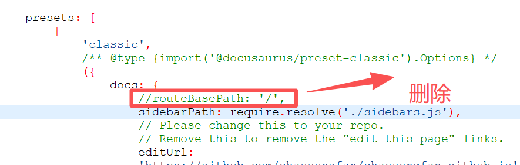

# 依赖工具安装

命令行依赖工具

```
	apt install git make gcc g++ xz-utils
```

下载nodejs

```
https://nodejs.org/en/download
```

我下载的版本是

```
node-v22.14.0-linux-x64.tar.xz
```

下载后解压到指定目录，然后修改 ~/.bashrc 文件，将 nodejs 相关可执行程序路径添加到 PATH 中。示例如下：

```
NODEJS=/home/szf/docusaurus/node-v22.14.0-linux-x64/bin
export PATH=$NODEJS:$PATH

```

# nodejs 插件安装

执行如下操作安装之：

```
npx create-docusaurus@2.4 my-website classic
cd ./my-website
npm install @cmfcmf/docusaurus-search-local --save-dev --registry=https://registry.npmmirror.com
npm install @node-rs/jieba --save-dev --registry=https://registry.npmmirror.com
npm install prism-react-renderer --save-dev --registry=https://registry.npmmirror.com
```

# 项目 clone

```
git clone https://github.com/shaozongfan/PuchengPeasant.github.io.git
```

克隆 docusaurus 项目到本地，并将PuchengPeasant.github.io拷贝到my-website目录下

将 node_modules拷贝到PuchengPeasant.github.io。

# 编译项目

进入 my-website目录中，执行 `npm run build`来编译，编译成功的主要日志如下：

```
rlk@rlk:my-website$ npm run build

> my-website@0.0.0 build
> docusaurus build

[INFO] [en] Creating an optimized production build...

✔ Client


✔ Server
  Compiled successfully in 1.60m


✔ Client


● Server █████████████████████████ cache (99%) shutdown IdleFileCachePlugin
 stored

[SUCCESS] Generated static files in "build".
[INFO] Use `npm run serve` command to test your build locally.

```

# 配置 deploy

### 1. 生成SSH密

如果你还没有SSH密钥对，你可以通过在终端运行以下命令来生成它们：

bash复制

```bash
ssh-keygen -t ed25519 -C "your_email@example.com"
```

- 这条命令会生成一个新的SSH密钥对（公钥和私钥）。
- 按照提示操作，你可以为密钥设置密码，也可以直接按回车键留空。
- 默认情况下，公钥会保存在`~/.ssh/id_ed25519.pub`，私钥会保存在`~/.ssh/id_ed25519`。

### 2. 查看公钥

在添加SSH密钥到GitHub之前，你需要查看公钥的内容。可以通过以下命令查看：

bash复制

```bash
cat ~/.ssh/id_ed25519.pub
```

这将显示你的公钥，你需要复制这部分内容。

### 3. 添加SSH密钥到GitHub

1. 登录到你的GitHub账户。
2. 点击右上角的头像，选择“Settings”（设置）。
3. 在设置页面的侧边栏中，点击“SSH and GPG keys”（SSH和GPG密钥）。
4. 点击“New SSH key”（新建SSH密钥）按钮。
5. 在“Title”（标题）字段中，为你的密钥设置一个描述性的标题，例如你的笔记本电脑的名称。
6. 在“Key”（密钥）字段中，粘贴你之前复制的公钥内容。
7. 点击“Add SSH key”（添加SSH密钥）按钮。

### 4. 测试SSH密钥

添加SSH密钥后，你应该测试它以确保一切正常工作。可以通过以下命令测试：

bash复制

```bash
ssh -T git@github.com
```


### 5.执行一次如下步骤

一定要执行这一步，完成认证过程

```
 git clone --depth 1 --branch gh-pages git@github.com:shaozongfan/shaozongfan.github.io.git /tmp/shaozongfan.github.io.git-gh-pagesUOkBdR-tes
```

### 6.终端设置

```
 export USE_SSH=true
```

### 7.执行

```
npm run deploy
```


# 遇到的问题

1. 终端设置 export USE_SSH=true
2. 执行 `npm run deploy`，基线数据如下

```

[INFO] `git commit -m "Deploy website - based on 8170f15060a5866dbc5c7cab1d586842e3480c74"` code: 0
ERROR: Permission to facebook/docusaurus.git denied to shaozongfan.
fatal: Could not read from remote repository.

Please make sure you have the correct access rights
and the repository exists.
[INFO] `git push --force origin gh-pages` code: 128
[ERROR] Deployment of the build output failed.
[ERROR] Error: Running "git push" command failed. Does the GitHub user account you are using have push access to the repository?
    at runDeploy (/home/szf/docusaurus/PuchengPeasant.github.io/node_modules/@docusaurus/core/lib/commands/deploy.js:158:19)
    at async Command.deploy (/home/szf/docusaurus/PuchengPeasant.github.io/node_modules/@docusaurus/core/lib/commands/deploy.js:179:13)

```

# 解决方法

修改docusautus.config.js文件

```
const config = {
  title: 'My Site',
  tagline: 'Dinosaurs are cool',
  favicon: 'img/favicon.ico',

  // Set the production url of your site here
  //url: 'https://github.com/shaozongfan/shaozongfan.github.io.git',
  //url: 'https://shaozongfan.github.io/PuchengPeasant.github.io/',
  url: 'https://shaozongfan.github.io',
 ///url: 'https://your-docusaurus-test-site.com',
  // Set the /<baseUrl>/ pathname under which your site is served
  // For GitHub pages deployment, it is often '/<projectName>/'
  baseUrl: '/',

  // GitHub pages deployment config.
  // If you aren't using GitHub pages, you don't need these.
  //organizationName: 'facebook', // Usually your GitHub org/user name.
  //projectName: 'docusaurus', // Usually your repo name.

  organizationName: 'shaozongfan',
  projectName: 'shaozongfan.github.io',
  deploymentBranch: 'gh-pages',

  trailingSlash:false,
  onBrokenLinks: 'throw',
  onBrokenMarkdownLinks: 'warn',

  deploymentBranch: 'gh-pages',
  trailingSlash:false,
  // Even if you don't use internalization, you can use this field to set useful
  // metadata like html lang. For example, if your site is Chinese, you may want
  // to replace "en" with "zh-Hans".
  i18n: {
    defaultLocale: 'en',
    locales: ['en'],
  },

```

# 国内访问github

```
https://github.com/maxiaof/github-hosts
```


遇到的问题

```
[ERROR] Unable to build website for locale zh-Hans.
[ERROR] Error: Docusaurus found broken links!

Please check the pages of your site in the list below, and make sure you don't reference any path that does not exist.
Note: it's possible to ignore broken links with the 'onBrokenLinks' Docusaurus configuration, and let the build pass.

Exhaustive list of all broken links found:

- On source page path = /shaozongfan.github.io/:
   -> linking to /shaozongfan.github.io/docs/intro

    at reportMessage (/home/rlk/docusaurus/shaozongfan.github.io/node_modules/@docusaurus/utils/lib/jsUtils.js:88:19)
    at handleBrokenLinks (/home/rlk/docusaurus/shaozongfan.github.io/node_modules/@docusaurus/core/lib/server/brokenLinks.js:153:35)
    at async buildLocale (/home/rlk/docusaurus/shaozongfan.github.io/node_modules/@docusaurus/core/lib/commands/build.js:176:5)
    at async tryToBuildLocale (/home/rlk/docusaurus/shaozongfan.github.io/node_modules/@docusaurus/core/lib/commands/build.js:37:20)
    at async mapAsyncSequential (/home/rlk/docusaurus/shaozongfan.github.io/node_modules/@docusaurus/utils/lib/jsUtils.js:36:24)
    at async build (/home/rlk/docusaurus/shaozongfan.github.io/node_modules/@docusaurus/core/lib/commands/build.js:72:21)

```

# 解决方法




# 遇到的问题

```
rlk@rlk:shaozongfan.github.io$ npm run build

> longyu-website@0.0.0 build
> docusaurus build

[ERROR] Error: Cannot find module 'prism-react-renderer/themes/github'
Require stack:
- /home/rlk/docusaurus/shaozongfan.github.io/docusaurus.config.js
- /home/rlk/docusaurus/shaozongfan.github.io/node_modules/@docusaurus/core/lib/server/config.js
- /home/rlk/docusaurus/shaozongfan.github.io/node_modules/@docusaurus/core/lib/server/index.js
- /home/rlk/docusaurus/shaozongfan.github.io/node_modules/@docusaurus/core/lib/commands/build.js
- /home/rlk/docusaurus/shaozongfan.github.io/node_modules/@docusaurus/core/lib/index.js
    at Module._resolveFilename (node:internal/modules/cjs/loader:1140:15)
    at Module._load (node:internal/modules/cjs/loader:981:27)
    at Module.require (node:internal/modules/cjs/loader:1231:19)
    at require (node:internal/modules/helpers:177:18)
    at Object.<anonymous> (/home/rlk/docusaurus/shaozongfan.github.io/docusaurus.config.js:4:24)
    at Module._compile (node:internal/modules/cjs/loader:1364:14)
    at Module._extensions..js (node:internal/modules/cjs/loader:1422:10)
    at Module.load (node:internal/modules/cjs/loader:1203:32)
    at Module._load (node:internal/modules/cjs/loader:1019:12)
    at Module.require (node:internal/modules/cjs/loader:1231:19)

```

# 解决方法

```
npm install prism-react-renderer@^1.3.5
```

