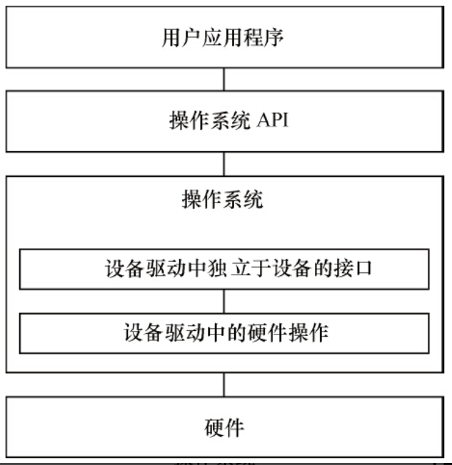

在1.2节中我们看到一个清晰的设备驱动，它直接运行在硬件之上，不与任何操作系统关联。当系统包含操作系统时，设备驱动会变得怎样呢？

首先，无操作系统时设备驱动的硬件操作工作仍然是必不可少的，没有这一部分，驱动不可能与硬件打交道。

其次，我们还需要将驱动融入内核。为了实现这种融合，必须在所有设备的驱动中设计面向操作系统内核的接口，这样的接口由操作系统规定，对一类设备而言结构一致，独立于具体的设备。

由此可见，当系统中存在操作系统的时候，驱动变成了连接硬件和内核的桥梁。如图1.4所示，操作系统的存在势必要求设备驱动附加更多的代码和功能，把单一的“驱使硬件设备行动”变成了操作系统内与硬件交互的模块，它对外呈现为操作系统的API，不再给应用软件工程师直接提供接口

图1.4　硬件、驱动、操作系统和应用程序的关系

那么我们要问，有了操作系统之后，驱动反而变得复杂，那要操作系统干什么？

首先，一个复杂的软件系统需要处理多个并发的任务，没有操作系统，想完成多任务并发是很困难的。

其次，操作系统给我们提供内存管理机制。一个典型的例子是，对于多数含MMU的32位处理器而言，Windows、Linux等操作系统可以让每个进程都可以独立地访问4GB的内存空间。

上述优点似乎并没有体现在设备驱动身上，操作系统的存在给设备驱动究竟带来了什么实质性的好处？

简而言之，操作系统通过给驱动制造麻烦来达到给上层应用提供便利的目的。当驱动都按照操作系统给出的独立于设备的接口而设计时，那么，应用程序将可使用统一的系统调用接口来访问各种设备。对于类UNIX的VxWorks、Linux等操作系统而言，当应用程序通过write（）、read（）等函数读写文件就可访问各种字符设备和块设备，而不论设备的具体类型和工作方式，那将是多么便利。