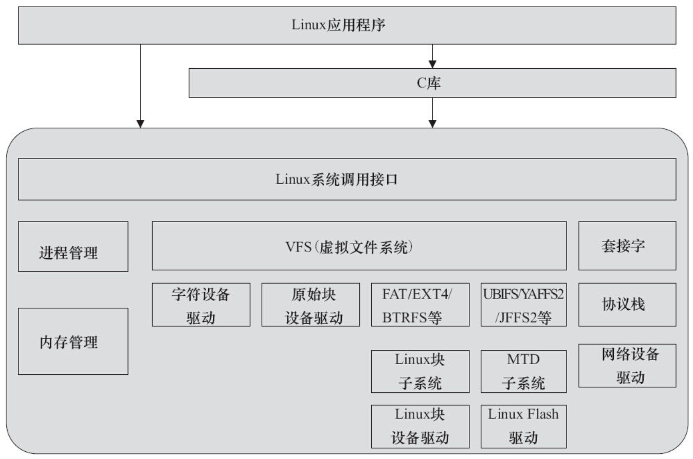

# 1.4.1　设备的分类及特点

计算机系统的硬件主要由CPU、存储器和外设组成。随着IC制作工艺的发展，目前，芯片的集成度越来越高，往往在CPU内部就集成了存储器和外设适配器。譬如，相当多的ARM、PowerPC、MIPS等处理器都集成了UART、I2 C控制器、SPI控制器、USB控制器、SDRAM控制器等，有的处理器还集成了GPU（图形处理器）、视频编解码器等。

驱动针对的对象是存储器和外设（包括CPU内部集成的存储器和外设），而不是针对CPU内核。Linux将存储器和外设分为3个基础大类。

- 字符设备。
- 块设备。
- 网络设备。

字符设备指那些必须以串行顺序依次进行访问的设备，如触摸屏、磁带驱动器、鼠标等。块设备可以按任意顺序进行访问，以块为单位进行操作，如硬盘、eMMC等。字符设备和块设备的驱动设计有出很大的差异，但是对于用户而言，它们都要使用文件系统的操作接口open（）、close（）、read（）、write（）等进行访问。

在Linux系统中，网络设备面向数据包的接收和发送而设计，它并不倾向于对应于文件系统的节点。内核与网络设备的通信与内核和字符设备、网络设备的通信方式完全不同，前者主要还是使用套接字接口。

# 1.4.2　Linux设备驱动与整个软硬件系统的关系

如图1.5所示，除网络设备外，字符设备与块设备都被映射到Linux文件系统的文件和目录，通过文件系统的系统调用接口open（）、write（）、read（）、close（）等即可访问字符设备和块设备。所有字符设备和块设备都统一呈现给用户。Linux的块设备有两种访问方法：一种是类似dd命令对应的原始块设备，如“/dev/sdb1”等；另外一种方法是在块设备上建立FAT、EXT4、BTRFS等文件系统，然后以文件路径如“/home/barry/hello.txt”的形式进行访问。在Linux中，针对NOR、NAND等提供了独立的内存技术设备（Memory Technology Device，MTD）子系统，其上运行YAFFS2、JFFS2、UBIFS等具备擦除和负载均衡能力的文件系统。针对磁盘或者Flash设备的FAT、EXT4、YAFFS2、JFFS2、UBIFS等文件系统定义了文件和目录在存储介质上的组织。而Linux的虚拟文件系统则统一对它们进行了抽象。

图1.5　Linux设备驱动与整个软硬件系统的关系

应用程序可以使用Linux的系统调用接口编程，但也可使用C库函数，出于代码可移植性的目的，后者更值得推荐。C库函数本身也通过系统调用接口而实现，如C库函数fopen（）、fwrite（）、fread（）、fclose（）分别会调用操作系统的API open（）、write（）、read（）、close（）。

# 1.4.3　Linux设备驱动的重点、难点

Linux设备驱动的学习是一项浩繁的工程，包含如下重点、难点。

- ·编写Linux设备驱动要求工程师有非常好的硬件基础，懂得SRAM、Flash、SDRAM、磁盘的读写方式，UART、I2 C、USB等设备的接口以及轮询、中断、DMA的原理，PCI总线的工作方式以及CPU的内存管理单元（MMU）等。
- ·编写Linux设备驱动要求工程师有非常好的C语言基础，能灵活地运用C语言的结构体、指针、函数指针及内存动态申请和释放等。
- ·编写Linux设备驱动要求工程师有一定的Linux内核基础，虽然并不要求工程师对内核各个部分有深入的研究，但至少要明白驱动与内核的接口。尤其是对于块设备、网络设备、Flash设备、串口设备等复杂设备，内核定义的驱动体系结构本身就非常复杂。
- ·编写Linux设备驱动要求工程师有非常好的多任务并发控制和同步的基础，因为在驱动中会大量使用自旋锁、互斥、信号量、等待队列等并发与同步机制。

上述经验值的获取并非朝夕之事，因此要求我们有足够的学习恒心和毅力。对这些重点、难点，本书都会在相应章节进行讲解。

动手实践永远是学习任何软件开发的最好方法，学习Linux设备驱动也不例外。因此，本书使用的是通过QEMU模拟的ARM vexpress电路板，本书中的所有实例均可在该“电路板”上直接执行。

阅读经典书籍和参与Linux社区的讨论也是非常好的学习方法。Linux内核源代码中包含了一个Documentation目录，其中包含了一批内核设计文档，全部是文本文件。很遗憾，这些文档的组织不太好，内容也不够细致。

学习Linux设备驱动的一个注意事项是要避免管中窥豹、只见树木不见森林，因为各类Linux设备驱动都从属于一个Linux设备驱动的架构，单纯而片面地学习几个函数、几个数据结构是不可能理清驱动中各组成部分之间的关系的。因此，Linux驱动的分析方法是点面结合，将对函数和数据结构的理解放在整体架构的背景之中。这是本书各章节讲解驱动的方法。