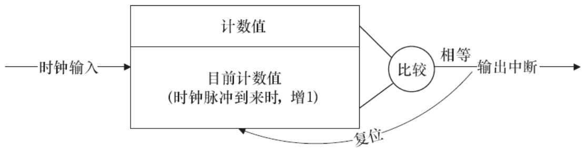
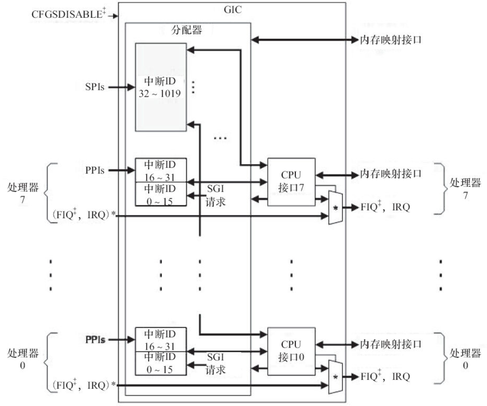

所谓中断是指CPU在执行程序的过程中，出现了某些突发事件急待处理，CPU必须暂停当前程序的执行，转去处理突发事件，处理完毕后又返回原程序被中断的位置继续执行。

根据中断的来源，中断可分为内部中断和外部中断，内部中断的中断源来自CPU内部（软件中断指令、溢出、除法错误等，例如，操作系统从用户态切换到内核态需借助CPU内部的软件中断），外部中断的中断源来自CPU外部，由外设提出请求。

根据中断是否可以屏蔽，中断可分为可屏蔽中断与不可屏蔽中断（NMI），可屏蔽中断可以通过设置中断控制器寄存器等方法被屏蔽，屏蔽后，该中断不再得到响应，而不可屏蔽中断不能被屏蔽。

根据中断入口跳转方法的不同，中断可分为向量中断和非向量中断。采用向量中断的CPU通常为不同的中断分配不同的中断号，当检测到某中断号的中断到来后，就自动跳转到与该中断号对应的地址执行。不同中断号的中断有不同的入口地址。非向量中断的多个中断共享一个入口地址，进入该入口地址后，再通过软件判断中断标志来识别具体是哪个中断。也就是说，向量中断由硬件提供中断服务程序入口地址，非向量中断由软件提供中断服务程序入口地址。

一个典型的非向量中断服务程序如代码清单10.1所示，它先判断中断源，然后调用不同中断源的中断服务程序。

代码清单10.1　非向量中断服务程序的典型结构

```
 1 irq_handler()
 2 {
 3   ...
 4   int int_src = read_int_status();  /* 读硬件的中断相关寄存器*/
 5   switch (int_src)  {               /* 判断中断源*/
 6   case DEV_A:
 7        dev_a_handler();
 8        break;
 9   case DEV_B:
10        dev_b_handler();
11        break;
12  ...
13  default:
14       break;
15  }
16  ...
17}
```

嵌入式系统以及x86PC中大多包含可编程中断控制器（PIC），许多MCU内部就集成了PIC。如在80386中，PIC是两片i8259A芯片的级联。通过读写PIC的寄存器，程序员可以屏蔽/使能某中断及获得中断状态，前者一般通过中断MASK寄存器完成，后者一般通过中断PEND寄存器完成。

定时器在硬件上也依赖中断来实现，图10.1所示为典型的嵌入式微处理器内可编程间隔定时器（PIT）的工作原理，它接收一个时钟输入，当时钟脉冲到来时，将目前计数值增1并与预先设置的计数值（计数目标）比较，若相等，证明计数周期满，并产生定时器中断且复位目前计数值。



图10.1　PIT定时器的工作原理

在ARM多核处理器里最常用的中断控制器是GIC（Generic Interrupt Controller），如图10.2所示，它支持3种类型的中断。



图10.2　ARM多核处理器里的GIC

SGI（Software Generated Interrupt）：软件产生的中断，可以用于多核的核间通信，一个CPU可以通过写GIC的寄存器给另外一个CPU产生中断。多核调度用的IPI_WAKEUP、IPI_TIMER、IPI_RESCHEDULE、IPI_CALL_FUNC、IPI_CALL_FUNC_SINGLE、IPI_CPU_STOP、IPI_IRQ_WORK、IPI_COMPLETION都是由SGI产生的。

PPI（Private Peripheral Interrupt）：某个CPU私有外设的中断，这类外设的中断只能发给绑定的那个CPU。

SPI（Shared Peripheral Interrupt）：共享外设的中断，这类外设的中断可以路由到任何一个CPU。

对于SPI类型的中断，内核可以通过如下API设定中断触发的CPU核：

```
extern int irq_set_affinity (unsigned int irq, const struct cpumask *m);
```

在ARM Linux默认情况下，中断都是在CPU0上产生的，比如，我们可以通过如下代码把中断irq设定到CPU i上去：

```
irq_set_affinity(irq, cpumask_of(i));
```

