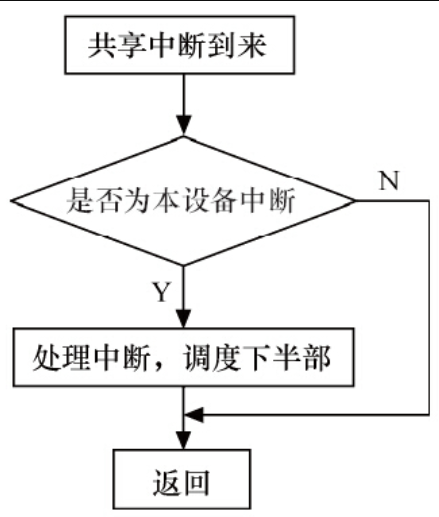

多个设备共享一根硬件中断线的情况在实际的硬件系统中广泛存在，Linux支持这种中断共享。下面是中断共享的使用方法。

1）共享中断的多个设备在申请中断时，都应该使用IRQF_SHARED标志，而且一个设备以IRQF_SHARED申请某中断成功的前提是该中断未被申请，或该中断虽然被申请了，但是之前申请该中断的所有设备也都以IRQF_SHARED标志申请该中断。

2）尽管内核模块可访问的全局地址都可以作为request_irq（…，void*dev_id）的最后一个参数dev_id，但是设备结构体指针显然是可传入的最佳参数。

3）在中断到来时，会遍历执行共享此中断的所有中断处理程序，直到某一个函数返回IRQ_HANDLED。在中断处理程序顶半部中，应根据硬件寄存器中的信息比照传入的dev_id参数迅速地判断是否为本设备的中断，若不是，应迅速返回IRQ_NONE，如图10.5所示。



图10.5　共享中断的处理

代码清单10.8给出了使用共享中断的设备驱动程序的模板（仅包含与共享中断机制相关的部分）。

代码清单10.8　共享中断编程模板

```
 1/* 中断处理顶半部 */
 2irqreturn_t xxx_interrupt(int irq, void *dev_id)
 3{
 4    ...
 5 int status = read_int_status();      /* 获知中断源*/
 6 if(!is_myint(dev_id,status))         /* 判断是否为本设备中断*/
 7          return IRQ_NONE;            /* 不是本设备中断，立即返回*/
 8
 9 /* 是本设备中断，进行处理*/
10   ...
11   return IRQ_HANDLED;                /* 返回IRQ_HANDLED表明中断已被处理*/
12}
13
14/* 设备驱动模块加载函数*/
15int xxx_init(void)
16{
17    ...
18    /* 申请共享中断*/
19    result = request_irq(sh_irq, xxx_interrupt,
20        IRQF_SHARED, "xxx", xxx_dev);
21 ...
22}
23
24/* 设备驱动模块卸载函数*/
25void xxx_exit(void)
26{
27    ...
28    /* 释放中断*/
29    free_irq(xxx_irq, xxx_interrupt);
30    ...
31}
```

