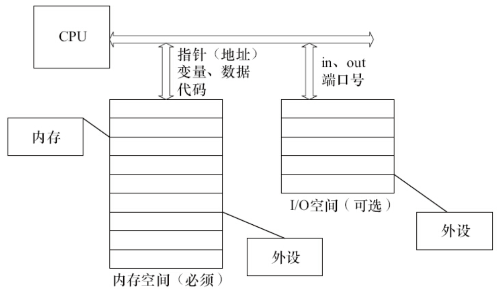
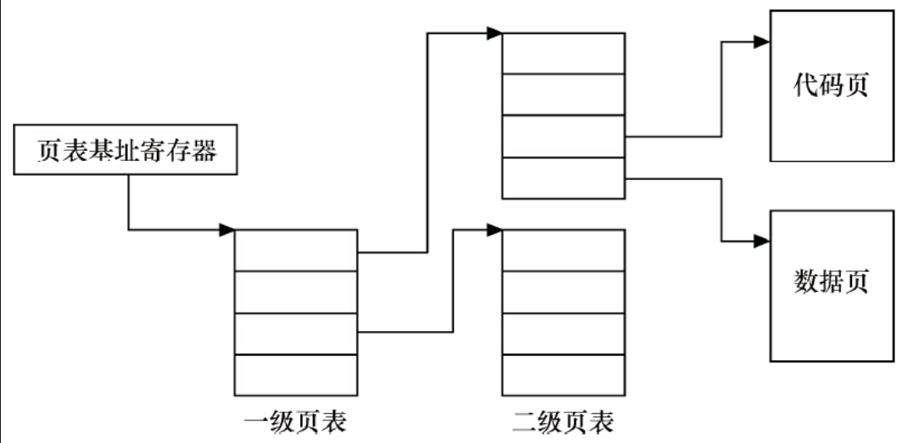
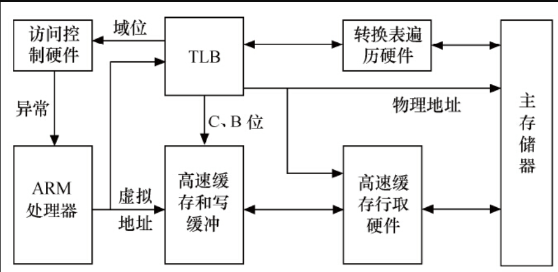
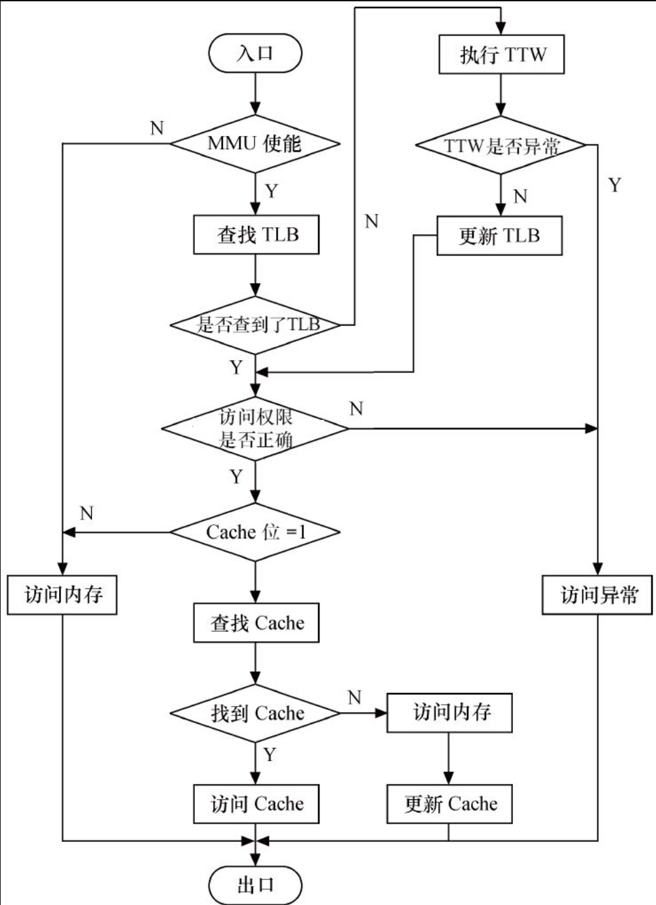

# 11.1.1　内存空间与I/O空间

在X86处理器中存在着I/O空间的概念，I/O空间是相对于内存空间而言的，它通过特定的指令in、out来访问。端口号标识了外设的寄存器地址。Intel语法中的in、out指令格式如下：

```
IN 累加器, {端口号│DX}
OUT {端口号│DX},累加器
```

目前，大多数嵌入式微控制器（如ARM、PowerPC等）中并不提供I/O空间，而仅存在内存空间。内存空间可以直接通过地址、指针来访问，程序及在程序运行中使用的变量和其他数据都存在于内存空间中。

内存地址可以直接由C语言指针操作，例如在186处理器中执行如下代码：

```
unsigned char *p = (unsigned char *)0xF000FF00;
*p=11; 
```

以上程序的意义是在绝对地址0xF0000+0xFF00（186处理器使用16位段地址和16位偏移地址）中写入11。

而在ARM、PowerPC等未采用段地址的处理器中，p指向的内存空间就是0xF000FF00，而*p=11就是在该地址写入11。

再如，186处理器启动后会在绝对地址0xFFFF0（对应的C语言指针是0xF000FFF0，0xF000为段地址，0xFFF0为段内偏移）中执行，请看下面的代码：

```
typedef void (*lpFunction) ( );    /* 定义一个无参数、无返回类型的函数指针类型*/
lpFunction lpReset = (lpFunction)0xF000FFF0; /* 定义一个函数指针，指向*/
/* CPU启动后所执行的第一条指令的位置*/
lpReset();     /* 调用函数*/
```

在以上程序中，没有定义任何一个函数实体，但是程序却执行了这样的函数调用：lpReset（），它实际上起到了“软重启”的作用，跳转到CPU启动后第一条要执行的指令的位置。因此，可以通过函数指针调用一个没有函数体的“函数”，这本质上只是换一个地址开始执行。

即便是在X86处理器中，虽然提供了I/O空间，如果由我们自己设计电路板，外设仍然可以只挂接在内存空间中。此时，CPU可以像访问一个内存单元那样访问外设I/O端口，而不需要设立专门的I/O指令。因此，内存空间是必需的，而I/O空间是可选的。图11.1给出了内存空间和I/O空间的对比。



图11.1　内存空间和I/O空间

# 11.1.2　内存管理单元

高性能处理器一般会提供一个内存管理单元（MMU），该单元辅助操作系统进行内存管理，提供虚拟地址和物理地址的映射、内存访问权限保护和Cache缓存控制等硬件支持。操作系统内核借助MMU可以让用户感觉到程序好像可以使用非常大的内存空间，从而使得编程人员在写程序时不用考虑计算机中物理内存的实际容量。

为了理解基本的MMU操作原理，需先明晰几个概念。

1）TLB（Translation Lookaside Buffer）：即转换旁路缓存，TLB是MMU的核心部件，它缓存少量的虚拟地址与物理地址的转换关系，是转换表的Cache，因此也经常被称为“快表”。

2）TTW（Translation Table walk）：即转换表漫游，当TLB中没有缓冲对应的地址转换关系时，需要通过对内存中转换表（大多数处理器的转换表为多级页表，如图11.2所示）的访问来获得虚拟地址和物理地址的对应关系。TTW成功后，结果应写入TLB



图11.2　内存中的转换表

图11.3给出了一个典型的ARM处理器访问内存的过程，其他处理器也执行类似过程。当ARM要访问存储器时，MMU先查找TLB中的虚拟地址表。如果ARM的结构支持分开的数据TLB（DTLB）和指令TLB（ITLB），则除了取指令使用ITLB外，其他的都使用DTLB。ARM处理器的MMU如图11.3所示。



图11.3　ARM处理器的MMU

若TLB中没有虚拟地址的入口，则转换表遍历硬件并从存放于主存储器内的转换表中获取地址转换信息和访问权限（即执行TTW），同时将这些信息放入TLB，它或者被放在一个没有使用的入口或者替换一个已经存在的入口。之后，在TLB条目中控制信息的控制下，当访问权限允许时，对真实物理地址的访问将在Cache或者在内存中发生，如图11.4所示。



图11.4　ARM CPU进行数据访问的流程

ARM内TLB条目中的控制信息用于控制对对应地址的访问权限以及Cache的操作。

- ·C（高速缓存）和B（缓冲）位被用来控制对应地址的高速缓存和写缓冲，并决定是否进行高速缓存。
- ·访问权限和域位用来控制读写访问是否被允许。如果不允许，MMU则向ARM处理器发送一个存储器异常，否则访问将被允许进行。

上述描述的MMU机制针对的虽然是ARM处理器，但PowerPC、MIPS等其他处理器也均有类似的操作。

MMU具有虚拟地址和物理地址转换、内存访问权限保护等功能，这将使得Linux操作系统能单独为系统的每个用户进程分配独立的内存空间并保证用户空间不能访问内核空间的地址，为操作系统的虚拟内存管理模块提供硬件基础。

在Linux 2.6.11之前，Linux内核硬件无关层使用了三级页表PGD、PMD和PTE；从Linux 2.6.11开始，为了配合64位CPU的体系结构，硬件无关层则使用了4级页表目录管理的方式，即PGD、PUD、PMD和PTE。注意这仅仅是一种软件意义上的抽象，实际硬件的页表级数可能少于4。代码清单11.1给出了一个典型的从虚拟地址得到PTE的页表查询（Page Table Walk）过程，它取自arch/arm/lib/uaccess_with_memcpy.c。

代码清单11.1　Linux的四级页表与页表查询

```
 1static int
 2pin_page_for_write(const void __user *_addr, pte_t **ptep, spinlock_t **ptlp)
 3{
 4 unsigned long addr = (unsigned long)_addr;
 5 pgd_t *pgd;
 6 pmd_t *pmd;
 7 pte_t *pte;
 8 pud_t *pud;
 9 spinlock_t *ptl;
10
11 pgd = pgd_offset(current->mm, addr);
12 if (unlikely(pgd_none(*pgd) || pgd_bad(*pgd)))
13     return 0;
14
15 pud = pud_offset(pgd, addr);
16 if (unlikely(pud_none(*pud) || pud_bad(*pud)))
17     return 0;
18
19 pmd = pmd_offset(pud, addr);
20 if (unlikely(pmd_none(*pmd)))
21     return 0;
22
23 /*
24  * A pmd can be bad if it refers to a HugeTLB or THP page.
25  *
26  * Both THP and HugeTLB pages have the same pmd layout
27  * and should not be manipulated by the pte functions.
28  *
29  * Lock the page table for the destination and check
30  * to see that it's still huge and whether or not we will
31  * need to fault on write, or if we have a splitting THP.
32  */
33 if (unlikely(pmd_thp_or_huge(*pmd))) {
34     ptl = &current->mm->page_table_lock;
35     spin_lock(ptl);
36     if (unlikely(!pmd_thp_or_huge(*pmd)
37         || pmd_hugewillfault(*pmd)
38         || pmd_trans_splitting(*pmd))) {
39         spin_unlock(ptl);
40         return 0;
41     }
42
43     *ptep = NULL;
44     *ptlp = ptl;
45     return 1;
46 }
47
48 if (unlikely(pmd_bad(*pmd)))
49     return 0;
50
51 pte = pte_offset_map_lock(current->mm, pmd, addr, &ptl);
52 if (unlikely(!pte_present(*pte) || !pte_young(*pte) ||
53     !pte_write(*pte) || !pte_dirty(*pte))) {
54     pte_unmap_unlock(pte, ptl);
55     return 0;
56 }
57
58 *ptep = pte;
59 *ptlp = ptl;
60
61 return 1;
62}
```

第1行的类型为struct，mm_struct的参数mm用于描述Linux进程所占有的内存资源。上述代码中的pgd_offset、pud_offset、pmd_offset分别用于得到一级页表、二级页表和三级页表的入口，最后通过pte_offset_map_lock得到目标页表项pte。而且第33行还通过pmd_thp_or_huge（）判断是否有巨页的情况，如果是巨页，就直接访问pmd。

但是，MMU并不是对所有的处理器都是必需的，例如常用的SAMSUNG基于ARM7TDMI系列的S3C44B0X不附带MMU，新版的Linux 2.6支持不带MMU的处理器。在嵌入式系统中，仍存在大量无MMU的处理器，Linux 2.6为了更广泛地应用于嵌入式系统，融合了mClinux，以支持这些无MMU系统，如Dragonball、ColdFire、Hitachi H8/300、Blackfin等。