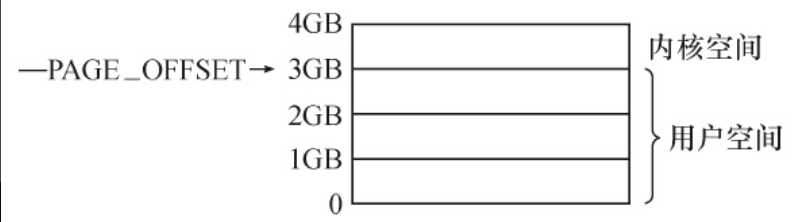
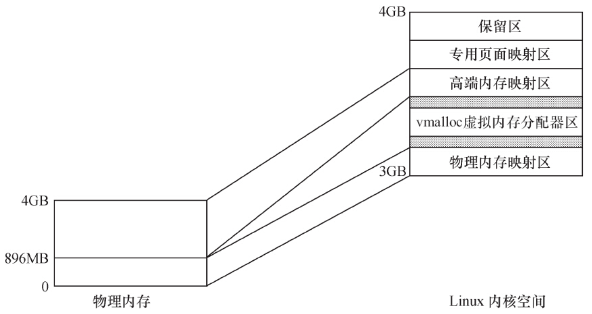
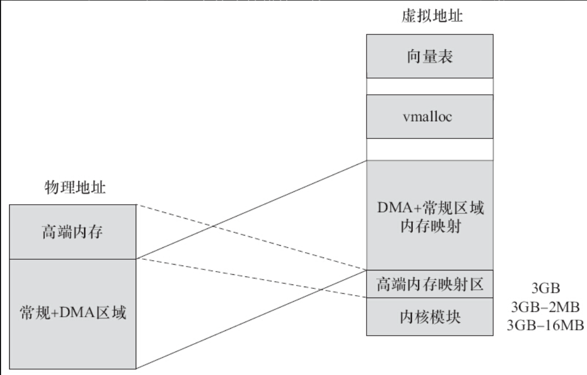
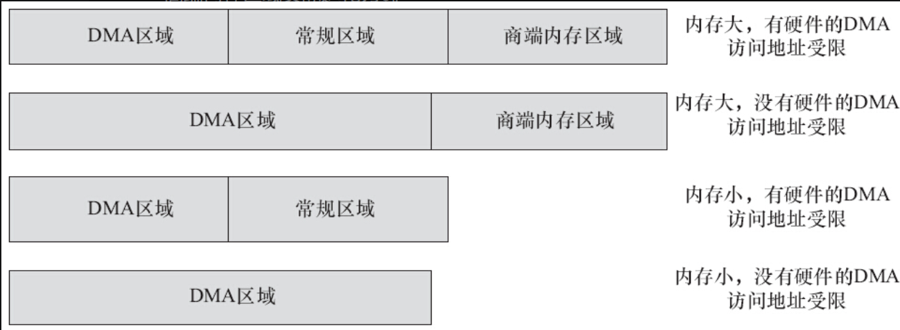
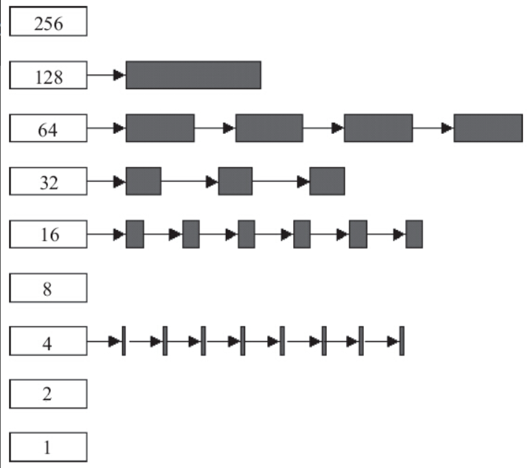

对于包含MMU的处理器而言，Linux系统提供了复杂的存储管理系统，使得进程所能访问的内存达到4GB。

在Linux系统中，进程的4GB内存空间被分为两个部分——用户空间与内核空间。用户空间的地址一般分布为0~3GB（即PAGE_OFFSET，在0x86中它等于0xC0000000），这样，剩下的3~4GB为内核空间，如图11.5所示。用户进程通常只能访问用户空间的虚拟地址，不能访问内核空间的虚拟地址。用户进程只有通过系统调用（代表用户进程在内核态执行）等方式才可以访问到内核空间



图11.5　用户空间与内核空间

每个进程的用户空间都是完全独立、互不相干的，用户进程各自有不同的页表。而内核空间是由内核负责映射，它并不会跟着进程改变，是固定的。内核空间的虚拟地址到物理地址映射是被所有进程共享的，内核的虚拟空间独立于其他程序。

Linux中1GB的内核地址空间又被划分为物理内存映射区、虚拟内存分配区、高端页面映射区、专用页面映射区和系统保留映射区这几个区域，如图11.6所示。



图11.6　32位x86系统Linux内核的地址空间

对于x86系统而言，一般情况下，物理内存映射区最大长度为896MB，系统的物理内存被顺序映射在内核空间的这个区域中。当系统物理内存大于896MB时，超过物理内存映射区的那部分内存称为高端内存（而未超过物理内存映射区的内存通常被称为常规内存），内核在存取高端内存时必须将它们映射到高端页面映射区。

Linux保留内核空间最顶部FIXADDR_TOP~4GB的区域作为保留区。

紧接着最顶端的保留区以下的一段区域为专用页面映射区（FIXADDR_START~FIXADDR_TOP），它的总尺寸和每一页的用途由fixed_address枚举结构在编译时预定义，用__fix_to_virt（index）可获取专用区内预定义页面的逻辑地址。其开始地址和结束地址宏定义如下：

```
#define FIXADDR_START       (FIXADDR_TOP - _ _FIXADDR_SIZE)
#define FIXADDR_TOP       ((unsigned long)_ _FIXADDR_TOP)
#define _ _FIXADDR_TOP    0xfffff000
```

接下来，如果系统配置了高端内存，则位于专用页面映射区之下的就是一段高端内存映射区，其起始地址为PKMAP_BASE，定义如下：

```
#define PKMAP_BASE ( (FIXADDR_BOOT_START - PAGE_SIZE*(LAST_PKMAP + 1)) & PMD_MASK )
```

其中所涉及的宏定义如下：

```
#define FIXADDR_BOOT_START    (FIXADDR_TOP - _ _FIXADDR_BOOT_SIZE)
#define LAST_PKMAP    PTRS_PER_PTE
#define PTRS_PER_PTE    512
#define PMD_MASK    (~(PMD_SIZE-1))
# define PMD_SIZE    (1UL << PMD_SHIFT)
#define PMD_SHIFT    21
```

在物理区和高端映射区之间为虚拟内存分配器区（VMALLOC_START~VMALLOC_END），用于vmalloc（）函数，它的前部与物理内存映射区有一个隔离带，后部与高端映射区也有一个隔离带，vmalloc区域定义如下：

```
#define VMALLOC_OFFSET (8*1024*1024)
#define VMALLOC_START    (((unsigned long) high_memory +
    vmalloc_earlyreserve + 2*VMALLOC_OFFSET-1) & ~(VMALLOC_OFFSET-1))
#ifdef CONFIG_HIGHMEM    /* 支持高端内存*/
# define VMALLOC_END    (PKMAP_BASE-2*PAGE_SIZE)
#else                    /* 不支持高端内存*/
# define VMALLOC_END    (FIXADDR_START-2*PAGE_SIZE)
#endif
```

当系统物理内存超过4GB时，必须使用CPU的扩展分页（PAE）模式所提供的64位页目录项才能存取到4GB以上的物理内存，这需要CPU的支持。加入了PAE功能的Intel Pentium Pro及以后的CPU允许内存最大可配置到64GB，它们具备36位物理地址空间寻址能力。

由此可见，对于32位的x86而言，在3~4GB之间的内核空间中，从低地址到高地址依次为：物理内存映射区→隔离带→vmalloc虚拟内存分配器区→隔离带→高端内存映射区→专用页面映射区→保留区。

直接进行映射的896MB物理内存其实又分为两个区域，在低于16MB的区域，ISA设备可以做DMA，所以该区域为DMA区域（内核为了保证ISA驱动在申请DMA缓冲区的时候，通过GFP_DMA标记可以确保申请到16MB以内的内存，所以必须把这个区域列为一个单独的区域管理）；16MB~896MB之间的为常规区域。高于896MB的就称为高端内存区域了

32位ARM Linux的内核空间地址映射与x86不太一样，内核文档Documentation/arm/memory.txt给出了ARM Linux的内存映射情况。0xffff0000~0xffff0fff是“CPU vector page”，即向量表的地址。0xffc00000~0xffefffff是DMA内存映射区域，dma_alloc_xxx族函数把DMA缓冲区映射在这一段，VMALLOC_START~VMALLOC_END-1是vmalloc和ioremap区域（在vmalloc区域的大小可以配置，通过“vmalloc=”这个启动参数可以指定），PAGE_OFFSET~high_memory-1是DMA和正常区域的映射区域，MODULES_VADDR~MODULES_END-1是内核模块区域，PKMAP_BASE~PAGE_OFFSET-1是高端内存映射区。假设我们把PAGE_OFFSET定义为3GB，实际上Linux内核模块位于3GB-16MB~3GB-2MB，高端内存映射区则通常位于3GB-2MB~3GB。

图11.7给出了32位ARM系统Linux内核地址空间中的内核模块区域、高端内存映射区、vmalloc、向量表区域等。我们假定编译内核的时候选择的是VMSPLIT_3G（3G/1G user/kernel split）。如果用户选择的是VMSPLIT_2G（2G/2G user/kernel split），则图11.7中的内核模块开始于2GB-16MB，DMA和常规内存区域映射区也开始于2GB。



图11.7　32位ARM系统中Linux内核的地址空间

ARM系统的Linux之所以把内核模块安置在3GB或者2GB附近的16MB范围内，主要是为了实现内核模块和内核本身的代码段之间的短跳转

对于ARM SoC而言，如果芯片内部有的硬件组件的DMA引擎访问内存时有地址空间限制（某些空间访问不到），比如假设UART控制器的DMA只能访问32MB，那么这个低32MB就是DMA区域；32MB到高端内存地址的这段称为常规区域；再之上的称为高端内存区域。

图11.8给出了几种DMA、常规、高端内存区域可能的分布，在第一种情况下，有硬件的DMA引擎不能访问全部地址，且内存较大而无法全部在内核空间虚拟地址映射下，存放有3个区域；第二种情况下，没有硬件的DMA引擎不能访问全部地址，且内存较大而无法全部在内核空间虚拟地址映射下，则常规区域实际退化为0；第三种情况下，有硬件的DMA引擎不能访问全部地址，且内存较小可以全部在内核空间虚拟地址映射下，则高端内存区域实际退化为0；第四种情况下，没有硬件的DMA引擎不能访问全部地址，且内存较小可以全部在内核空间虚拟地址映射下，则常规和高端内存区域实际退化为0



图11.8　DMA、常规、高端内存区域分布

如图11.9所示，DMA、常规、高端内存这3个区域都采用buddy算法进行管理，把空闲的页面以2的n次方为单位进行管理，因此Linux最底层的内存申请都是以2n 为单位的。Buddy算法最主要的优点是避免了外部碎片，任何时候区域里的空闲内存都能以2的n次方进行拆分或合并。



图11.9　buddy算法

/proc/buddyinfo会显示每个区域里面2n的空闲页面分布情况，比如：

```
$cat /proc/buddyinfo
Node 0, zone      DMA      8      5      2      7      8      3      0      0
0      1      0
Node 0, zone   Normal   2002   1252    524    187    183     71      7      0
0      1      1
```

上述结果显示高端内存区域为0，DMA区域里1页空闲的内存还有8个，连续2页空闲的有5个，连续4页空闲的有2个，以此类推；常规区域里面1页空闲的还有2002个，连续2页空闲的有1252个，以此类推。

对于内核物理内存映射区的虚拟内存（即从DMA和常规区域映射过来的），使用virt_to_phys（）可以实现内核虚拟地址转化为物理地址。与之对应的函数为phys_to_virt（），它将物理地址转化为内核虚拟地址。

注意： 上述virt_to_phys（）和phys_to_virt（）方法仅适用于DMA和常规区域，高端内存的虚拟地址与物理地址之间不存在如此简单的换算关系。