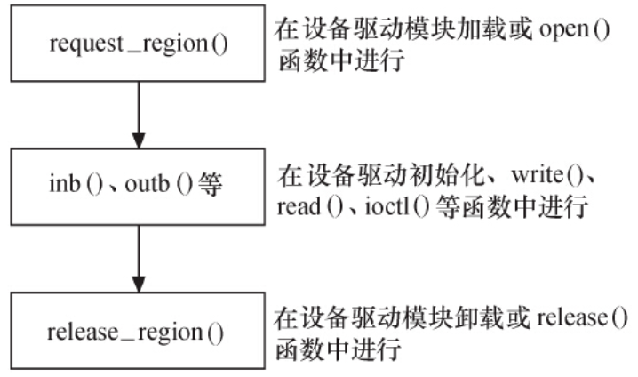
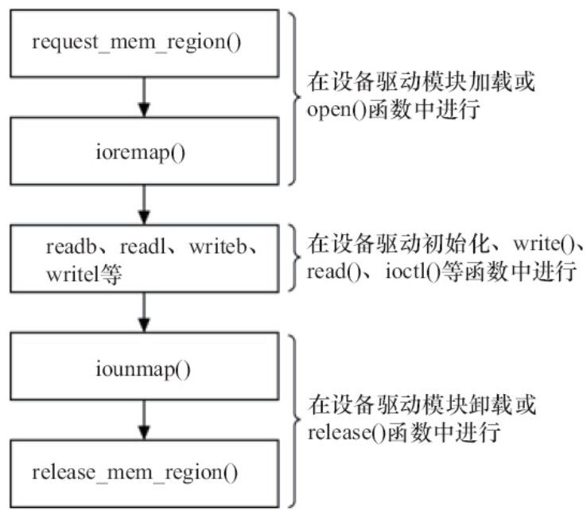

设备通常会提供一组寄存器来控制设备、读写设备和获取设备状态，即控制寄存器、数据寄存器和状态寄存器。这些寄存器可能位于I/O空间中，也可能位于内存空间中。当位于I/O空间时，通常被称为I/O端口；当位于内存空间时，对应的内存空间被称为I/O内存。

# 11.4.1　Linux I/O端口和I/O内存访问接口

## 1.I/O端口

在Linux设备驱动中，应使用Linux内核提供的函数来访问定位于I/O空间的端口，这些函数包括如下几种。

1）读写字节端口（8位宽）。

```
unsigned inb(unsigned port);
void outb(unsigned char byte, unsigned port);
```

2）读写字端口（16位宽）。

```
unsigned inw(unsigned port);
void outw(unsigned short word, unsigned port);
```

3）读写长字端口（32位宽）。

```
unsigned inl(unsigned port);
void outl(unsigned longword, unsigned port);
```

4）读写一串字节。

```
void insb(unsigned port, void *addr, unsigned long count);
void outsb(unsigned port, void *addr, unsigned long count);
```

5）insb（）从端口port开始读count个字节端口，并将读取结果写入addr指向的内存；outsb（）将addr指向的内存中的count个字节连续写入以port开始的端口。

6）读写一串字。

```
void insw(unsigned port, void *addr, unsigned long count);
void outsw(unsigned port, void *addr, unsigned long count);
```

7）读写一串长字。

```
void insl(unsigned port, void *addr, unsigned long count);
void outsl(unsigned port, void *addr, unsigned long count);
```

上述各函数中I/O端口号port的类型高度依赖于具体的硬件平台，因此，这里只是写出了unsigned。

## 2.I/O内存

在内核中访问I/O内存（通常是芯片内部的各个I2 C、SPI、USB等控制器的寄存器或者外部内存总线上的设备）之前，需首先使用ioremap（）函数将设备所处的物理地址映射到虚拟地址上。ioremap（）的原型如下：

```
void *ioremap(unsigned long offset, unsigned long size);
```

ioremap（）与vmalloc（）类似，也需要建立新的页表，但是它并不进行vmalloc（）中所执行的内存分配行为。ioremap（）返回一个特殊的虚拟地址，该地址可用来存取特定的物理地址范围，这个虚拟地址位于vmalloc映射区域。通过ioremap（）获得的虚拟地址应该被iounmap（）函数释放，其原型如下：

```
void iounmap(void * addr);
```

ioremap（）有个变体是devm_ioremap（），类似于其他以devm_开头的函数，通过devm_ioremap（）进行的映射通常不需要在驱动退出和出错处理的时候进行iounmap（）。devm_ioremap（）的原型为：

```
void __iomem *devm_ioremap(struct device *dev, resource_size_t offset,
                           unsigned long size);
```

在设备的物理地址（一般都是寄存器）被映射到虚拟地址之后，尽管可以直接通过指针访问这些地址，但是Linux内核推荐用一组标准的API来完成设备内存映射的虚拟地址的读写。

读寄存器用readb_relaxed（）、readw_relaxed（）、readl_relaxed（）、readb（）、readw（）、readl（）这一组API，以分别读8bit、16bit、32bit的寄存器，没有_relaxed后缀的版本与有_relaxed后缀的版本的区别是没有_relaxed后缀的版本包含一个内存屏障，如：

```
#define readb(c)            ({ u8  __v = readb_relaxed(c); __iormb(); __v; })
#define readw(c)            ({ u16__v = readw_relaxed(c); __iormb(); __v; })
#define readl(c)            ({ u32 __v = readl_relaxed(c); __iormb(); __v; })
```

写寄存器用writeb_relaxed（）、writew_relaxed（）、writel_relaxed（）、writeb（）、writew（）、writel（）这一组API，以分别写8bit、16bit、32bit的寄存器，没有_relaxed后缀的版本与有_relaxed后缀的版本的区别是前者包含一个内存屏障，如：

```
#define writeb(v,c)         ({ __iowmb(); writeb_relaxed(v,c); })
#define writew(v,c)         ({ __iowmb(); writew_relaxed(v,c); })
#define writel(v,c)         ({ __iowmb(); writel_relaxed(v,c); })
```

# 11.4.2　申请与释放设备的I/O端口和I/O内存

## 1.I/O端口申请

Linux内核提供了一组函数以申请和释放I/O端口，表明该驱动要访问这片区域。

```
struct resource *request_region(unsigned long first, unsigned long n, const char *name);
```

这个函数向内核申请n个端口，这些端口从first开始，name参数为设备的名称。如果分配成功，则返回值不是NULL，如果返回NULL，则意味着申请端口失败。

当用request_region（）申请的I/O端口使用完成后，应当使用release_region（）函数将它们归还给系统，这个函数的原型如下：

```
void release_region(unsigned long start, unsigned long n);
```

## 2.I/O内存申请

同样，Linux内核也提供了一组函数以申请和释放I/O内存的范围。此处的“申请”表明该驱动要访问这片区域，它不会做任何内存映射的动作，更多的是类似于“reservation”的概念。

```
struct resource *request_mem_region(unsigned long start, unsigned long len, char *name);
```

这个函数向内核申请n个内存地址，这些地址从first开始，name参数为设备的名称。如果分配成功，则返回值不是NULL，如果返回NULL，则意味着申请I/O内存失败。

当用request_mem_region（）申请的I/O内存使用完成后，应当使用release_mem_region（）函数将它们归还给系统，这个函数的原型如下：

```
void release_mem_region(unsigned long start, unsigned long len);
```

request_region（）和request_mem_region（）也分别有变体，其为devm_request_region（）和devm_request_mem_region（）。

# 11.4.3　设备I/O端口和I/O内存访问流程

综合11.3节和本节的内容，可以归纳出设备驱动访问I/O端口和I/O内存的步骤。

I/O端口访问的一种途径是直接使用I/O端口操作函数：在设备打开或驱动模块被加载时申请I/O端口区域，之后使用inb（）、outb（）等进行端口访问，最后，在设备关闭或驱动被卸载时释放I/O端口范围。整个流程如图11.10所示。



图11.10　I/O端口的访问流程

I/O内存的访问步骤如图11.11所示，首先是调用request_mem_region（）申请资源，接着将寄存器地址通过ioremap（）映射到内核空间虚拟地址，之后就可以通过Linux设备访问编程接口访问这些设备的寄存器了。访问完成后，应对ioremap（）申请的虚拟地址进行释放，并释放release_mem_region（）申请的I/O内存资源。



图11.11　I/O内存访问流程

有时候，驱动在访问寄存器或I/O端口前，会省去request_mem_region（）、request_region（）这样的调用。

# 11.4.4　将设备地址映射到用户空间

## 1.内存映射与VMA

一般情况下，用户空间是不可能也不应该直接访问设备的，但是，设备驱动程序中可实现mmap（）函数，这个函数可使得用户空间能直接访问设备的物理地址。实际上，mmap（）实现了这样的一个映射过程：它将用户空间的一段内存与设备内存关联，当用户访问用户空间的这段地址范围时，实际上会转化为对设备的访问。

这种能力对于显示适配器一类的设备非常有意义，如果用户空间可直接通过内存映射访问显存的话，屏幕帧的各点像素将不再需要一个从用户空间到内核空间的复制的过程。

mmap（）必须以PAGE_SIZE为单位进行映射，实际上，内存只能以页为单位进行映射，若要映射非PAGE_SIZE整数倍的地址范围，要先进行页对齐，强行以PAGE_SIZE的倍数大小进行映射。

从file_operations文件操作结构体可以看出，驱动中mmap（）函数的原型如下：

```
int(*mmap)(struct file *, struct vm_area_struct*);
```

驱动中的mmap（）函数将在用户进行mmap（）系统调用时最终被调用，mmap（）系统调用的原型与file_operations中mmap（）的原型区别很大，如下所示：

```
caddr_t  mmap (caddr_t addr, size_t len, int prot, int flags, int fd, off_t offset);
```

参数fd为文件描述符，一般由open（）返回，fd也可以指定为-1，此时需指定flags参数中的MAP_ANON，表明进行的是匿名映射。

len是映射到调用用户空间的字节数，它从被映射文件开头offset个字节开始算起，offset参数一般设为0，表示从文件头开始映射。

prot参数指定访问权限，可取如下几个值的“或”：PROT_READ（可读）、PROT_WRITE（可写）、PROT_EXEC（可执行）和PROT_NONE（不可访问）。

参数addr指定文件应被映射到用户空间的起始地址，一般被指定为NULL，这样，选择起始地址的任务将由内核完成，而函数的返回值就是映射到用户空间的地址。其类型caddr_t实际上就是void*。

当用户调用mmap（）的时候，内核会进行如下处理。

1）在进程的虚拟空间查找一块VMA。

2）将这块VMA进行映射。

3）如果设备驱动程序或者文件系统的file_operations定义了mmap（）操作，则调用它。

4）将这个VMA插入进程的VMA链表中。

file_operations中mmap（）函数的第一个参数就是步骤1）找到的VMA。

由mmap（）系统调用映射的内存可由munmap（）解除映射，这个函数的原型如下：

```
int munmap(caddr_t addr, size_t len );
```

驱动程序中mmap（）的实现机制是建立页表，并填充VMA结构体中vm_operations_struct指针。VMA就是vm_area_struct，用于描述一个虚拟内存区域，VMA结构体的定义如代码清单11.4所示。

代码清单11.4　VMA结构体

```
 1struct vm_area_struct {
 2  /* The first cache line has the info for VMA tree walking. */
 3
 4  unsigned long vm_start;         /* Our start address within vm_mm. */
 5  unsigned long vm_end;           /* The first byte after our end address
 6                                     within vm_mm. */
 7
 8  /* linked list of VM areas per task, sorted by address */
 9  struct vm_area_struct *vm_next, *vm_prev;
10
11  struct rb_node vm_rb;
12
13  ...
14
15  /* Second cache line starts here. */
16
17  struct mm_struct *vm_mm;         /* The address space we belong to. */
18  pgprot_t vm_page_prot;           /* Access permissions of this VMA. */
19  unsigned long vm_flags;          /* Flags, see mm.h. */
20
21  ...
22  const struct vm_operations_struct *vm_ops;
23
24  /* Information about our backing store: */
25  unsigned long vm_pgoff;          /* Offset (within vm_file) in PAGE_SIZE
26                                      units, *not* PAGE_CACHE_SIZE */
27  struct file * vm_file;           /* File we map to (can be NULL). */
28  void * vm_private_data;          /* was vm_pte (shared mem) */
29  ...
30};
```

VMA结构体描述的虚地址介于vm_start和vm_end之间，而其vm_ops成员指向这个VMA的操作集。针对VMA的操作都被包含在vm_operations_struct结构体中，vm_operations_struct结构体的定义如代码清单11.5所示。

代码清单11.5　vm_operations_struct结构体

```
 1struct vm_operations_struct {
 2  void (*open)(struct vm_area_struct * area);
 3  void (*close)(struct vm_area_struct * area);
 4  int (*fault)(struct vm_area_struct *vma, struct vm_fault *vmf);
 5  void (*map_pages)(struct vm_area_struct *vma, struct vm_fault *vmf);
 6
 7  /* notification that a previously read-only page is about to become
 8   * writable, if an error is returned it will cause a SIGBUS */
 9  int (*page_mkwrite)(struct vm_area_struct *vma, struct vm_fault *vmf);
10
11  /* called by access_process_vm when get_user_pages() fails, typically
12   * for use by special VMAs that can switch between memory and hardware
13   */
14  int (*access)(struct vm_area_struct *vma, unsigned long addr,
15            void *buf, int len, int write);
16  …
17};
```

整个vm_operations_struct结构体的实体会在file_operations的mmap（）成员函数里被赋值给相应的vma->vm_ops，而上述open（）函数也通常在mmap（）里调用，close（）函数会在用户调用munmap（）的时候被调用到。代码清单11.6给出了一个vm_operations_struct的操作范例。

代码清单11.6　vm_operations_struct操作范例

```
 1static int xxx_mmap(struct file *filp, struct vm_area_struct *vma)
 2{
 3  if (remap_pfn_range(vma, vma->vm_start, vm->vm_pgoff, vma->vm_end - vma
 4    ->vm_start, vma->vm_page_prot))/* 建立页表*/
 5    return  -EAGAIN;
 6  vma->vm_ops = &xxx_remap_vm_ops;
 7  xxx_vma_open(vma);
 8  return 0;
 9}
10
11static void xxx_vma_open(struct vm_area_struct *vma)/* VMA打开函数*/
12{
13  ...
14  printk(KERN_NOTICE "xxx VMA open, virt %lx, phys %lx\n", vma->vm_start,
15    vma->vm_pgoff << PAGE_SHIFT);
16}
17
18static void xxx_vma_close(struct vm_area_struct *vma)/* VMA关闭函数*/
19{
20  ...
21  printk(KERN_NOTICE "xxx VMA close.\n");
22}
23
24static struct vm_operations_struct xxx_remap_vm_ops = {/* VMA操作结构体*/
25  .open = xxx_vma_open,
26  .close = xxx_vma_close,
27  ...
28};
```

第3行调用的remap_pfn_range（）创建页表项，以VMA结构体的成员（VMA的数据成员是内核根据用户的请求自己填充的）作为remap_pfn_range（）的参数，映射的虚拟地址范围是vma->vm_start至vma->vm_end。

remap_pfn_range（）函数的原型如下：

```
int remap_pfn_range(struct vm_area_struct *vma, unsigned long addr,
          unsigned long pfn, unsigned long size, pgprot_t prot);
```

其中的addr参数表示内存映射开始处的虚拟地址。remap_pfn_range（）函数为addr~addr+size的虚拟地址构造页表。

pfn是虚拟地址应该映射到的物理地址的页帧号，实际上就是物理地址右移PAGE_SHIFT位。若PAGE_SIZE为4KB，则PAGE_SHIFT为12，因为PAGE_SIZE等于1<<PAGE_SHIFT。

prot是新页所要求的保护属性。

在驱动程序中，我们能使用remap_pfn_range（）映射内存中的保留页、设备I/O、framebuffer、camera等内存。在remap_pfn_range（）上又可以进一步封装出io_remap_pfn_range（）、vm_iomap_memory（）等API。

```
#define io_remap_pfn_range remap_pfn_range
int vm_iomap_memory(struct vm_area_struct *vma, phys_addr_t start, unsigned long len)
{
    unsigned long vm_len, pfn, pages;
    ...
    len += start & ~PAGE_MASK;
    pfn = start >> PAGE_SHIFT;
    pages = (len + ~PAGE_MASK) >> PAGE_SHIFT;
    ...
    pfn += vma->vm_pgoff;
    pages -= vma->vm_pgoff;
    /* Can we fit all of the mapping  */
    vm_len = vma->vm_end - vma->vm_start;
    ...
    /* Ok, let it rip */
    return io_remap_pfn_range(vma, vma->vm_start, pfn, vm_len, vma->vm_page_prot);
}
```

代码清单11.7给出了LCD驱动映射framebuffer物理地址到用户空间的典型范例，代码取自drivers/video/fbdev/core/fbmem.c。

代码清单11.7　LCD驱动映射framebuffer的mmap

```
 1static int
 2fb_mmap(struct file *file, struct vm_area_struct * vma)
 3{
 4  struct fb_info *info = file_fb_info(file);
 5  struct fb_ops *fb;
 6  unsigned long mmio_pgoff;
 7  unsigned long start;
 8  u32len;
 9
10  if (!info)
11       return -ENODEV;
12  fb = info->fbops;
13  if (!fb)
14       return -ENODEV;
15  mutex_lock(&info->mm_lock);
16  if (fb->fb_mmap) {
17       int res;
18       res = fb->fb_mmap(info, vma);
19       mutex_unlock(&info->mm_lock);
20       return res;
21  }
22
23  /*
24   * Ugh. This can be either the frame buffer mapping, or
25   * if pgoff points past it, the mmio mapping.
26   */
27  start = info->fix.smem_start;
28  len = info->fix.smem_len;
29  mmio_pgoff = PAGE_ALIGN((start & ~PAGE_MASK) + len) >> PAGE_SHIFT;
30  if (vma->vm_pgoff >= mmio_pgoff) {
31       if (info->var.accel_flags) {
32             mutex_unlock(&info->mm_lock);
33             return -EINVAL;
34       }
35
36       vma->vm_pgoff -= mmio_pgoff;
37       start = info->fix.mmio_start;
38       len = info->fix.mmio_len;
39  }
40  mutex_unlock(&info->mm_lock);
41
42  vma->vm_page_prot = vm_get_page_prot(vma->vm_flags);
43  fb_pgprotect(file, vma, start);
44
45  return vm_iomap_memory(vma, start, len);
46}
```

通常，I/O内存被映射时需要是nocache的，这时候，我们应该对vma->vm_page_prot设置nocache标志之后再映射，如代码清单11.8所示。

代码清单11.8　以nocache方式将内核空间映射到用户空间

```
 1static int xxx_nocache_mmap(struct file *filp, struct vm_area_struct *vma)
 2{
 3  vma->vm_page_prot = pgprot_noncached(vma->vm_page_prot);/* 赋nocache标志 */
 4  vma->vm_pgoff = ((u32)map_start >> PAGE_SHIFT);
 5  /* 映射*/
 6  if (remap_pfn_range(vma, vma->vm_start, vma->vm_pgoff, vma->vm_end - vma
 7    ->vm_start, vma->vm_page_prot))
 8    return  -EAGAIN;
 9  return 0;
10}
```

上述代码第3行的pgprot_noncached（）是一个宏，它高度依赖于CPU的体系结构，ARM的pgprot_noncached（）定义如下：

```
#define pgprot_noncached(prot) \
        __pgprot_modify(prot, L_PTE_MT_MASK, L_PTE_MT_UNCACHED)
```

另一个比pgprot_noncached（）稍微少一些限制的宏是pgprot_writecombine（），它的定义如下：

```
#define pgprot_writecombine(prot) \
        __pgprot_modify(prot, L_PTE_MT_MASK, L_PTE_MT_BUFFERABLE)
```

pgprot_noncached（）实际禁止了相关页的Cache和写缓冲（Write Buffer），pgprot_writecombine（）则没有禁止写缓冲。ARM的写缓冲器是一个非常小的FIFO存储器，位于处理器核与主存之间，其目的在于将处理器核和Cache从较慢的主存写操作中解脱出来。写缓冲区与Cache在存储层次上处于同一层次，但是它只作用于写主存。

## 2.fault（）函数

除了remap_pfn_range（）以外，在驱动程序中实现VMA的fault（）函数通常可以为设备提供更加灵活的内存映射途径。当访问的页不在内存里，即发生缺页异常时，fault（）会被内核自动调用，而fault（）的具体行为可以自定义。这是因为当发生缺页异常时，系统会经过如下处理过程。

1）找到缺页的虚拟地址所在的VMA。

2）如果必要，分配中间页目录表和页表。

3）如果页表项对应的物理页面不存在，则调用这个VMA的fault（）方法，它返回物理页面的页描迏符。

4）将物理页面的地址填充到页表中。

fault（）函数在Linux的早期版本中命名为nopage（），后来变更为了fault（）。代码清单11.9给出了一个设备驱动中使用fault（）的典型范例。

代码清单11.9　fault（）函数使用范例

```
 1static int xxx_fault(struct vm_area_struct *vma, struct vm_fault *vmf)
 2{
 3  unsigned long paddr;
 4  unsigned long pfn;
 5  pgoff_t index = vmf->pgoff;
 6  struct vma_data *vdata = vma->vm_private_data;
 7
 8  ...
 9
10  pfn = paddr >> PAGE_SHIFT;
11
12  vm_insert_pfn(vma, (unsigned long)vmf->virtual_address, pfn);
13
14  return VM_FAULT_NOPAGE;
15} 
```

大多数设备驱动都不需要提供设备内存到用户空间的映射能力，因为，对于串口等面向流的设备而言，实现这种映射毫无意义。而对于显示、视频等设备，建立映射可减少用户空间和内核空间之间的内存复制。