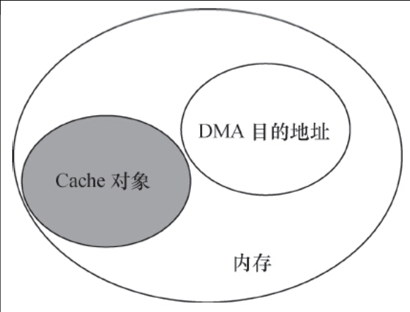
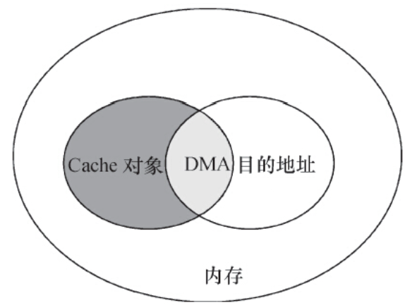

DMA是一种无须CPU的参与就可以让外设与系统内存之间进行双向数据传输的硬件机制。使用DMA可以使系统CPU从实际的I/O数据传输过程中摆脱出来，从而大大提高系统的吞吐率。DMA通常与硬件体系结构，特别是外设的总线技术密切相关。

DMA方式的数据传输由DMA控制器（DMAC）控制，在传输期间，CPU可以并发地执行其他任务。当DMA结束后，DMAC通过中断通知CPU数据传输已经结束，然后由CPU执行相应的中断服务程序进行后处理。

# 11.6.1　DMA与Cache一致性

Cache和DMA本身似乎是两个毫不相关的事物。Cache被用作CPU针对内存的缓存，利用程序的空间局部性和时间局部性原理，达到较高的命中率，从而避免CPU每次都必须要与相对慢速的内存交互数据来提高数据的访问速率。DMA可以作为内存与外设之间传输数据的方式，在这种传输方式之下，数据并不需要经过CPU中转。

Cache和DMA本身似乎是两个毫不相关的事物。Cache被用作CPU针对内存的缓存，利用程序的空间局部性和时间局部性原理，达到较高的命中率，从而避免CPU每次都必须要与相对慢速的内存交互数据来提高数据的访问速率。DMA可以作为内存与外设之间传输数据的方式，在这种传输方式之下，数据并不需要经过CPU中转。



图11.12　DMA目的地址与Cache对象没有重叠



图11.13　DMA目的地址与Cache对象有重叠

所谓Cache数据与内存数据的不一致性，是指在采用Cache的系统中，同样一个数据可能既存在于Cache中，也存在于主存中，Cache与主存中的数据一样则具有一致性，数据若不一样则具有不一致性。

需要特别注意的是，Cache与内存的一致性问题经常被初学者遗忘。在发生Cache与内存不一致性错误后，驱动将无法正常运行。如果没有相关的背景知识，工程师几乎无法定位错误的原因，因为这时所有的程序看起来都是完全正确的。Cache的不一致性问题并不是只发生在DMA的情况下，实际上，它还存在于Cache使能和关闭的时刻。例如，对于带MMU功能的ARM处理器，在开启MMU之前，需要先置Cache无效，对于TLB，也是如此，代码清单11.12给出的这段汇编可用来完成此任务。

代码清单11.12　置ARM的Cache无效

```
1/* 使cache无效*/
2"mov    r0, #0\n"
3"mcr    p15, 0, r0, c7, c7, 0\n"     /* 使数据和指令cache无效*/
4"mcr    p15, 0, r0, c7, c10, 4\n"    /* 放空写缓冲 */
5"mcr    p15, 0, r0, c8, c7, 0\n"     /* 使TLB无效 */
```

# 11.6.2　Linux下的DMA编程

首先DMA本身不属于一种等同于字符设备、块设备和网络设备的外设，它只是一种外设与内存交互数据的方式。因此，本节的标题不是“Linux下的DMA驱动”而是“Linux下的DMA编程”。

内存中用于与外设交互数据的一块区域称为DMA缓冲区，在设备不支持scatter/gather（分散/聚集，简称SG）操作的情况下，DMA缓冲区在物理上必须是连续的。

## 1.DMA区域

对于x86系统的ISA设备而言，其DMA操作只能在16MB以下的内存中进行，因此，在使用kmalloc（）、__get_free_pages（）及其类似函数申请DMA缓冲区时应使用GFP_DMA标志，这样能保证获得的内存位于DMA区域中，并具备DMA能力。

在内核中定义了__get_free_pages（）针对DMA的“快捷方式”__get_dma_pages（），它在申请标志中添加了GFP_DMA，如下所示：

```
#define _ _get_dma_pages(gfp_mask, order) \
        __get_free_pages((gfp_mask) | GFP_DMA,(order))
```

如果不想使用log2size（即order）为参数申请DMA内存，则可以使用另一个函数dma_mem_alloc（），其源代码如代码清单11.13所示。

代码清单11.13　dma_mem_alloc（）函数

```
1static unsigned long dma_mem_alloc(int size)
2{
3  int order = get_order(size);        /* 大小->指数*/
4  return _ _get_dma_pages(GFP_KERNEL, order);
5}
```

对于大多数现代嵌入式处理器而言，DMA操作可以在整个常规内存区域进行，因此DMA区域就直接覆盖了常规内存。

## 2.虚拟地址、物理地址和总线地址

基于DMA的硬件使用的是总线地址而不是物理地址，总线地址是从设备角度上看到的内存地址，物理地址则是从CPU MMU控制器外围角度上看到的内存地址（从CPU核角度看到的是虚拟地址）。虽然在PC上，对于ISA和PCI而言，总线地址即为物理地址，但并不是每个平台都是如此。因为有时候接口总线通过桥接电路连接，桥接电路会将I/O地址映射为不同的物理地址。例如，在PReP（PowerPC Reference Platform）系统中，物理地址0在设备端看起来是0x80000000，而0通常又被映射为虚拟地址0xC0000000，所以同一地址就具备了三重身份：物理地址0、总线地址0x80000000及虚拟地址0xC0000000。还有一些系统提供了页面映射机制，它能将任意的页面映射为连续的外设总线地址。内核提供了如下函数以进行简单的虚拟地址/总线地址转换：

```
unsigned long virt_to_bus(volatile void *address);
void *bus_to_virt(unsigned long address);
```

在使用IOMMU或反弹缓冲区的情况下，上述函数一般不会正常工作。而且，这两个函数并不建议使用。如图11.14所示，IOMMU的工作原理与CPU内的MMU非常类似，不过它针对的是外设总线地址和内存地址之间的转化。由于IOMMU可以使得外设DMA引擎看到“虚拟地址”，因此在使用IOMMU的情况下，在修改映射寄存器后，可以使得SG中分段的缓冲区地址对外设变得连续。


图11.14　MMU与IOMMU

## 3.DMA地址掩码

设备并不一定能在所有的内存地址上执行DMA操作，在这种情况下应该通过下列函数执行DMA地址掩码：

```
int dma_set_mask(struct device *dev, u64 mask);
```

例如，对于只能在24位地址上执行DMA操作的设备而言，就应该调用dma_set_mask（dev，0xffffff）。

其实该API本质上就是修改device结构体中的dma_mask成员，如ARM平台的定义为：

```
int arm_dma_set_mask(struct device *dev, u64 dma_mask)
{
        if (!dev->dma_mask || !dma_supported(dev, dma_mask))
                return -EIO;
        *dev->dma_mask = dma_mask;
        return 0;
}
```

在device结构体中，除了有dma_mask以外，还有一个coherent_dma_mask成员。dma_mask是设备DMA可以寻址的范围，而coherent_dma_mask作用于申请一致性的DMA缓冲区。

## 4.一致性DMA缓冲区

DMA映射包括两个方面的工作：分配一片DMA缓冲区；为这片缓冲区产生设备可访问的地址。同时，DMA映射也必须考虑Cache一致性问题。内核中提供了如下函数以分配一个DMA一致性的内存区域：

```
void * dma_alloc_coherent(struct device *dev, size_t size, dma_addr_t *handle,
    gfp_t gfp);
```

上述函数的返回值为申请到的DMA缓冲区的虚拟地址，此外，该函数还通过参数handle返回DMA缓冲区的总线地址。handle的类型为dma_addr_t，代表的是总线地址。

dma_alloc_coherent（）申请一片DMA缓冲区，以进行地址映射并保证该缓冲区的Cache一致性。与dma_alloc_coherent（）对应的释放函数为：

```
void dma_free_coherent(struct device *dev, size_t size, void *cpu_addr,
    dma_addr_t handle);
```

以下函数用于分配一个写合并（Writecombining）的DMA缓冲区：

```
void * dma_alloc_writecombine(struct device *dev, size_t size, dma_addr_t
    *handle, gfp_t gfp);
```

与dma_alloc_writecombine（）对应的释放函数dma_free_writecombine（）实际上就是dma_free_coherent（），它定义为：

```
#define dma_free_writecombine(dev,size,cpu_addr,handle) \
         dma_free_coherent(dev,size,cpu_addr,handle)
```

此外，Linux内核还提供了PCI设备申请DMA缓冲区的函数pci_alloc_consistent（），其原型为：

```
void * pci_alloc_consistent(struct pci_dev *pdev, size_t size, dma_addr_t *dma_addrp);
```

对应的释放函数为pci_free_consistent（），其原型为：

```
void pci_free_consistent(struct pci_dev *pdev, size_t size, void *cpu_addr,
    dma_addr_t dma_addr);
```

这里我们要强调的是，dma_alloc_xxx（）函数虽然是以dma_alloc_开头的，但是其申请的区域不一定在DMA区域里面。以32位ARM处理器为例，当coherent_dma_mask小于0xffffffff时，才会设置GFP_DMA标记，并从DMA区域去申请内存。

在我们使用ARM等嵌入式Linux系统的时候，一个头疼的问题是GPU、Camera、HDMI等都需要预留大量连续内存，这部分内存平时不用，但是一般的做法又必须先预留着。目前，Marek Szyprowski和Michal Nazarewicz实现了一套全新的CMA，（Contiguous Memory Allocator）。通过这套机制，我们可以做到不预留内存，这些内存平时是可用的，只有当需要的时候才被分配给Camera、HDMI等设备。

CMA对上呈现的接口是标准的DMA，也是一致性缓冲区API。关于CMA的进一步介绍，可以参考http://lwn.net/Articles/486301/ 的文档《A deep dive into CMA》。

## 5.流式DMA映射

并不是所有的DMA缓冲区都是驱动申请的，如果是驱动申请的，用一致性DMA缓冲区自然最方便，这直接考虑了Cache一致性问题。但是，在许多情况下，缓冲区来自内核的较上层（如网卡驱动中的网络报文、块设备驱动中要写入设备的数据等），上层很可能用普通的kmalloc（）、__get_free_pages（）等方法申请，这时候就要使用流式DMA映射。流式DMA缓冲区使用的一般步骤如下。

1）进行流式DMA映射。

2）执行DMA操作。

3）进行流式DMA去映射。

流式DMA映射操作在本质上大多就是进行Cache的使无效或清除操作，以解决Cache一致性问题。

相对于一致性DMA映射而言，流式DMA映射的接口较为复杂。对于单个已经分配的缓冲区而言，使用dma_map_single（）可实现流式DMA映射，该函数原型为：

```
dma_addr_t dma_map_single(struct device *dev, void *buffer, size_t size,
enum dma_data_direction direction);
```

如果映射成功，返回的是总线地址，否则，返回NULL。第4个参数为DMA的方向，可能的值包括DMA_TO_DEVICE、DMA_FROM_DEVICE、DMA_BIDIRECTIONAL和DMA_NONE。

dma_map_single（）的反函数为dma_unmap_single（），原型是：

```
void dma_unmap_single(struct device *dev, dma_addr_t dma_addr, size_t size,
enum dma_data_direction direction);
```

通常情况下，设备驱动不应该访问unmap的流式DMA缓冲区，如果一定要这么做，可先使用如下函数获得DMA缓冲区的拥有权：

```
void dma_sync_single_for_cpu(struct device *dev, dma_handle_t bus_addr,
size_t size, enum dma_data_direction direction);
```

在驱动访问完DMA缓冲区后，应该将其所有权返还给设备，这可通过如下函数完成：

```
void dma_sync_single_for_device(struct device *dev, dma_handle_t bus_addr,
size_t size, enum dma_data_direction direction);
```

如果设备要求较大的DMA缓冲区，在其支持SG模式的情况下，申请多个相对较小的不连续的DMA缓冲区通常是防止申请太大的连续物理空间的方法。在Linux内核中，使用如下函数映射SG：

```
int dma_map_sg(struct device *dev, struct scatterlist *sg, int nents,
enum dma_data_direction direction);
```

nents是散列表（scatterlist）入口的数量，该函数的返回值是DMA缓冲区的数量，可能小于nents。对于scatterlist中的每个项目，dma_map_sg（）为设备产生恰当的总线地址，它会合并物理上临近的内存区域。

scatterlist结构体的定义如代码清单11.14所示，它包含了与scatterlist对应的页结构体指针、缓冲区在页中的偏移（offset）、缓冲区长度（length）以及总线地址（dma_address）。

代码清单11.14　scatterlist结构体

```
 1struct scatterlist {
 2#ifdef CONFIG_DEBUG_SG
 3       unsigned long   sg_magic;
 4#endif
 5       unsigned long   page_link;
 6       unsigned int    offset;
 7       unsigned int    length;
 8       dma_addr_t      dma_address;
 9#ifdef CONFIG_NEED_SG_DMA_LENGTH
10       unsigned int    dma_length;
11#endif
12};
```

执行dma_map_sg（）后，通过sg_dma_address（）可返回scatterlist对应缓冲区的总线地址，sg_dma_len（）可返回scatterlist对应缓冲区的长度，这两个函数的原型为：

```
dma_addr_t sg_dma_address(struct scatterlist *sg);
unsigned int sg_dma_len(struct scatterlist *sg);
```

在DMA传输结束后，可通过dma_map_sg（）的反函数dma_unmap_sg（）除去DMA映射：

```
void dma_unmap_sg(struct device *dev, struct scatterlist *list,
int nents, enum dma_data_direction direction);
```

SG映射属于流式DMA映射，与单一缓冲区情况下的流式DMA映射类似，如果设备驱动一定要访问映射情况下的SG缓冲区，应该先调用如下函数：

```
void dma_sync_sg_for_cpu(struct device *dev, struct scatterlist *sg,
int nents, enum dma_data_direction direction);
```

访问完后，通过下列函数将所有权返回给设备：

```
void dma_sync_sg_for_device(struct device *dev, struct scatterlist *sg,
int nents, enum dma_data_direction direction);
```

在Linux系统中可以用一个相对简单的方法预先分配缓冲区，那就是同步“mem=”参数预留内存。例如，对于内存为64MB的系统，通过给其传递mem=62MB命令行参数可以使得顶部的2MB内存被预留出来作为I/O内存使用，这2MB内存可以被静态映射，也可以被执行ioremap（）。

## 6.dmaengine标准API

Linux内核目前推荐使用dmaengine的驱动架构来编写DMA控制器的驱动，同时外设的驱动使用标准的dmaengine API进行DMA的准备、发起和完成时的回调工作。

和中断一样，在使用DMA之前，设备驱动程序需首先向dmaengine系统申请DMA通道，申请DMA通道的函数如下：

```
struct dma_chan *dma_request_slave_channel(struct device *dev, const char *name);
struct dma_chan *__dma_request_channel(const dma_cap_mask_t *mask,
                                         dma_filter_fn fn, void *fn_param);
```

使用完DMA通道后，应该利用如下函数释放该通道：

```
void dma_release_channel(struct dma_chan *chan);
```

之后，一般通过如代码清单11.15的方法初始化并发起一次DMA操作。它通过dmaengine_prep_slave_single（）准备好一些DMA描述符，并填充其完成回调为xxx_dma_fini_callback（），之后通过dmaengine_submit（）把这个描述符插入队列，再通过dma_async_issue_pending（）发起这次DMA动作。DMA完成后，xxx_dma_fini_callback（）函数会被dmaengine驱动自动调用。

代码清单11.15　利用dmaengine API发起一次DMA操作

```
 1static void xxx_dma_fini_callback(void *data)
 2{
 3        struct completion *dma_complete = data;
 4
 5        complete(dma_complete);
 6}
 7
 8issue_xxx_dma(...)
 9{
10      rx_desc = dmaengine_prep_slave_single(xxx->rx_chan,
11              xxx->dst_start, t->len, DMA_DEV_TO_MEM,
12              DMA_PREP_INTERRUPT | DMA_CTRL_ACK);
13      rx_desc->callback = xxx_dma_fini_callback;
14      rx_desc->callback_param = &xxx->rx_done;
15
16      dmaengine_submit(rx_desc);
17      dma_async_issue_pending(xxx->rx_chan);
18}
```

