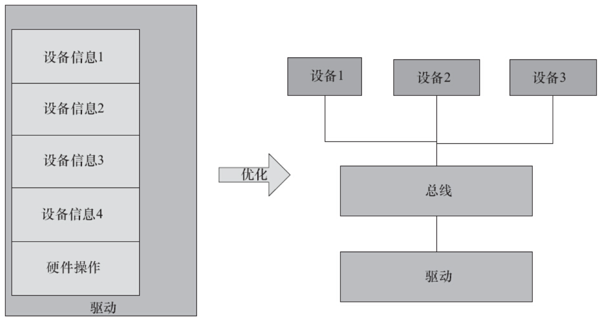
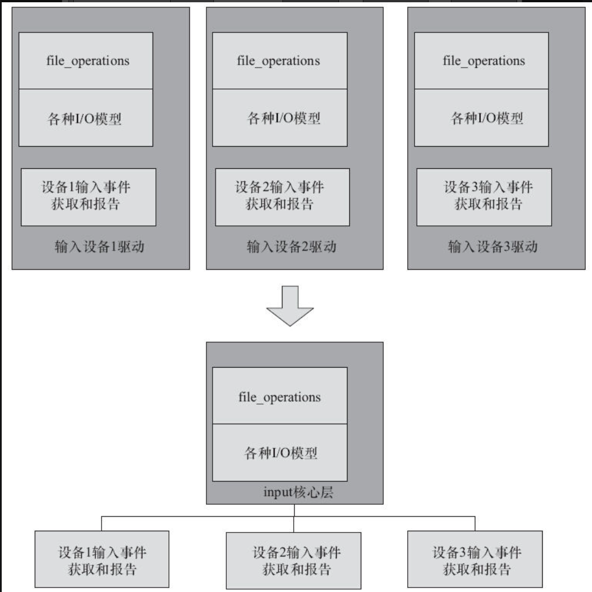
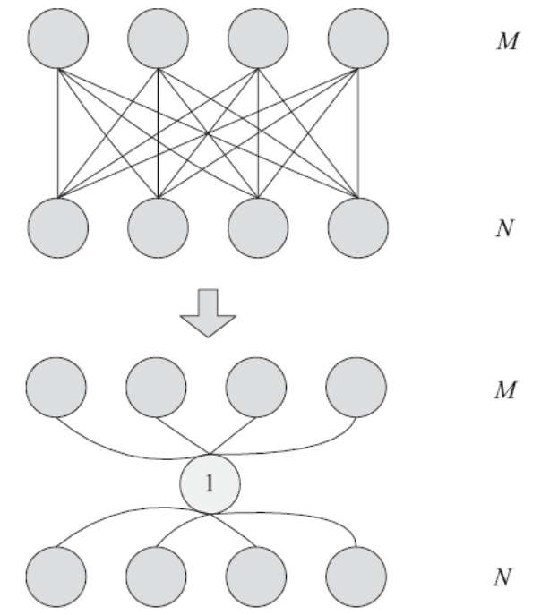
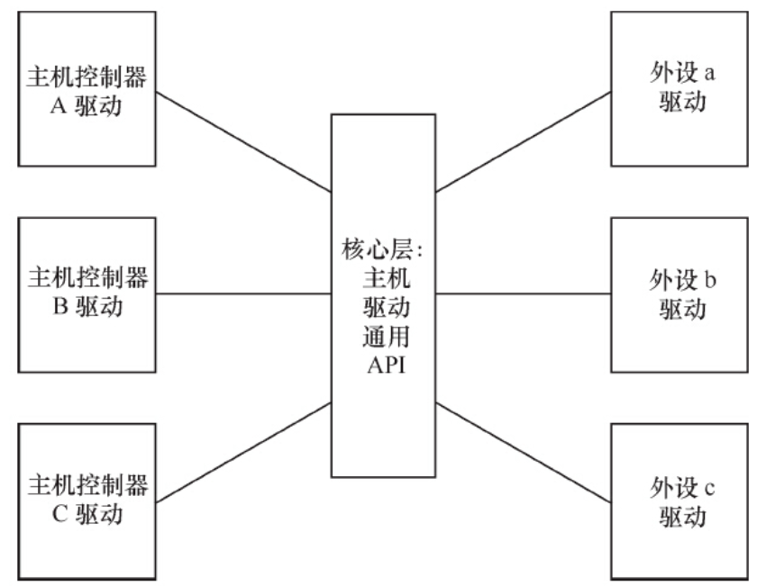

Linux不是为了某单一电路板而设计的操作系统，它可以支持约30种体系结构下一定数量的硬件，因此，它的驱动架构很显然不能像RTOS下或者无操作系统下那么小儿科的做法。

Linux设备驱动非常重视软件的可重用和跨平台能力。譬如，如果我们写下一个DM9000网卡的驱动，Linux的想法是这个驱动应该最好一行都不要改就可以在任何一个平台上跑起来。为了做到这一点（看似很难，因为每个板子连接DM9000的基地址，中断号什么的都可能不一样），驱动中势必会有类似这样的代码：

```
#ifdef  BOARD_XXX
#define DM9000_BASE 0x10000
#define DM9000_IRQ 8
#elif defined(BOARD_YYY)
#define DM9000_BASE 0x20000
#define DM9000_IRQ 7
#elif defined(BOARD_ZZZ)
#define DM9000_BASE 0x30000
#define DM9000_IRQ 9…
#endif
```

上述代码主要有如下问题：

1）此段代码看起来面目可憎，如果有100个板子，就要if/else 100次，到了第101个板子，又得重新加if/else。代码进行着简单的“复制—粘贴”，“复制—粘贴”式的简单重复通常意味着代码编写者的水平很差。

2）非常难做到一个驱动支持多个设备，如果某个电路板上有两个DM9000网卡，则DM9000_BASE这个宏就不够用了，此时势必要定义出来DM9000_BASE 1、DM9000_BASE 2、DM9000_IRQ 1、DM9000_IRQ 2类的宏；定义了DM9000_BASE 1、DM9000_BASE 2后，如果又有第3个DM9000网卡加到板子上，前面的代码就又不适用了。

3）依赖于make menuconfig选择的项目来编译内核，因此，在不同的硬件平台下要依赖于所选择的BOARD_XXX、BOARD_YYY选项来决定代码逻辑。这不符合ARM Linux 3.x一个映像适用于多个硬件的目标。实际上，我们可能同时选择了BOARD_XXX、BOARD_YYY、BOARD_ZZZ。

我们按照上面的方法编写代码的时候，相信自己编着编着也会觉得奇怪，闻到了代码里不好的味道。这个时候，请停下你飞奔的脚步，等一等你的灵魂。我们有没有办法把设备端的信息从驱动里面剥离出来，让驱动以某种标准方法拿到这些平台信息呢Linux总线、设备和驱动模型实际上可以做到这一点，驱动只管驱动，设备只管设备，总线则负责匹配设备和驱动，而驱动则以标准途径拿到板级信息，这样，驱动就可以放之四海而皆准了，如图12.1所示。

Linux的字符设备驱动需要编写file_operations成员函数，并负责处理阻塞、非组塞、多路复用、SIGIO等复杂事物。但是，当我们面对一个真实的硬件驱动时，假如要编写一个按键的驱动，作为一个“懒惰”的程序员，你真的只想做最简单的工作，譬如，收到一个按键中断、汇报一个按键值，至于什么file_operations、几种I/O模型，那是Linux的事情，为什么要我管Linux也是程序员写出来的，因此，程序员怎么想，它必然要怎么做。于是，这里就衍生出来了一个软件分层的想法，尽管file_operations、I/O模型不可或缺，但是关于此部分的代码，全世界恐怕所有的输入设备都是一样的，为什么不提炼一个中间层出来，把这些事情搞定，也就是在底层编写驱动的时候，搞定具体的硬件操作呢？

将软件进行分层设计应该是软件工程最基本的一个思想，如果提炼一个input的核心层出来，把跟Linux接口以及整个一套input事件的汇报机制都在这里面实现，如图12.2所示，显然是非常好的。



图12.1　Linux设备和驱动的分离



图12.2　Linux驱动的分层

在Linux设备驱动框架的设计中，除了有分层设计以外，还有分隔的思想。举一个简单的例子，假设我们要通过SPI总线访问某外设，假设CPU的名字叫XXX1，SPI外设叫YYY1。在访问YYY1外设的时候，要通过操作CPU XXX1上的SPI控制器的寄存器才能达到访问SPI外设YYY1的目的，最简单的代码逻辑是：

```
cpu_xxx1_spi_reg_write()
cpu_xxx1_spi_reg_read()
spi_client_yyy1_work1()
cpu_xxx1_spi_reg_write()
cpu_xxx1_spi_reg_read()
spi_client_yyy1_work2()
```

如果按照这种方式来设计驱动，结果对于任何一个SPI外设来讲，它的驱动代码都是与CPU相关的。也就是说，当代码用在CPU XXX1上的时候，它访问XXX1的SPI主机控制寄存器，当用在XXX2上的时候，它访问XXX2的SPI主机控制寄存器：

```
cpu_xxx2_spi_reg_write()
cpu_xxx2_spi_reg_read()
spi_client_yyy1_work1()
cpu_xxx2_spi_reg_write()
cpu_xxx2_spi_reg_read()
spi_client_yyy1_work2()
```

这显然是不被接受的，因为这意味着外设YYY1用在不同的CPU XXX1和XXX2上的时候需要不同的驱动。同时，如果CPU XXX1除了支持YYY1以外，还要支持外设YYY2、YYY3、YYY4等，这个XXX的代码就要重复出现在YYY1、YYY2、YYY3、YYY4的驱动里面：

```
cpu_xxx1_spi_reg_write()
cpu_xxx1_spi_reg_read()
spi_client_yyy2_work1()
cpu_xxx1_spi_reg_write()
cpu_xxx1_spi_reg_read()
spi_client_yyy2_work2()…
```

按照这样的逻辑，如果要让N个不同的YYY在M个不同的CPU XXX上跑起来，需要M*N份代码。这是一种典型的强耦合，不符合软件工程“高内聚、低耦合”和“信息隐蔽”的基本原则。

这种软件架构是一种典型的网状耦合，网状耦合一般不太适合人类的思维逻辑，会把我们的思维搞乱。对于网状耦合的M∶N，我们一般要提炼出一个中间“1”，让M与“1”耦合，N也与这个“1”耦合，如图12.3所示。



图12.3　将M∶N耦合转化为M∶1∶N耦合

那么，我们可以用如图12.4所示的思想对主机控制器驱动和外设驱动进行分离。这样的结果是，外设YYY1、YYY2、YYY3、YYY4的驱动与主机控制器XXX1、XXX2、XXX3、XXX4的驱动不相关，主机控制器驱动不关心外设，而外设驱动也不关心主机，外设只是访问核心层的通用API进行数据传输，主机和外设之间可以进行任意组合。



图12.4　Linux设备驱动的主机、外设驱动分离

如果我们不进行如图12.4所示的主机和外设分离，外设YYY1、YYY2、YYY3和主机XXX1、XXX2、XXX3进行组合的时候，需要9个不同的驱动。设想一共有m个主机控制器，n个外设，分离的结果是需要m+n个驱动，不分离则需要m*n个驱动。因为，m个主机控制器，n个外设的驱动都可以被充分地复用了。