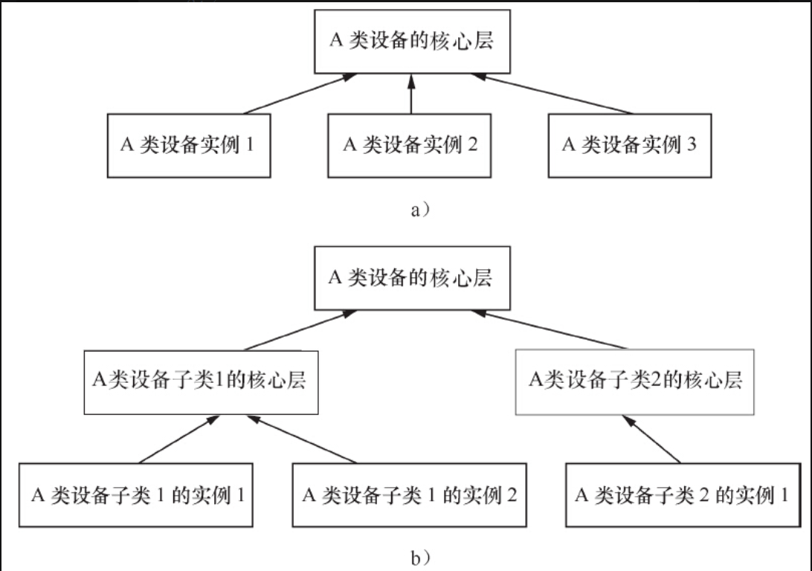
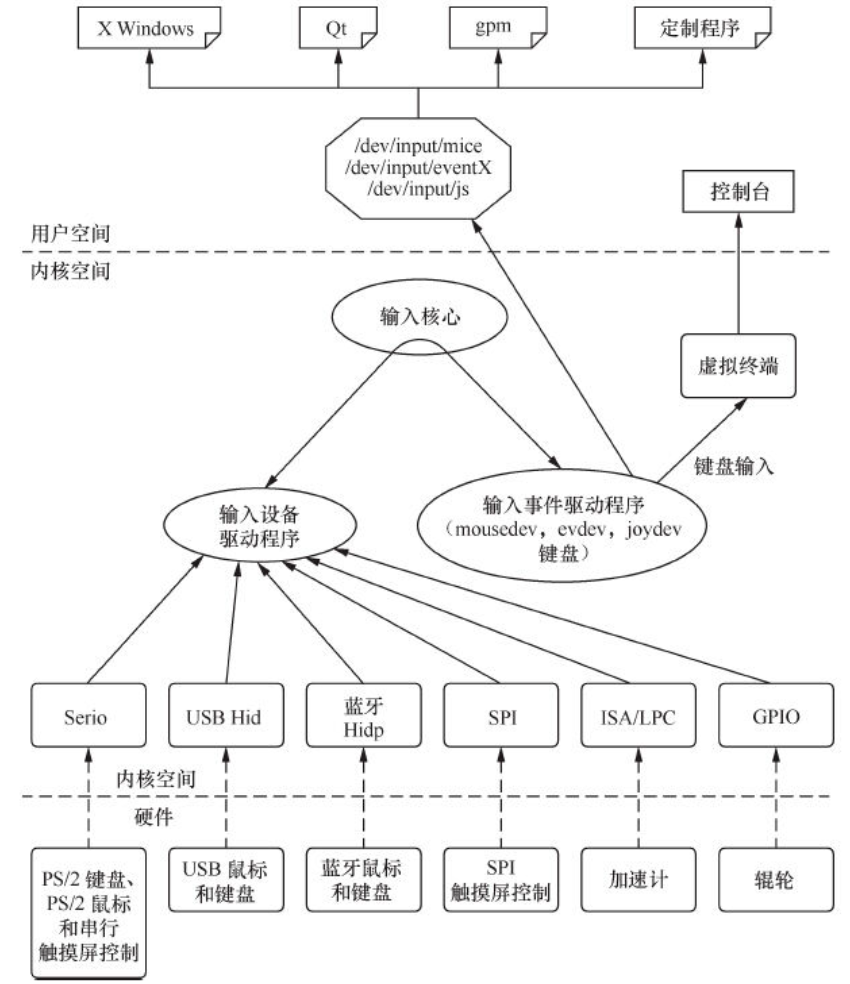
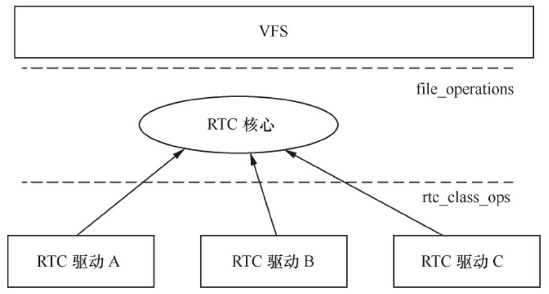
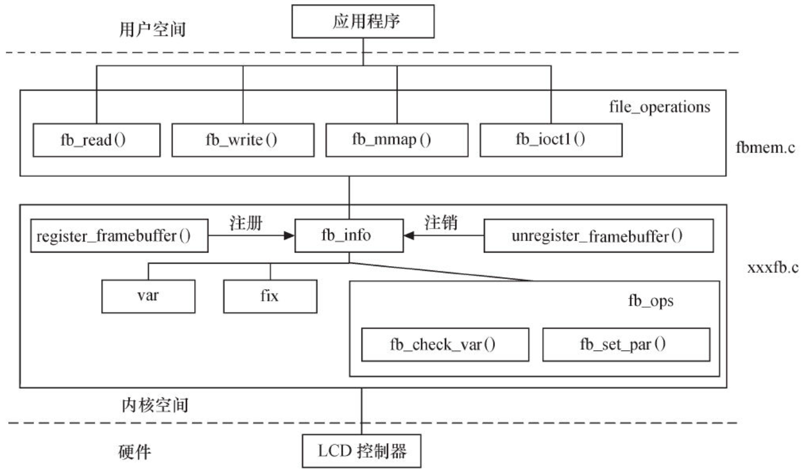
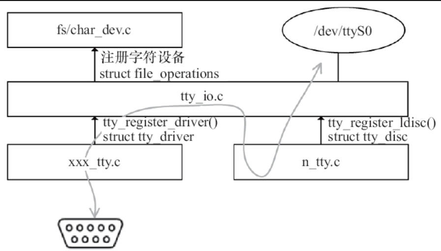
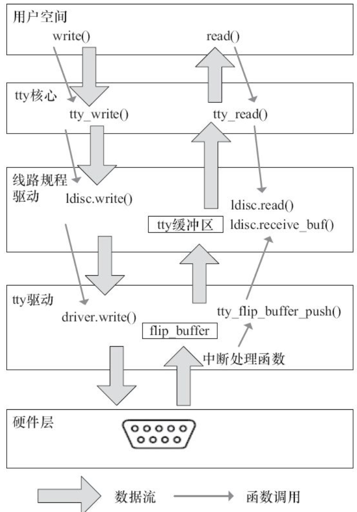
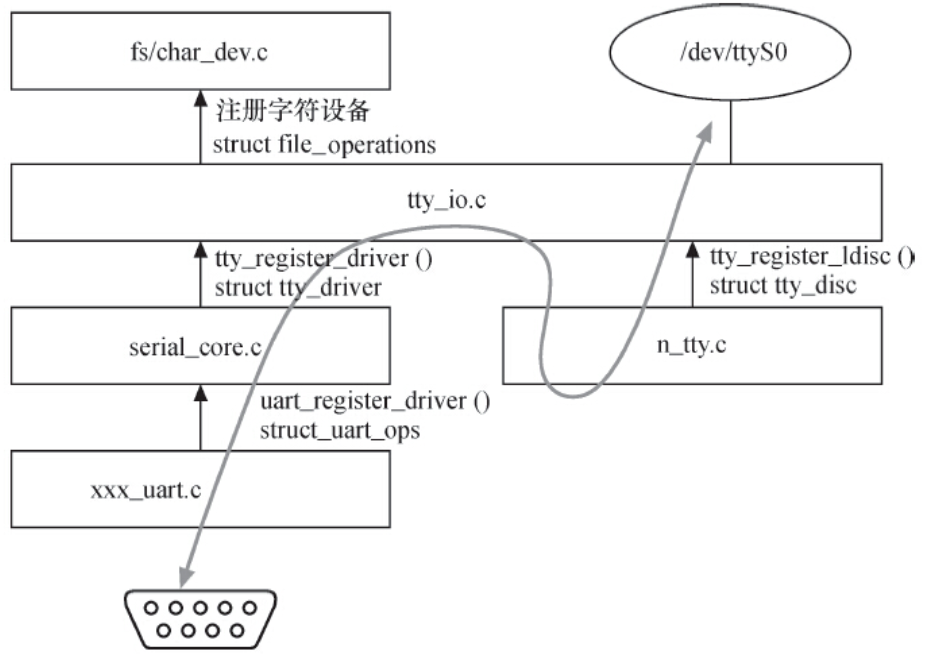
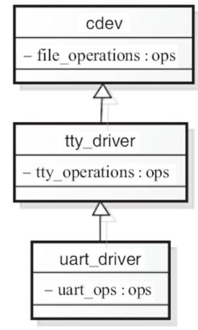

# 12.3.1　设备驱动核心层和例化

在12.1节，我们已经从感性上认识了Linux驱动软件分层的意义。其实，在分层设计的时候，Linux内核大量使用了面向对象的设计思想。

在面向对象的程序设计中，可以为某一类相似的事物定义一个基类，而具体的事物可以继承这个基类中的函数。如果对于继承的这个事物而言，某成员函数的实现与基类一致，那它就可以直接继承基类的函数；相反，它也可以重写（Overriding），对父类的函数进行重新定义。若子类中的方法与父类中的某方法具有相同的方法名、返回类型和参数表，则新方法将覆盖原有的方法。这种面向对象的“多态”设计思想极大地提高了代码的可重用能力，是对现实世界中事物之间关系的一种良好呈现。

Linux内核完全是由C语言和汇编语言写成，但是却频繁地用到了面向对象的设计思想。在设备驱动方面，往往为同类的设备设计了一个框架，而框架中的核心层则实现了该设备通用的一些功能。同样的，如果具体的设备不想使用核心层的函数，也可以重写。举个例子：

```
return_type core_funca(xxx_device * bottom_dev, param1_type param1, param1_type param2)
{
    if (bottom_dev->funca)
        return bottom_dev->funca(param1, param2);
    /* 核心层通用的funca代码*/
    ...
}
```

在上述core_funca的实现中，会检查底层设备是否重写了funca（），如果重写了，就调用底层的代码，否则，直接使用通用层的。这样做的好处是，核心层的代码可以处理绝大多数与该类设备的funca（）对应的功能，只有少数特殊设备需要重新实现funca（）。

再看一个例子：

```
return_type core_funca(xxx_device * bottom_dev, param1_type param1, param1_type param2)
{
     /*通用的步骤代码A */
     typea_dev_commonA();
     ...
     /* 底层操作ops1 */
     bottom_dev->funca_ops1();
     /*通用的步骤代码B */
     typea_dev_commonB();
     ...
     /* 底层操作ops2 */
     bottom_dev->funca_ops2();
     /*通用的步骤代码C */
     typea_dev_commonB();
     ...
     /** 底层操作ops3*/
     bottom_dev->funca_ops3();
}
```

上述代码假定为了实现funca（），对于同类设备而言，操作流程一致，都要经过“通用代码A、底层ops1、通用代码B、底层ops2、通用代码C、底层ops3”这几步，分层设计带来的明显好处是，对于通用代码A、B、C，具体的底层驱动不需要再实现，而仅仅只要关心其底层的操作ops1、ops2、ops3则可。

图12.5明确反映了设备驱动的核心层与具体设备驱动的关系，实际上，这种分层可能只有两层（见图12.5a），也可能是多层的（图12.5b）。



图12.5　Linux设备驱动的分层

这样的分层化设计在Linux的input、RTC、MTD、I2 C、SPI、tty、USB等诸多类型设备驱动中屡见不鲜。下面的几小节以input、RTC、Framebuffer等为例先进行一番讲解，当然，后续的章节会对与几个大的设备类型对应的驱动层次进行更详细的分析。

# 12.3.2　输入设备驱动

输入设备（如按键、键盘、触摸屏、鼠标等）是典型的字符设备，其一般的工作机理是底层在按键、触摸等动作发送时产生一个中断（或驱动通过Timer定时查询），然后CPU通过SPI、I2 C或外部存储器总线读取键值、坐标等数据，并将它们放入一个缓冲区，字符设备驱动管理该缓冲区，而驱动的read（）接口让用户可以读取键值、坐标等数据。

显然，在这些工作中，只是中断、读键值/坐标值是与设备相关的，而输入事件的缓冲区管理以及字符设备驱动的file_operations接口则对输入设备是通用的。基于此，内核设计了输入子系统，由核心层处理公共的工作。Linux内核输入子系统的框架如图12.6所示。



图12.6　Linux内核输入子系统的框架

输入核心提供了底层输入设备驱动程序所需的API，如分配/释放一个输入设备：

```
struct input_dev *input_allocate_device(void);
void input_free_device(struct input_dev *dev);
```

input_allocate_device（）返回的是1个input_dev的结构体，此结构体用于表征1个输入设备。

注册/注销输入设备用的接口如下：

```
int __must_check input_register_device(struct input_dev *);
void input_unregister_device(struct input_dev *);
```

报告输入事件用的接口如下：

```
/* 报告指定type、code的输入事件*/
void input_event(struct input_dev *dev, unsigned int type, unsigned int code, int value);
/* 报告键值*/
void input_report_key(struct input_dev *dev, unsigned int code, int value);
/* 报告相对坐标*/
void input_report_rel(struct input_dev *dev, unsigned int code, int value);
/* 报告绝对坐标 */
void input_report_abs(struct input_dev *dev, unsigned int code, int value);
/* 报告同步事件 */
void input_sync(struct input_dev *dev);
```

而对于所有的输入事件，内核都用统一的数据结构来描述，这个数据结构是input_event，如代码清单12.10所示。

代码清单12.10　input_event结构体

```
1struct input_event {
2   struct timeval time;
3   __u16type;
4   __u16code;
5   __s32value;
6};
```

drivers/input/keyboard/gpio_keys.c基于input架构实现了一个通用的GPIO按键驱动。该驱动是基于platform_driver架构的，名为“gpio-keys”。它将与硬件相关的信息（如使用的GPIO号，按下和抬起时的电平等）屏蔽在板文件platform_device的platform_data中，因此该驱动可应用于各个处理器，具有良好的跨平台性。代码清单12.11列出了该驱动的probe（）函数。

代码清单12.11　GPIO按键驱动的probe（）函数

```
 1static int gpio_keys_probe(struct platform_device *pdev)
 2{
 3 struct device *dev = &pdev->dev;
 4 const struct gpio_keys_platform_data *pdata = dev_get_platdata(dev);
 5 struct gpio_keys_drvdata *ddata;
 6 struct input_dev *input;
 7 size_t size;
 8 int i, error;
 9 int wakeup = 0;
10
11 if (!pdata) {
12     pdata = gpio_keys_get_devtree_pdata(dev);
13     if (IS_ERR(pdata))
14         return PTR_ERR(pdata);
15 }
16
17 size = sizeof(struct gpio_keys_drvdata) +
18         pdata->nbuttons * sizeof(struct gpio_button_data);
19 ddata = devm_kzalloc(dev, size, GFP_KERNEL);
20 if (!ddata) {
21     dev_err(dev, "failed to allocate state\n");
22     return -ENOMEM;
23 }
24
25 input = devm_input_allocate_device(dev);
26 if (!input) {
27     dev_err(dev, "failed to allocate input device\n");
28     return -ENOMEM;
29 }
30
31 ddata->pdata = pdata;
32 ddata->input = input;
33 mutex_init(&ddata->disable_lock);
34
35 platform_set_drvdata(pdev, ddata);
36 input_set_drvdata(input, ddata);
37
38 input->name = pdata->name   : pdev->name;
39 input->phys = "gpio-keys/input0";
40 input->dev.parent = &pdev->dev;
41 input->open = gpio_keys_open;
42 input->close = gpio_keys_close;
43
44 input->id.bustype = BUS_HOST;
45 input->id.vendor = 0x0001;
46 input->id.product = 0x0001;
47 input->id.version = 0x0100;
48
49 /* Enable auto repeat feature of Linux input subsystem */
50 if (pdata->rep)
51     __set_bit(EV_REP, input->evbit);
52
53 for (i = 0; i < pdata->nbuttons; i++) {
54     const struct gpio_keys_button *button = &pdata->buttons[i];
55     struct gpio_button_data *bdata = &ddata->data[i];
56
57     error = gpio_keys_setup_key(pdev, input, bdata, button);
58     if (error)
59         return error;
60
61     if (button->wakeup)
62         wakeup = 1;
63 }
64
65 error = sysfs_create_group(&pdev->dev.kobj, &gpio_keys_attr_group);
66 ...
67 error = input_register_device(input);
68 ...
69}
```

上述代码的第25行分配了1个输入设备，第31~47行初始化了该input_dev的一些属性，第58行注册了这个输入设备。第53~63行则初始化了所用到的GPIO，第67行完成了这个输入设备的注册。

在注册输入设备后，底层输入设备驱动的核心工作只剩下在按键、触摸等人为动作发生时报告事件。代码清单12.12列出了GPIO按键中断发生时的事件报告代码。

代码清单12.12　GPIO按键中断发生时的事件报告

```
 1static irqreturn_t gpio_keys_irq_isr(int irq, void *dev_id)
 2{
 3 struct gpio_button_data *bdata = dev_id;
 4 const struct gpio_keys_button *button = bdata->button;
 5 struct input_dev *input = bdata->input;
 6 unsigned long flags;
 7
 8 BUG_ON(irq != bdata->irq);
 9
10 spin_lock_irqsave(&bdata->lock, flags);
11
12 if (!bdata->key_pressed) {
13     if (bdata->button->wakeup)
14         pm_wakeup_event(bdata->input->dev.parent, 0);
15
16     input_event(input, EV_KEY, button->code, 1);
17     input_sync(input);
18
19     if (!bdata->timer_debounce) {
20         input_event(input, EV_KEY, button->code, 0);
21         input_sync(input);
22         goto out;
23     }
24
25     bdata->key_pressed = true;
26 }
27
28 if (bdata->timer_debounce)
29     mod_timer(&bdata->timer,
30         jiffies + msecs_to_jiffies(bdata->timer_debounce));
31out:
32 spin_unlock_irqrestore(&bdata->lock, flags);
33 return IRQ_HANDLED;
34}
```

GPIO按键驱动通过input_event（）、input_sync（）这样的函数来汇报按键事件以及同步事件。从底层的GPIO按键驱动可以看出，该驱动中没有任何file_operations的动作，也没有各种I/O模型，注册进入系统也用的是input_register_device（）这样的与input相关的API。这是由于与Linux VFS接口的这一部分代码全部都在drivers/input/evdev.c中实现了，代码清单12.13摘取了部分关键代码。

代码清单12.13　input核心层的file_operations和read（）函数

```
 1static ssize_t evdev_read(struct file *file, char __user *buffer,
 2            size_t count, loff_t *ppos)
 3{
 4 struct evdev_client *client = file->private_data;
 5 struct evdev *evdev = client->evdev;
 6 struct input_event event;
 7 size_t read = 0;
 8 int error;
 9
10 if (count != 0&& count < input_event_size())
11     return -EINVAL;
12
13 for (;;) {
14     if (!evdev->exist || client->revoked)
15         return -ENODEV;
16
17     if (client->packet_head == client->tail &&
18         (file->f_flags & O_NONBLOCK))
19         return -EAGAIN;
20
21     /*
22      * count == 0is special - no IO is done but we check
23      * for error conditions (see above).
24      */
25     if (count == 0)
26         break;
27
28     while (read + input_event_size() <= count &&
29            evdev_fetch_next_event(client, &event)) {
30
31         if (input_event_to_user(buffer + read, &event))
32             return -EFAULT;
33
34         read += input_event_size();
35     }
36
37     if (read)
38         break;
39
40     if (!(file->f_flags & O_NONBLOCK)) {
41         error = wait_event_interruptible(evdev->wait,
42                 client->packet_head != client->tail ||
43                 !evdev->exist || client->revoked);
44         if (error)
45             return error;
46     }
47 }
48
49 return read;
50}
51
52static const struct file_operations evdev_fops = {
53 .owner        = THIS_MODULE,
54 .read         = evdev_read,
55 .write        = evdev_write,
56 .pol          = evdev_poll,
57 .open         = evdev_open,
58 .release      = evdev_release,
59 .unlocked_ioct= evdev_ioctl,
60#ifdef CONFIG_COMPAT
61 .compat_ioct= evdev_ioctl_compat,
62#endif
63 .fasync        = evdev_fasync,
64 .flush         = evdev_flush,
65 .llseek        = no_llseek,
66};
```

上述代码中的17~19行在检查出是非阻塞访问后，立即返回EAGAIN错误，而第29行和第41~43行的代码则处理了阻塞的睡眠情况。回过头来想，其实gpio_keys驱动里面调用的input_event（）、input_sync（）有间接唤醒这个等待队列evdev->wait的功能，只不过这些代码都隐藏在其内部实现里了。

# 12.3.3　RTC设备驱动

RTC（实时钟）借助电池供电，在系统掉电的情况下依然可以正常计时。它通常还具有产生周期性中断以及闹钟（Alarm）中断的能力，是一种典型的字符设备。作为一种字符设备驱动，RTC需要有file_operations中接口函数的实现，如open（）、release（）、read（）、poll（）、ioctl（）等，而典型的IOCTL包括RTC_SET_TIME、RTC_ALM_READ、RTC_ALM_SET、RTC_IRQP_SET、RTC_IRQP_READ等，这些对于所有的RTC是通用的，只有底层的具体实现是与设备相关的。

因此，drivers/rtc/rtc-dev.c实现了RTC驱动通用的字符设备驱动层，它实现了file_opearations的成员函数以及一些通用的关于RTC的控制代码，并向底层导出rtc_device_register（）、rtc_device_unregister（）以注册和注销RTC；导出rtc_class_ops结构体以描述底层的RTC硬件操作。这个RTC通用层实现的结果是，底层的RTC驱动不再需要关心RTC作为字符设备驱动的具体实现，也无需关心一些通用的RTC控制逻辑，图12.7表明了这种关系。



图12.7　Linux RTC设备驱动的分层

drivers/rtc/rtc-s3c.c实现了S3C6410的RTC驱动，其注册RTC以及绑定rtc_class_ops的代码如代码清单12.14所示。

代码清单12.14　S3C6410RTC驱动的rtc_class_ops实例与RTC注册

```
 1static const struct rtc_class_ops s3c_rtcops = {
 2 .read_time     = s3c_rtc_gettime,
 3 .set_time      = s3c_rtc_settime,
 4 .read_alarm    = s3c_rtc_getalarm,
 5 .set_alarm     = s3c_rtc_setalarm,
 6 .proc          = s3c_rtc_proc,
 7 .alarm_irq_enable = s3c_rtc_setaie,
 8};
 9
10static int s3c_rtc_probe(struct platform_device *pdev)
11{
12 ...
13 rtc = devm_rtc_device_register(&pdev->dev, "s3c", &s3c_rtcops,
14               THIS_MODULE);
15 ...
16}
```

drivers/rtc/rtc-dev.c以及其调用的drivers/rtc/interface.c等RTC核心层相当于把file_operations中的open（）、release（）、读取和设置时间等都间接“转发”给了底层的实例，代码清单12.15摘取了部分RTC核心层调用具体底层驱动callback的过程。

代码清单12.15　RTC核心层“转发”到底层RTC驱动callback

```
 1static int rtc_dev_open(struct inode *inode, struct file *file)
 2{
 3 ...
 4 err = ops->open   ops->open(rtc->dev.parent) : 0;
 5 ...
 6}
 7
 8static int __rtc_read_time(struct rtc_device *rtc, struct rtc_time *tm)
 9{
10 int err;
11 if (!rtc->ops)
12     err = -ENODEV;
13 else if (!rtc->ops->read_time)
14      err = -EINVAL;
15 ...
16 return err;
17}
18
19int rtc_read_time(struct rtc_device *rtc, struct rtc_time *tm)
20{
21 int err;
22
23 err = mutex_lock_interruptible(&rtc->ops_lock);
24 if (err)
25     return err;
26
27 err = __rtc_read_time(rtc, tm);
28 mutex_unlock(&rtc->ops_lock);
29 return err;
30}
31
32int rtc_set_time(struct rtc_device *rtc, struct rtc_time *tm)
33{
34 ...
35
36 if (!rtc->ops)
37     err = -ENODEV;
38 else if (rtc->ops->set_time)
39     err = rtc->ops->set_time(rtc->dev.parent, tm);
40 ...
41 return err;
42}
43
44static long rtc_dev_ioctl(struct file *file,
45     unsigned int cmd, unsigned long arg)
46{
47 ...
48
49 case RTC_RD_TIME:
50     mutex_unlock(&rtc->ops_lock);
51
52     err = rtc_read_time(rtc, &tm);
53     if (err < 0)
54         return err;
55
56     if (copy_to_user(uarg, &tm, sizeof(tm)))
57         err = -EFAULT;
58     return err;
59
60 case RTC_SET_TIME:
61     mutex_unlock(&rtc->ops_lock);
62
63     if (copy_from_user(&tm, uarg, sizeof(tm)))
64         return -EFAULT;
65
66     return rtc_set_time(rtc, &tm);
67 ...
68}
```

# 12.3.4　Framebuffer设备驱动

Framebuffer（帧缓冲）是Linux系统为显示设备提供的一个接口，它将显示缓冲区抽象，屏蔽图像硬件的底层差异，允许上层应用程序在图形模式下直接对显示缓冲区进行读写操作。对于帧缓冲设备而言，只要在显示缓冲区中与显示点对应的区域内写入颜色值，对应的颜色会自动在屏幕上显示。

图12.8所示为Linux帧缓冲设备驱动的主要结构，帧缓冲设备提供给用户空间的file_operations结构体由drivers/video/fbdev/core/fbmem.c中的file_operations提供，而特定帧缓冲设备fb_info结构体的注册、注销以及其中成员的维护，尤其是fb_ops中成员函数的实现则由对应的xxxfb.c文件实现，fb_ops中的成员函数最终会操作LCD控制其硬件寄存器。



图12.8　Linux帧缓冲设备驱动的程序结构

多数显存的操作方法都是规范的，可以按照像素点格式的要求顺序写帧缓冲区。但是有少量LCD的显存写法可能比较特殊，这时候，在核心层drivers/video/fbdev/core/fbmem.c实现的fb_write（）中，实际上可以给底层提供一个重写自己的机会，如代码清单12.16所示。

代码清单12.16　LCD的framebuffer write（）函数

```
 1static ssize_t
 2fb_write(struct file *file, const char __user *buf, size_t count, loff_t *ppos)
 3{
 4 unsigned long p = *ppos;
 5 struct fb_info *info = file_fb_info(file);
 6 u8*buffer, *src;
 7 u8__iomem *dst;
 8 int c, cnt = 0, err = 0;
 9 unsigned long total_size;
10
11 if (!info || !info->screen_base)
12     return -ENODEV;
13
14 if (info->state != FBINFO_STATE_RUNNING)
15     return -EPERM;
16
17 if (info->fbops->fb_write)
18     return info->fbops->fb_write(info, buf, count, ppos);
19
20 total_size = info->screen_size;
21
22 if (total_size == 0)
23     total_size = info->fix.smem_len;
24
25 if (p > total_size)
26     return -EFBIG;
27
28 if (count > total_size) {
29     err = -EFBIG;
30     count = total_size;
31 }
32
33 if (count + p > total_size) {
34     if (!err)
35         err = -ENOSPC;
36
37     count = total_size - p;
38 }
39
40 buffer = kmalloc((count > PAGE_SIZE)   PAGE_SIZE : count,
41          GFP_KERNEL);
42 if (!buffer)
43     return -ENOMEM;
44
45 dst = (u8__iomem *) (info->screen_base + p);
46
47 if (info->fbops->fb_sync)
48     info->fbops->fb_sync(info);
49
50 while (count) {
51     c = (count > PAGE_SIZE)   PAGE_SIZE : count;
52     src = buffer;
53
54     if (copy_from_user(src, buf, c)) {
55         err = -EFAULT;
56         break;
57     }
58
59     fb_memcpy_tofb(dst, src, c);
60     dst += c;
61     src += c;
62     *ppos += c;
63     buf += c;
64     cnt += c;
65     count -= c;
66 }
67
68 kfree(buffer);
69
70 return (cnt)   cnt : err;
71}
```

第17~18行是一个检查底层LCD有没有实现自己特殊显存写法的代码，如果有，直接调底层的；如果没有，用中间层标准的显存写法就搞定了底层的那个不特殊的LCD。

# 12.3.5　终端设备驱动

在Linux系统中，终端是一种字符型设备，它有多种类型，通常使用tty（Teletype）来简称各种类型的终端设备。对于嵌入式系统而言，最普遍采用的是UART（Universal Asynchronous Receiver/Transmitter）串行端口，日常生活中简称串口。

Linux内核中tty的层次结构如图12.9所示，它包含tty核心tty_io.c、tty线路规程n_tty.c（实现N_TTY线路规程）和tty驱动实例xxx_tty.c，tty线路规程的工作是以特殊的方式格式化从一个用户或者硬件收到的数据，这种格式化常常采用一个协议转换的形式。

tty_io.c本身是一个标准的字符设备驱动，它对上有字符设备的职责，实现file_operations成员函数。但是tty核心层对下又定义了tty_driver的架构，这样tty设备驱动的主体工作就变成了填充tty_driver结构体中的成员，实现其中的tty_operations的成员函数，而不再是去实现file_operations这一级的工作。tty_driver结构体和tty_operations的定义分别如代码清单12.17和12.18所示。



图12.9　Linux内核中tty的层次结构

代码清单12.17　tty_driver结构体

```
 1struct tty_driver {
 2      int     magic;                  /* magic number for this structure */
 3      struct kref kref;               /* Reference management */
 4      struct cdev *cdevs;
 5      struct module   *owner;
 6      const char      *driver_name;
 7      const char      *name;
 8      int     name_base;              /* offset of printed name */
 9      int     major;                  /* major device number */
10      int     minor_start;            /* start of minor device number */
11      unsigned int    num;            /* number of devices allocated */
12      short   type;                   /* type of tty driver */
13      short   subtype;                /* subtype of tty driver */
14      struct ktermios init_termios;   /* Initial termios */
15      unsigned long   flags;          /* tty driver flags */
16      struct proc_dir_entry *proc_entry;   /* /proc fs entry */
17      struct tty_driver *other;       /* only used for the PTY driver */
18
19      /*
20       * Pointer to the tty data structures
21       */
22      struct tty_struct **ttys;
23      struct tty_port **ports;
24      struct ktermios **termios;
25      void *driver_state;
26
27      /*
28       * Driver methods
29       */
30
31      const struct tty_operations *ops;
32      struct list_head tty_drivers;
33};
```

代码清单12.18　tty_operations结构体

```
 1struct tty_operations {
 2 struct tty_struct * (*lookup)(struct tty_driver *driver,
 3          struct inode *inode, int idx);
 4 int  (*install)(struct tty_driver *driver, struct tty_struct *tty);
 5 void (*remove)(struct tty_driver *driver, struct tty_struct *tty);
 6 int  (*open)(struct tty_struct * tty, struct file * filp);
 7 void (*close)(struct tty_struct * tty, struct file * filp);
 8 void (*shutdown)(struct tty_struct *tty);
 9 void (*cleanup)(struct tty_struct *tty);
10 int  (*write)(struct tty_struct * tty,
11           const unsigned char *buf, int count);
12 int  (*put_char)(struct tty_struct *tty, unsigned char ch);
13 void (*flush_chars)(struct tty_struct *tty);
14 int  (*write_room)(struct tty_struct *tty);
15 int  (*chars_in_buffer)(struct tty_struct *tty);
16 int  (*ioctl)(struct tty_struct *tty,
17         unsigned int cmd, unsigned long arg);
18 long (*compat_ioctl)(struct tty_struct *tty,
19                 unsigned int cmd, unsigned long arg);
20 void (*set_termios)(struct tty_struct *tty, struct ktermios * old);
21 void (*throttle)(struct tty_struct * tty);
22 void (*unthrottle)(struct tty_struct * tty);
23 void (*stop)(struct tty_struct *tty);
24 void (*start)(struct tty_struct *tty);
25 void (*hangup)(struct tty_struct *tty);
26 int (*break_ctl)(struct tty_struct *tty, int state);
27 void (*flush_buffer)(struct tty_struct *tty);
28 void (*set_ldisc)(struct tty_struct *tty);
29 void (*wait_until_sent)(struct tty_struct *tty, int timeout);
30 void (*send_xchar)(struct tty_struct *tty, char ch);
31 int (*tiocmget)(struct tty_struct *tty);
32 int (*tiocmset)(struct tty_struct *tty,
33         unsigned int set, unsigned int clear);
34 int (*resize)(struct tty_struct *tty, struct winsize *ws);
35 int (*set_termiox)(struct tty_struct *tty, struct termiox *tnew);
36 int (*get_icount)(struct tty_struct *tty,
37             struct serial_icounter_struct *icount);
38#ifdef CONFIG_CONSOLE_POLL
39 int (*poll_init)(struct tty_driver *driver, int line, char *options);
40 int (*poll_get_char)(struct tty_driver *driver, int line);
41 void (*poll_put_char)(struct tty_driver *driver, int line, char ch);
42#endif
43 const struct file_operations *proc_fops;
44};
```

如图12.10所示，tty设备发送数据的流程为：tty核心从一个用户获取将要发送给一个tty设备的数据，tty核心将数据传递给tty线路规程驱动，接着数据被传递到tty驱动，tty驱动将数据转换为可以发送给硬件的格式。接收数据的流程为：从tty硬件接收到的数据向上交给tty驱动，接着进入tty线路规程驱动，再进入tty核心，在这里它被一个用户获取。



图12.10　tty设备发送、接收数据流的流程

代码清单12.18中第10行的tty_driver操作集tty_operations的成员函数write（）函数接收3个参数：tty_struct、发送数据指针及要发送的字节数。该函数是被file_operations的write（）成员函数间接触发调用的。从接收角度看，tty驱动一般收到字符后会通过tty_flip_buffer_push（）将接收缓冲区推到线路规程。

尽管一个特定的底层UART设备驱动完全可以遵循上述tty_driver的方法来设计，即定义tty_driver并实现tty_operations中的成员函数，但是鉴于串口之间的共性，Linux考虑在文件drivers/tty/serial/serial_core.c中实现了UART设备的通用tty驱动层（我们可以称其为串口核心层）。这样，UART驱动的主要任务就进一步演变成了实现serial-core.c中定义的一组uart_xxx接口而不是tty_xxx接口，如图12.11所示。因此，按照面向对象的思想，可以认为tty_driver是字符设备的泛化、serial-core是tty_driver的泛化，而具体的串口驱动又是serial-core的泛化。



图12.11　串口核心层

串口核心层又定义了新的uart_driver结构体和其操作集uart_ops。一个底层的UART驱动需要创建和通过uart_register_driver（）注册一个uart_driver而不是tty_driver，代码清单12.19给出了uart_driver的定义。

代码清单12.19　uart_driver结构体

```
 1struct uart_driver {
 2      struct module           *owner;
 3      const char              *driver_name;
 4      const char              *dev_name;
 5      int                      major;
 6      int                      minor;
 7      int                      nr;
 8      struct console          *cons;
 9
10      /*
11       * these are private; the low level driver should not
12       * touch these; they should be initialised to NULL
13       */
14      struct uart_state       *state;
15      struct tty_driver       *tty_driver;
16};
```

uart_driver结构体在本质上是派生自uart_driver结构体，因此，它的第15行也包含了一个tty_driver结构体成员。tty_operations在UART这个层面上也被进一步泛化为了uart_ops，其定义如代码清单12.20所示。

代码清单12.20　uart_ops结构体

```
 1struct uart_ops {
 2 unsigned int    (*tx_empty)(struct uart_port *);
 3 void        (*set_mctrl)(struct uart_port *, unsigned int mctrl);
 4 unsigned int    (*get_mctrl)(struct uart_port *);
 5 void        (*stop_tx)(struct uart_port *);
 6 void        (*start_tx)(struct uart_port *);
 7 void        (*throttle)(struct uart_port *);
 8 void        (*unthrottle)(struct uart_port *);
 9 void        (*send_xchar)(struct uart_port *, char ch);
10 void        (*stop_rx)(struct uart_port *);
11 void        (*enable_ms)(struct uart_port *);
12 void        (*break_ctl)(struct uart_port *, int ctl);
13 int         (*startup)(struct uart_port *);
14 void        (*shutdown)(struct uart_port *);
15 void        (*flush_buffer)(struct uart_port *);
16 void        (*set_termios)(struct uart_port *, struct ktermios *new,
17                    struct ktermios *old);
18 void        (*set_ldisc)(struct uart_port *, struct ktermios *);
19 void        (*pm)(struct uart_port *, unsigned int state,
20               unsigned int oldstate);
21
22 const char    *(*type)(struct uart_port *);
23
24 void        (*release_port)(struct uart_port *);
25
26 int         (*request_port)(struct uart_port *);
27 void        (*config_port)(struct uart_port *, int);
28 int         (*verify_port)(struct uart_port *, struct serial_struct *);
29 int         (*ioctl)(struct uart_port *, unsigned int, unsigned long);
30#ifdef CONFIG_CONSOLE_POLL
31 int         (*poll_init)(struct uart_port *);
32 void        (*poll_put_char)(struct uart_port *, unsigned char);
33 int         (*poll_get_char)(struct uart_port *);
34#endif
35};
```

由于drivers/tty/serial/serial_core.c是一个tty_driver，因此在serial_core.c中，存在一个tty_operations的实例，这个实例的成员函数会进一步调用struct uart_ops的成员函数，这样就把file_operations里的成员函数、tty_operations的成员函数和uart_ops的成员函数串起来了。

# 12.3.6　misc设备驱动

由于Linux驱动倾向于分层设计，所以各个具体的设备都可以找到它归属的类型，从而套到它相应的架构里面去，并且只需要实现最底层的那一部分。但是，也有部分类似globalmem、globalfifo的字符设备，确实不知道它属于什么类型，我们一般推荐大家采用miscdevice框架结构。miscdevice本质上也是字符设备，只是在miscdevice核心层的misc_init（）函数中，通过register_chrdev（MISC_MAJOR，"misc"，&misc_fops）注册了字符设备，而具体miscdevice实例调用misc_register（）的时候又自动完成了device_create（）、获取动态次设备号的动作。

miscdevice的主设备号是固定的，MISC_MAJOR定义为10，在Linux内核中，大概可以找到200多处使用miscdevice框架结构的驱动。

miscdevice结构体的定义如代码清单12.21所示，在它的第4行，指向了一个file_operations的结构体。miscdevice结构体内file_operations中的成员函数实际上是由drivers/char/misc.c中misc驱动核心层的misc_fops成员函数间接调用的，比如misc_open（）就会间接调用底层注册的miscdevice的fops->open。

代码清单12.21　miscdevice结构体

```
 1struct miscdevice  {
 2      int minor;
 3      const char *name;
 4      const struct file_operations *fops;
 5      struct list_head list;
 6      struct device *parent;
 7      struct device *this_device;
 8      const char *nodename;
 9      umode_t mode;
10};
```

如果上述代码第2行的minor为MISC_DYNAMIC_MINOR，miscdevice核心层会自动找一个空闲的次设备号，否则用minor指定的次设备号。第3行的name是设备的名称。

miscdevice驱动的注册和注销分别用下面两个API

```
int misc_register(struct miscdevice * misc);
int misc_deregister(struct miscdevice *misc);
```

因此miscdevice驱动的一般结构形如：

```
static const struct file_operations xxx_fops = {
       .unlocked_ioctl = xxx_ioctl,
       .mmap           = xxx_mmap,
            …
};
static struct miscdevice xxx_dev = {
       .minor  = MISC_DYNAMIC_MINOR,
       .name   = "xxx",
       .fops   = &xxx_fops
};
static int __init xxx_init(void)
{
       pr_info("ARC Hostlink driver mmap at 0x%p\n", __HOSTLINK__);
       return misc_register(&xxx_dev);
}
```

在调用misc_register（&xxx_dev）时，该函数内部会自动调用device_create（），而device_create（）会以xxx_dev作为drvdata参数。其次，在miscdevice核心层misc_open（）函数的帮助下，在file_operations的成员函数中，xxx_dev会自动成为file的private_data（misc_open会完成file->private_data的赋值操作）。

如果我们用面向对象的封装思想把一个设备的属性、自旋锁、互斥体、等待队列、miscdevice等封装在一个结构体里面：

```
struct xxx_dev {
     unsigned int version;
     unsigned int size;
     spinlock_t lock;
    ...
    struct miscdevice miscdev;
};
```

在file_operations的成员函数中，就可以通过container_of（）和file->private_data反推出xxx_dev的实例。

```
static long xxx_ioctl(struct file *file, unsigned int cmd, unsigned long arg)
 {
    struct xxx_dev *xxx = container_of(file->private_data,
                struct xxx_dev, miscdev);
    ...
}
```

下面我们把globalfifo驱动改造成基于platform_driver且采用miscdevice框架的结构体。首先这个新的驱动变成了要通过platform_driver的probe（）函数来初始化，其次不再直接采用register_chrdev（）、cdev_add（）之类的原始API，而采用miscdevice的注册方法。代码清单12.22列出了新的globalfifo驱动相对于第9章globalfifo驱动变化的部分。

代码清单12.22　新的globalfifo驱动相对于第9章globalfifo驱动变化的部分

```
 1struct globalfifo_dev {
 2    ...
 3    struct miscdevice miscdev;
 4};
 5
 6static int globalfifo_fasync(int fd, struct file *filp, int mode)
 7{
 8    struct globalfifo_dev *dev = container_of(filp->private_data,
 9        struct globalfifo_dev, miscdev);
10    ...
11}
12
13static long globalfifo_ioctl(struct file *filp, unsigned int cmd,
14                 unsigned long arg)
15{
16    struct globalfifo_dev *dev = container_of(filp->private_data,
17        struct globalfifo_dev, miscdev);
18    ...
19}
20
21static unsigned int globalfifo_poll(struct file *filp, poll_table * wait)
22{
23    struct globalfifo_dev *dev = container_of(filp->private_data,
24        struct globalfifo_dev, miscdev);
25    ...
26}
27
28static ssize_t globalfifo_read(struct file *filp, char __user *buf,
29                   size_t count, loff_t *ppos)
30{
31    struct globalfifo_dev *dev = container_of(filp->private_data,
32        struct globalfifo_dev, miscdev);
33    ...
34}
35
36static ssize_t globalfifo_write(struct file *filp, const char __user *buf,
37                size_t count, loff_t *ppos)
38{
39    struct globalfifo_dev *dev = container_of(filp->private_data,
40        struct globalfifo_dev, miscdev);
41    ...
42}
43
44static int globalfifo_probe(struct platform_device *pdev)
45{
46    struct globalfifo_dev *gl;
47    int ret;
48
49    gl = devm_kzalloc(&pdev->dev, sizeof(*gl), GFP_KERNEL);
50    if (!gl)
51        return -ENOMEM;
52    gl->miscdev.minor = MISC_DYNAMIC_MINOR;
53    gl->miscdev.name = "globalfifo";
54    gl->miscdev.fops = &globalfifo_fops;
55
56    mutex_init(&gl->mutex);
57    init_waitqueue_head(&gl->r_wait);
58    init_waitqueue_head(&gl->w_wait);
59    platform_set_drvdata(pdev, gl);
60
61    ret = misc_register(&gl->miscdev);
62    if (ret < 0)
63        goto err;
64    ...
65    return 0;
66err:
67    return ret;
68}
69
70static int globalfifo_remove(struct platform_device *pdev)
71{
72    struct globalfifo_dev *gl = platform_get_drvdata(pdev);
73    misc_deregister(&gl->miscdev);
74    return 0;
75}
76
77static struct platform_driver globalfifo_driver = {
78    .driver = {
79        .name = "globalfifo",
80        .owner = THIS_MODULE,
81    },
82    .probe = globalfifo_probe,
83    .remove = globalfifo_remove,
84};
85module_platform_driver(globalfifo_driver);
```

在上述代码中，file_operations的各个成员函数都使用container_of（）反向求出private_data，第61行在platform_driver的probe（）函数中完成了miscdev的注册，而在remove（）函数中使用misc_deregister（）完成了miscdev的注销。

上述代码也改用了platform_device和platform_driver的体系结构。我们增加了一个模块来完成platform_device的注册，在模块初始化的时候通过platform_device_alloc（）和platform_device_add（）分配并添加platform_device，而在模块卸载的时候则通过platform_device_unregister（）注销platform_device，如代码清单12.23所示。

代码清单12.23　与globalfifo对应的platform_device的注册和注销

```
 1static struct platform_device *globalfifo_pdev;
 2
 3static int __init globalfifodev_init(void)
 4{
 5        int ret;
 6
 7        globalfifo_pdev = platform_device_alloc("globalfifo", -1);
 8        if (!globalfifo_pdev)
 9                return -ENOMEM;
10
11        ret = platform_device_add(globalfifo_pdev);
12        if (ret) {
13                platform_device_put(globalfifo_pdev);
14                return ret;
15        }
16
17        return 0;
18
19}
20module_init(globalfifodev_init);
21
22static void __exit globalfifodev_exit(void)
23{
24        platform_device_unregister(globalfifo_pdev);
25}
26module_exit(globalfifodev_exit);
```

本书配套代码/home/baohua/develop/training/kernel/drivers/globalfifo/ch12中包含了globalfifo driver和device端的两个模块。在该目录运行make，会生成两个模块：globalfifo.ko和globalfifo-dev.ko，把globalfifo.ko和globalfifo-dev.ko先后insmod，会导致platform_driver和platform_device的匹配，globalfifo_probe（）会执行，/dev/globalfifo节点会自动生成，默认情况下需要root权限来访问/dev/globalfifo。

如果此后我们rmmod globalfifo-dev.ko，则会导致platform_driver的remove（）成员函数，即globalfifo_remove（）函数被执行，/dev/globalfifo节点会自动消失。

# 12.3.7　驱动核心层

分析了上述多个实例，我们可以归纳出核心层肩负的3大职责：

1）对上提供接口。file_operations的读、写、ioctl都被中间层搞定，各种I/O模型也被处理掉了。

2）中间层实现通用逻辑。可以被底层各种实例共享的代码都被中间层搞定，避免底层重复实现。

3）对下定义框架。底层的驱动不再需要关心Linux内核VFS的接口和各种可能的I/O模型，而只需处理与具体硬件相关的访问。

这种分层有时候还不是两层，可以有更多层，在软件上呈现为面向对象里类继承和多态的状态。上一节介绍的终端设备驱动，在软件层次上类似图12.12的效果。



图12.12　tty驱动各层泛化