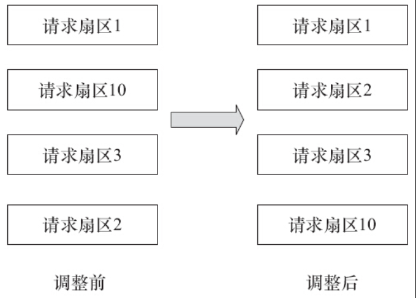
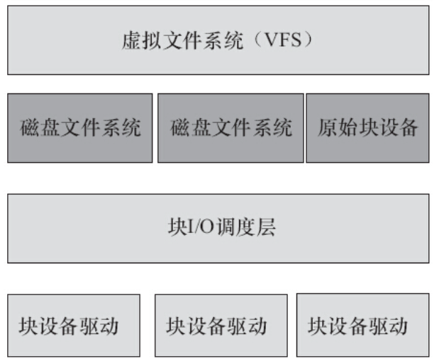

字符设备与块设备I/O操作的不同如下。

1）块设备只能以块为单位接收输入和返回输出，而字符设备则以字节为单位。大多数设备是字符设备，因为它们不需要缓冲而且不以固定块大小进行操作。

2）块设备对于I/O请求有对应的缓冲区，因此它们可以选择以什么顺序进行响应，字符设备无须缓冲且被直接读写。对于存储设备而言，调整读写的顺序作用巨大，因为在读写连续的扇区的存储速度比分离的扇区更快。

3）字符设备只能被顺序读写，而块设备可以随机访问。

虽然块设备可随机访问，但是对于磁盘这类机械设备而言，顺序地组织块设备的访问可以提高性能，如图13.1所示，对扇区1、10、3、2的请求被调整为对扇区1、2、3、10的请求。

在Linux中，我们通常通过磁盘文件系统EXT4、UBIFS等访问磁盘，但是磁盘也有一种原始设备的访问方式，如直接访问/dev/sdb1等。所有的EXT4、UBIFS、原始块设备又都工作于VFS之下，而EXT4、UBIFS、原始块设备之下又包含块I/O调度层以进行排序和合并（见图13.2）。

图13.1　调整块设备I/O操作的顺序

图13.2　Linux块设备子系统

I/O调度层的基本目的是将请求按照它们对应在块设备上的扇区号进行排列，以减少磁头的移动，提高效率。