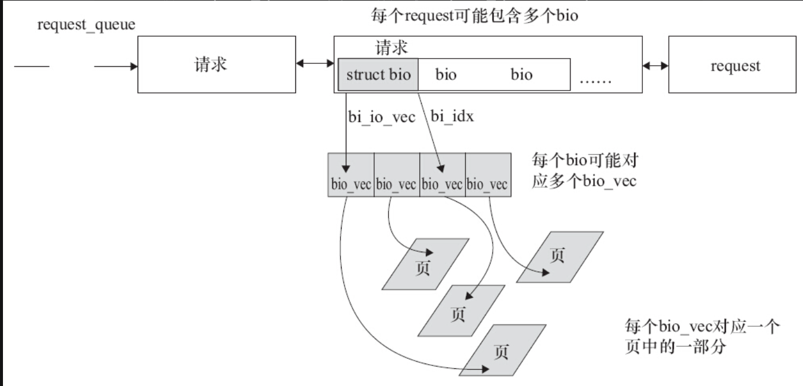

# 13.2.1　block_device_operations结构体

在块设备驱动中，有一个类似于字符设备驱动中file_operations结构体的block_device_operations结构体，它是对块设备操作的集合，定义如代码清单13.1所示。

代码清单13.1　block_device_operations结构体

```
 1struct block_device_operations {
 2       int (*open) (struct block_device *, fmode_t);
 3       void (*release) (struct gendisk *, fmode_t);
 4       int (*rw_page)(struct block_device *, sector_t, struct page *, int rw);
 5       int (*ioctl) (struct block_device *, fmode_t, unsigned, unsigned long);
 6       int (*compat_ioctl) (struct block_device *, fmode_t, unsigned, unsigned long);
 7       int (*direct_access) (struct block_device *, sector_t,
 8                                         void **, unsigned long *);
 9       unsigned int (*check_events) (struct gendisk *disk,
10                                unsigned int clearing);
11       /* ->media_changed() is DEPRECATED, use ->check_events() instead */
12       int (*media_changed) (struct gendisk *);
13       void (*unlock_native_capacity) (struct gendisk *);
14       int (*revalidate_disk) (struct gendisk *);
15       int (*getgeo)(struct block_device *, struct hd_geometry *);
16       /* this callback is with swap_lock and sometimes page table lock held */
17       void (*swap_slot_free_notify) (struct block_device *, unsigned long);
18       struct module *owner;
19};
```

下面对其主要成员函数进行分析。

1.打开和释放

```
int (*open) (struct block_device *, fmode_t);
void (*release) (struct gendisk *, fmode_t);
```

与字符设备驱动类似，当设备被打开和关闭时将调用它们。

2.I/O控制

```
int (*ioctl) (struct block_device *, fmode_t, unsigned, unsigned long);
int (*compat_ioctl) (struct block_device *, fmode_t, unsigned, unsigned long);
```

上述函数是ioctl（）系统调用的实现，块设备包含大量的标准请求，这些标准请求由Linux通用块设备层处理，因此大部分块设备驱动的ioctl（）函数相当短。当一个64位系统内的32位进程调用ioctl（）的时候，调用的是compat_ioctl（）。

3.介质改变

```
int (*media_changed) (struct gendisk *gd);
```

被内核调用以检查驱动器中的介质是否已经改变，如果是，则返回一个非0值，否则返回0。这个函数仅适用于支持可移动介质的驱动器，通常需要在驱动中增加一个表示介质状态是否改变的标志变量，非可移动设备的驱动不需要实现这个方法。

```
unsigned int (*check_events) (struct gendisk *disk,
                              unsigned int clearing);
```

media_changed（）这个回调函数目前已经过时了，已被check_events（）替代。Tejun Heo<tj@kernel.org>在内核提交了一个补丁，完成了“implement in-kernel gendisk events handling”的工作，这个补丁对应的commit ID是77ea887e。老的Linux在用户空间里轮询可移动磁盘介质是否存在，而新的内核则在内核空间里轮询。check_events（）函数检查有没有挂起的事件，如果有DISK_EVENT_MEDIA_CHANGE和DISK_EVENT_EJECT_REQUEST事件，就返回。

4.使介质有效

```
int (*revalidate_disk) (struct gendisk *gd);
```

revalidate_disk（）函数被调用来响应一个介质改变，它给驱动一个机会来进行必要的工作以使新介质准备好。

5.获得驱动器信息

```
int (*getgeo)(struct block_device *, struct hd_geometry *);
```

该函数根据驱动器的几何信息填充一个hd_geometry结构体，hd_geometry结构体包含磁头、扇区、柱面等信息，其定义于include/linux/hdreg.h头文件中。

6.模块指针

```
struct module *owner;
```

一个指向拥有这个结构体的模块的指针，它通常被初始化为THIS_MODULE。

# 13.2.2　gendisk结构体

在Linux内核中，使用gendisk（通用磁盘）结构体来表示一个独立的磁盘设备（或分区），这个结构体的定义如代码清单13.2所示。

代码清单13.2　gendisk结构体

```
 1struct gendisk {
 2        /* major, first_minor and minors are input parameters only,
 3         * don't use directly.  Use disk_devt() and disk_max_parts().
 4         */
 5        int major;        /* major number of driver */
 6        int first_minor;
 7        int minors;       /* maximum number of minors, =1for
 8                           * disks that can't be partitioned. */
 9
10        char disk_name[DISK_NAME_LEN];    /* name of major driver */
11        char *(*devnode)(struct gendisk *gd, umode_t *mode);
12
13        unsigned int events;              /* supported events */
14        unsigned int async_events;        /* async events, subset of all */
15
16        /* Array of pointers to partitions indexed by partno.
17         * Protected with matching bdev lock but stat and other
18         * non-critical accesses use RCU.  Always access through
19         * helpers.
20         */
21        struct disk_part_tbl __rcu *part_tbl;
22        struct hd_struct part0;
23
24        const struct block_device_operations *fops;
25        struct request_queue *queue;
26        void *private_data;
27
28        int flags;
29        struct device *driverfs_dev;  // FIXME: remove
30        struct kobject *slave_dir;
31
32        struct timer_rand_state *random;
33        atomic_t sync_io;          /* RAID */
34        struct disk_events *ev;
35#ifdef  CONFIG_BLK_DEV_INTEGRITY
36        struct blk_integrity *integrity;
37#endif
38        int node_id;
39};
```

major、first_minor和minors共同表征了磁盘的主、次设备号，同一个磁盘的各个分区共享一个主设备号，而次设备号则不同。fops为block_device_operations，即上节描述的块设备操作集合。queue是内核用来管理这个设备的I/O请求队列的指针。private_data可用于指向磁盘的任何私有数据，用法与字符设备驱动file结构体的private_data类似。hd_struct成员表示一个分区，而disk_part_tbl成员用于容纳分区表，part0和part_tbl两者的关系在于：

```
disk->part_tbl->part[0] = &disk->part0;
```

Linux内核提供了一组函数来操作gendisk，如下所示。

## 1.分配gendisk

gendisk结构体是一个动态分配的结构体，它需要特别的内核操作来初始化，驱动不能自己分配这个结构体，而应该使用下列函数来分配gendisk：

```
struct gendisk *alloc_disk(int minors);
```

minors参数是这个磁盘使用的次设备号的数量，一般也就是磁盘分区的数量，此后minors不能被修改。

## 2.增加gendisk

gendisk结构体被分配之后，系统还不能使用这个磁盘，需要调用如下函数来注册这个磁盘设备。

```
void add_disk(struct gendisk *disk);
```

## 3.释放gendisk

当不再需要磁盘时，应当使用如下函数释放gendisk。

```
void del_gendisk(struct gendisk *gp);
```

## 4.gendisk引用计数

```
struct kobject *get_disk(struct gendisk *disk);
void put_disk(struct gendisk *disk);
```

前者最终会调用“kobject_get（&disk_to_dev（disk）->kobj）；”，而后者则会调用“kobject_put（&disk_to_dev（disk）->kobj）；”。

# 13.2.3　bio、request和request_queue

通常一个bio对应上层传递给块层的I/O请求。每个bio结构体实例及其包含的bvec_iter、bio_vec结构体实例描述了该I/O请求的开始扇区、数据方向（读还是写）、数据放入的页，其定义如代码清单13.3所示。

代码清单13.3　bio结构体

```
 1struct bvec_iter {
 2        sector_t                bi_sector;   /* device address in 512byte
 3                                             sectors */
 4        unsigned int            bi_size;     /* residual I/O count */
 5
 6        unsigned int            bi_idx;      /* current index into bvl_vec */
 7
 8        unsigned int            bi_bvec_done;      /* number of bytes completed
 9                                                    in current bvec */
10};
11
12/*
13 * main unit of I/O for the block layer and lower layers (ie drivers and
14 * stacking drivers)
15 */
16struct bio {
17        struct bio              *bi_next;   /* request queue link */
18        struct block_device     *bi_bdev;
19        unsigned long           bi_flags;   /* status, command, etc */
20        unsigned long           bi_rw;      /* bottom bits READ/WRITE,
21                                           * top bits priority
22                                           */
23
24        struct bvec_iter        bi_iter;
25
26        /* Number of segments in this BIO after
27         * physical address coalescing is performed.
28         */
29        unsigned int            bi_phys_segments;
30
31        ...
32
33        struct bio_vec          *bi_io_vec;  /* the actual vec list */
34
35        struct bio_set          *bi_pool;
36
37        /*
38         * We can inline a number of vecs at the end of the bio, to avoid
39         * double allocations for a small number of bio_vecs. This member
40         * MUST obviously be kept at the very end of the bio.
41         */
42        struct bio_vec          bi_inline_vecs[0];
43};
```

与bio对应的数据每次存放的内存不一定是连续的，bio_vec结构体用来描述与这个bio请求对应的所有的内存，它可能不总是在一个页面里面，因此需要一个向量，定义如代码清单13.4所示。向量中的每个元素实际是一个[page，offset，len]，我们一般也称它为一个片段。

代码清单13.4　bio_vec结构体

```
1struct bio_vec {
2       struct page     *bv_page;
3       unsigned int    bv_len;
4       unsigned int    bv_offset;
5};
```

I/O调度算法可将连续的bio合并成一个请求。请求是bio经由I/O调度进行调整后的结果，这是请求和bio的区别。因此，一个request可以包含多个bio。当bio被提交给I/O调度器时，I/O调度器可能会将这个bio插入现存的请求中，也可能生成新的请求。

每个块设备或者块设备的分区都对应有自身的request_queue，从I/O调度器合并和排序出来的请求会被分发（Dispatch）到设备级的request_queue。图13.3描述了request_queue、request、bio、bio_vec之间的关系。



图13.3　request_queue、request、bio和bio_vec

下面看一下驱动中涉及的处理bio、request和request_queue的主要API。

（1）初始化请求队列

```
request_queue_t *blk_init_queue(request_fn_proc *rfn, spinlock_t *lock);
```

该函数的第一个参数是请求处理函数的指针，第二个参数是控制访问队列权限的自旋锁，这个函数会发生内存分配的行为，它可能会失败，因此一定要检查它的返回值。这个函数一般在块设备驱动的初始化过程中调用。

（2）清除请求队列

```
void blk_cleanup_queue(request_queue_t * q);
```

这个函数完成将请求队列返回给系统的任务，一般在块设备驱动卸载过程中调用。

（3）分配请求队列

```
request_queue_t *blk_alloc_queue(int gfp_mask);
```

对于RAMDISK这种完全随机访问的非机械设备，并不需要进行复杂的I/O调度，这个时候，可以直接“踢开”I/O调度器，使用如下函数来绑定请求队列和“制造请求”函数（make_request_fn）。

```
void blk_queue_make_request(request_queue_t * q, make_request_fn * mfn);
```

blk_alloc_queue（）和blk_queue_make_request（）结合起来使用的逻辑一般是：

```
xxx_queue = blk_alloc_queue(GFP_KERNEL);
blk_queue_make_request(xxx_queue, xxx_make_request);
```

（4）提取请求

```
struct request * blk_peek_request(struct request_queue *q);
```

上述函数用于返回下一个要处理的请求（由I/O调度器决定），如果没有请求则返回NULL。它不会清除请求，而是仍然将这个请求保留在队列上。原先的老的函数elv_next_request（）已经不再存在。

（5）启动请求

```
void blk_start_request(struct request *req);
```

从请求队列中移除请求。原先的老的API blkdev_dequeue_request（）会在blk_start_request（）内部被调用。

我们可以考虑使用blk_fetch_request（）函数，它同时做完了blk_peek_request（）和blk_start_request（）的工作，如代码清单13.5所示。

代码清单13.5　blk_fetch_request（）函数

```
1struct request *blk_fetch_request(struct request_queue *q)
2{
3       struct request *rq;
4
5       rq = blk_peek_request(q);
6       if (rq)
7               blk_start_request(rq);
8       return rq;
9}
```

（6）遍历bio和片段

```
#define __rq_for_each_bio(_bio, rq)    \
        if ((rq->bio))                 \
                for (_bio = (rq)->bio; _bio; _bio = _bio->bi_next)
```

__rq_for_each_bio（）遍历一个请求的所有bio。

```
#define __bio_for_each_segment(bvl, bio, iter, start)          \
        for (iter = (start);                                   \
             (iter).bi_size &&                                 \
                ((bvl = bio_iter_iovec((bio), (iter))), 1);    \
             bio_advance_iter((bio), &(iter), (bvl).bv_len))
#define bio_for_each_segment(bvl, bio, iter)                   \
        __bio_for_each_segment(bvl, bio, iter, (bio)->bi_iter)
```

bio_for_each_segment（）遍历一个bio的所有bio_vec。

```
#define rq_for_each_segment(bvl, _rq, _iter)               \
        __rq_for_each_bio(_iter.bio, _rq)                  \
                bio_for_each_segment(bvl, _iter.bio, _iter.iter)
```

rq_for_each_segment（）迭代遍历一个请求所有bio中的所有segment。

（7）报告完成

```
void __blk_end_request_all(struct request *rq, int error);
void blk_end_request_all(struct request *rq, int error);
```

上述两个函数用于报告请求是否完成，error为0表示成功，小于0表示失败。__blk_end_request_all（）需要在持有队列锁的场景下调用。

类似的函数还有blk_end_request_cur（）、blk_end_request_err（）、__blk_end_request（）、__blk_end_request_all（）、__blk_end_request_cur（）以及__blk_end_request_err（）。其中xxx_end_request_cur（）只是表明完成了request中当前的那个chunk，也就是完成了当前的bio_cur_bytes（rq->bio）的传输。

若我们用blk_queue_make_request（）绕开I/O调度，但是在bio处理完成后应该使用bio_endio（）函数通知处理结束：

```
void bio_endio(struct bio *bio, int error);
```

如果是I/O操作故障，可以调用快捷函数bio_io_error（），它定义为：

```
#define bio_io_error(bio) bio_endio((bio), -EIO)
```

# 13.2.4　I/O调度器

Linux 2.6以后的内核包含4个I/O调度器，它们分别是Noop I/O调度器、Anticipatory I/O调度器、Deadline I/O调度器与CFQ I/O调度器。其中，Anticipatory I/O调度器算法已经在2010年从内核中去掉了。

Noop I/O调度器是一个简化的调度程序，该算法实现了一个简单FIFO队列，它只进行最基本的合并，比较适合基于Flash的存储器。

Anticipatory I/O调度器算法推迟I/O请求，以期能对它们进行排序，获得最高的效率。在每次处理完读请求之后，不是立即返回，而是等待几个微秒。在这段时间内，任何来自临近区域的请求都被立即执行。超时以后，继续原来的处理。

Deadline I/O调度器是针对Anticipatory I/O调度器的缺点进行改善而得来的，它试图把每次请求的延迟降至最低，该算法重排了请求的顺序来提高性能。它使用轮询的调度器，简洁小巧，提供了最小的读取延迟和尚佳的吞吐量，特别适合于读取较多的环境（比如数据库）。

CFQ I/O调度器为系统内的所有任务分配均匀的I/O带宽，提供一个公平的工作环境，在多媒体应用中，能保证音、视频及时从磁盘中读取数据

内核4.0-rc1block目录中的noop-iosched.c、deadline-iosched.c和cfq-iosched.c文件分别实现了IOSCHED_NOOP、IOSCHED_DEADLINE和IOSCHED_CFQ调度算法。as-iosched.c这个文件目前已经不再存在。当前情况下，默认的调度器是CFQ。

可以通过给内核添加启动参数，选择所使用的I/O调度算法，如：

```
kernel elevator=deadline
```

也可以通过类似如下的命令，改变一个设备的调度器：

```
echo SCHEDULER > /sys/block/DEVICE/queue/scheduler
```

