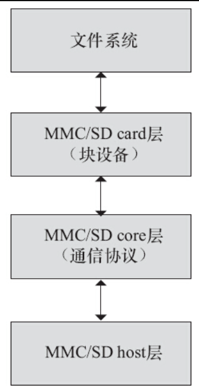

Linux MMC/SD存储卡是一种典型的块设备，它的实现位于drivers/mmc。drivers/mmc下又分为card、core和host这3个子目录。card实际上跟Linux的块设备子系统对接，实现块设备驱动以及完成请求，但是具体的协议经过core层的接口，最终通过host完成传输，因此整个MMC子系统的框架结构如图13.5所示。另外，card目录除了实现标准的MMC/SD存储卡以外，该目录还包含一些SDIO外设的卡驱动，如drivers/mmc/card/sdio_uart.c。core目录除了给card提供接口外，实际上也定义好了host驱动的框架。



图13.5　Linux MMC子系统

drivers/mmc/card/queue.c的mmc_init_queue（）函数通过blk_init_queue（mmc_request_fn，lock）绑定了请求处理函数mmc_request_fn（）：

```
int mmc_init_queue(struct mmc_queue *mq, struct mmc_card *card,
                   spinlock_t *lock, const char *subname)
{
        ...
        mq->queue = blk_init_queue(mmc_request_fn, lock);
        ...
}
```

而mmc_request_fn（）函数会唤醒与MMC对应的内核线程来处理请求，与该线程对应的处理函数mmc_queue_thread（）执行与MMC对应的mq->issue_fn（mq，req）：

```
static int mmc_queue_thread(void *d)
{
        ...
        do {
                …

                req = blk_fetch_request(q);
                mq->mqrq_cur->req = req;
                …

                if (req || mq->mqrq_prev->req) {
                        set_current_state(TASK_RUNNING);
                        cmd_flags = req   req->cmd_flags : 0;
                        mq->issue_fn(mq, req);
                        ...
        return 0;
}
```

对于存储设备而言，mq->issue_fn（）函数指向drivers/mmc/card/block.c中的mmc_blk_issue_rq（）：

```
static struct mmc_blk_data *mmc_blk_alloc_req(struct mmc_card *card,
                                              struct device *parent,
                                              sector_t size,
                                              bool default_ro,
                                              const char *subname,
                                              int area_type)
{
        ...
        md->queue.issue_fn = mmc_blk_issue_rq;
        md->queue.data = md;
        ...
}
```

其中的mmc_blk_issue_rw_rq（）等函数最终会调用drivers/mmc/core/core.c中的mmc_start_req（）这样的函数：

```
static int mmc_blk_issue_rw_rq(struct mmc_queue *mq, struct request *rqc)
{
        ...
                areq = mmc_start_req(card->host, areq, (int *) &status);
        ...
}
```

mmc_start_req（）反过来又调用host驱动的host->ops->pre_req（）、host->ops->enable（）、host->ops->disable（）、host->ops->request（）等成员函数，这些函数实现于drivers/mm/host目录中。

host->ops实际上是一个MMC host操作的集合，对应的结构体为mmc_host_ops，它的定义如代码清单13.16所示。MMC主机驱动的主体工作就是实现该结构体的成员函数，如drivers/mmc/host/mmc_spi.c、drivers/mmc/host/bfin_sdh.c、drivers/mmc/host/sdhci.c等。

代码清单13.16　mmc_host_ops结构体

```
 1struct mmc_host_ops {
 2        /*
 3         * 'enable' is called when the host is claimed and 'disable' is called
 4         * when the host is released. 'enable' and 'disable' are deprecated.
 5         */
 6        int (*enable)(struct mmc_host *host);
 7        int (*disable)(struct mmc_host *host);
 8        /*
 9         * It is optional for the host to implement pre_req and post_req in
10         * order to support double buffering of requests (prepare one
11         * request while another request is active).
12         * pre_req() must always be followed by a post_req().
13         * To undo a call made to pre_req(), call post_req() with
14         * a nonzero err condition.
15         */
16        void    (*post_req)(struct mmc_host *host, struct mmc_request *req,
17                            int err);
18        void    (*pre_req)(struct mmc_host *host, struct mmc_request *req,
19                           bool is_first_req);
20        void    (*request)(struct mmc_host *host, struct mmc_request *req);
21        /*
22         * Avoid calling these three functions too often or in a "fast path",
23         * since underlaying controller might implement them in an expensive
24         * and/or slow way.
25         *
26         * Also note that these functions might sleep, so don't call them
27         * in the atomic contexts!
28         *
29         * Return values for the get_ro callback should be:
30         *   0for a read/write card
31         *   1for a read-only card
32         *   -ENOSYS when not supported (equal to NULL callback)
33         *   or a negative errno value when something bad happened
34         *
35         * Return values for the get_cd callback should be:
36         *   0for a absent card
37         *   1for a present card
38         *   -ENOSYS when not supported (equal to NULL callback)
39         *   or a negative errno value when something bad happened
40         */
41        void    (*set_ios)(struct mmc_host *host, struct mmc_ios *ios);
42        int     (*get_ro)(struct mmc_host *host);
43        int     (*get_cd)(struct mmc_host *host);
44
45        void    (*enable_sdio_irq)(struct mmc_host *host, int enable);
46
47        /* optional callback for HC quirks */
48        void    (*init_card)(struct mmc_host *host, struct mmc_card *card);
49
50        int     (*start_signal_voltage_switch)(struct mmc_host *host, struct                   mmc_ios *ios);
51
52        /* Check if the card is pulling dat[0:3] low */
53        int     (*card_busy)(struct mmc_host *host);
54
55        /* The tuning command opcode value is different for SD and eMMC cards */
56        int     (*execute_tuning)(struct mmc_host *host, u32opcode);
57
58        /* Prepare HS400target operating frequency depending host driver */
59        int     (*prepare_hs400_tuning)(struct mmc_host *host, struct mmc_ios *ios);
60        int     (*select_drive_strength)(unsigned int max_dtr, int host_drv,                   int card_drv);
61        void    (*hw_reset)(struct mmc_host *host);
62        void    (*card_event)(struct mmc_host *host);
63};
```

由于目前大多数SoC内嵌的MMC/SD/SDIO控制器是SDHCI（Secure Digital Host Controller Interface），所以更多是直接重用drivers/mmc/host/sdhci.c驱动，很多芯片甚至还可以进一步使用基于drivers/mmc/host/sdhci.c定义的drivers/mmc/host/sdhci-pltfm.c框架。