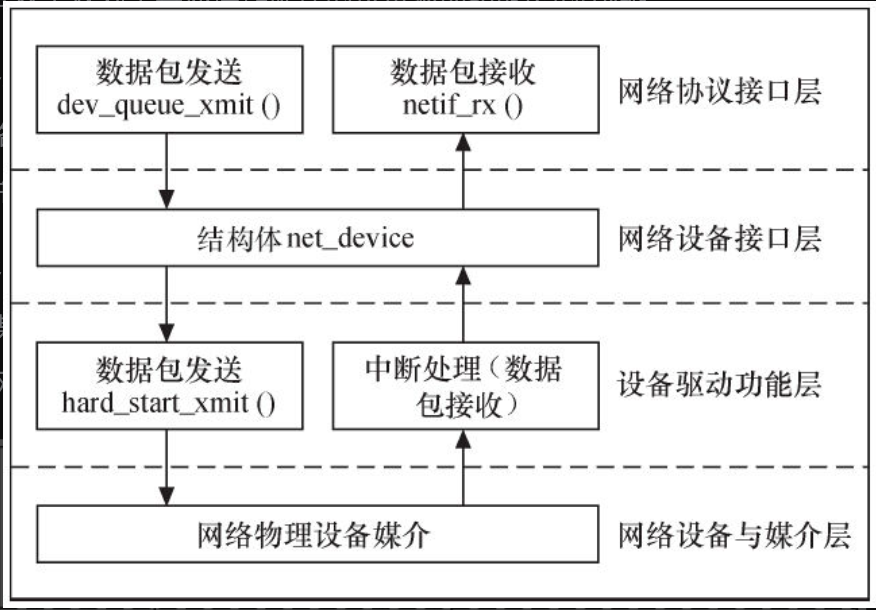
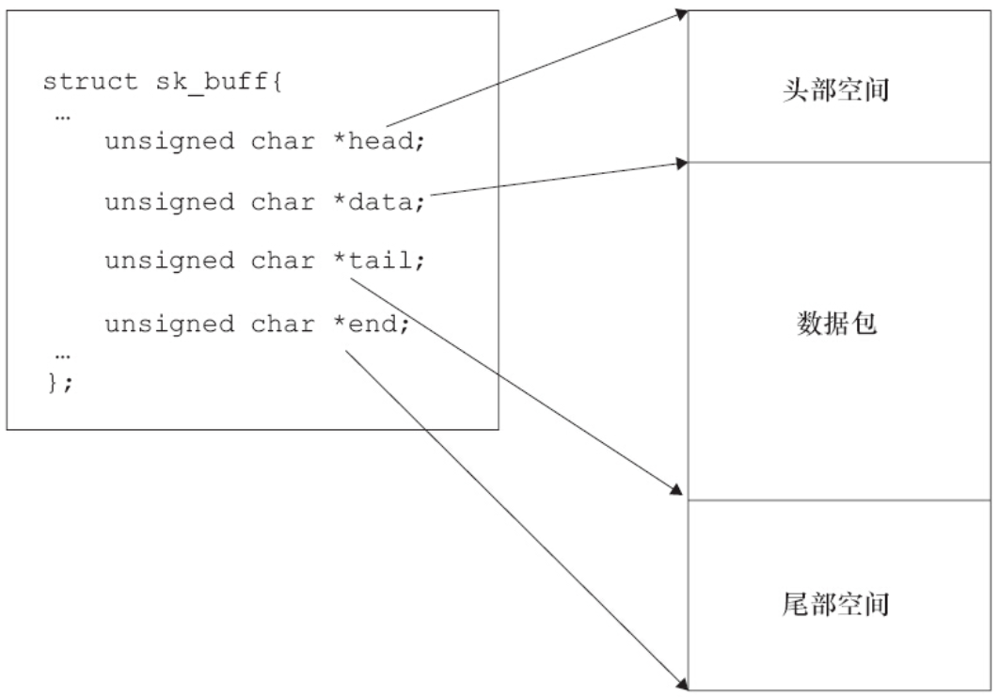

Linux网络设备驱动程序的体系结构如图14.1所示，从上到下可以划分为4层，依次为网络协议接口层、网络设备接口层、提供实际功能的设备驱动功能层以及网络设备与媒介层，这4层的作用如下所示。

1）网络协议接口层向网络层协议提供统一的数据包收发接口，不论上层协议是ARP，还是IP，都通过dev_queue_xmit（）函数发送数据，并通过netif_rx（）函数接收数据。这一层的存在使得上层协议独立于具体的设备。

2）网络设备接口层向协议接口层提供统一的用于描述具体网络设备属性和操作的结构体net_device，该结构体是设备驱动功能层中各函数的容器。实际上，网络设备接口层从宏观上规划了具体操作硬件的设备驱动功能层的结构。

3）设备驱动功能层的各函数是网络设备接口层net_device数据结构的具体成员，是驱使网络设备硬件完成相应动作的程序，它通过hard_start_xmit（）函数启动发送操作，并通过网络设备上的中断触发接收操作

。4）网络设备与媒介层是完成数据包发送和接收的物理实体，包括网络适配器和具体的传输媒介，网络适配器被设备驱动功能层中的函数在物理上驱动。对于Linux系统而言，网络设备和媒介都可以是虚拟的。



图14.1　Linux网络设备驱动程序的体系结构

在设计具体的网络设备驱动程序时，我们需要完成的主要工作是编写设备驱动功能层的相关函数以填充net_device数据结构的内容并将net_device注册入内核。

# 14.1.1　网络协议接口层

网络协议接口层最主要的功能是给上层协议提供透明的数据包发送和接收接口。当上层ARP或IP需要发送数据包时，它将调用网络协议接口层的dev_queue_xmit（）函数发送该数据包，同时需传递给该函数一个指向struct sk_buff数据结构的指针。dev_queue_xmit（）函数的原型为：

```
int dev_queue_xmit(struct sk_buff *skb);
```

同样地，上层对数据包的接收也通过向netif_rx（）函数传递一个struct sk_buff数据结构的指针来完成。netif_rx（）函数的原型为：

```
int netif_rx(struct sk_buff *skb);
```

sk_buff结构体非常重要，它定义于include/linux/skbuff.h文件中，含义为“套接字缓冲区”，用于在Linux网络子系统中的各层之间传递数据，是Linux网络子系统数据传递的“中枢神经”。

当发送数据包时，Linux内核的网络处理模块必须建立一个包含要传输的数据包的sk_buff，然后将sk_buff递交给下层，各层在sk_buff中添加不同的协议头直至交给网络设备发送。同样地，当网络设备从网络媒介上接收到数据包后，它必须将接收到的数据转换为sk_buff数据结构并传递给上层，各层剥去相应的协议头直至交给用户。代码清单14.1列出了sk_buff结构体中的几个关键数据成员以及描述。

代码清单14.1　sk_buff结构体中的几个关键数据成员以及描述

```
 1/**
 2 *      struct sk_buff - socket buffer
 3 *      @next: Next buffer in list
 4 *      @prev: Previous buffer in list
 5 *      @len: Length of actual data
 6 *      @data_len: Data length
 7 *      @mac_len: Length of link layer header
 8 *      @hdr_len: writable header length of cloned skb
 9 *      @csum: Checksum (must include start/offset pair)
10 *      @csum_start: Offset from skb->head where checksumming should start
11 *      @csum_offset: Offset from csum_start where checksum should be stored
12 *      @priority: Packet queueing priority
13 *      @protocol: Packet protocol from driver
14 *      @inner_protocol: Protocol (encapsulation)
15 *      @inner_transport_header: Inner transport layer header (encapsulation)
16 *      @inner_network_header: Network layer header (encapsulation)
17 *      @inner_mac_header: Link layer header (encapsulation)
18 *      @transport_header: Transport layer header
19 *      @network_header: Network layer header
20 *      @mac_header: Link layer header
21 *      @tail: Tail pointer
22 *      @end: End pointer
23 *      @head: Head of buffer
24 *      @data: Data head pointer
25 */
26
27struct sk_buff {
28        /* These two members must be first. */
29        struct sk_buff          *next;
30        struct sk_buff          *prev;
31
32        ...
33        unsigned int            len,
34                                data_len;
35        __u16                   mac_len,
36                                hdr_len;
37        ...
38        __u32                   priority;
39        ...
40        __be16                  protocol;
41
42        ...
43
44        __be16                  inner_protocol;
45        __u16                   inner_transport_header;
46        __u16                   inner_network_header;
47        __u16                   inner_mac_header;
48        __u16                   transport_header;
49        __u16                   network_header;
50        __u16                   mac_header;
51        /* These elements must be at the end, see alloc_skb() for details.  */
52        sk_buff_data_t          tail;
53        sk_buff_data_t          end;
54        unsigned char           *head,
55                                *data;
56        ...
57};
```

如图14.1所示，尤其值得注意的是head和end指向缓冲区的头部和尾部，而data和tail指向实际数据的头部和尾部。每一层会在head和data之间填充协议头，或者在tail和end之间添加新的协议数据。



图14.2　sk_buff的head、data、tail、end指针

下面我们来分析套接字缓冲区涉及的操作函数，Linux套接字缓冲区支持分配、释放、变更等功能函数。

（1）分配

Linux内核中用于分配套接字缓冲区的函数有：

```
struct sk_buff *alloc_skb(unsigned int len, gfp_t priority);
struct sk_buff *dev_alloc_skb(unsigned int len);
```

alloc_skb（）函数分配一个套接字缓冲区和一个数据缓冲区，参数len为数据缓冲区的空间大小，通常以L1_CACHE_BYTES字节（对于ARM为32）对齐，参数priority为内存分配的优先级。dev_alloc_skb（）函数以GFP_ATOMIC优先级进行skb的分配，原因是该函数经常在设备驱动的接收中断里被调用

（2）释放

Linux内核中用于释放套接字缓冲区的函数有：

```
void kfree_skb(struct sk_buff *skb);
void dev_kfree_skb(struct sk_buff *skb);
void dev_kfree_skb_irq(struct sk_buff *skb);
void dev_kfree_skb_any(struct sk_buff *skb);
```

上述函数用于释放被alloc_skb（）函数分配的套接字缓冲区和数据缓冲区。

Linux内核内部使用kree_skb（）函数，而在网络设备驱动程序中则最好用dev_kfree_skb（）、dev_kfree_skb_irq（）或dev_kfree_skb_any（）函数进行套接字缓冲区的释放。其中，dev_kfree_skb（）函数用于非中断上下文，dev_kfree_skb_irq（）函数用于中断上下文，而dev_kfree_skb_any（）函数在中断和非中断上下文中皆可采用，它其实是做一个非常简单的上下文判断，然后再调用__dev_kfree_skb_irq（）或者dev_kfree_skb（），这从其代码的实现中也可以看出：

```
void __dev_kfree_skb_any(struct sk_buff *skb, enum skb_free_reason reason)
{
        if (in_irq() || irqs_disabled())
                __dev_kfree_skb_irq(skb, reason);
        else
                dev_kfree_skb(skb);
}
```

（3）变更

在Linux内核中可以用如下函数在缓冲区尾部增加数据：

```
unsigned char *skb_put(struct sk_buff *skb, unsigned int len);
```

它会导致skb->tail后移len（skb->tail+=len），而skb->len会增加len的大小（skb->len+=len）。通常，在设备驱动的接收数据处理中会调用此函数。

在Linux内核中可以用如下函数在缓冲区开头增加数据：

```
unsigned char *skb_push(struct sk_buff *skb, unsigned int len);
```

它会导致skb->data前移len（skb->data-=len），而skb->len会增加len的大小（skb->len+=len）。与该函数的功能完成相反的函数是skb_pull（），它可以在缓冲区开头移除数据，执行的动作是skb->len-=len、skb->data+=len。

对于一个空的缓冲区而言，调用如下函数可以调整缓冲区的头部：

```
static inline void skb_reserve(struct sk_buff *skb, int len);
```

它会将skb->data和skb->tail同时后移len，执行skb->data+=len、skb->tail+=len。内核里存在许多这样的代码：

```
skb=alloc_skb(len+headspace, GFP_KERNEL);
skb_reserve(skb, headspace);
skb_put(skb,len);
memcpy_fromfs(skb->data,data,len);
pass_to_m_protocol(skb);
```

上述代码先分配一个全新的sk_buff，接着调用skb_reserve（）腾出头部空间，之后调用skb_put（）腾出数据空间，然后把数据复制进来，最后把sk_buff传给协议栈。

# 14.1.2　网络设备接口层

网络设备接口层的主要功能是为千变万化的网络设备定义统一、抽象的数据结构net_device结构体，以不变应万变，实现多种硬件在软件层次上的统一。

net_device结构体在内核中指代一个网络设备，它定义于include/linux/netdevice.h文件中，网络设备驱动程序只需通过填充net_device的具体成员并注册net_device即可实现硬件操作函数与内核的挂接。

net_device是一个巨大的结构体，定义于include/linux/netdevice.h中，包含网络设备的属性描述和操作接口，下面介绍其中的一些关键成员。

（1）全局信息

```
char name[IFNAMESIZ];
```

name是网络设备的名称。

（2）硬件信息

```
unsigned long mem_end;
unsigned long mem_start;
```

mem_start和mem_end分别定义了设备所使用的共享内存的起始和结束地址。

```
unsigned long base_addr;
unsigned char irq;
unsigned char if_port;
unsigned char dma;
```

base_addr为网络设备I/O基地址。

irq为设备使用的中断号。

if_port指定多端口设备使用哪一个端口，该字段仅针对多端口设备。例如，如果设备同时支持IF_PORT_10BASE2（同轴电缆）和IF_PORT_10BASET（双绞线），则可使用该字段。

dma指定分配给设备的DMA通道。

（3）接口信息

```
unsigned short hard_header_len;
```

hard_header_len是网络设备的硬件头长度，在以太网设备的初始化函数中，该成员被赋为ETH_HLEN，即14。

```
unsigned short type;
```

type是接口的硬件类型。

```
unsigned mtu;
```

mtu指最大传输单元（MTU）。

```
unsigned char           *dev_addr;
```

用于存放设备的硬件地址，驱动可能提供了设置MAC地址的接口，这会导致用户设置的MAC地址等存入该成员，如代码清单14.2drivers/net/ethernet/moxa/moxart_ether.c中的moxart_set_mac_address（）函数所示。

代码清单14.2　set_mac_address（）函数

```
1static int moxart_set_mac_address(struct net_device *ndev, void *addr)
2{
3        struct sockaddr *address = addr;
4
5        if (!is_valid_ether_addr(address->sa_data))
6                return -EADDRNOTAVAIL;
7
8        memcpy(ndev->dev_addr, address->sa_data, ndev->addr_len);
9        moxart_update_mac_address(ndev);
10
11        return 0;
12}
```

上述代码完成了memcpy（）以及最终硬件上的MAC地址变更。

```
unsigned short flags；
```

flags指网络接口标志，以IFF_（Interface Flags）开头，部分标志由内核来管理，其他的在接口初始化时被设置以说明设备接口的能力和特性。接口标志包括IFF_UP（当设备被激活并可以开始发送数据包时，内核设置该标志）、IFF_AUTOMEDIA（设备可在多种媒介间切换）、IFF_BROADCAST（允许广播）、IFF_DEBUG（调试模式，可用于控制printk调用的详细程度）、IFF_LOOPBACK（回环）、IFF_MULTICAST（允许组播）、IFF_NOARP（接口不能执行ARP）和IFF_POINTOPOINT（接口连接到点到点链路）等。

（4）设备操作函数

```
const struct net_device_ops *netdev_ops;
```

该结构体是网络设备的一系列硬件操作行数的集合，它也定义于include/linux/netdevice.h中，这个结构体很大，代码清单14.3列出了其中的一些基础部分。

代码清单14.3　net_device_ops结构体

```
 1struct net_device_ops {
 2        int             (*ndo_init)(struct net_device *dev);
 3        void            (*ndo_uninit)(struct net_device *dev);
 4        int             (*ndo_open)(struct net_device *dev);
 5        int             (*ndo_stop)(struct net_device *dev);
 6        netdev_tx_t     (*ndo_start_xmit) (struct sk_buff *skb,
 7                                           struct net_device *dev);
 8        u16             (*ndo_select_queue)(struct net_device *dev,
 9                                            struct sk_buff *skb,
10                                            void *accel_priv,
11                                            select_queue_fallback_t fallback);
12        void            (*ndo_change_rx_flags)(struct net_device *dev,
13                                               int flags);
14        void            (*ndo_set_rx_mode)(struct net_device *dev);
15        int             (*ndo_set_mac_address)(struct net_device *dev,
16                                               void *addr);
17        int             (*ndo_validate_addr)(struct net_device *dev);
18        int             (*ndo_do_ioctl)(struct net_device *dev,
19                                        struct ifreq *ifr, int cmd);
20        ...
21};
```

ndo_open（）函数的作用是打开网络接口设备，获得设备需要的I/O地址、IRQ、DMA通道等。stop（）函数的作用是停止网络接口设备，与open（）函数的作用相反。

```
int  (*ndo_start_xmit) (struct sk_buff *skb,struct net_device *dev);
```

ndo_start_xmit（）函数会启动数据包的发送，当系统调用驱动程序的xmit函数时，需要向其传入一个sk_buff结构体指针，以使得驱动程序能获取从上层传递下来的数据包。

```
void (*ndo_tx_timeout)(struct net_device *dev);
```

当数据包的发送超时时，ndo_tx_timeout（）函数会被调用，该函数需采取重新启动数据包发送过程或重新启动硬件等措施来恢复网络设备到正常状态。

```
struct net_device_stats* (*ndo_get_stats)(struct net_device *dev);
```

ndo_get_stats（）函数用于获得网络设备的状态信息，它返回一个net_device_stats结构体指针。net_device_stats结构体保存了详细的网络设备流量统计信息，如发送和接收的数据包数、字节数等，详见14.8节。

```
int (*ndo_do_ioctl)(struct net_device *dev, struct ifreq *ifr, int cmd);
int (*ndo_set_config)(struct net_device *dev, struct ifmap *map);
int (*ndo_set_mac_address)(struct net_device *dev, void *addr);
```

ndo_do_ioctl（）函数用于进行设备特定的I/O控制。

ndo_set_config（）函数用于配置接口，也可用于改变设备的I/O地址和中断号。

ndo_set_mac_address（）函数用于设置设备的MAC地址。

除了netdev_ops以外，在net_device中还存在类似于ethtool_ops、header_ops这样的操作集：

```
const struct ethtool_ops *ethtool_ops;
const struct header_ops *header_ops;
```

ethtool_ops成员函数与用户空间ethtool工具的各个命令选项对应，ethtool提供了网卡及网卡驱动管理能力，能够为Linux网络开发人员和管理人员提供对网卡硬件、驱动程序和网络协议栈的设置、查看以及调试等功能。

header_ops对应于硬件头部操作，主要是完成创建硬件头部和从给定的sk_buff分析出硬件头部等操作。

（5）辅助成员

```
unsigned long trans_start;
unsigned long last_rx;
```

trans_start记录最后的数据包开始发送时的时间戳，last_rx记录最后一次接收到数据包时的时间戳，这两个时间戳记录的都是jiffies，驱动程序应维护这两个成员。

通常情况下，网络设备驱动以中断方式接收数据包，而poll_controller（）则采用纯轮询方式，另外一种数据接收方式是NAPI（New API），其数据接收流程为“接收中断来临→关闭接收中断→以轮询方式接收所有数据包直到收空→开启接收中断→接收中断来临……”内核中提供了如下与NAPI相关的API：

```
static inline void netif_napi_add(struct net_device *dev,
                                  struct napi_struct *napi,
                                  int (*poll)(struct napi_struct *, int),
                                  int weight);
static inline void netif_napi_del(struct napi_struct *napi);
```

以上两个函数分别用于初始化和移除一个NAPI，netif_napi_add（）的poll参数是NAPI要调度执行的轮询函数。

```
static inline void napi_enable(struct napi_struct *n);
static inline void napi_disable(struct napi_struct *n);
```

以上两个函数分别用于使能和禁止NAPI调度。

```
static inline int napi_schedule_prep(struct napi_struct *n);
```

该函数用于检查NAPI是否可以调度，而napi_schedule（）函数用于调度轮询实例的运行，其原型为：

```
static inline void napi_schedule(struct napi_struct *n);
```

在NAPI处理完成的时候应该调用：

```
static inline void napi_complete(struct napi_struct *n);
```

# 14.1.3　设备驱动功能层

net_device结构体的成员（属性和net_device_ops结构体中的函数指针）需要被设备驱动功能层赋予具体的数值和函数。对于具体的设备xxx，工程师应该编写相应的设备驱动功能层的函数，这些函数形如xxx_open（）、xxx_stop（）、xxx_tx（）、xxx_hard_header（）、xxx_get_stats（）和xxx_tx_timeout（）等。

由于网络数据包的接收可由中断引发，设备驱动功能层中的另一个主体部分将是中断处理函数，它负责读取硬件上接收到的数据包并传送给上层协议，因此可能包含xxx_interrupt（）和xxx_rx（）函数，前者完成中断类型判断等基本工作，后者则需完成数据包的生成及将其递交给上层等复杂工作。

14.2~14.8节将对上述函数进行详细分析并给出参考设计模板。

对于特定的设备，我们还可以定义相关的私有数据和操作，并封装为一个私有信息结构体xxx_private，让其指针赋值给net_device的私有成员。在xxx_private结构体中可包含设备的特殊属性和操作、自旋锁与信号量、定时器以及统计信息等，这都由工程师自定义。在驱动中，要用到私有数据的时候，则使用在netdevice.h中定义的接口：

```
static inline void *netdev_priv(const struct net_device *dev);
```

比如在驱动drivers/net/ethernet/davicom/dm9000.c的dm9000_probe（）函数中，使用alloc_etherdev（sizeof（struct board_info））分配网络设备，board_info结构体就成了这个网络设备的私有数据，在其他函数中可以简单地提取这个私有数据，例如：

```
static int
dm9000_start_xmit(struct sk_buff *skb, struct net_device *dev)
{
        unsigned long flags;
        board_info_t *db = netdev_priv(dev);
        ...
}
```

