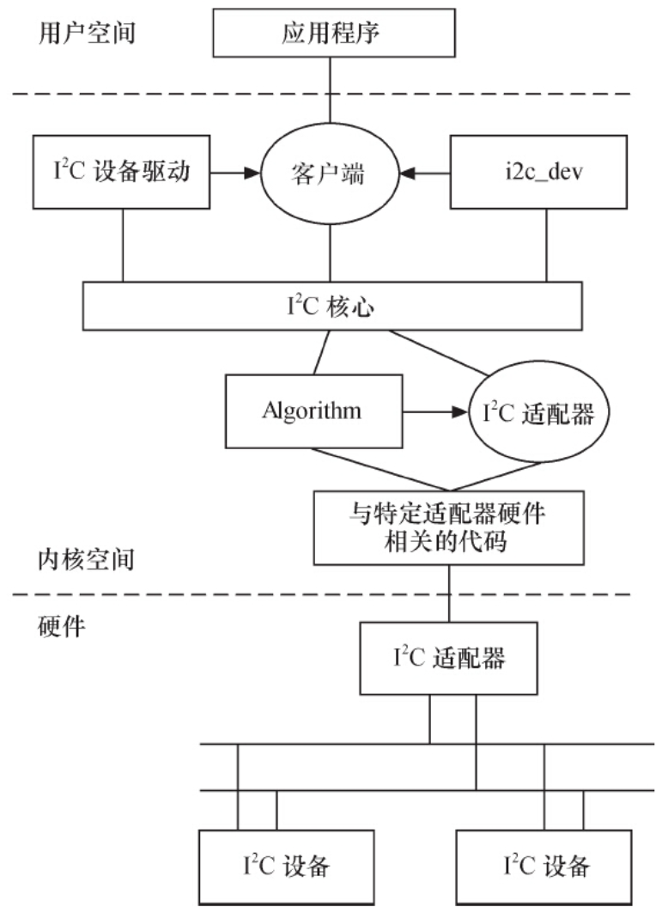
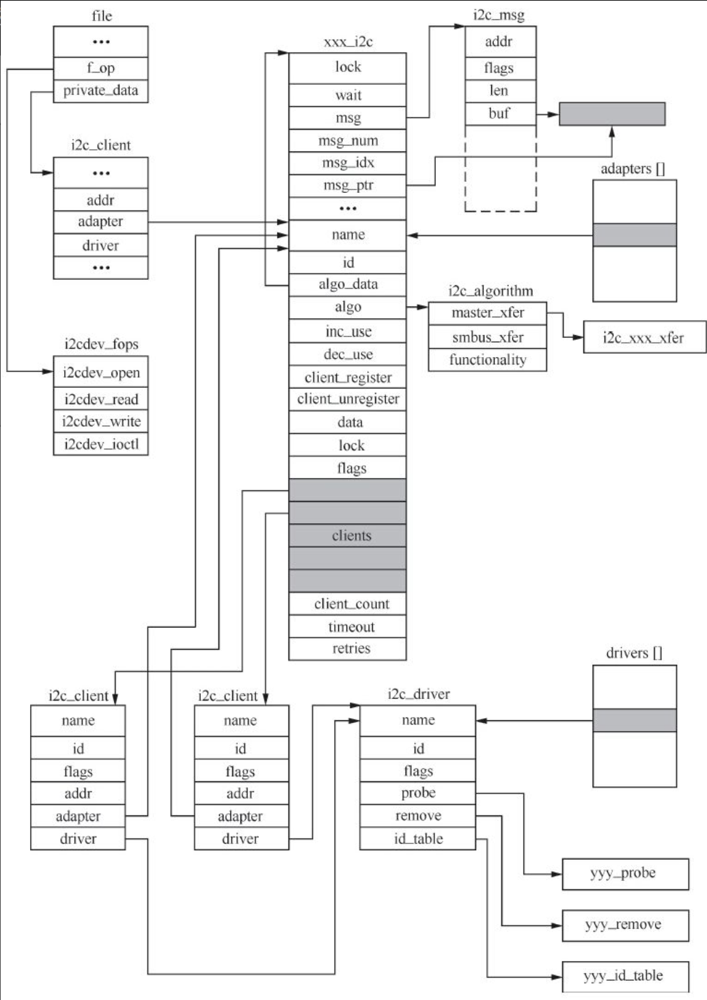

Linux的I2 C体系结构分为3个组成部分。

（1）I2 C核心

I2 C核心提供了I2 C总线驱动和设备驱动的注册、注销方法，I2 C通信方法（即Algorithm）上层的与具体适配器无关的代码以及探测设备、检测设备地址的上层代码等，如图15.1所示。

（2）I2 C总线驱动

I2 C总线驱动是对I2 C硬件体系结构中适配器端的实现，适配器可由CPU控制，甚至可以直接集成在CPU内部。

I2 C总线驱动主要包含I2 C适配器数据结构i2c_adapter、I2 C适配器的Algorithm数据结构i2c_algorithm和控制I2 C适配器产生通信信号的函数。



图15.1　Linux的I2 C体系结构

经由I2 C总线驱动的代码，我们可以控制I2 C适配器以主控方式产生开始位、停止位、读写周期，以及以从设备方式被读写、产生ACK等。

（3）I2 C设备驱动

I2 C设备驱动（也称为客户驱动）是对I2 C硬件体系结构中设备端的实现，设备一般挂接在受CPU控制的I2 C适配器上，通过I2 C适配器与CPU交换数据。

I2 C设备驱动主要包含数据结构i2c_driver和i2c_client，我们需要根据具体设备实现其中的成员函数。

在Linux 2.6内核中，所有的I2 C设备都在sysfs文件系统中显示，存于/sys/bus/i2c/目录下，以适配器地址和芯片地址的形式列出，例如：

```
$ tree /sys/bus/i2c/
/sys/bus/i2c/
|-- devices
|   |-- i2c0 -> ../../../devices/platform/versatile-i2c.0/i2c-0
|   '-- i2c1 -> ../../../devices/platform/versatile-i2c.0/i2c-1
'-- drivers
    '-- dummy
```

在Linux内核源代码中的drivers目录下有一个i2c目录，而在i2c目录下又包含如下文件和文件夹。

（1）i2c-core.c

这个文件实现了I2 C核心的功能以及/proc/bus/i2c*接口。

（2）i2c-dev.c

实现了I2 C适配器设备文件的功能，每一个I2 C适配器都被分配一个设备。通过适配器访问设备时的主设备号都为89，次设备号为0~255。应用程序通过“i2c-%d”（i2c-0，i2c-1，…，i2c-10，…）文件名并使用文件操作接口open（）、write（）、read（）、ioctl（）和close（）等来访问这个设备。

i2c-dev.c并不是针对特定的设备而设计的，只是提供了通用的read（）、write（）和ioctl（）等接口，应用层可以借用这些接口访问挂接在适配器上的I2 C设备的存储空间或寄存器，并控制I2 C设备的工作方式。

（3）busses文件夹

这个文件包含了一些I2 C主机控制器的驱动，如i2c-tegra.c、i2c-omap.c、i2c-versatile.c、i2c-s3c2410.c等。

（4）algos文件夹

实现了一些I2 C总线适配器的通信方法。

此外，内核中的i2c.h头文件对i2c_adapter、i2c_algorithm、i2c_driver和i2c_client这4个数据结构进行了定义。理解这4个结构体的作用十分重要，它们的定义位于include/linux/i2c.h文件中，代码清单15.1、15.2、15.3、15.4分别对它们进行了描述。

代码清单15.1　i2c_adapter结构体

```
 1struct i2c_adapter {
 2        struct module *owner;
 3        unsigned int class;                 /* classes to allow probing for */
 4        const struct i2c_algorithm *algo;   /* the algorithm to access the bus */
 5        void *algo_data;
 6
 7        /* data fields that are valid for all devices   */
 8        struct rt_mutex bus_lock;
 9
10        int timeout;                        /* in jiffies */
11        int retries;
12        struct device dev;                  /* the adapter device */
13
14        int nr;
15        char name[48];
16        struct completion dev_released;
17
18        struct mutex userspace_clients_lock;
19        struct list_head userspace_clients;
20
21        struct i2c_bus_recovery_info *bus_recovery_info;
22};
```

代码清单15.2　i2c_algorithm结构体

```
 1struct i2c_algorithm {
 2        /* If an adapter algorithm can't do I2C-level access, set master_xfer
 3           to NULL. If an adapter algorithm can do SMBus access, set
 4           smbus_xfer. If set to NULL, the SMBus protocol is simulated
 5           using common I2C messages */
 6        /* master_xfer should return the number of messages successfully
 7           processed, or a negative value on error */
 8        int (*master_xfer)(struct i2c_adapter *adap, struct i2c_msg *msgs,
 9                           int num);
10        int (*smbus_xfer) (struct i2c_adapter *adap, u16 addr,
11                        unsigned short flags, char read_write,
12                        u8 command, int size, union i2c_smbus_data *data);
13
14        /* To determine what the adapter supports */
15        u32 (*functionality) (struct i2c_adapter *);
16};
```

上述第8行代码对应为I2 C传输函数指针，I2 C主机驱动的大部分工作也聚集在这里。上述第10行代码对应为SMBus传输函数指针，SMBus不需要增加额外引脚，与I2 C总线相比，在访问时序上也有一定的差异。

代码清单15.3　i2c_driver结构体

```
 1struct i2c_driver {
 2        unsigned int class;
 3
 4        /* Notifies the driver that a new bus has appeared. You should avoid
 5         * using this, it will be removed in a near future.
 6         */
 7        int (*attach_adapter)(struct i2c_adapter *) __deprecated;
 8
 9        /* Standard driver model interfaces */
10        int (*probe)(struct i2c_client *, const struct i2c_device_id *);
11        int (*remove)(struct i2c_client *);
12
13        /* driver model interfaces that don't relate to enumeration  */
14        void (*shutdown)(struct i2c_client *);
15        int (*suspend)(struct i2c_client *, pm_message_t mesg);
16        int (*resume)(struct i2c_client *);
17
18        /* Alert callback, for example for the SMBus alert protocol.
19         * The format and meaning of the data value depends on the protocol.
20         * For the SMBus alert protocol, there is a single bit of data passed
21         * as the alert response's low bit ("event flag").
22         */
23        void (*alert)(struct i2c_client *, unsigned int data);
24
25        /* a ioctl like command that can be used to perform specific functions
26         * with the device.
27         */
28        int (*command)(struct i2c_client *client, unsigned int cmd, void *arg);
29
30        struct device_driver driver;
31        const struct i2c_device_id *id_table;
32
33        /* Device detection callback for automatic device creation */
34        int (*detect)(struct i2c_client *, struct i2c_board_info *);
35        const unsigned short *address_list;
36        struct list_head clients;
37};
```

代码清单15.4　i2c_client结构体

```
 1struct i2c_client {
 2        unsigned short flags;         /* div., see below            */
 3        unsigned short addr;          /* chip address - NOTE: 7bit    */
 4                                      /* addresses are stored in the  */
 5                                      /* _LOWER_ 7 bits             */
 6        char name[I2C_NAME_SIZE];
 7        struct i2c_adapter *adapter;  /* the adapter we sit on        */
 8        struct device dev;            /* the device structure         */
 9        int irq;                      /* irq issued by device         */
10        struct list_head detected;
11};
```

下面分析i2c_adapter、i2c_algorithm、i2c_driver和i2c_client这4个数据结构的作用及其盘根错节的关系。

（1）i2c_adapter与i2c_algorithm

i2c_adapter对应于物理上的一个适配器，而i2c_algorithm对应一套通信方法。一个I2 C适配器需要i2c_algorithm提供的通信函数来控制适配器产生特定的访问周期。缺少i2c_algorithm的i2c_adapter什么也做不了，因此i2c_adapter中包含所使用的i2c_algorithm的指针。

i2c_algorithm中的关键函数master_xfer（）用于产生I2 C访问周期需要的信号，以i2c_msg（即I2 C消息）为单位。i2c_msg结构体也是非常重要的，它定义于include/uapi/linux/i2c.h（在uapi目录下，证明用户空间的应用也可能使用这个结构体）中，代码清单15.5给出了它的定义，其中的成员表明了I2 C的传输地址、方向、缓冲区、缓冲区长度等信息。

代码清单15.5　i2c_msg结构体

```
 1struct i2c_msg {
 2        __u16 addr;                     /* slave address          */
 3        __u16 flags;
 4#define I2C_M_TEN             0x0010  /* this is a ten bit chip address */
 5#define I2C_M_RD              0x0001  /* read data, from slave to master */
 6#define I2C_M_STOP            0x8000  /* if I2C_FUNC_PROTOCOL_MANGLING */
 7#define I2C_M_NOSTART         0x4000  /* if I2C_FUNC_NOSTART */
 8#define I2C_M_REV_DIR_ADDR    0x2000  /* if I2C_FUNC_PROTOCOL_MANGLING */
 9#define I2C_M_IGNORE_NAK      0x1000  /* if I2C_FUNC_PROTOCOL_MANGLING */
10#define I2C_M_NO_RD_ACK       0x0800  /* if I2C_FUNC_PROTOCOL_MANGLING */
11#define I2C_M_RECV_LEN        0x0400  /* length will be first received byte */
12         __u16 len;                     /* msg length                 */
13         __u8 *buf;                     /* pointer to msg data          */
14};
```

（2）i2c_driver与i2c_client

i2c_driver对应于一套驱动方法，其主要成员函数是probe（）、remove（）、suspend（）、resume（）等，另外，struct i2c_device_id形式的id_table是该驱动所支持的I2 C设备的ID表。i2c_client对应于真实的物理设备，每个I2 C设备都需要一个i2c_client来描述。i2c_driver与i2c_client的关系是一对多，一个i2c_driver可以支持多个同类型的i2c_client。

i2c_client的信息通常在BSP的板文件中通过i2c_board_info填充，如下面的代码就定义了一个I2 C设备的ID为“ad7142_joystick”、地址为0x2C、中断号为IRQ_PF5的i2c_client：

```
static struct i2c_board_info __initdata xxx_i2c_board_info[] = {
#if defined(CONfiG_JOYSTICK_AD7142) || defined(CONfiG_JOYSTICK_AD7142_MODULE)
       {
               I2C_BOARD_INFO("ad7142_joystick", 0x2C),
               .irq = IRQ_PF5,
       },
...
}
```

在I2 C总线驱动i2c_bus_type的match（）函数i2c_device_match（）中，会调用i2c_match_id（）函数匹配在板文件中定义的ID和i2c_driver所支持的ID表。

（3）i2c_adpater与i2c_client

i2c_adpater与i2c_client的关系与I2 C硬件体系中适配器和设备的关系一致，即i2c_client依附于i2c_adpater。由于一个适配器可以连接多个I2 C设备，所以一个i2c_adpater也可以被多个i2c_client依附，i2c_adpater中包括依附于它的i2c_client的链表。

假设I2 C总线适配器xxx上有两个使用相同驱动程序的yyy I2 C设备，在打开该I2 C总线的设备节点后，相关数据结构之间的逻辑组织关系将如图15.2所示。



图15.2　I2 C驱动的各种数据结构的关系

从上面的分析可知，虽然I2 C硬件体系结构比较简单，但是I2 C体系结构在Linux中的实现却相当复杂。当工程师拿到实际的电路板时，面对复杂的Linux I2 C子系统，应该如何下手写驱动呢？究竟有哪些是需要亲自做的，哪些是内核已经提供的呢？理清这个问题非常有意义，可以使我们在面对具体问题时迅速抓住重点

一方面，适配器驱动可能是Linux内核本身还不包含的；另一方面，挂接在适配器上的具体设备驱动可能也是Linux内核还不包含的。因此，工程师要实现的主要工作如下。

- ·提供I2 C适配器的硬件驱动，探测、初始化I2 C适配器（如申请I2 C的I/O地址和中断号）、驱动CPU控制的I2 C适配器从硬件上产生各种信号以及处理I2 C中断等。
- ·提供I2 C适配器的Algorithm，用具体适配器的xxx_xfer（）函数填充i2c_algorithm的master_xfer指针，并把i2c_algorithm指针赋值给i2c_adapter的algo指针。
- ·实现I2 C设备驱动中的i2c_driver接口，用具体设备yyy的yyy_probe（）、yyy_remove（）、yyy_suspend（）、yyy_resume（）函数指针和i2c_device_id设备ID表赋值给i2c_driver的probe、remove、suspend、resume和id_table指针。
- ·实现I2 C设备所对应类型的具体驱动，i2c_driver只是实现设备与总线的挂接，而挂接在总线上的设备则千差万别。例如，如果是字符设备，就实现文件操作接口，即实现具体设备yyy的yyy_read（）、yyy_write（）和yyy_ioctl（）函数等；如果是声卡，就实现ALSA驱动。

上述工作中前两个属于I2 C总线驱动，后两个属于I2 C设备驱动。15.3~15.4节将详细分析这些工作的实施方法，给出设计模板，而15.5~15.6节将给出两个具体的实例。