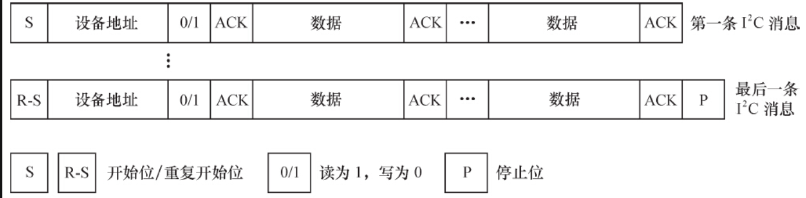

# 15.3.1　I2 C适配器驱动的注册与注销

由于I2 C总线控制器通常是在内存上的，所以它本身也连接在platform总线上，要通过platform_driver和platform_device的匹配来执行。因此尽管I2 C适配器给别人提供了总线，它自己也被认为是接在platform总线上的一个客户。Linux的总线、设备和驱动模型实际上是一个树形结构，每个节点虽然可能成为别人的总线控制器，但是自己也被认为是从上一级总线枚举出来的。

通常我们会在与I2 C适配器所对应的platform_driver的probe（）函数中完成两个工作。

- ·初始化I2 C适配器所使用的硬件资源，如申请I/O地址、中断号、时钟等。
- ·通过i2c_add_adapter（）添加i2c_adapter的数据结构，当然这个i2c_adapter数据结构的成员已经被xxx适配器的相应函数指针所初始化。

通常我们会在platform_driver的remove（）函数中完成与加载函数相反的工作。

- ·释放I2 C适配器所使用的硬件资源，如释放I/O地址、中断号、时钟等。
- ·通过i2c_del_adapter（）删除i2c_adapter的数据结构。

代码清单15.9所示为I2 C适配器驱动的注册和注销模板。

代码清单15.9　I2 C适配置驱动的注册和注销模板

```
 1static int xxx_i2c_probe(struct platform_device *pdev)
 2{
 3         struct i2c_adapter *adap;
 4
 5         ...
 6         xxx_adpater_hw_init()
 7         adap->dev.parent = &pdev->dev;
 8         adap->dev.of_node = pdev->dev.of_node;
 9
10         rc = i2c_add_adapter(adap);
11         ...
12}
13
14static int xxx_i2c_remove(struct platform_device *pdev)
15{
16         ...
17         xxx_adpater_hw_free()
18         i2c_del_adapter(&dev->adapter);
19
20         return 0;
21}
22
23static const struct of_device_id xxx_i2c_of_match[] = {
24         {.compatible = "vendor,xxx-i2c",},
25         {},
26};
27MODULE_DEVICE_TABLE(of, xxx_i2c_of_match);
28
29static struct platform_driver xxx_i2c_driver = {
30         .driver = {
31                   .name = "xxx-i2c",
32                   .owner = THIS_MODULE,
33                   .of_match_table = xxx_i2c_of_match,
34                   },
35         .probe = xxx_i2c_probe,
36         .remove = xxx_i2c_remove,
37};
38module_platform_driver(xxx_i2c_driver);
```

上述代码中的xxx_adpater_hw_init（）和xxx_adpater_hw_free（）函数的实现都与具体的CPU和I2 C适配器硬件直接相关。

# 15.3.2　I2 C总线的通信方法

我们需要为特定的I2 C适配器实现通信方法，主要是实现i2c_algorithm的functionality（）函数和master_xfer（）函数。

functionality（）函数非常简单，用于返回algorithm所支持的通信协议，如I2C_FUNC_I2C、I2C_FUNC_10BIT_ADDR、I2C_FUNC_SMBUS_READ_BYTE、I2C_FUNC_SMBUS_WRITE_BYTE等。

master_xfer（）函数在I2 C适配器上完成传递给它的i2c_msg数组中的每个I2 C消息，代码清单15.10所示为xxx设备的master_xfer（）函数模板。

代码清单15.10　master_xfer（）函数模板

```
 1static int i2c_adapter_xxx_xfer(struct i2c_adapter *adap, struct i2c_msg *msgs,
 2    int num)
 3{
 4    ...
 5    for (i = 0; i < num; i++) {
 6      i2c_adapter_xxx_start();                                          /* 产生开始位*/
 7      /*是读消息*/
 8      if (msgs[i]->flags &I2C_M_RD) {
 9        i2c_adapter_xxx_setaddr((msg->addr << 1) | 1);                  /* 发送从设备读地址*/
10        i2c_adapter_xxx_wait_ack();                                     /* 获得从设备的ack */
11        i2c_adapter_xxx_readbytes(msgs[i]->buf, msgs[i]->len);          /* 读取msgs[i] ->len
12          长的数据到msgs[i]->buf */
13      } else {                                                          /* 是写消息*/
14        i2c_adapter_xxx_setaddr(msg->addr << 1);                        /* 发送从设备写地址
 */
15        i2c_adapter_xxx_wait_ack();                                     /* 获得从设备的ack */
16        i2c_adapter_xxx_writebytes(msgs[i]->buf, msgs[i]->len);         /* 读取msgs[i]->len
17          长的数据到msgs[i]->buf */
18      }
19    }
20    i2c_adapter_xxx_stop();                                             /* 产生停止位*/
21}
```

上述代码实际上给出了一个master_xfer（）函数处理I2 C消息数组的流程，对于数组中的每个消息，先判断消息类型，若为读消息，则赋从设备地址为（msg->addr<<1）|1，否则为msg->addr<<1。对每个消息产生一个开始位，紧接着传送从设备地址，然后开始数据的发送或接收，且对最后的消息还需产生一个停止位。图15.3所示为整个master_xfer（）完成的时序。



图15.3　master_xfer（）完成的时序

master_xfer（）函数模板中的i2c_adapter_xxx_start（）、i2c_adapter_xxx_setaddr（）、i2c_adapter_xxx_wait_ack（）、i2c_adapter_xxx_readbytes（）、i2c_adapter_xxx_writebytes（）和i2c_adapter_xxx_stop（）函数用于完成适配器的底层硬件操作，与I2 C适配器和CPU的具体硬件直接相关，需要由工程师根据芯片的数据手册来实现。

i2c_adapter_xxx_readbytes（）用于从从设备上接收一串数据，i2c_adapter_xxx_writebytes（）用于向从设备写入一串数据，这两个函数的内部也会涉及I2 C总线协议中的ACK应答。

master_xfer（）函数的实现形式会很多种，多数驱动以中断方式来完成这个流程，比如发起硬件操作请求后，将自己调度出去，因此中间会伴随着睡眠的动作。

多数I2 C总线驱动会定义一个xxx_i2c结构体，作为i2c_adapter的algo_data（类似“私有数据”），其中包含I2 C消息数组指针、数组索引及I2 C适配器Algorithm访问控制用的自旋锁、等待队列等，而master_xfer（）函数在完成i2c_msg数组中消息的处理时，也经常需要访问xxx_i2c结构体的成员以获取寄存器基地址、锁等信息。代码清单15.11所示为一个典型的xxx_i2c结构体的定义，与图15.2中的xxx_i2c是对应的，具体的实现因硬件而异。

代码清单15.11　xxx_i2c结构体模板

```
 1struct xxx_i2c {
 2   spinlock_t     lock;
 3   wait_queue_head_t wait;
 4   struct i2c_msg    *msg;
 5   unsigned int      msg_num;
 6   unsigned int      msg_idx;
 7   unsigned int      msg_ptr;
 8   ...
 9   struct i2c_adapter    adap;
10};
```

