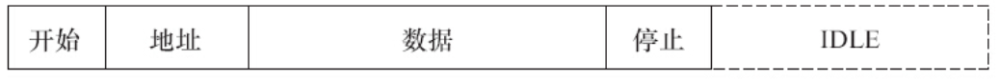

I2 C设备驱动要使用i2c_driver和i2c_client数据结构并填充i2c_driver中的成员函数。i2c_client一般被包含在设备的私有信息结构体yyy_data中，而i2c_driver则适合被定义为全局变量并初始化，代码清单15.12所示为已被初始化的i2c_driver。

代码清单15.12　被初始化的i2c_driver

```
1static struct i2c_driver yyy_driver = {
2   .driver = {
3     .name = "yyy",
4   } ,
5   .probe            = yyy_probe,
6   .remove           = yyy_remove,
7   .id_table         = yyy_id,
8};
```

# 15.4.1　Linux I2 C设备驱动的模块加载与卸载

I2 C设备驱动的模块加载函数通过I2 C核心的i2c_add_driver（）API函数添加i2c_driver的工作，而模块卸载函数需要做相反的工作：通过I2 C核心的i2c_del_driver（）函数删除i2c_driver。代码清单15.13所示为I2 C设备驱动的模块加载与卸载函数模板。

代码清单15.13　I2 C外设驱动的模块加载与卸载函数模板

```
 1static int __init yyy_init(void)
 2{
 3          return i2c_add_driver(&yyy_driver);
 4}
 5module_initcall(yyy_init);
 6
 7static void __exit yyy_exit(void)
 8{
 9          i2c_del_driver(&yyy_driver);
10}
11module_exit(yyy_exit);
```

# 15.4.2　Linux I2 C设备驱动的数据传输

在I2 C设备上读写数据的时序且数据通常通过i2c_msg数组进行组织，最后通过i2c_transfer（）函数完成，代码清单15.14所示为一个读取指定偏移offs的寄存器。

代码清单15.14　I2 C设备驱动的数据传输范例

```
 1struct i2c_msg msg[2];
 2   /* 第一条消息是写消息*/
 3   msg[0].addr = client->addr;
 4   msg[0].flags = 0;
 5   msg[0].len = 1;
 6   msg[0].buf = &offs;
 7   /* 第二条消息是读消息*/
 8   msg[1].addr = client->addr;
 9   msg[1].flags = I2C_M_RD;
10   msg[1].len = sizeof(buf);
11   msg[1].buf = &buf[0];
12
13   i2c_transfer(client->adapter, msg, 2);
```

# 15.4.3　Linux的i2c-dev.c文件分析

i2c-dev.c文件完全可以被看作是一个I2 C设备驱动，不过，它实现的i2c_client是虚拟、临时的，主要是为了便于从用户空间操作I2 C外设。i2c-dev.c针对每个I2 C适配器生成一个主设备号为89的设备文件，实现了i2c_driver的成员函数以及文件操作接口，因此i2c-dev.c的主体是“i2c_driver成员函数+字符设备驱动”。

i2c-dev.c提供的i2cdev_read（）、i2cdev_write（）函数对应于用户空间要使用的read（）和write（）文件操作接口，这两个函数分别调用I2 C核心的i2c_master_recv（）和i2c_master_send（）函数来构造一条I2 C消息并引发适配器Algorithm通信函数的调用，以完成消息的传输，它们对应于如图15.4所示的时序。



图15.4　i2cdev_read（）和i2cdev_write（）函数对应的时序

但是，很遗憾，大多数稍微复杂一点的I2 C设备的读写流程并不对应于一条消息，往往需要两条甚至多条消息来进行一次读写周期（即如图15.5所示的重复开始位的RepStart模式），在这种情况下，在应用层仍然调用read（）、write（）文件API来读写I2 C设备，将不能正确地读写。


图15.5　RepStart模式

鉴于上述原因，i2c-dev.c中的i2cdev_read（）和i2cdev_write（）函数不具备太强的通用性，没有太大的实用价值，只能适用于非RepStart模式的情况。对于由两条以上消息组成的读写，在用户空间需要组织i2c_msg消息数组并调用I2C_RDWR IOCTL命令。代码清单15.15所示为i2cdev_ioctl（）函数的框架。

代码清单15.15　i2c-dev_c中的i2cdev_ioctl（）函数

```
 1static int i2cdev_ioctl(struct inode *inode, struct file *file,
 2        unsigned int cmd, unsigned long arg)
 3{
 4   struct i2c_client *client = (struct i2c_client *)file->private_data;
 5   ...
 6   switch ( cmd ) {
 7   case I2C_SLAVE:
 8   case I2C_SLAVE_FORCE:
 9        ...                           /* 设置从设备地址*/
10   case I2C_TENBIT:
11        ...
12   case I2C_PEC:
13        ...
14   case I2C_FUNCS:
15        ...
16   case I2C_RDWR:
17       return i2cdev_ioctl_rdrw(client, arg);
18   case I2C_SMBUS:
19        ...
20   case I2C_RETRIES:
21        ...
22   case I2C_TIMEOUT:
23        ...
24   default:
25      return i2c_control(client,cmd,arg);
26}
27return 0;
28}
```

常用的IOCTL包括I2C_SLAVE（设置从设备地址）、I2C_RETRIES（没有收到设备ACK情况下的重试次数，默认为1）、I2C_TIMEOU（超时）以及I2C_RDWR。

代码清单15.16和代码清单15.17所示为直接通过read（）、write（）接口和O_RDWR IOCTL读写I2 C设备的例子。

代码清单15.16　直接通过read（）/write（）读写I2 C设备

```
 1#include <stdio.h>
 2#include <linux/types.h>
 3#include <fcntl.h>
 4#include <unistd.h>
 5#include <stdlib.h>
 6#include <sys/types.h>
 7#include <sys/ioctl.h>
 8#include <linux/i2c.h>
 9#include <linux/i2c-dev.h>
10
11int main(int argc, char **argv)
12{
13   unsigned int fd;
14   unsigned short mem_addr;
15   unsigned short size;
16   unsigned short idx;
17   #define BUFF_SIZE    32
18   char buf[BUFF_SIZE];
19   char cswap;
20   union
21   {
22    unsigned short addr;
23    char bytes[2];
24}  tmp;
25
26   if (argc < 3) {
27    printf("Use:\n%s /dev/i2c-x mem_addr size\n", argv[0]);
28    return 0;
29   }
30   sscanf(argv[2], "%d", &mem_addr);
31   sscanf(argv[3], "%d", &size);
32
33   if (size > BUFF_SIZE)
34    size = BUFF_SIZE;
35
36   fd = open(argv[1], O_RDWR);
37
38   if (!fd) {
39    printf("Error on opening the device file\n");
40    return 0;
41   }
42
43   ioctl(fd, I2C_SLAVE, 0x50); /* 设置EEPROM地址*/
44   ioctl(fd, I2C_TIMEOUT, 1);  /* 设置超时*/
45   ioctl(fd, I2C_RETRIES, 1);  /* 设置重试次数*/
46
47   for (idx = 0; idx < size; ++idx, ++mem_addr) {
48    tmp.addr = mem_addr;
49    cswap = tmp.bytes[0];
50    tmp.bytes[0] = tmp.bytes[1];
51    tmp.bytes[1] = cswap;
52    write(fd, &tmp.addr, 2);
53    read(fd, &buf[idx], 1);
54   }
55   buf[size] = 0;
56   close(fd);
57   printf("Read %d char: %s\n", size, buf);
58   return 0;
59}
```

代码清单15.17　通过O_RDWR IOCTL读写I2 C设备

```
 1#include <stdio.h>
 2#include <linux/types.h>
 3#include <fcntl.h>
 4#include <unistd.h>
 5#include <stdlib.h>
 6#include <sys/types.h>
 7#include <sys/ioctl.h>
 8#include <errno.h>
 9#include <assert.h>
10#include <string.h>
11#include <linux/i2c.h>
12#include <linux/i2c-dev.h>
13
14int main(int argc, char **argv)
15{
16struct i2c_rdwr_ioctl_data work_queue;
17unsigned int idx;
18unsigned int fd;
19unsigned int slave_address, reg_address;
20unsigned char val;
21int i;
22int ret;
23
24if (argc < 4) {
25      printf("Usage:\n%s /dev/i2c-x start_addr reg_addr\n", argv[0]);
26      return 0;
27}
28
29fd = open(argv[1], O_RDWR);
30
31if (!fd) {
32      printf("Error on opening the device file\n");
33      return 0;
34}
35sscanf(argv[2], "%x", &slave_address);
36sscanf(argv[3], "%x", &reg_address);
37
38work_queue.nmsgs = 2;         /* 消息数量*/
39work_queue.msgs = (struct i2c_msg*)malloc(work_queue.nmsgs *sizeof(struct
40           i2c_msg));
41if (!work_queue.msgs) {
42       printf("Memory alloc error\n");
43       close(fd);
44       return 0;
45}
46
47ioctl(fd, I2C_TIMEOUT, 2);    /* 设置超时*/
48ioctl(fd, I2C_RETRIES, 1);    /* 设置重试次数*/
49
50for (i = reg_address; i < reg_address + 16; i++) {
51       val = i;
52      (work_queue.msgs[0]).len = 1;
53      (work_queue.msgs[0]).addr = slave_address;
54      (work_queue.msgs[0]).buf = &val;
55
56      (work_queue.msgs[1]).len = 1;
57      (work_queue.msgs[1]).flags = I2C_M_RD;
58      (work_queue.msgs[1]).addr = slave_address;
59      (work_queue.msgs[1]).buf = &val;
60
61      ret = ioctl(fd, I2C_RDWR, (unsigned long) &work_queue);
62      if (ret < 0)
63      printf("Error during I2C_RDWR ioctl with error code: %d\n", ret);
64else
65      printf("reg:%02x val:%02x\n", i, val);
66}
67close(fd);
68return ;
69}
```

使用该工具可指定读取某I2 C控制器上某I2 C从设备的某寄存器，如读I2 C控制器0上的地址为0x18的从设备，从寄存器0x20开始读：

```
# i2c-test /dev/i2c-0 0x18 0x20
reg:20 val:07
reg:21 val:00
reg:22 val:00
reg:23 val:00
reg:24 val:00
reg:25 val:00
reg:26 val:00
reg:27 val:00
reg:28 val:00
reg:29 val:00
reg:2a val:00
reg:2b val:00
reg:2c val:00
reg:2d val:00
reg:2e val:00
reg:2f val:00
```

