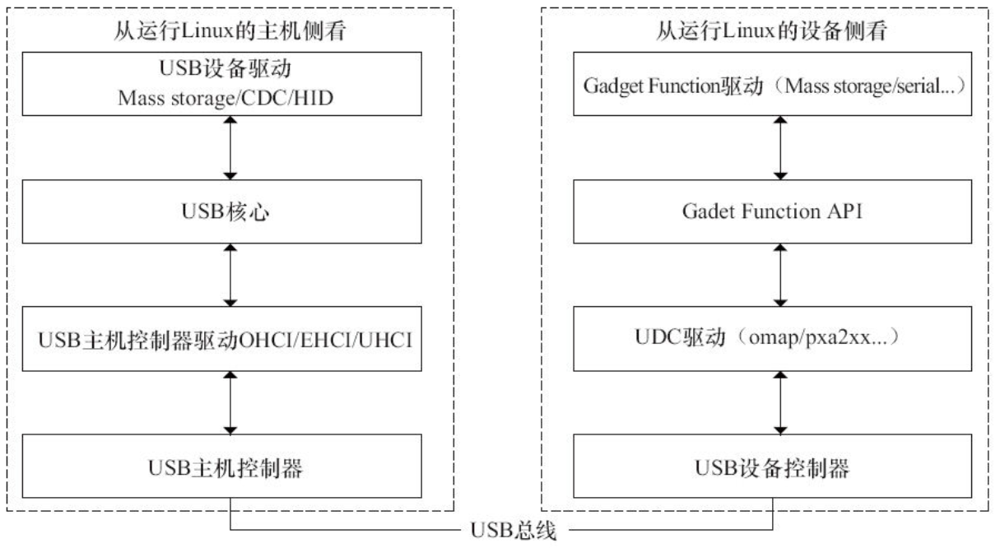
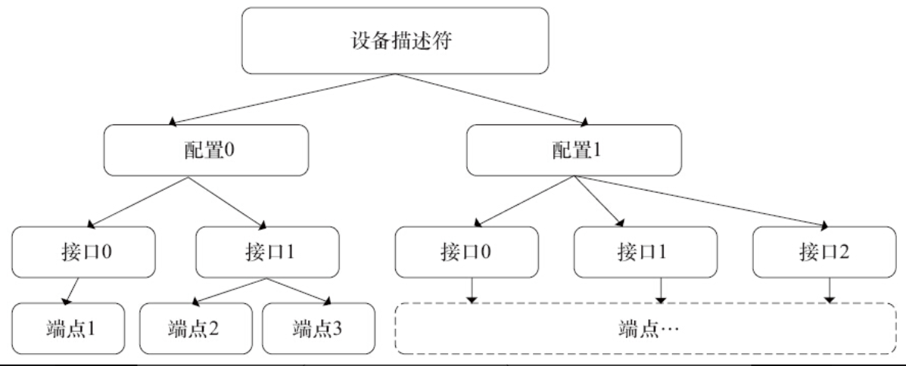

# 16.1.1　主机侧与设备侧USB驱动

USB采用树形拓扑结构，主机侧和设备侧的USB控制器分别称为主机控制器（Host Controller）和USB设备控制器（UDC），每条总线上只有一个主机控制器，负责协调主机和设备间的通信，而设备不能主动向主机发送任何消息。如图16.1所示，在Linux系统中，USB驱动可以从两个角度去观察，一个角度是主机侧，一个角度是设备侧。

如图16.1的左侧所示，从主机侧去看，在Linux驱动中，处于USB驱动最底层的是USB主机控制器硬件，在其上运行的是USB主机控制器驱动，在主机控制器上的为USB核心层，再上层为USB设备驱动层（插入主机上的U盘、鼠标、USB转串口等设备驱动）。因此，在主机侧的层次结构中，要实现的USB驱动包括两类：USB主机控制器驱动和USB设备驱动，前者控制插入其中的USB设备，后者控制USB设备如何与主机通信。Linux内核中的USB核心负责USB驱动管理和协议处理的主要工作。主机控制器驱动和设备驱动之间的USB核心非常重要，其功能包括：通过定义一些数据结构、宏和功能函数，向上为设备驱动提供编程接口，向下为USB主机控制器驱动提供编程接口；维护整个系统的USB设备信息；完成设备热插拔控制、总线数据传输控制等。



图16.1　Linux USB驱动总体结构

如图16.1的右侧所示，Linux内核中USB设备侧驱动程序分为3个层次：UDC驱动程序、Gadget Function API和Gadget Function驱动程序。UDC驱动程序直接访问硬件，控制USB设备和主机间的底层通信，向上层提供与硬件相关操作的回调函数。当前Gadget Function API是UDC驱动程序回调函数的简单包装。Gadget Function驱动程序具体控制USB设备功能的实现，使设备表现出“网络连接”、“打印机”或“USB Mass Storage”等特性，它使用Gadget Function API控制UDC实现上述功能。Gadget Function API把下层的UDC驱动程序和上层的Gadget Function驱动程序隔离开，使得在Linux系统中编写USB设备侧驱动程序时能够把功能的实现和底层通信分离。

# 16.1.2　设备、配置、接口、端点

在USB设备的逻辑组织中，包含设备、配置、接口和端点4个层次。

每个USB设备都提供不同级别的配置信息，可以包含一个或多个配置，不同的配置使设备表现出不同的功能组合（在探测/连接期间需从其中选定一个），配置由多个接口组成。

在USB协议中，接口由多个端点组成，代表一个基本的功能，是USB设备驱动程序控制的对象，一个功能复杂的USB设备可以具有多个接口。每个配置中可以有多个接口，而设备接口是端点的汇集（Collection）。例如，USB扬声器可以包含一个音频接口以及对旋钮和按钮的接口。一个配置中的所有接口可以同时有效，并可被不同的驱动程序连接。每个接口可以有备用接口，以提供不同质量的服务参数。

端点是USB通信的最基本形式，每一个USB设备接口在主机看来就是一个端点的集合。主机只能通过端点与设备进行通信，以使用设备的功能。在USB系统中每一个端点都有唯一的地址，这是由设备地址和端点号给出的。每个端点都有一定的属性，其中包括传输方式、总线访问频率、带宽、端点号和数据包的最大容量等。一个USB端点只能在一个方向上承载数据，从主机到设备（称为输出端点）或者从设备到主机（称为输入端点），因此端点可看作是一个单向的管道。端点0通常为控制端点，用于设备初始化参数等。只要设备连接到USB上并且上电，端点0就可以被访问。端点1、2等一般用作数据端点，存放主机与设备间往来的数据。

总体而言，USB设备非常复杂，由许多不同的逻辑单元组成，如图16.2所示，这些单元之间的关系如下：



图16.2　USB设备、配置、接口和端点

- ·设备通常有一个或多个配置；
- ·配置通常有一个或多个接口；
- ·接口通常有一个或多个设置；
- ·接口有零个或多个端点。

这种层次化配置信息在设备中通过一组标准的描述符来描述，如下所示。

- ·设备描述符：关于设备的通用信息，如供应商ID、产品ID和修订ID，支持的设备类、子类和适用的协议以及默认端点的最大包大小等。在Linux内核中，USB设备用usb_device结构体来描述，USB设备描述符定义为usb_device_descriptor结构体，位于include/uapi/linux/usb/ch9.h文件中，如代码清单16.1所示。

代码清单16.1　usb_device_descriptor结构体

```
 1struct usb_device_descriptor  {
 2   __u8  bLength;           /* 描述符长度*/
 3   __u8  bDescriptorType;   /* 描述符类型编号*/
 4
 5   __le16 bcdUSB;           /* USB版本号*/
 6   __u8  bDeviceClass;      /* USB分配的设备类code */
 7   __u8  bDeviceSubClass;   /* USB分配的子类code */
 8   __u8  bDeviceProtocol;   /* USB分配的协议code */
 9   __u8  bMaxPacketSize0;   /* endpoint0最大包大小*/
10   __le16 idVendor;         /* 厂商编号*/
11   __le16 idProduct;        /* 产品编号*/
12   __le16 bcdDevice;        /* 设备出厂编号*/
13   __u8  iManufacturer;     /* 描述厂商字符串的索引*/
14   __u8  iProduct;          /* 描述产品字符串的索引*/
15   __u8  iSerialNumber;     /* 描述设备序列号字符串的索引*/
16   __u8  bNumConfigurations;/* 可能的配置数量*/
17} __attribute__ ((packed));
```

- ·配置描述符：此配置中的接口数、支持的挂起和恢复能力以及功率要求。USB配置在内核中使用usb_host_config结构体描述，而USB配置描述符定义为结构体usb_config_descriptor，如代码清单16.2所示。

代码清单16.2　usb_config_descriptor结构体

```
 1struct usb_config_descriptor  {
 3   __u8  bLength;               /* 描述符长度*/
 4   __u8  bDescriptorType;       /* 描述符类型编号*/
 5
 6   __le16 wTotalLength;         /* 配置所返回的所有数据的大小*/
 7   __u8  bNumInterfaces;        /* 配置所支持的接口数*/
 8   __u8  bConfigurationValue;   /* Set_Configuration命令需要的参数值*/
 9   __u8  iConfiguration;        /* 描述该配置的字符串的索引值*/
10   __u8  bmAttributes;          /* 供电模式的选择*/
11   __u8  bMaxPower;             /* 设备从总线提取的最大电流 */
12} _ attribute__ ((packed));
```

- ·接口描述符：接口类、子类和适用的协议，接口备用配置的数目和端点数目。USB接口在内核中使用usb_interface结构体描述，而USB接口描述符定义为结构体usb_interface_descriptor，如代码清单16.3所示。

代码清单16.3　usb_interface_descriptor结构体

```
 1struct usb_interface_descriptor  {
 3   __u8  bLength;               /* 描述符长度*/
 4   __u8  bDescriptorType;       /* 描述符类型*/
 5
 6   __u8  bInterfaceNumber;      /* 接口的编号*/
 7   __u8  bAlternateSetting;     /* 备用的接口描述符编号*/
 8   __u8  bNumEndpoints;         /* 该接口使用的端点数，不包括端点0 */
 9   __u8  bInterfaceClass;       /* 接口类型*/
10   __u8  bInterfaceSubClass;    /* 接口子类型*/
11   __u8  bInterfaceProtocol;    /* 接口所遵循的协议*/
12   __u8  iInterface;            /* 描述该接口的字符串索引值*/
13} __attribute__ ((packed));
```

- ·端点描述符：端点地址、方向和类型，支持的最大包大小，如果是中断类型的端点则还包括轮询频率。在Linux内核中，USB端点使用usb_host_endpoint结构体来描述，而USB端点描述符定义为usb_endpoint_descriptor结构体，如代码清单16.4所示。

代码清单16.4　usb_endpoint_descriptor结构体

```
 1  struct usb_endpoint_descriptor {
 3   __u8  bLength;              /* 描述符长度*/
 4   __u8  bDescriptorType;      /* 描述符类型*/
 5   __u8  bEndpointAddress;     /* 端点地址：0~3位是端点号，第7位是方向(0为输出,1为输入) */
 6   __u8  bmAttributes;         /* 端点属性：bit[0:1] 的值为00表示控制，为01表示同步，为02表示批量，为03表示中断*/
 7   __le16 wMaxPacketSize;      /* 本端点接收或发送的最大信息包的大小*/
 8   __u8  bInterval;            /* 轮询数据传送端点的时间间隔*/
 9                               /* 对于批量传送的端点以及控制传送的端点，此域忽略*/
10                               /* 对于同步传送的端点，此域必须为1 */
11                               /* 对于中断传送的端点，此域值的范围为1~255 */
12   __u8  bRefresh;
13   __u8  bSynchAddress;
14} __attribute__ ((packed));
```

- ·字符串描述符：在其他描述符中会为某些字段提供字符串索引，它们可被用来检索描述性字符串，可以以多种语言形式提供。字符串描述符是可选的，有的设备有，有的设备没有，字符串描述符对应于usb_string_descriptor结构体，如代码清单16.5所示。

代码清单16.5　usb_string_descriptor结构体

```
 1struct usb_string_descriptor {
 3   __u8  bLength;            /* 描述符长度*/
 4   __u8  bDescriptorType;    /* 描述符类型*/
 5
 6   __le16 wData[1];          /* 以UTF-16LE编码*/
 7} __attribute__ ((packed));
```

例如，笔者在PC上插入一个SanDisk U盘后，通过lsusb命令得到与这个U盘相关的描述符，从中可以显示这个U盘包含了一个设备描述符、一个配置描述符、一个接口描述符、批量输入和批量输出两个端点描述符。呈现出来的信息内容直接对应于usb_device_descriptor、usb_config_descriptor、usb_interface_descriptor、usb_endpoint_descriptor、usb_string_descriptor结构体，如下所示：

```
Bus 001 Device 004: ID 0781:5151 SanDisk Corp.
Device Descriptor:
 bLength              18
 bDescriptorType        1
 bcdUSB             2.00
 bDeviceClass           0 Interface
 bDeviceSubClass         0
 bDeviceProtocol         0
 bMaxPacketSize0        64
 idVendor          0x0781 SanDisk Corp.
 idProduct         0x5151
 bcdDevice           0.10
 iManufacturer          1 SanDisk Corporation
 iProduct              2 Cruzer Micro
 iSerial               3 20060877500A1BE1FDE1
 bNumConfigurations      1
 Configuration Descriptor:
  bLength                 9
  bDescriptorType        2
  wTotalLength          32
  bNumInterfaces         1
  bConfigurationValue     1
  iConfiguration         0
  bmAttributes        0x80
  MaxPower            200mA
  Interface Descriptor:
   bLength               9
   bDescriptorType        4
   bInterfaceNumber       0
   bAlternateSetting      0
   bNumEndpoints         2
   bInterfaceClass        8 Mass Storage
   bInterfaceSubClass     6 SCSI
   bInterfaceProtocol    80 Bulk (Zip)
   iInterface           0
   Endpoint Descriptor:
    bLength              7
    bDescriptorType       5
    bEndpointAddress    0x81  EP 1 IN
    bmAttributes          2
     Transfer Type         Bulk
     Synch Type           none
    wMaxPacketSize      512
    bInterval            0
   Endpoint Descriptor:
    bLength              7
    bDescriptorType       5
    bEndpointAddress    0x01  EP 1 OUT
    bmAttributes          2
     Transfer Type           Bulk
     Synch Type             none
    wMaxPacketSize       512
    bInterval             1
 Language IDs: (length=4)
   0409 English(US)
```

