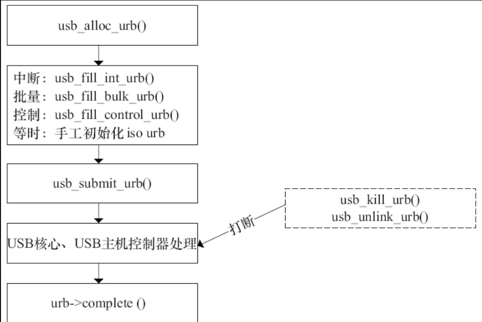

# 16.3.1　USB设备驱动的整体结构

这里所说的USB设备驱动指的是从主机角度来看，怎样访问被插入的USB设备，而不是指USB设备内部本身运行的固件程序。Linux系统实现了几类通用的USB设备驱动（也称客户驱动），划分为如下几个设备类。

- ·音频设备类。
- ·通信设备类。
- ·HID（人机接口）设备类。
- ·显示设备类。
- ·海量存储设备类。
- ·电源设备类。
- ·打印设备类。
- ·集线器设备类。

一般的通用Linux设备（如U盘、USB鼠标、USB键盘等）都不需要工程师再编写驱动，而工程师需要编写的是特定厂商、特定芯片的驱动，而且往往也可以参考已经在内核中提供的驱动模板。

Linux内核为各类USB设备分配了相应的设备号，如ACM USB调制解调器的主设备号为166（默认设备名/dev/ttyACMn）、USB打印机的主设备号为180，次设备号为0~15（默认设备名/dev/lpn）、USB串口的主设备号为188（默认设备名/dev/ttyUSBn）等，详见http://www.lanana.org/ 网站的设备列表。

在debugfs下，/sys/kernel/debug/usb/devices包含了USB的设备信息，在Ubuntu上插入一个U盘后，我们在/sys/kernel/debug/usb/devices中可看到类似信息。

```
$ sudo cat /sys/kernel/debug/usb/devices
T:  Bus=02 Lev=00 Prnt=00 Port=00 Cnt=00 Dev#=  1 Spd=12   MxCh= 8
B:  Alloc=  2/900 us ( 0%), #Int=  1, #Iso=  0
D:  Ver= 1.10 Cls=09(hub  ) Sub=00 Prot=00 MxPS=64 #Cfgs=  1
P:  Vendor=1d6b ProdID=0001 Rev= 4.00
S:  Manufacturer=Linux 4.0.0-rc1 ohci_hcd
S:  Product=OHCI PCI host controller
S:  SerialNumber=0000:00:06.0
C:* #Ifs= 1 Cfg#= 1 Atr=e0 MxPwr=  0mA
I:* If#= 0 Alt= 0 #EPs= 1 Cls=09(hub  ) Sub=00 Prot=00 Driver=hub
E:  Ad=81(I) Atr=03(Int.) MxPS=   2 Ivl=255ms…
T:  Bus=01 Lev=01 Prnt=01 Port=00 Cnt=01 Dev#=  2 Spd=480  MxCh= 0
D:  Ver= 2.10 Cls=00(>ifc ) Sub=00 Prot=00 MxPS=64 #Cfgs=  1
P:  Vendor=0930 ProdID=6545 Rev= 1.00
S:  Manufacturer=Kingston
S:  Product=DataTraveler 3.0
S:  SerialNumber=60A44C3FAE22EEA0797900F7
C:* #Ifs= 1 Cfg#= 1 Atr=80 MxPwr=498mA
I:* If#= 0 Alt= 0 #EPs= 2 Cls=08(stor.) Sub=06 Prot=50 Driver=usb-storage
E:  Ad=81(I) Atr=02(Bulk) MxPS= 512 Ivl=0ms
E:  Ad=02(O) Atr=02(Bulk) MxPS= 512 Ivl=0ms
```

通过分析上述记录信息，可以得到系统中USB的完整信息。USBView（http://www.kroah.com/linux-usb/ ）是一个图形化的GTK工具，可以显示USB信息。

此外，在sysfs文件系统中，同样包含了USB相关信息的描述，但只限于接口级别。USB设备和USB接口在sysfs中均表示为单独的USB设备，其目录命名规则如下：

```
根集线器
-集线器端口号（
-集线器端口号
-...）
:配置
.接口
```

下面给出一个/sys/bus/usb目录下的树形结构实例，其中的多数文件都是锚定到/sys/devices及/sys/drivers中相应文件的链接。

```
.├──


 devices│


   ├──


 1-0:1.0 -> ../../../devices/pci0000:00/0000:00:0b.0/usb1/1-0:1.0│


   ├──


 1-1 -> ../../../devices/pci0000:00/0000:00:0b.0/usb1/1-1│


   ├──


 1-1:1.0 -> ../../../devices/pci0000:00/0000:00:0b.0/usb1/1-1/1-1:1.0│


   ├──


 2-0:1.0 -> ../../../devices/pci0000:00/0000:00:06.0/usb2/2-0:1.0│


   ├──


 2-1 -> ../../../devices/pci0000:00/0000:00:06.0/usb2/2-1│


   ├──


 2-1:1.0 -> ../../../devices/pci0000:00/0000:00:06.0/usb2/2-1/2-1:1.0│


   ├──


 usb1 -> ../../../devices/pci0000:00/0000:00:0b.0/usb1│


   └──


 usb2 -> ../../../devices/pci0000:00/0000:00:06.0/usb2├──


 drivers│


   ├──


 hub│


   │


   ├──


 1-0:1.0 -> ../../../../devices/pci0000:00/0000:00:0b.0/usb1/1-0:1.0│


   │


   ├──


 2-0:1.0 -> ../../../../devices/pci0000:00/0000:00:06.0/usb2/2-0:1.0│


   │


   ├──


 bind│


   │


   ├──
 module -> ../../../../module/usbcore│
   │
   ├──
 new_id│
   │
   ├──
 remove_id│
   │
   ├──
 uevent│
   │
   └──
 unbind│
   ├──
 usb│
   │
   ├──
 1-1 -> ../../../../devices/pci0000:00/0000:00:0b.0/usb1/1-1│
   │
   ├──
 2-1 -> ../../../../devices/pci0000:00/0000:00:06.0/usb2/2-1│
   │
   ├──
 bind│
   │
   ├──
 uevent│
   │
   ├──
 unbind│
   │
   ├──
 usb1 -> ../../../../devices/pci0000:00/0000:00:0b.0/usb1│
   │
   └──

 usb2 -> ../../../../devices/pci0000:00/0000:00:06.0/usb2
```

正如tty_driver、i2c_driver等，在Linux内核中，使用usb_driver结构体描述一个USB设备驱动，usb_driver结构体的定义如代码清单16.11所示。

代码清单16.11　usb_driver结构体

```
 1struct usb_driver {
 2        const char *name;
 3
 4        int (*probe) (struct usb_interface *intf,
 5                    const struct usb_device_id *id);
 6
 7        void (*disconnect) (struct usb_interface *intf);
 8
 9        int (*unlocked_ioctl) (struct usb_interface *intf, unsigned int code,
10                     void *buf);
11
12        int (*suspend) (struct usb_interface *intf, pm_message_t message);
13        int (*resume) (struct usb_interface *intf);
14        int (*reset_resume)(struct usb_interface *intf);
15
16        int (*pre_reset)(struct usb_interface *intf);
17        int (*post_reset)(struct usb_interface *intf);
18
19        const struct usb_device_id *id_table;
20
21        struct usb_dynids dynids;
22        struct usbdrv_wrap drvwrap;
23        unsigned int no_dynamic_id:1;
24        unsigned int supports_autosuspend:1;
25        unsigned int disable_hub_initiated_lpm:1;
26        unsigned int soft_unbind:1;
27};
```

在编写新的USB设备驱动时，主要应该完成的工作是probe（）和disconnect（）函数，即探测和断开函数，它们分别在设备被插入和拔出的时候调用，用于初始化和释放软硬件资源。对usb_driver的注册和注销可通过下面两个函数完成：

```
int usb_register(struct usb_driver *new_driver)
void usb_deregister(struct usb_driver *driver);
```

usb_driver结构体中的id_table成员描述了这个USB驱动所支持的USB设备列表，它指向一个usb_device_id数组，usb_device_id结构体包含有USB设备的制造商ID、产品ID、产品版本、设备类、接口类等信息及其要匹配标志成员match_flags（标明要与哪些成员匹配，包含DEV_LO、DEV_HI、DEV_CLASS、DEV_SUBCLASS、DEV_PROTOCOL、INT_CLASS、INT_SUBCLASS、INT_PROTOCOL）。可以借助下面一组宏来生成usb_device_id结构体的实例：

```
USB_DEVICE(vendor, product)
```

该宏根据制造商ID和产品ID生成一个usb_device_id结构体的实例，在数组中增加该元素将意味着该驱动可支持与制造商ID、产品ID匹配的设备。

```
USB_DEVICE_VER(vendor, product, lo, hi)
```

该宏根据制造商ID、产品ID、产品版本的最小值和最大值生成一个usb_device_id结构体的实例，在数组中增加该元素将意味着该驱动可支持与制造商ID、产品ID匹配和lo~hi范围内版本的设备。

```
USB_DEVICE_INFO(class, subclass, protocol)
```

该宏用于创建一个匹配设备指定类型的usb_device_id结构体实例。

```
USB_INTERFACE_INFO(class, subclass, protocol)
```

该宏用于创建一个匹配接口指定类型的usb_device_id结构体实例。

代码清单16.12所示为两个用于描述某USB驱动支持的USB设备的usb_device_id结构体数组实例。

代码清单16.12　usb_device_id结构体数组实例

```
 1/* 本驱动支持的USB设备列表*/
 2
 3/* 实例1 */
 4static struct usb_device_id id_table [] = {
 5   { USB_DEVICE(VENDOR_ID, PRODUCT_ID) },
 6   { },
 7};
 8MODULE_DEVICE_TABLE (usb, id_table);
 9
10/* 实例2 */
11static struct usb_device_id id_table [] = {
12   { .idVendor = 0x10D2, .match_flags = USB_DEVICE_ID_MATCH_VENDOR, },
13   { },
14};
15MODULE_DEVICE_TABLE (usb, id_table);
```

当USB核心检测到某个设备的属性和某个驱动程序的usb_device_id结构体所携带的信息一致时，这个驱动程序的probe（）函数就被执行（如果这个USB驱动是个模块的话，相关的.ko还应被Linux自动加载）。拔掉设备或者卸掉驱动模块后，USB核心就执行disconnect（）函数来响应这个动作。

上述usb_driver结构体中的函数是USB设备驱动中与USB相关的部分，而USB只是一个总线，USB设备驱动真正的主体工作仍然是USB设备本身所属类型的驱动，如字符设备、tty设备、块设备、输入设备等。因此USB设备驱动包含其作为总线上挂接设备的驱动和本身所属设备类型的驱动两部分。

与platform_driver、i2c_driver类似，usb_driver起到了“牵线”的作用，即在probe（）里注册相应的字符、tty等设备，在disconnect（）注销相应的字符、tty等设备，而原先对设备的注册和注销一般直接发生在模块加载和卸载函数中。

尽管USB本身所属设备驱动的结构与其挂不挂在USB总线上没什么关系，但是据此在访问方式上却有很大的变化，例如，对于USB接口的字符设备而言，尽管仍然是write（）、read（）、ioctl（）这些函数，但是在这些函数中，贯穿始终的是称为URB的USB请求块。

如图16.3所示，在这棵树里，我们把树根比作主机控制器，树叶比作具体的USB设备，树干和树枝就是USB总线。树叶本身与树枝通过usb_driver连接，而树叶本身的驱动（读写、控制）则需要通过其树叶设备本身所属类设备驱动来完成。树根和树叶之间的“通信”依靠在树干和树枝里“流淌”的URB来完成。


图16.3　USB设备驱动结构

由此可见，usb_driver本身只是有找到USB设备、管理USB设备连接和断开的作用，也就是说，它是公司入口处的“打卡机”，可以获得员工（USB设备）的上/下班情况。树叶和员工一样，可以是研发工程师也可以是销售工程师，而作为USB设备的树叶可以是字符树叶、网络树叶或块树叶，因此必须实现相应设备类的驱动。

# 16.3.2　USB请求块

## 1.urb结构体

USB请求块（USB Request Block，URB）是USB设备驱动中用来描述与USB设备通信所用的基本载体和核心数据结构，非常类似于网络设备驱动中的sk_buff结构体。

代码清单16.13　URB结构体

```
 1struct urb {
 2        ...
 3        /* public: documented fields in the urb that can be used by drivers */
 4        struct list_head urb_list;      /* list head for use by the urb's
 5                                      * current owner */
 6        ...
 7        struct usb_host_endpoint *ep;   /* (internal) pointer to endpoint */
 8        unsigned int pipe;              /* (in) pipe information */
 9        unsigned int stream_id;         /* (in) stream ID */
10        int status;                     /* (return) non-ISO status */
11        unsigned int transfer_flags;    /* (in) URB_SHORT_NOT_OK | ...*/
12        void *transfer_buffer;          /* (in) associated data buffer */
13        dma_addr_t transfer_dma;        /* (in) dma addr for transfer_buffer */
14        struct scatterlist *sg;         /* (in) scatter gather buffer list */
15        int num_mapped_sgs;             /* (internal) mapped sg entries */
16        int num_sgs;                    /* (in) number of entries in the sg list */
17        u32 transfer_buffer_length;     /* (in) data buffer length */
18        u32 actual_length;              /* (return) actual transfer length */
19        unsigned char *setup_packet;    /* (in) setup packet (control only) */
20        dma_addr_t setup_dma;           /* (in) dma addr for setup_packet */
21        int start_frame;                /* (modify) start frame (ISO) */
22        int number_of_packets;          /* (in) number of ISO packets */
23        int interval;                   /* (modify) transfer interval
24                                       * (INT/ISO) */
25        int error_count;                /* (return) number of ISO errors */
26        void *context;                  /* (in) context for completion */
27        usb_complete_t complete;        /* (in) completion routine */
28        struct usb_iso_packet_descriptor iso_frame_desc[0];
29                                        /* (in) ISO ONLY */
30};
```

## 2.URB处理流程

USB设备中的每个端点都处理一个URB队列，在队列被清空之前，一个URB的典型生命周期如下。

### 1）被一个USB设备驱动创建。

创建URB结构体的函数为：

```
struct urb *usb_alloc_urb(int iso_packets, gfp_t mem_flags);
```

iso_packets是这个URB应当包含的等时数据包的数目，若为0表示不创建等时数据包。mem_flags参数是分配内存的标志，和kmalloc（）函数的分配标志参数含义相同。如果分配成功，该函数返回一个URB结构体指针，否则返回0。

URB结构体在驱动中不宜静态创建，因为这可能破坏USB核心给URB使用的引用计数方法。

usb_alloc_urb（）的“反函数”为：

```
void usb_free_urb(struct urb *urb);
```

该函数用于释放由usb_alloc_urb（）分配的URB结构体。

```
void usb_free_urb(struct urb *urb);
```

该函数用于释放由usb_alloc_urb（）分配的URB结构体。

### 2）初始化，被安排给一个特定USB设备的特定端点。

对于中断URB，使用usb_fill_int_urb（）函数来初始化URB，如下所示：

```
void usb_fill_int_urb(struct urb *urb, struct usb_device *dev,
 unsigned int pipe, void *transfer_buffer,
 int buffer_length, usb_complete_t complete,
 void *context, int interval);
```

URB参数指向要被初始化的URB的指针；dev指向这个URB要被发送到的USB设备；pipe是这个URB要被发送到的USB设备的特定端点；transfer_buffer是指向发送数据或接收数据的缓冲区的指针，和URB一样，它也不能是静态缓冲区，必须使用kmalloc（）来分配；buffer_length是transfer_buffer指针所指向缓冲区的大小；complete指针指向当这个URB完成时被调用的完成处理函数；context是完成处理函数的“上下文”；interval是这个URB应当被调度的间隔。

上述函数参数中的pipe使用usb_sndintpipe（）或usb_rcvintpipe（）创建。

对于批量URB，使用usb_fill_bulk_urb（）函数来初始化，如下所示：

```
void usb_fill_bulk_urb(struct urb *urb, struct usb_device *dev,
 unsigned int pipe, void *transfer_buffer,
 int buffer_length, usb_complete_t complete,
 void *context);
```

除了没有对应于调度间隔的interval参数以外，该函数的参数和usb_fill_int_urb（）函数的参数含义相同。

上述函数参数中的pipe使用usb_sndbulkpipe（）或者usb_rcvbulkpipe（）函数来创建。

对于控制URB，使用usb_fill_control_urb（）函数来初始化，如下所示：

```
void usb_fill_control_urb(struct urb *urb, struct usb_device *dev,
 unsigned int pipe, unsigned char *setup_packet,
 void *transfer_buffer, int buffer_length,
 usb_complete_t complete, void *context);
```

除了增加了新的setup_packet参数以外，该函数的参数和usb_fill_bulk_urb（）函数的参数含义相同。setup_packet参数指向即将被发送到端点的设置数据包。

上述函数参数中的pipe使用usb_sndctrlpipe（）或usb_rcvictrlpipe（）函数来创建。

等时URB没有像中断、控制和批量URB的初始化函数usb_fill_iso_urb（），我们只能手动对它初始化，而后才能提交给USB核心。代码清单16.14给出了初始化等时URB的例子，它来自drivers/media/usb/uvc/uvc_video.c文件。

代码清单16.14　初始化等时URB

```
 1        for (i = 0; i < UVC_URBS; ++i) {
 2               urb = usb_alloc_urb(npackets, gfp_flags);
 3               if (urb == NULL) {
 4                      uvc_uninit_video(stream, 1);
 5                      return -ENOMEM;
 6               }
 7
 8               urb->dev = stream->dev->udev;
 9               urb->context = stream;
10               urb->pipe = usb_rcvisocpipe(stream->dev->udev,
11                                 ep->desc.bEndpointAddress);
12#ifndef CONfiG_DMA_NONCOHERENT
13               urb->transfer_flags = URB_ISO_ASAP | URB_NO_TRANSFER_DMA_MAP;
14               urb->transfer_dma = stream->urb_dma[i];
15#else
16               urb->transfer_flags = URB_ISO_ASAP;
17#endif
18               urb->interval = ep->desc.bInterval;
19               urb->transfer_buffer = stream->urb_buffer[i];
20               urb->complete = uvc_video_complete;
21               urb->number_of_packets = npackets;
22               urb->transfer_buffer_length = size;
23
24               for (j = 0; j < npackets; ++j) {
25                      urb->iso_frame_desc[j].offset = j * psize;
26                      urb->iso_frame_desc[j].length = psize;
27               }
28
29               stream->urb[i] = urb;
30        }
```

### 3）被USB设备驱动提交给USB核心。

在完成第1）、2）步的创建和初始化URB后，URB便可以提交给USB核心了，可通过usb_submit_urb（）函数来完成，如下所示：

```
int usb_submit_urb(struct urb *urb, gfp_t mem_flags);
```

URB参数是指向URB的指针，mem_flags参数与传递给kmalloc（）函数参数的意义相同，它用于告知USB核心如何在此时分配内存缓冲区。

在提交URB到USB核心后，直到完成函数被调用之前，不要访问URB中的任何成员。

usb_submit_urb（）在原子上下文和进程上下文中都可以被调用，mem_flags变量需根据调用环境进行相应的设置，如下所示。

- ·GFP_ATOMIC：在中断处理函数、底半部、tasklet、定时器处理函数以及URB完成函数中，在调用者持有自旋锁或者读写锁时以及当驱动将current->state修改为非TASK_RUNNING时，应使用此标志。
- ·GFP_NOIO：在存储设备的块I/O和错误处理路径中，应使用此标志；
- ·GFP_KERNEL：如果没有任何理由使用GFP_ATOMIC和GFP_NOIO，就使用GFP_KERNEL。

如果usb_submit_urb（）调用成功，即URB的控制权被移交给USB核心，该函数返回0；否则，返回错误号。

### 4）提交由USB核心指定的USB主机控制器驱动。

### 5）被USB主机控制器处理，进行一次到USB设备的传送。

第4）~5）步由USB核心和主机控制器完成，不受USB设备驱动的控制。

### 6）当URB完成，USB主机控制器驱动通知USB设备驱动。

在如下3种情况下，URB将结束，URB完成回调函数将被调用（完成回调是通过usb_fill_xxx_urb的参数传入的）。在完成回调中，我们通常要进行urb->status的判断。

- ·URB被成功发送给设备，并且设备返回正确的确认。如果urb->status为0，意味着对于一个输出URB，数据被成功发送；对于一个输入URB，请求的数据被成功收到。
- ·如果发送数据到设备或从设备接收数据时发生了错误，urb->status将记录错误值。
- ·URB被从USB核心“去除连接”，这发生在驱动通过usb_unlink_urb（）或usb_kill_urb（）函数取消或URB虽已提交而USB设备被拔出的情况下

usb_unlink_urb（）和usb_kill_urb（）这两个函数用于取消已提交的URB，其参数为要被取消的URB指针。usb_unlink_urb（）是异步的，搞定后对应的完成回调会被调用；而usb_kill_urb（）会彻底终止URB的生命周期并等待这一行为，它通常在设备的disconnect（）函数中被调用。

当URB生命结束时（处理完成或被解除链接），在URB的完成回调中通过URB结构体的status成员可以获知其原因，如0表示传输成功，-ENOENT表示被usb_kill_urb（）杀死，-ECONNRESET表示被usb_unlink_urb（）杀死，-EPROTO表示传输中发生了bitstuff错误或者硬件未能及时收到响应数据包，-ENODEV表示USB设备已被移除，-EXDEV表示等时传输仅完成了一部分等。

对以上URB的处理步骤进行一个总结，图16.4给出了一个URB的完整处理流程，虚线框的usb_unlink_urb（）和usb_kill_urb（）并不一定会发生，它们只是在URB正在被USB核心和主机控制器处理时又被驱动程序取消的情况下才发生。



图16.4　URB处理流程

## 3.简单的批量与控制URB

有时USB驱动程序只是从USB设备上接收或向USB设备发送一些简单的数据，这时候，没有必要将URB创建、初始化、提交、完成处理的整个流程走一遍，而可以使用两个更简单的函数，如下所示。

### （1）usb_bulk_msg（）

```
int usb_bulk_msg(struct usb_device *usb_dev, unsigned int pipe,
                 void *data, int len, int *actual_length,
                 int timeout);
```

usb_dev参数为批量消息要发送的USB设备的指针，pipe为批量消息要发送到的USB设备的端点，data参数为指向要发送或接收的数据缓冲区的指针，len参数为data参数所指向的缓冲区的长度，actual_length用于返回实际发送或接收的字节数，timeout是发送超时，以jiffies为单位，0意味着永远等待。

如果函数调用成功，返回0；否则，返回1个负的错误值

## （2）usb_control_msg（）函数

usb_control_msg（）函数与usb_bulk_msg（）函数类似，不过它提供给驱动发送和结束USB控制信息而不是批量信息的能力，该函数的原型为：

```
int usb_control_msg(struct usb_device *dev, unsigned int pipe, __u8 request,
                    __u8 requesttype, __u16 value, __u16 index, void *data,
                    __u16 size, int timeout);
```

dev指向控制消息发往的USB设备，pipe是控制消息要发往的USB设备的端点，request是这个控制消息的USB请求值，requesttype是这个控制消息的USB请求类型，value是这个控制消息的USB消息值，index是这个控制消息的USB消息索引值，data指向要发送或接收的数据缓冲区，size是data参数所指向的缓冲区的大小，timeout是发送超时，以毫秒为单位，0意味着永远等待。

参数request、requesttype、value和index与USB规范中定义的USB控制消息直接对应。

如果函数调用成功，该函数返回发送到设备或从设备接收到的字节数；否则，返回一个负的错误值。

对usb_bulk_msg（）和usb_control_msg（）函数的使用要特别慎重，由于它们是同步的，因此不能在中断上下文和持有自旋锁的情况下使用。而且，该函数也不能被任何其他函数取消，因此，务必要使得驱动程序的disconnect（）函数掌握足够的信息，以判断和等待该调用的结束。

# 16.3.3　探测和断开函数

在USB设备驱动usb_driver结构体的probe（）函数中，应该完成如下工作。

- ·探测设备的端点地址、缓冲区大小，初始化任何可能用于控制USB设备的数据结构。
- ·把已初始化的数据结构的指针保存到接口设备中。

usb_set_intfdata（）函数可以设置usb_interface的私有数据，这个函数的原型为：

```
void usb_set_intfdata (struct usb_interface *intf, void *data);
```

这个函数的“反函数”用于得到usb_interface的私有数据，其原型为：

```
void *usb_get_intfdata (struct usb_interface *intf);
```

- ·注册USB设备。

如果是简单的字符设备，则可调用usb_register_dev（），这个函数的原型为：

```
int usb_register_dev(struct usb_interface *intf,
                     struct usb_class_driver *class_driver);
```

上述函数中的第二个参数为usb_class_driver结构体，这个结构体的定义如代码清单16.15所示

代码清单16.15　usb_class_driver结构体

```
 1struct usb_class_driver {
 2        char *name;
 3        char *(*devnode)(struct device *dev, umode_t *mode);
 4        const struct file_operations *fops;
 5        int minor_base;
 6};
```

对于字符设备而言，usb_class_driver结构体的fops成员中的write（）、read（）、ioctl（）等函数的地位完全等同于本书第6章中的file_operations成员函数。

如果是其他类型的设备，如tty设备，则调用对应设备的注册函数。

在USB设备驱动usb_driver结构体的probe（）函数中，应该完成如下工作。

- ·释放所有为设备分配的资源。
- ·设置接口设备的数据指针为NULL。
- ·注销USB设备。

对于字符设备，可以直接调用usb_register_dev（）函数的“反函数”，如下所示：

```
void usb_deregister_dev(struct usb_interface *intf,
                        struct usb_class_driver *class_driver);
```

对于其他类型的设备，如tty设备，则调用对应设备的注销函数。

# 16.3.4　USB骨架程序

Linux内核源代码中的driver/usb/usb-skeleton.c文件为我们提供了一个最基础的USB驱动程序，即USB骨架程序，它可被看作一个最简单的USB设备驱动实例。尽管具体的USB设备驱动千差万别，但其骨架则万变不离其宗

首先看看USB骨架程序的usb_driver结构体定义，如代码清单16.16所示。

代码清单16.16　USB骨架程序的usb_driver结构体

```
 1static struct usb_driver skel_driver = {
 2        .name =         "skeleton",
 3        .probe =        skel_probe,
 4        .disconnect =   skel_disconnect,
 5        .suspend =      skel_suspend,
 6        .resume =       skel_resume,
 7        .pre_reset =    skel_pre_reset,
 8        .post_reset =   skel_post_reset,
 9        .id_table =     skel_table,
10        .supports_autosuspend = 1,
11};
```

从上述代码第9行可以看出，它所支持的USB设备的列表数组为skel_table[]，其定义如代码清单16.17所示。

代码清单16.17　USB骨架程序的id_table

```
 1static struct usb_device_id skel_table [] = {
 2    { USB_DEVICE(USB_SKEL_VENDOR_ID, USB_SKEL_PRODUCT_ID) },
 3    { }                  /* Terminating entry */
 4};
 5MODULE_DEVICE_TABLE(usb, skel_table);
```

对上述usb_driver的注册和注销发生在USB骨架程序的模块加载与卸载函数内，其分别调用了usb_register（）和usb_deregister（），不过这个注册和注销的代码却不用写出来，直接用一个快捷宏module_usb_driver即可，如代码清单16.18所示。

代码清单16.18　USB骨架程序的模块加载

```
 1static struct usb_driver skel_driver = {
 2        .name =        "skeleton",
 3        .probe =       skel_probe,
 4        .disconnect =   skel_disconnect,
 5        .suspend =     skel_suspend,
 6        .resume =      skel_resume,
 7        .pre_reset =    skel_pre_reset,
 8        .post_reset =   skel_post_reset,
 9        .id_table =     skel_table,
10        .supports_autosuspend = 1,
11};
12
13module_usb_driver(skel_driver);
```

在usb_driver的probe（）成员函数中，会根据usb_interface的成员寻找第一个批量输入和输出端点，将端点地址、缓冲区等信息存入为USB骨架程序定义的usb_skel结构体中，并将usb_skel实例的指针传入usb_set_intfdata（）中以作为USB接口的私有数据，最后，它会注册USB设备，如代码清单16.19所示。

代码清单16.19　USB骨架程序的probe（）函数

```
 1static int skel_probe(struct usb_interface *interface,
 2            const struct usb_device_id *id)
 3{
 4   struct usb_skel *dev;
 5   struct usb_host_interface *iface_desc;
 6   struct usb_endpoint_descriptor *endpoint;
 7   size_t buffer_size;
 8   int i;
 9   int retval = -ENOMEM;
10
11   /* allocate memory for our device state and initialize it */
12   dev = kzalloc(sizeof(*dev), GFP_KERNEL);
13   ...
14   kref_init(&dev->kref);
15   sema_init(&dev->limit_sem, WRITES_IN_FLIGHT);
16   mutex_init(&dev->io_mutex);
17   spin_lock_init(&dev->err_lock);
18   init_usb_anchor(&dev->submitted);
19   init_waitqueue_head(&dev->bulk_in_wait);
20
21   dev->udev = usb_get_dev(interface_to_usbdev(interface));
22   dev->interface = interface;
23
24   /* set up the endpoint information */
25   /* use only the first bulk-in and bulk-out endpoints */
26   iface_desc = interface->cur_altsetting;
27   for (i = 0; i < iface_desc->desc.bNumEndpoints; ++i) {
28       endpoint = &iface_desc->endpoint[i].desc;
29
30       if (!dev->bulk_in_endpointAddr &&
31          usb_endpoint_is_bulk_in(endpoint)) {
32           /* we found a bulk in endpoint */
33           buffer_size = usb_endpoint_maxp(endpoint);
34           dev->bulk_in_size = buffer_size;
35           dev->bulk_in_endpointAddr = endpoint->bEndpointAddress;
36           dev->bulk_in_buffer = kmalloc(buffer_size, GFP_KERNEL);
37           ...
38           dev->bulk_in_urb = usb_alloc_urb(0, GFP_KERNEL);
39           ...
40       }
41
42       if (!dev->bulk_out_endpointAddr &&
43          usb_endpoint_is_bulk_out(endpoint)) {
44           /* we found a bulk out endpoint */
45           dev->bulk_out_endpointAddr = endpoint->bEndpointAddress;
46       }
47   }
48   ...
49
50   /* save our data pointer in this interface device */
51   usb_set_intfdata(interface, dev);
52
53   /* we can register the device now, as it is ready */
54   retval = usb_register_dev(interface, &skel_class);
55   ...
56   return 0;
57   ...
58}
```

usb_skel结构体可以被看作是一个私有数据结构体，其定义如代码清单16.20所示，应该根据具体的设备量身定制。

代码清单16.20　USB骨架程序的自定义数据结构usb_skel

```
 1struct usb_skel {
 2        struct usb_device      *udev;         /* the usb device for this device */
 3        struct usb_interface   *interface;    /* the interface for this device */
 4        struct semaphore limit_sem;    /* limiting the number of writes in progress */
 5        struct usb_anchor submitted;   /* in case we need to retract our submissions */
 6        struct urb  *bulk_in_urb;             /* the urb to read data with */
 7        unsigned char  *bulk_in_buffer;       /* the buffer to receive data */
 8        size_t bulk_in_size;                  /* the size of the receive buffer */
 9        size_t  bulk_in_filled;               /* number of bytes in the buffer */
10        size_t   bulk_in_copied;              /* already copied to user space */
11        __u8 bulk_in_endpointAddr;         /* the address of the bulk in endpoint */
12        __u8  bulk_out_endpointAddr;        /* the address of the bulk out endpoint */
13        int                  errors;          /* the last request tanked */
14        bool                 ongoing_read;    /* a read is going on */
15        spinlock_t            err_lock;       /* lock for errors */
16        struct kref           kref;
17        struct mutex          io_mutex;       /* synchronize I/O with disconnect */
18        wait_queue_head_t      bulk_in_wait;     /* to wait for an ongoing read */
19};
```

USB骨架程序的断开函数会完成与probe（）函数相反的工作，即设置接口数据为NULL，注销USB设备，如代码清单16.21所示。

代码清单16.21　USB骨架程序的断开函数

```
 1static void skel_disconnect(struct usb_interface *interface)
 2{
 3        struct usb_skel *dev;
 4        int minor = interface->minor;
 5
 6        dev = usb_get_intfdata(interface);
 7        usb_set_intfdata(interface, NULL);
 8
 9        /* give back our minor */
10        usb_deregister_dev(interface, &skel_class);
11
12        /* prevent more I/O from starting */
13        mutex_lock(&dev->io_mutex);
14        dev->interface = NULL;
15        mutex_unlock(&dev->io_mutex);
16
17        usb_kill_anchored_urbs(&dev->submitted);
18
19        /* decrement our usage count */
20        kref_put(&dev->kref, skel_delete);
21
22        dev_info(&interface->dev, "USB Skeleton #%d now disconnected", minor);
23}
```

代码清单16.19第54行usb_register_dev（interface，&skel_class）中的第二个参数包含了字符设备的file_operations结构体指针，而这个结构体中的成员实现也是USB字符设备的另一个组成成分。代码清单16.22给出了USB骨架程序的字符设备文件操作file_operations结构体的定义。

代码清单16.22　USB骨架程序的字符设备文件操作结构体

```
 1static const struct file_operations skel_fops = {
 2        .owner =       THIS_MODULE,
 3        .read =        skel_read,
 4        .write =       skel_write,
 5        .open =        skel_open,
 6        .release =     skel_release,
 7        .flush =        skel_flush,
 8        .llseek =      noop_llseek,
 9};
```

由于只是一个象征性的骨架程序，open（）成员函数的实现非常简单，它根据usb_driver和次设备号通过usb_find_interface（）获得USB接口，之后通过usb_get_intfdata（）获得接口的私有数据并赋予file->private_data，如代码清单16.23所示。

代码清单16.23　USB骨架程序的字符设备open（）函数

```
 1static int skel_open(struct inode *inode, struct file *file)
 2{
 3        struct usb_skel *dev;
 4        struct usb_interface *interface;
 5        int subminor;
 6        int retval = 0;
 7
 8        subminor = iminor(inode);
 9
10        interface = usb_find_interface(&skel_driver, subminor);
11        ...
12        dev = usb_get_intfdata(interface);
13        ...
14
15        retval = usb_autopm_get_interface(interface);
16        if (retval)
17               goto exit;
18
19        /* increment our usage count for the device */
20        kref_get(&dev->kref);
21
22        /* save our object in the file's private structure */
23        file->private_data = dev;
24
25exit:
26        return retval;
27}
```

由于在open（）函数中并没有申请任何软件和硬件资源，所以与open（）函数对应的release（）函数不用进行资源的释放，而只需进行减少在open（）中增加的引用计数等工作。

接下来要分析的是读写函数，前面已经提到，在访问USB设备的时候，贯穿其中的“中枢神经”是URB结构体。

在skel_write（）函数中进行的关于URB的操作与16.3.2小节的描述完全对应，即进行了URB的分配（调用usb_alloc_urb（））、初始化（调用usb_fill_bulk_urb（））和提交（调用usb_submit_urb（））的操作，如代码清单16.24所示。

代码清单16.24　USB骨架程序的字符设备写函数

```
 1static ssize_t skel_write(struct file *file, const char *user_buffer,
 2               size_t count, loff_t *ppos)
 3{
 4    struct usb_skel *dev;
 5    int retval = 0;
 6    struct urb *urb = NULL;
 7    char *buf = NULL;
 8    size_t writesize = min(count, (size_t)MAX_TRANSFER);
 9
10    dev = file->private_data;
11    ...
12    spin_lock_irq(&dev->err_lock);
13    retval = dev->errors;
14    ...
15    spin_unlock_irq(&dev->err_lock);
16    ...
17
18    /* create a urb, and a buffer for it, and copy the data to the urb */
19    urb = usb_alloc_urb(0, GFP_KERNEL);
20 ...
21
22    buf = usb_alloc_coherent(dev->udev, writesize, GFP_KERNEL,
23                    &urb->transfer_dma);
24    ...
25
26    if (copy_from_user(buf, user_buffer, writesize)) {
27         retval = -EFAULT;
28         goto error;
29    }
30
31    /* this lock makes sure we don't submit URBs to gone devices */
32    mutex_lock(&dev->io_mutex);
33    ...
34
35    /* initialize the urb properly */
36    usb_fill_bulk_urb(urb, dev->udev,
37               usb_sndbulkpipe(dev->udev, dev->bulk_out_endpointAddr),
38               buf, writesize, skel_write_bulk_callback, dev);
39    urb->transfer_flags |= URB_NO_TRANSFER_DMA_MAP;
40    usb_anchor_urb(urb, &dev->submitted);
41
42    /* send the data out the bulk port */
43    retval = usb_submit_urb(urb, GFP_KERNEL);
44    mutex_unlock(&dev->io_mutex);
45    ...
46    usb_free_urb(urb);
47
48    return writesize;
49    ...
50}
```

在写函数中发起的URB结束后，第38行填入的完成函数skel_write_bulk_callback（）将被调用，它会进行urb->status的判断，如代码清单16.25所示。

代码清单16.25　USB骨架程序的字符设备写操作完成函数

```
 1static void skel_write_bulk_callback(struct urb *urb)
 2{
 3        struct usb_skel *dev;
 4
 5        dev = urb->context;
 6
 7        /* sync/async unlink faults aren't errors */
 8        if (urb->status) {
 9               if (!(urb->status == -ENOENT ||
10                   urb->status == -ECONNRESET ||
11                   urb->status == -ESHUTDOWN))
12                      dev_err(&dev->interface->dev,
13                            "%s - nonzero write bulk status received: %d\n",
14                            __func__, urb->status);
15
16               spin_lock(&dev->err_lock);
17               dev->errors = urb->status;
18               spin_unlock(&dev->err_lock);
19        }
20
21        /* free up our allocated buffer */
22        usb_free_coherent(urb->dev, urb->transfer_buffer_length,
23                      urb->transfer_buffer, urb->transfer_dma);
24        up(&dev->limit_sem);
25}
```

# 16.3.5　实例：USB键盘驱动

在Linux系统中，键盘被认定为标准输入设备，对于一个USB键盘而言，其驱动主要由两部分组成：usb_driver的成员函数以及输入设备驱动的input_event获取和报告。

在USB键盘设备驱动的模块加载和卸载函数中，将分别注册和注销对应于USB键盘的usb_driver结构体usb_kbd_driver，代码清单16.26所示为模块加载与卸载函数以及usb_driver结构体的定义。

代码清单16.26　USB键盘设备驱动的模块加载与卸载函数以及usb_driver结构体

```
 1static struct usb_device_id usb_kbd_id_table [] = {
 2        { USB_INTERFACE_INFO(USB_INTERFACE_CLASS_HID, USB_INTERFACE_SUBCLASS_BOOT,
 3               USB_INTERFACE_PROTOCOL_KEYBOARD) },
 4        { }                                      /* Terminating entry */
 5};
 6
 7MODULE_DEVICE_TABLE (usb, usb_kbd_id_table);
 8
 9static struct usb_driver usb_kbd_driver = {
10        .name =        "usbkbd",
11        .probe =       usb_kbd_probe,
12        .disconnect =   usb_kbd_disconnect,
13        .id_table =    usb_kbd_id_table,
14};
15
16module_usb_driver(usb_kbd_driver);
```

在usb_driver的probe（）函数中，将进行输入设备的初始化和注册，USB键盘要使用的中断URB和控制URB的初始化，并设置接口的私有数据，如代码清单16.27所示。

代码清单16.27　USB键盘设备驱动的probe（）函数

```
 1static int usb_kbd_probe(struct usb_interface *iface,
 2             const struct usb_device_id *id)
 3{
 4    struct usb_device *dev = interface_to_usbdev(iface);
 5    struct usb_host_interface *interface;
 6    struct usb_endpoint_descriptor *endpoint;
 7    struct usb_kbd *kbd;
 8    struct input_dev *input_dev;
 9    ...
10    interface = iface->cur_altsetting;
11
12    endpoint = &interface->endpoint[0].desc;
13
14    pipe = usb_rcvintpipe(dev, endpoint->bEndpointAddress);
15    maxp = usb_maxpacket(dev, pipe, usb_pipeout(pipe));
16
17    kbd = kzalloc(sizeof(struct usb_kbd), GFP_KERNEL);
18    input_dev = input_allocate_device();
19
20    if (usb_kbd_alloc_mem(dev, kbd))
21        goto fail2;
22
23    kbd->usbdev = dev;
24    kbd->dev = input_dev;
25    ...
26    usb_make_path(dev, kbd->phys, sizeof(kbd->phys));
27    strlcat(kbd->phys, "/input0", sizeof(kbd->phys));
28
29    input_dev->name = kbd->name;
30    input_dev->phys = kbd->phys;
31    usb_to_input_id(dev, &input_dev->id);
32    input_dev->dev.parent = &iface->dev;
33
34    input_set_drvdata(input_dev, kbd);
35
36    input_dev->evbit[0] = BIT_MASK(EV_KEY) | BIT_MASK(EV_LED) |
37        BIT_MASK(EV_REP);
38    ...
39    input_dev->event = usb_kbd_event;
40    input_dev->open = usb_kbd_open;
41    input_dev->close = usb_kbd_close;
42
43    usb_fill_int_urb(kbd->irq, dev, pipe,
44              kbd->new, (maxp > 8   8 : maxp),
45              usb_kbd_irq, kbd, endpoint->bInterval);
46    kbd->irq->transfer_dma = kbd->new_dma;
47    kbd->irq->transfer_flags |= URB_NO_TRANSFER_DMA_MAP;
48    ...
49    usb_fill_control_urb(kbd->led, dev, usb_sndctrlpipe(dev, 0),
50                 (void *) kbd->cr, kbd->leds, 1,
51                 usb_kbd_led, kbd);
52    kbd->led->transfer_dma = kbd->leds_dma;
53    kbd->led->transfer_flags |= URB_NO_TRANSFER_DMA_MAP;
54
55    error = input_register_device(kbd->dev);
56    if (error)
57        goto fail2;
58
59    usb_set_intfdata(iface, kbd);
60    device_set_wakeup_enable(&dev->dev, 1);
61    return 0;
62    ...
63}
```

在usb_driver的断开函数中，将设置接口私有数据为NULL、终止已提交的URB并注销输入设备，如代码清单16.28所示。

代码清单16.28　USB键盘设备驱动的断开函数

```
 1static void usb_kbd_disconnect(struct usb_interface *intf)
 2{
 3   struct usb_kbd *kbd = usb_get_intfdata (intf);
 4
 5   usb_set_intfdata(intf, NULL);
 6   if (kbd) {
 7       usb_kill_urb(kbd->irq);
 8       input_unregister_device(kbd->dev);
 9       usb_kill_urb(kbd->led);
10        usb_kbd_free_mem(interface_to_usbdev(intf), kbd);
11       kfree(kbd);
12   }
13}
```

键盘主要依赖于中断传输模式，在键盘中断URB的完成函数usb_kbd_irq（）中（通过代码清单16.27的第45行可以看出），将会通过input_report_key（）报告按键事件，通过input_sync（）报告同步事件，如代码清单16.29所示。

代码清单16.29　USB键盘设备驱动的中断URB完成函数

```
 1static void usb_kbd_irq(struct urb *urb)
 2{
 3   ...
 4   for (i = 0; i < 8; i++)
 5       input_report_key(kbd->dev, usb_kbd_keycode[i + 224], (kbd->new[0] >> i) & 1);
 6
 7   for (i = 2; i < 8; i++) {
 8
 9       if (kbd->old[i]>3 && memscan(kbd->new + 2, kbd->old[i], 6)==kbd->new + 8) {
10           if (usb_kbd_keycode[kbd->old[i]])
11               input_report_key(kbd->dev, usb_kbd_keycode[kbd->old[i]], 0);
12           else
13               hid_info(urb->dev,
14                    "Unknown key (scancode %#x) released.\n",
15                    kbd->old[i]);
16       }
17
18       if (kbd->new[i] > 3&&memscan(kbd->old + 2, kbd->new[i], 6)==kbd->old + 8) {
19           if (usb_kbd_keycode[kbd->new[i]])
20               input_report_key(kbd->dev, usb_kbd_keycode[kbd->new[i]], 1);
21           else
22               hid_info(urb->dev,
23                    "Unknown key (scancode %#x) pressed.\n",
24                    kbd->new[i]);
25       }
26   }
27
28   input_sync(kbd->dev);
29
30   ...
31}
```

从USB键盘驱动的例子中，我们进一步看到了usb_driver本身只是起一个挂接总线的作用，而具体设备类型的驱动仍然是工作的主体，例如键盘就是input、USB串口就是tty，只是在这些设备底层进行硬件访问的时候，调用的都是与URB相关的接口，这套USB核心层API—URB的存在使我们无须关心底层USB主机控制器的具体细节，因此，USB设备驱动也变得与平台无关，同样的驱动可应用于不同的SoC。