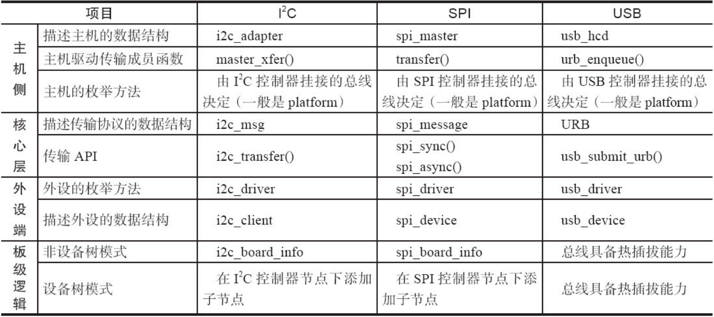

根据图12.4，Linux倾向于将主机端的驱动与外设端的驱动分离，而通过一个核心层将某种总线的协议进行抽象，外设端的驱动调用核心层API间接过渡到对主机驱动传输函数的调用。对于I2 C、SPI这类不具备热插拔能力的总线而言，一般在arch/arm/mach-xxx或者arch/arm/boot/dts中会有相应的板级描述信息，描述外设与主机的连接情况。

Linux的各个子系统都呈现为相同的特点，表17.1类比了I2 C、SPI、USB驱动架构，其他的PCI等都是类似的。

表17.1　I2 C、SPI、USB驱动架构的类比

对于USB、PCI等总线而言，由于它们具备热插拔能力，所以实际上不存在类似I2 C、SPI这样的板级描述信息。换句话说，即便是有这类信息，其实也没有什么用，因为如果写了板子上有个U盘，但实际上没有，其实反而是制造了麻烦；相反，如果没有写，U盘一旦插入，Linux USB子系统会自动探测到一个U盘。

同时我们注意到，I2 C、SPI、USB控制器虽然给别人提供了总线，但是其实自己也是由它自身依附的总线枚举出来的。比如，对于SoC而言，这些控制器一般是直接集成在芯片内部，通过内存访问指令来访问的，因此它们自身是通过platform_driver、platform_device这种模型枚举进来的。