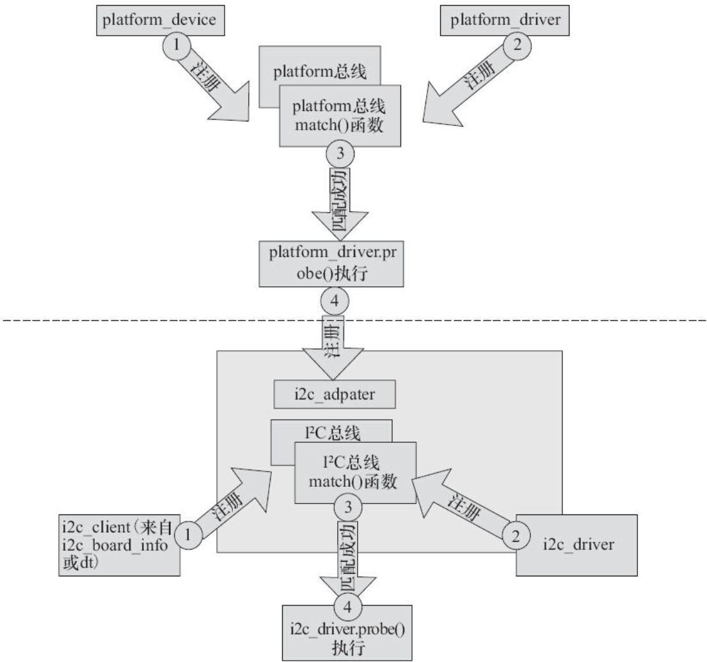

I2 C控制器所在驱动的platform_driver与arch/arm/mach-xxx中的platform_device（或者设备树中的节点）通过platform总线的match（）函数匹配导致platform_driver.probe（）执行，从而完成I2 C控制器的注册；而I2 C上面挂的触摸屏依附的i2c_driver与arch/arm/mach-xxx中的i2c_board_info指向的设备（或者设备树中的节点）通过I2 C总线的match（）函数匹配导致i2c_driver.probe（）执行，从而使触摸屏展开。

图17.1虚线上方部分是i2c_adapater眼里的Linux世界；下方部分是i2c_client眼里的Linux世界。其实，Linux中的每一个设备通过它依附的总线被枚举出来，尽管它自身可能给别人提供总线。

图17.1　I2 C主机和外设眼里的Linux世界