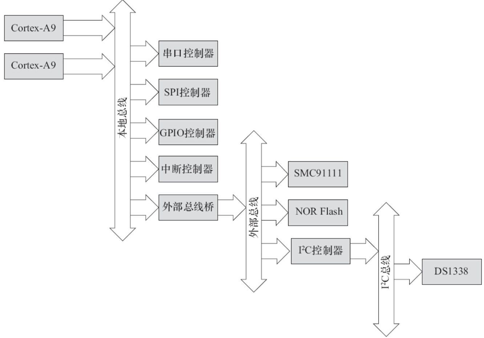
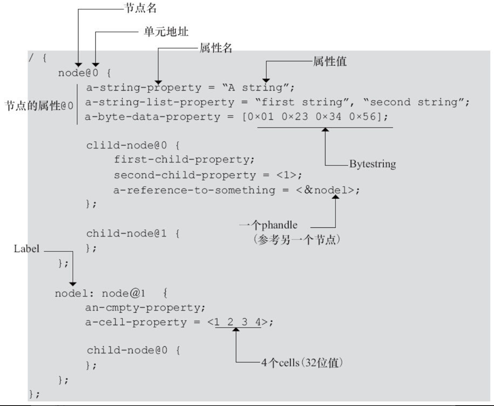

---

---

整个设备树牵涉面比较广，即增加了新的用于描述设备硬件信息的文本格式，又增加了编译这个文本的工具，同时Bootloader也需要支持将编译后的设备树传递给Linux内核。

# 18.2.1DTS、DTC和DTB等

## 1.DTS

文件.dts是一种ASCII文本格式的设备树描述，此文本格式非常人性化，适合人类的阅读习惯。基本上，在ARM Linux中，一个.dts文件对应一个ARM的设备，一般放置在内核的arch/arm/boot/dts/目录中。值得注意的是，在arch/powerpc/boot/dts、arch/powerpc/boot/dts、arch/c6x/boot/dts、arch/openrisc/boot/dts等目录中，也存在大量的.dts文件，这证明DTS绝对不是ARM的专利。

由于一个SoC可能对应多个设备（一个SoC可以对应多个产品和电路板），这些.dts文件势必须包含许多共同的部分，Linux内核为了简化，把SoC公用的部分或者多个设备共同的部分一般提炼为.dtsi，类似于C语言的头文件。其他的设备对应的.dts就包括这个.dtsi。譬如，对于VEXPRESS而言，vexpress-v2m.dtsi就被vexpress-v2p-ca9.dts所引用，vexpress-v2p-ca9.dts有如下一行代码：

```
/include/ "vexpress-v2m.dtsi"
```

当然，和C语言的头文件类似，.dtsi也可以包括其他的.dtsi，譬如几乎所有的ARM SoC的.dtsi都引用了skeleton.dtsi。

文件.dts（或者其包括的.dtsi）的基本元素即为前文所述的节点和属性，代码清单18.1给出了一个设备树结构的模版。

代码清单18.1　设备树结构模版

```
 1/ {
 2      node1 {
 3          a-string-property = "A string";
 4          a-string-list-property = "first string", "second string";
 5          a-byte-data-property = [0x01 0x23 0x34 0x56];
 6          child-node1 {
 7              first-child-property;
 8              second-child-property = <1>;
 9              a-string-property = "Hello, world";
10          };
11          child-node2 {
12          };
13      };
14      node2 {
15          an-empty-property;
16          a-cell-property = <1 2 3 4>; /* each number (cell) is a uint32 */
17          child-node1 {
18          };
19      };
20};
```

上述.dts文件并没有什么真实的用途，但它基本表征了一个设备树源文件的结构：

1个root节点"/"；root节点下面含一系列子节点，本例中为node1和node2；节点node1下又含有一系列子节点，本例中为child-node1和child-node2；各节点都有一系列属性。这些属性可能为空，如an-empty-property；可能为字符串，如a-string-property；可能为字符串数组，如a-string-list-property；可能为Cells（由u32整数组成），如second-child-property；可能为二进制数，如a-byte-data-property。

下面以一个最简单的设备为例来看如何写一个.dts文件。如图18.1所示，假设此设备的配置如下：



图18.1　设备树参考硬件结构图

1个双核ARM Cortex-A932位处理器；ARM本地总线上的内存映射区域分布有两个串口（分别位于0x101F1000和0x101F2000）、GPIO控制器（位于0x101F3000）、SPI控制器（位于0x10170000）、中断控制器（位于0x10140000）和一个外部总线桥；外部总线桥上又连接了SMC SMC91111以太网（位于0x10100000）、I2 C控制器（位于0x10160000）、64MB NOR Flash（位于0x30000000）；外部总线桥上连接的I2 C控制器所对应的I2 C总线上又连接了Maxim DS1338实时钟（I2 C地址为0x58）。

对于图18.1所示硬件结构图，如果用“.dts”描述，则其对应的“.dts”文件如代码清单18.2所示。

代码清单18.2　参考硬件的设备树文件

```
 1/ {
 2      compatible = "acme,coyotes-revenge";
 3      #address-cells = <1>;
 4      #size-cells = <1>;
 5      interrupt-parent = <&intc>;
 6
 7      cpus {
 8          #address-cells = <1>;
 9          #size-cells = <0>;
10          cpu@0 {
11              compatible = "arm,cortex-a9";
12              reg = <0>;
13          };
14          cpu@1 {
15              compatible = "arm,cortex-a9";
16              reg = <1>;
17          };
18      };
19
20      serial@101f0000 {
21          compatible = "arm,pl011";
22          reg = <0x101f0000 0x1000 >;
23          interrupts = < 1 0 >;
24      };
25
26      serial@101f2000 {
27          compatible = "arm,pl011";
28          reg = <0x101f2000 0x1000 >;
29          interrupts = < 2 0 >;
30      };
31
32      gpio@101f3000 {
33          compatible = "arm,pl061";
34          reg = <0x101f3000 0x1000
35                 0x101f4000 0x0010>;
36          interrupts = < 3 0 >;
37      };
38
39      intc: interrupt-controller@10140000 {
40          compatible = "arm,pl190";
41          reg = <0x10140000 0x1000 >;
42          interrupt-controller;
43          #interrupt-cells = <2>;
44      };
45
46      spi@10115000 {
47          compatible = "arm,pl022";
48          reg = <0x10115000 0x1000 >;
49          interrupts = < 4 0 >;
50      };
51
52      external-bus {
53          #address-cells = <2>
54          #size-cells = <1>;
55          ranges = <0 0  0x10100000  0x10000     // Chipselect 1, Ethernet
56                    1 0  0x10160000  0x10000        // Chipselect 2, i2c controller
57                    2 0  0x30000000  0x1000000>; // Chipselect 3, NOR Flash
58
59          ethernet@0,0 {
60              compatible = "smc,smc91c111";
61              reg = <0 0 0x1000>;
62              interrupts = < 5 2 >;
63          };
64
65          i2c@1,0 {
66              compatible = "acme,a1234-i2c-bus";
67              #address-cells = <1>;
68              #size-cells = <0>;
69              reg = <1 0 0x1000>;
70              interrupts = < 6 2 >;
71              rtc@58 {
72                  compatible = "maxim,ds1338";
73                  reg = <58>;
74                  interrupts = < 7 3 >;
75              };
76          };
77
78          flash@2,0 {
79              compatible = "samsung,k8f1315ebm", "cfi-flash";
80              reg = <2 0 0x4000000>;
81          };
82      };
83};
```

在上述.dts文件中，可以看出external-bus是根节点的子节点，而I2 C又是external-bus的子节点，RTC又进一步是I2 C的子节点。每一级节点都有一些属性信息，本章后续部分会进行详细解释。

## 2.DTC（Device Tree Compiler）

DTC是将.dts编译为.dtb的工具。DTC的源代码位于内核的scripts/dtc目录中，在Linux内核使能了设备树的情况下，编译内核的时候主机工具DTC会被编译出来，对应于scripts/dtc/Makefile中“hostprogs-y：=dtc”这一hostprogs的编译目标。

当然，DTC也可以在Ubuntu中单独安装，命令如下：

```
sudo apt-get install device-tree-compiler
```

在Linux内核的arch/arm/boot/dts/Makefile中，描述了当某种SoC被选中后，哪些.dtb文件会被编译出来，如与VEXPRESS对应的.dtb包括：

```
dtb-$(CONfiG_ARCH_VEXPRESS) += vexpress-v2p-ca5s.dtb \
vexpress-v2p-ca9.dtb \
vexpress-v2p-ca15-tc1.dtb \
vexpress-v2p-ca15_a7.dtb \
xenvm-4.2.dtb
```

在Linux下，我们可以单独编译设备树文件。当我们在Linux内核下运行make dtbs时，若我们之前选择了ARCH_VEXPRESS，上述.dtb都会由对应的.dts编译出来，因为arch/arm/Makefile中含有一个.dtbs编译目标项目。

DTC除了可以编译.dts文件以外，其实也可以“反汇编”.dtb文件为.dts文件，其指令格式为：

```
./scripts/dtc/dtc -I dtb -O dts -o xxx.dts arch/arm/boot/dts/xxx.dtb
```

## 3.DTB（Device Tree Blob）

文件.dtb是.dts被DTC编译后的二进制格式的设备树描述，可由Linux内核解析，当然U-Boot这样的bootloader也是可以识别.dtb的。

通常在我们为电路板制作NAND、SD启动映像时，会为.dtb文件单独留下一个很小的区域以存放之，之后bootloader在引导内核的过程中，会先读取该.dtb到内存。

Linux内核也支持一种变通的模式，可以不把.dtb文件单独存放，而是直接和zImage绑定在一起做成一个映像文件，类似cat zImage xxx.dtb>zImage_with_dtb的效果。当然内核编译时候要使能CONFIG_ARM_APPENDED_DTB这个选项，以支持“Use appended device tree blob to zImage”（见Linux内核中的菜单）。

## 4.绑定（Binding）

对于设备树中的节点和属性具体是如何来描述设备的硬件细节的，一般需要文档来进行讲解，文档的后缀名一般为.txt。在这个.txt文件中，需要描述对应节点的兼容性、必需的属性和可选的属性。

这些文档位于内核的Documentation/devicetree/bindings目录下，其下又分为很多子目录。譬如，Documentation/devicetree/bindings/i2c/i2c-xiic.txt描述了Xilinx的I2 C控制器，其内容如下：

```
Xilinx IIC controller:
Required properties:
- compatible : Must be "xlnx,xps-iic-2.00.a"
- reg : IIC register location and length
- interrupts : IIC controller unterrupt
- #address-cells = <1>
- #size-cells = <0>
Optional properties:
- Child nodes conforming to i2c bus binding
Example:
        axi_iic_0: i2c@40800000 {
compatible = "xlnx,xps-iic-2.00.a";
interrupts = < 1 2 >;
reg = < 0x40800000 0x10000 >;
                #size-cells = <0>;
                #address-cells = <1>;
        };
```

基本可以看出，设备树绑定文档的主要内容包括：

- ·关于该模块最基本的描述。
- ·必需属性（Required Properties）的描述。
- ·可选属性（Optional Properties）的描述。
- ·一个实例。

Linux内核下的scripts/checkpatch.pl会运行一个检查，如果有人在设备树中新添加了compatible字符串，而没有添加相应的文档进行解释，checkpatch程序会报出警告：UNDOCUMENTED_DT_STRINGDT compatible string xxx appears un-documented，因此程序员要养成及时写DT Binding文档的习惯。

## 5.Bootloader

Uboot设备从v1.1.3开始支持设备树，其对ARM的支持则是和ARM内核支持设备树同期完成。

为了使能设备树，需要在编译Uboot的时候在config文件中加入：

```
#define CONfiG_OF_LIBFDT
```

在Uboot中，可以从NAND、SD或者TFTP等任意介质中将.dtb读入内存，假设.dtb放入的内存地址为0x71000000，之后可在Uboot中运行fdt addr命令设置.dtb的地址，如：

```
UBoot> fdt addr 0x71000000
```

fdt的其他命令就变得可以使用，如fdt resize、fdt print等。

对于ARM来讲，可以通过bootz kernel_addr initrd_address dtb_address的命令来启动内核，即dtb_address作为bootz或者bootm的最后一次参数，第一个参数为内核映像的地址，第二个参数为initrd的地址，若不存在initrd，可以用“-”符号代替。

# 18.2.2根节点兼容性

上述.dts文件中，第2行根节点"/"的兼容属性compatible="acme，coyotes-revenge"；定义了整个系统（设备级别）的名称，它的组织形式为：manufacturer，model。

Linux内核通过根节点"/"的兼容属性即可判断它启动的是什么设备。在真实项目中，这个顶层设备的兼容属性一般包括两个或者两个以上的兼容性字符串，首个兼容性字符串是板子级别的名字，后面一个兼容性是芯片级别（或者芯片系列级别）的名字。

譬如板子arch/arm/boot/dts/vexpress-v2p-ca9.dts兼容于arm，vexpress，v2p-ca9和“arm，vexpress”：

```
compatible = "arm,vexpress,v2p-ca9", "arm,vexpress";
```

板子arch/arm/boot/dts/vexpress-v2p-ca5s.dts的兼容性则为：

```
compatible = "arm,vexpress,v2p-ca5s", "arm,vexpress";
```

板子arch/arm/boot/dts/vexpress-v2p-ca15_a7.dts的兼容性为：

```
compatible = "arm,vexpress,v2p-ca15_a7", "arm,vexpress";
```

可以看出，上述各个电路板的共性是兼容于arm，vexpress，而特性是分别兼容于arm，vexpress，v2p-ca9、arm，vexpress，v2p-ca5s和arm，vexpress，v2p-ca15_a7。

进一步地看，arch/arm/boot/dts/exynos4210-origen.dts的兼容性字段如下：

```
compatible = "insignal,origen", "samsung,exynos4210", "samsung,exynos4";
```

第一个字符串是板子名字（很特定），第2个字符串是芯片名字（比较特定），第3个字段是芯片系列的名字（比较通用）。

作为类比，arch/arm/boot/dts/exynos4210-universal_c210.dts的兼容性字段则如下：

```
compatible = "samsung,universal_c210", "samsung,exynos4210", "samsung,exynos4";
```

由此可见，它与exynos4210-origen.dts的区别只在于第1个字符串（特定的板子名字）不一样，后面芯片名和芯片系列的名字都一样。

在Linux 2.6内核中，ARM Linux针对不同的电路板会建立由MACHINE_START和MACHINE_END包围起来的针对这个设备的一系列回调函数，如代码清单18.3所示。

代码清单18.3　ARM Linux 2.6时代的设备

```
 1MACHINE_START(VEXPRESS, "ARM-Versatile Express")
 2         .atag_offset    = 0x100,
 3         .smp            = smp_ops(vexpress_smp_ops),
 4         .map_io         = v2m_map_io,
 5         .init_early     = v2m_init_early,
 6         .init_irq       = v2m_init_irq,
 7         .timer          = &v2m_timer,
 8         .handle_irq     = gic_handle_irq,
 9         .init_machine   = v2m_init,
10         .restart        = vexpress_restart,
11MACHINE_END
```

这些不同的设备会有不同的MACHINE ID，Uboot在启动Linux内核时会将MACHINE ID存放在r1寄存器，Linux启动时会匹配Bootloader传递的MACHINE ID和MACHINE_START声明的MACHINE ID，然后执行相应设备的一系列初始化函数。

ARM Linux 3.x在引入设备树之后，MACHINE_START变更为DT_MACHINE_START，其中含有一个.dt_compat成员，用于表明相关的设备与.dts中根节点的兼容属性兼容关系。如果Bootloader传递给内核的设备树中根节点的兼容属性出现在某设备的.dt_compat表中，相关的设备就与对应的兼容匹配，从而引发这一设备的一系列初始化函数被执行。一个典型的DT_MACHINE如代码清单18.4所示。

代码清单18.4　ARM Linux 3.x时代的设备

```
 1static const char * const v2m_dt_match[] __initconst = {
 2         "arm,vexpress",
 3         "xen,xenvm",
 4         NULL,
 5};
 6DT_MACHINE_START(VEXPRESS_DT, "ARM-Versatile Express")
 7         .dt_compat      = v2m_dt_match,
 8         .smp            = smp_ops(vexpress_smp_ops),
 9         .map_io         = v2m_dt_map_io,
10         .init_early     = v2m_dt_init_early,
11         .init_irq       = v2m_dt_init_irq,
12         .timer          = &v2m_dt_timer,
13         .init_machine   = v2m_dt_init,
14         .handle_irq     = gic_handle_irq,
15         .restart        = vexpress_restart,
16MACHINE_END
```

Linux倡导针对多个SoC、多个电路板的通用DT设备，即一个DT设备的.dt_compat包含多个电路板.dts文件的根节点兼容属性字符串。之后，如果这多个电路板的初始化序列不一样，可以通过int of_machine_is_compatible（const char*compat）API判断具体的电路板是什么。在Linux内核中，常常使用如下API来判断根节点的兼容性：

```
int of_machine_is_compatible(const char *compat);
```

此API判断目前运行的板子或者SoC的兼容性，它匹配的是设备树根节点下的兼容属性。例如drivers/cpufreq/exynos-cpufreq.c中就有判断运行的CPU类型是exynos4210、exynos4212、exynos4412还是exynos5250的代码，进而分别处理，如代码清单18.5所示。

代码清单18.5　of_machine_is_compatible（）的案例

```
 1 static int exynos_cpufreq_probe(struct platform_device *pdev)
 2 {
 3         int ret = -EINVAL;
 4
 5         exynos_info = kzalloc(sizeof(*exynos_info), GFP_KERNEL);
 6         if (!exynos_info)
 7                 return -ENOMEM;
 8
 9         exynos_info->dev = &pdev->dev;
10
11         if (of_machine_is_compatible("samsung,exynos4210")) {
12                 exynos_info->type = EXYNOS_SOC_4210;
13                 ret = exynos4210_cpufreq_init(exynos_info);
14         } else if (of_machine_is_compatible("samsung,exynos4212")) {
15                 exynos_info->type = EXYNOS_SOC_4212;
16                 ret = exynos4x12_cpufreq_init(exynos_info);
17         } else if (of_machine_is_compatible("samsung,exynos4412")) {
18                 exynos_info->type = EXYNOS_SOC_4412;
19                 ret = exynos4x12_cpufreq_init(exynos_info);
20         } else if (of_machine_is_compatible("samsung,exynos5250")) {
21                 exynos_info->type = EXYNOS_SOC_5250;
22                 ret = exynos5250_cpufreq_init(exynos_info);
23         } else {
24                 pr_err("%s: Unknown SoC type\n", __func__);
25                 return -ENODEV;
26         }
27         ...
28}
```

如果一个兼容包含多个字符串，譬如对于前面介绍的根节点兼容compatible="samsung，universal_c210"，"samsung，exynos4210"，"samsung，exynos4"的情况，如下3个表达式都是成立的。

```
of_machine_is_compatible("samsung,universal_c210")
of_machine_is_compatible("samsung,exynos4210")
of_machine_is_compatible("samsung,exynos4")
```

# 18.2.3设备节点兼容性

在.dts文件的每个设备节点中，都有一个兼容属性，兼容属性用于驱动和设备的绑定。兼容属性是一个字符串的列表，列表中的第一个字符串表征了节点代表的确切设备，形式为"manufacturer，model"，其后的字符串表征可兼容的其他设备。可以说前面的是特指，后面的则涵盖更广的范围。如在vexpress-v2m.dtsi中的Flash节点如下：

```
flash@0,00000000 {
compatible = "arm,vexpress-flash", "cfi-flash";
reg = <0 0x00000000 0x04000000>,
<1 0x00000000 0x04000000>;
bank-width = <4>;
 };
```

兼容属性的第2个字符串"cfi-flash"明显比第1个字符串"arm，vexpress-flash"涵盖的范围更广。

再如，Freescale MPC8349SoC含一个串口设备，它实现了国家半导体（National Sem-iconductor）的NS16550寄存器接口。则MPC8349串口设备的兼容属性为compatible="fsl，mpc8349-uart"，"ns16550"。其中，fsl，mpc8349-uart指代了确切的设备，ns16550代表该设备与NS16550UART保持了寄存器兼容。因此，设备节点的兼容性和根节点的兼容性是类似的，都是“从具体到抽象”。

使用设备树后，驱动需要与.dts中描述的设备节点进行匹配，从而使驱动的probe（）函数执行。对于platform_driver而言，需要添加一个OF匹配表，如前文的.dts文件的"acme，a1234-i2c-bus"兼容I2 C控制器节点的OF匹配表，具体代码清单18.6所示。

代码清单18.6　platform设备驱动中的of_match_table

```
 1static const struct of_device_id a1234_i2c_of_match[] = {
 2          { .compatible = "acme,a1234-i2c-bus", },
 3          {},
 4};
 5MODULE_DEVICE_TABLE(of, a1234_i2c_of_match);
 6
 7static struct platform_driver i2c_a1234_driver = {
 8          .driver = {
 9                  .name = "a1234-i2c-bus",
10                  .owner = THIS_MODULE,
11                  .of_match_table = a1234_i2c_of_match,
12          },
13          .probe = i2c_a1234_probe,
14          .remove = i2c_a1234_remove,
15};
16module_platform_driver(i2c_a1234_driver);
```

对于I2 C和SPI从设备而言，同样也可以通过of_match_table添加匹配的.dts中的相关节点的兼容属性，如sound/soc/codecs/wm8753.c中的针对WolfsonWM8753的of_match_table，具体如代码清单18.7所示。

代码清单18.7　I2 C、SPI设备驱动中的of_match_table

```
 1static const struct of_device_id wm8753_of_match[] = {
 2          { .compatible = "wlf,wm8753", },
 3          { }
 4};
 5MODULE_DEVICE_TABLE(of, wm8753_of_match);
 6static struct spi_driver wm8753_spi_driver = {
 7          .driver = {
 8                  .name   = "wm8753",
 9                  .owner  = THIS_MODULE,
10                  .of_match_table = wm8753_of_match,
11          },
12          .probe          = wm8753_spi_probe,
13          .remove         = wm8753_spi_remove,
14};
15static struct i2c_driver wm8753_i2c_driver = {
16          .driver = {
17                  .name = "wm8753",
18                  .owner = THIS_MODULE,
19                  .of_match_table = wm8753_of_match,
20          },
21          .probe =    wm8753_i2c_probe,
22          .remove =   wm8753_i2c_remove,
23          .id_table = wm8753_i2c_id,
24};
```

上述代码中的第2行显示WM8753的供应商是“wlf”，它其实是对应于Wolfson Microe-lectronics的前缀。详细的前缀可见于内核文档：Documentation/devicetree/bindings/vendor-prefixes.txt

对于I2 C、SPI还有一点需要提醒的是，I2 C和SPI外设驱动和设备树中设备节点的兼容属性还有一种弱式匹配方法，就是“别名”匹配。兼容属性的组织形式为manufacturer，model，别名其实就是去掉兼容属性中manufacturer前缀后的model部分。关于这一点，可查看drivers/spi/spi.c的源代码，函数spi_match_device（）暴露了更多的细节，如果别名出现在设备spi_driver的id_table里面，或者别名与spi_driver的name字段相同，SPI设备和驱动都可以匹配上，代码清单18.8显示了SPI的别名匹配。

代码清单18.8　SPI的别名匹配

```
 1static int spi_match_device(struct device *dev, struct device_driver *drv)
 2{
 3          const struct spi_device *spi = to_spi_device(dev);
 4          const struct spi_driver *sdrv = to_spi_driver(drv);
 5
 6          /* Attempt an OF style match */
 7          if (of_driver_match_device(dev, drv))
 8                  return 1;
 9
10          /* Then try ACPI */
11           if (acpi_driver_match_device(dev, drv))
12                   return 1;
13
14           if (sdrv->id_table)
15                   return !!spi_match_id(sdrv->id_table, spi);
16
17           return strcmp(spi->modalias, drv->name) == 0;
18 }
19static const struct spi_device_id *spi_match_id(const struct spi_device_id *id,
20                                              const struct spi_device *sdev)
21{
22        while (id->name[0]) {
23               if (!strcmp(sdev->modalias, id->name))
24                       return id;
25               id++;
26        }
27        return NULL;
28}
```

通过这个别名匹配，实际上，SPI和I2 C的外设驱动即使没有of_match_table，还是可以和设备树中的节点匹配上的。

一个驱动可以在of_match_table中兼容多个设备，在Linux内核中常常使用如下API来判断具体的设备是什么：

```
int of_device_is_compatible(const struct device_node *device,const char *compat);
```

此函数用于判断设备节点的兼容属性是否包含compat指定的字符串。这个API多用于一个驱动支持两个以上设备的时候。

当一个驱动支持两个或多个设备的时候，这些不同.dts文件中设备的兼容属性都会写入驱动OF匹配表。因此驱动可以通过Bootloader传递给内核设备树中的真正节点的兼容属性以确定究竟是哪一种设备，从而根据不同的设备类型进行不同的处理。如arch/powerpc/platforms/83xx/usb.c中的mpc831x_usb_cfg（）就进行了类似处理：

```
if (immr_node && (of_device_is_compatible(immr_node, "fsl,mpc8315-immr") ||
                of_device_is_compatible(immr_node, "fsl,mpc8308-immr")))
        clrsetbits_be32(immap + MPC83XX_SCCR_OFFS,
                        MPC8315_SCCR_USB_MASK,
                        MPC8315_SCCR_USB_DRCM_01);
else
        clrsetbits_be32(immap + MPC83XX_SCCR_OFFS,
                        MPC83XX_SCCR_USB_MASK,
                        MPC83XX_SCCR_USB_DRCM_11);
/* Configure pin mux for ULPI.  There is no pin mux for UTMI */
if (prop && !strcmp(prop, "ulpi")) {
if (of_device_is_compatible(immr_node, "fsl,mpc8308-immr")) {
                clrsetbits_be32(immap + MPC83XX_SICRH_OFFS,
                                MPC8308_SICRH_USB_MASK,
                                MPC8308_SICRH_USB_ULPI);
        } else if (of_device_is_compatible(immr_node, "fsl,mpc8315-immr")) {
                clrsetbits_be32(immap + MPC83XX_SICRL_OFFS,
                                MPC8315_SICRL_USB_MASK,
                                MPC8315_SICRL_USB_ULPI);
                clrsetbits_be32(immap + MPC83XX_SICRH_OFFS,
                                MPC8315_SICRH_USB_MASK,
                                MPC8315_SICRH_USB_ULPI);
        } else {
                clrsetbits_be32(immap + MPC83XX_SICRL_OFFS,
                                MPC831X_SICRL_USB_MASK,
                                MPC831X_SICRL_USB_ULPI);
                clrsetbits_be32(immap + MPC83XX_SICRH_OFFS,
                                MPC831X_SICRH_USB_MASK,
                                MPC831X_SICRH_USB_ULPI);
        }
}
```

它根据具体的设备是fsl，mpc8315-immr和fsl，mpc8308-immr、中的哪一种来进行不同的处理。

当一个驱动可以兼容多种设备的时候，除了of_device_is_compatible（）这种判断方法以外，还可以采用在驱动的of_device_id表中填充.data成员的形式。譬如，arch/arm/mm/cache-l2x0.c支持“arm，l210-cache”“arm，pl310-cache”“arm，l220-cache”等多种设备，其of_device_id表如代码清单18.9所示。

代码清单18.9　支持多个兼容性以及.data成员的of_device_id表

```
 1#define L2C_ID(name, fns) { .compatible = name, .data = (void *)&fns }
 2static const struct of_device_id l2x0_ids[] __initconst = {
 3          L2C_ID("arm,l210-cache", of_l2c210_data),
 4          L2C_ID("arm,l220-cache", of_l2c220_data),
 5          L2C_ID("arm,pl310-cache", of_l2c310_data),
 6          L2C_ID("brcm,bcm11351-a2-pl310-cache", of_bcm_l2x0_data),
 7          L2C_ID("marvell,aurora-outer-cache", of_aurora_with_outer_data),
 8          L2C_ID("marvell,aurora-system-cache", of_aurora_no_outer_data),
 9          L2C_ID("marvell,tauros3-cache", of_tauros3_data),
10          /* Deprecated IDs */
11          L2C_ID("bcm,bcm11351-a2-pl310-cache", of_bcm_l2x0_data),
12          {}
13 };
```

在驱动中，通过如代码清单18.10的方法拿到了对应于L2缓存类型的.data成员，其中主要用到了of_match_node（）这个API。

代码清单18.10　通过of_match_node（）找到.data

```
 1int __init l2x0_of_init(u32 aux_val, u32 aux_mask)
 2{
 3          const struct l2c_init_data *data;
 4          struct device_node *np;
 5
 6          np = of_find_matching_node(NULL, l2x0_ids);
 7          if (!np)
 8                  return -ENODEV;
 9          …
10          data = of_match_node(l2x0_ids, np)->data;
11}
```

如果电路板的.dts文件中L2缓存是arm，pl310-cache，那么上述代码第10行找到的data就是of_l2c310_data，它是l2c_init_data结构体的一个实例。l2c_init_data是一个由L2缓存驱动自定义的数据结构，在其定义中既可以保护数据成员，又可以包含函数指针，如代码清单18.11所示。

代码清单18.11　与兼容对应的特定data实例

```
 1struct l2c_init_data {
 2          const char *type;
 3          unsigned way_size_0;
 4          unsigned num_lock;
 5          void (*of_parse)(const struct device_node *, u32 *, u32 *);
 6          void (*enable)(void __iomem *, u32, unsigned);
 7          void (*fixup)(void __iomem *, u32, struct outer_cache_fns *);
 8          void (*save)(void __iomem *);
 9          struct outer_cache_fns outer_cache;
10};
```

通过这种方法，驱动可以把与某个设备兼容的私有数据寻找出来，如此体现了一种面向对象的设计思想，避免了大量的if，else或者switch，case语句。

# 18.2.4设备节点及label的命名

代码清单18.2的.dts文件中，根节点“/”的cpus子节点下面又包含两个cpu子节点，描述了此设备上的两个CPU，并且两者的兼容属性为："arm，cortex-a9"。注意cpus和cpus的两个cpu子节点的命名，它们遵循的组织形式为< name>[@< unit-address>]，<   >中的内容是必选项，[   ]中的则为可选项。name是一个ASCII字符串，用于描述节点对应的设备类型，如3com Ethernet适配器对应的节点name宜为ethernet，而不是3com509。如果一个节点描述的设备有地址，则应该给出@unit-address。多个相同类型设备节点的name可以一样，只要unit-address不同即可，如本例中含有cpu@0、cpu@1以及serial@101f0000与serial@101f2000这样的同名节点。设备的unit-address地址也经常在其对应节点的reg属性中给出。对于挂在内存空间的设备而言，@字符后跟的一般就是该设备在内存空间的基地址，譬如arch/arm/boot/dts/exynos4210.dtsi中存在的：

```
sysram@02020000 {       
compatible = "mmio-sram";     
reg = <0x02020000 0x20000>;      
…
}
```

上述节点的reg属性的开始位置与@后面的地址一样。

对于挂在I2 C总线上的外设而言，@后面一般跟的是从设备的I2 C地址，譬如arch/arm/boot/dts/exynos4210-trats.dts中的mms114-touchscreen：

```
i2c@13890000 {
       …
       mms114-touchscreen@48 {
              compatible = "melfas,mms114";
              reg = <0x48>;
              …
       };
};
```

上述节点的reg属性标示的I2 C从地址与@后面的地址一样。

具体的节点命名规范可见ePAPR（embedded Power Architecture Platform Reference）标准，在https://www.power.org 中可下载该标准。

我们还可以给一个设备节点添加label，之后可以通过&label的形式访问这个label，这种引用是通过phandle（pointer handle）进行的。

例如，在arch/arm/boot/dts/omap5.dtsi中，第3组GPIO有gpio3这个label，如代码清单18.12所示。

代码清单18.12　在设备树中定义label

```
 1gpio3: gpio@48057000 {
 2         compatible = "ti,omap4-gpio";
 3         reg = <0x48057000 0x200>;
 4         interrupts = <GIC_SPI 31 IRQ_TYPE_LEVEL_HIGH>;
 5         ti,hwmods = "gpio3";
 6         gpio-controller;
 7         #gpio-cells = <2>;
 8         interrupt-controller;
 9         #interrupt-cells = <2>;
10 };
```

而hsusb2_phy这个USB的PHY复位GPIO用的是这组GPIO中的一个，所以它通过phandle引用了“gpio3”，如代码清单18.13所示。

代码清单18.13　通过phandle引用其他节点

```
 1/* HS USB Host PHY on PORT 2 */
 2hsusb2_phy: hsusb2_phy {
 3          compatible = "usb-nop-xceiv";
 4          reset-gpios = <&gpio3 12 GPIO_ACTIVE_LOW>; /* gpio3_76 HUB_RESET */
 5};
```

代码清单18.12第1行的gpio3是gpio@48057000节点的label，而代码清单18.13的hsusb2_phy则通过&gpio3引用了这个节点，表明自己要使用这一组GPIO中的第12个GPIO。很显然，这种phandle引用其实表明硬件之间的一种关联性。

再举一例，在arch/arm/boot/dts/omap5.dtsi中，我们可以看到类似如下的label，从这些实例可以看出，label习惯以<设备类型>< index>进行命名：

```
i2c1: i2c@48070000 {
}
i2c2: i2c@48072000 {
}
i2c3: i2c@48060000 {
}…
```

读者也许发现了一个奇怪的现象，就是代码清单18.13中居然引用了GPIO_ACTIVE_LOW这个类似C语言的宏。文件.dts的编译过程确实支持C的预处理，相应的.dts文件也包括了包含GPIO_ACTIVE_LOW这个宏定义的头文件：

```
#include <dt-bindings/gpio/gpio.h>
```

对于ARM而言，dt-bindings头文件位于内核的arch/arm/boot/dts/include/dt-bindings目录中。观察该目录的属性，它实际上是一个符号链接：

```
baohua@baohua-VirtualBox:~/develop/linux/arch/arm/boot/dts/include$ ls -l dt-
    bindings
lrwxrwxrwx 1 baohua baohua 34 11月
 28 00:16 dt-bindings -> ../../../../../
    include/dt-bindings
```

从内核的scripts/Makefile.lib这个文件可以看出，文件.dts的编译过程确实是支持C预处理的。

```
cmd_dtc = $(CPP) $(dtc_cpp_flags) -x assembler-with-cpp -o $(dtc-tmp) $< ; \
        $(objtree)/scripts/dtc/dtc -O dtb -o $@ -b 0 \
                -i $(dir $<) $(DTC_FLAGS) \
                -d $(depfile).dtc.tmp $(dtc-tmp) ; \
cat $(depfile).pre.tmp $(depfile).dtc.tmp > $(depfile)
```

它是先做了$（CPP）$（dtc_cpp_flags）-x assembler-with-cpp-o$（dtc-tmp）$<，再做的.dtc编译。

# 18.2.5地址编码

可寻址的设备使用如下信息在设备树中编码地址信息：

```
reg
    #address-cells
    #size-cells
```

其中，reg的组织形式为reg=<address1length1 [address2 length2] [ address3 length3]...>，其中的每一组address length表明了设备使用的一个地址范围。address为1个或多个32位的整型（即cell），而length的意义则意味着从address到address+length–1的地址范围都属于该节点。若#size-cells=0，则length字段为空。

address和length字段是可变长的，父节点的#address-cells和#size-cells分别决定了子节点reg属性的address和length字段的长度。

在代码清单18.2中，根节点的#address-cells=<1>；和#size-cells=<1>；决定了serial、gpio、spi等节点的address和length字段的长度分别为1。

cpus节点的#address-cells=<1>；和#size-cells=<0>；决定了两个cpu子节点的address为1，而length为空，于是形成了两个cpu的reg=<0>；和reg=<1>；。

external-bus节点的#address-cells=<2>和#size-cells=<1>；决定了其下的ethernet、i2c、flash的reg字段形如reg=<0 0 0x1000>；、reg=<1 0 0x1000>；和reg=<2 0 0x4000000>；。其中，address字段长度为2，开始的第一个cell（即“<”后的0、1、2）是对应的片选，第2个cell（即<0 0 0x1000>、<1 0 0x1000>和<2 00x1000000>中间的0，0，0）是相对该片选的基地址，第3个cell（即“>”前的0x1000、0x1000、0x1000000）为length。

特别要留意的是i2c节点中定义的#address-cells=<1>；和#size-cells=<0>；，其作用到了I2 C总线上连接的RTC，它的address字段为0x58，是RTC设备的I2 C地址。

根节点的直接子书点描述的是CPU的视图，因此根子节点的address区域就直接位于CPU的内存区域。但是，经过总线桥后的address往往需要经过转换才能对应CPU的内存映射。external-bus的ranges属性定义了经过external-bus桥后的地址范围如何映射到CPU的内存区域。

```
ranges = <0 0  0x10100000   0x10000     // Chipselect 1, Ethernet
                  1 0  0x10160000   0x10000     // Chipselect 2, i2c controller
                  2 0  0x30000000   0x1000000>; // Chipselect 3, NOR Flash
```

ranges是地址转换表，其中的每个项目是一个子地址、父地址以及在子地址空间的大小的映射。映射表中的子地址、父地址分别采用子地址空间的#address-cells和父地址空间的#address-cells大小。对于本例而言，子地址空间的#address-cells为2，父地址空间的#address-cells值为1，因此0 0 0x10100000 0x10000的前2个cell为external-bus桥后external-bus上片选0偏移0，第3个cell表示external-bus上片选0偏移0的地址空间被映射到CPU的本地总线的0x10100000位置，第4个cell表示映射的大小为0x10000。ranges后面两个项目的含义可以类推。

# 18.2.6中断连接

设备树中还可以包含中断连接信息，对于中断控制器而言，它提供如下属性：

interrupt-controller–这个属性为空，中断控制器应该加上此属性表明自己的身份；

#interrupt-cells–与#address-cells和#size-cells相似，它表明连接此中断控制器的设备的中断属性的cell大小。

在整个设备树中，与中断相关的属性还包括：

interrupt-parent–设备节点通过它来指定它所依附的中断控制器的phandle，当节点没有指定interrupt-parent时，则从父级节点继承。对于本例（代码清单18.2）而言，根节点指定了interrupt-parent=<&intc>；，其对应于intc：interrupt-controller@10140000，而根节点的子节点并未指定interrupt-parent，因此它们都继承了intc，即位于0x10140000的中断控制器中。

interrupts–用到了中断的设备节点，通过它指定中断号、触发方法等，这个属性具体含有多少个cell，由它依附的中断控制器节点的#interrupt-cells属性决定。而每个cell具体又是什么含义，一般由驱动的实现决定，而且也会在设备树的绑定文档中说明。譬如，对于ARM GIC中断控制器而言，#interrupt-cells为3，3个cell的具体含义在Documentation/devicetree/bindings/arm/gic.txt中就有如下文字说明：

```
The 1st cell is the interrupt type; 0 for SPI interrupts, 1 for PPI
interrupts.
The 2nd cell contains the interrupt number for the interrupt type.
SPI interrupts are in the range [0-987].  PPI interrupts are in the
range [0-15].
The 3rd cell is the flags, encoded as follows:
bits[3:0] trigger type and level flags.
              1 = low-to-high edge triggered
              2 = high-to-low edge triggered
              4 = active high level-sensitive
              8 = active low level-sensitive
bits[15:8] PPI interrupt cpu mask.  Each bit corresponds to each of
the 8 possible cpus attached to the GIC.  A bit set to '1' indicated
the interrupt is wired to that CPU.  Only valid for PPI interrupts.
```

另外，值得注意的是，一个设备还可能用到多个中断号。对于ARM GIC而言，若某设备使用了SPI的168号、169号两个中断，而且都是高电平触发，则该设备节点的中断属性可定义为interrupts=<01684>，<01694>；。

对于平台设备而言，简单的通过如下API就可以指定想取哪一个中断，其中的参数num就是中断的index。

```
int platform_get_irq(struct platform_device *dev, unsigned int num);
```

当然在.dts文件中可以对中断进行命名，而后在驱动中通过platform_get_irq_byname（）来获取对应的中断号。譬如代码清单18.14演示了在drivers/dma/fsl-edma.c中通过platform_get_irq_byname（）获取IRQ，以及arch/arm/boot/dts/vf610.dtsi与fsl-edma驱动对应节点的中断描述。

代码清单18.14　设备树中的中断名称以及驱动获取中断

```
 1static int
 2fsl_edma_irq_init(struct platform_device *pdev,struct fsl_edma_engine *fsl_edma)
 3{
 4     fsl_edma->txirq = platform_get_irq_byname(pdev, "edma-tx");
 5     fsl_edma->errirq = platform_get_irq_byname(pdev, "edma-err");
 6}
 7
 8edma0: dma-controller@40018000 {
 9           #dma-cells = <2>;
10           compatible = "fsl,vf610-edma";
11           reg = <0x40018000 0x2000>,
12                   <0x40024000 0x1000>,
13                   <0x40025000 0x1000>;
14           interrupts = <0 8 IRQ_TYPE_LEVEL_HIGH>,
15                           <0 9 IRQ_TYPE_LEVEL_HIGH>;
16           interrupt-names = "edma-tx", "edma-err";
17           dma-channels = <32>;
18           clock-names = "dmamux0", "dmamux1";
19           clocks = <&clks VF610_CLK_DMAMUX0>,
20                   <&clks VF610_CLK_DMAMUX1>;
21};
```

第4行、第5行的platform_get_irq_byname（）的第2个参数与.dts中的interrupt-names是一致的。

# 18.2.7GPIO、时钟、pinmux连接

除了中断以外，在ARM Linux中时钟、GPIO、pinmux都可以通过.dts中的节点和属性进行描述。

## 1.GPIO

譬如，对于GPIO控制器而言，其对应的设备节点需声明gpio-controller属性，并设置#gpio-cells的大小。譬如，对于兼容性为fsl，imx28-pinctrl的pinctrl驱动而言，其GPIO控制器的设备节点类似于：

```
pinctrl@80018000 {
compatible = "fsl,imx28-pinctrl", "simple-bus";
reg = <0x80018000 2000>;
        gpio0: gpio@0 {
		compatible = "fsl,imx28-gpio";
		interrupts = <127>;
		gpio-controller;
                #gpio-cells = <2>;
				interrupt-controller;
                #interrupt-cells = <2>;
        };
        gpio1: gpio@1 {
			compatible = "fsl,imx28-gpio";
			interrupts = <126>;
			gpio-controller;
                #gpio-cells = <2>;
			interrupt-controller;
                #interrupt-cells = <2>;
        };
        ...
};
```

其中，#gpio-　cells为2，第1个cell为GPIO号，第2个为GPIO的极性。为0的时候是高电平有效，为1的时候则是低电平有效。

使用GPIO的设备则通过定义命名xxx-gpios属性来引用GPIO控制器的设备节点，如：

```
sdhci@c8000400 {
	status = "okay";
	cd-gpios = <&gpio01 0>;
	wp-gpios = <&gpio02 0>;
	power-gpios = <&gpio03 0>;
	bus-width = <4>;
        };
```

而具体的设备驱动则通过类似如下的方法来获取GPIO：

```
cd_gpio = of_get_named_gpio(np, "cd-gpios", 0);
wp_gpio = of_get_named_gpio(np, "wp-gpios", 0);
power_gpio = of_get_named_gpio(np, "power-gpios", 0);
```

of_get_named_gpio（）这个API的原型如下：

```
static inline int of_get_named_gpio(struct device_node *np,
const char *propname, int index);
```

在.dts和设备驱动不关心GPIO名字的情况下，也可以直接通过of_get_gpio（）获取GPIO，此函数原型为：

```
static inline int of_get_gpio(struct device_node *np, int index);
```

如对于compatible="gpio-control-nand"的基于GPIO的NAND控制器而言，在.dts中会定义多个gpio属性：

```
gpio-nand@1,0 {
compatible = "gpio-control-nand";
reg = <1 0x0000 0x2>;
       #address-cells = <1>;
       #size-cells = <1>;
gpios = <&banka 1 0     /* rdy */
		&banka 2 0     /* nce */
		&banka 3 0     /* ale */
		&banka 4 0     /* cle */
                0              /* nwp */>;
       partition@0 {
       ...
       };
};
```

在相应的驱动代码drivers/mtd/nand/gpio.c中是这样获取这些GPIO的：

```
plat->gpio_rdy = of_get_gpio(dev->of_node, 0);
plat->gpio_nce = of_get_gpio(dev->of_node, 1);
plat->gpio_ale = of_get_gpio(dev->of_node, 2);
plat->gpio_cle = of_get_gpio(dev->of_node, 3);
plat->gpio_nwp = of_get_gpio(dev->of_node, 4);
```

## 2.时钟

时钟和GPIO也是类似的，时钟控制器的节点被使用时钟的模块引用：

```
clocks = <&clks 138>, <&clks 140>, <&clks 141>;
clock-names = "uart", "general", "noc";
```

而驱动中则使用上述的clock-names属性作为clk_get（）或devm_clk_get（）的第二个参数来申请时钟，譬如获取第2个时钟：

```
devm_clk_get(&pdev->dev, "general");
```

<&clks 138>里的138这个index是与相应时钟驱动中clk的表的顺序对应的，很多开发者也认为这种数字出现在设备树中不太好，因此他们把clk的index作为宏定义到了arch/arm/boot/dts/include/dt-bindings/clock中。譬如include/dt-bindings/clock/imx6qdl-clock.h中存在这样的宏：

```
#define IMX6QDL_CLK_STEP                        16
#define IMX6QDL_CLK_PLL1_SW                     17
#define IMX6QDL_CLK_ARM                         104
```

而arch/arm/boot/dts/imx6q.dtsi则是这样引用它们的：

```
clocks = <&clks IMX6QDL_CLK_ARM>,
<&clks IMX6QDL_CLK_PLL2_PFD2_396M>,
<&clks IMX6QDL_CLK_STEP>,
<&clks IMX6QDL_CLK_PLL1_SW>,
<&clks IMX6QDL_CLK_PLL1_SYS>;
```

## 3.pinmux

在设备树中，某个设备节点使用的pinmux的引脚群是通过phandle来指定的。譬如在arch/arm/boot/dts/atlas6.dtsi的pinctrl节点中包含所有引脚群的描述，如代码清单18.15所示。

代码清单18.15　设备树中pinctrl控制器的引脚群

```
 1gpio: pinctrl@b0120000 {
 2         #gpio-cells = <2>;
 3         #interrupt-cells = <2>;
 4         compatible = "sirf,atlas6-pinctrl";
 5         …
 6
 7         lcd_16pins_a: lcd0@0 {
 8                lcd {
 9                       sirf,pins = "lcd_16bitsgrp";
10                       sirf,function = "lcd_16bits";
11                };
12         };
13         …
14         spi0_pins_a: spi0@0 {
15                spi {
16                       sirf,pins = "spi0grp";
17                       sirf,function = "spi0";
18                };
19         };
20         spi1_pins_a: spi1@0 {
21                spi {
22                       sirf,pins = "spi1grp";
23                       sirf,function = "spi1";
24                };
25         };
26         …
27};
```

而SPI0这个硬件实际上需要用到spi0_pins_a对应的spi0grp这一组引脚，因此在atlas6-evb.dts中通过pinctrl-0引用了它，如代码清单18.16所示。

代码清单18.16　给设备节点指定引脚群

```
 1 spi@b00d0000 {
 2          status = "okay";
 3          pinctrl-names = "default";
 4          pinctrl-0 = <&spi0_pins_a>;
 5          …
 6};
```

到目前为止，我们可以勾勒出一个设备树的全局视图，图18.2显示了设备树中的节点、属性、label以及phandle等信息。



图18.2　设备树的全景视图