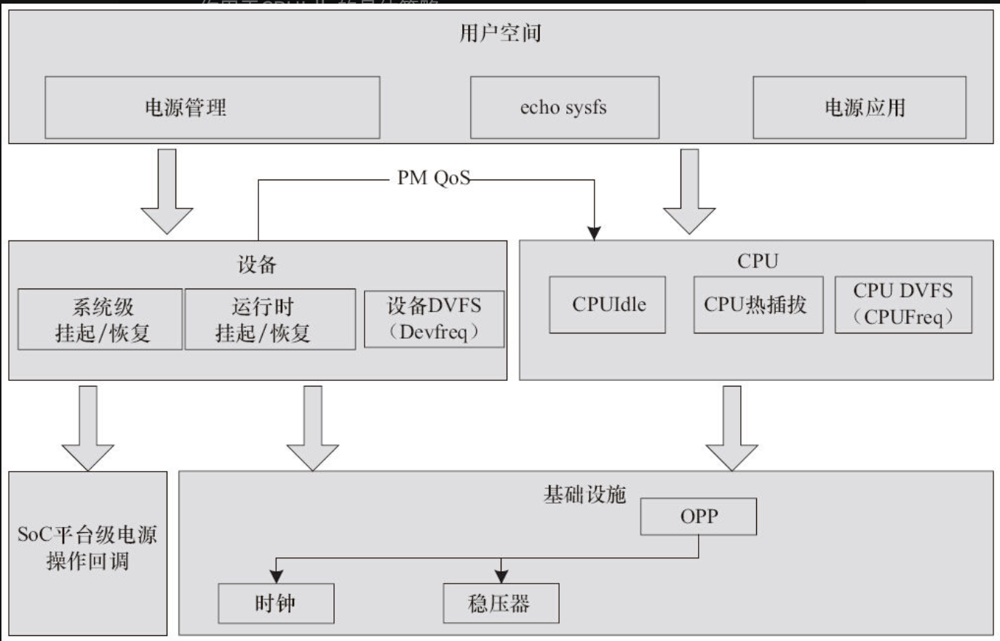

Linux电源管理非常复杂，牵扯到系统级的待机、频率电压变换、系统空闲时的处理以及每个设备驱动对系统待机的支持和每个设备的运行时（Runtime）电源管理，可以说它和系统中的每个设备驱动都息息相关。

对于消费电子产品来说，电源管理相当重要。因此，这部分工作往往在开发周期中占据相当大的比重，图19.1呈现了Linux内核电源管理的整体架构。大体可以归纳为如下几类：

1）CPU在运行时根据系统负载进行动态电压和频率变换的CPUFreq。

2）CPU在系统空闲时根据空闲的情况进行低功耗模式的CPUIdle。

3）多核系统下CPU的热插拔支持。

4）系统和设备针对延迟的特别需求而提出申请的PM QoS，它会作用于CPUIdle的具体策略。

5）设备驱动针对系统挂起到RAM/硬盘的一系列入口函数。

6）SoC进入挂起状态、SDRAM自刷新的入口。

7）设备的运行时动态电源管理，根据使用情况动态开关设备。

8）底层的时钟、稳压器、频率/电压表（OPP模块完成）支撑，各驱动子系统都可能用到。

图19.1　Linux内核电源管理的整体架构