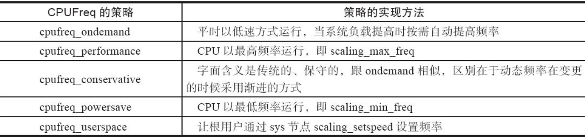

CPUFreq子系统位于drivers/cpufreq目录下，负责进行运行过程中CPU频率和电压的动态调整，即DVFS（Dynamic Voltage Frequency Scaling，动态电压频率调整）。运行时进行CPU电压和频率调整的原因是：CMOS电路中的功耗与电压的平方成正比、与频率成正比（P∝fV2 ），因此降低电压和频率可降低功耗。

CPUFreq的核心层位于drivers/cpufreq/cpufreq.c下，它为各个SoC的CPUFreq驱动的实现提供了一套统一的接口，并实现了一套notifier机制，可以在CPUFreq的策略和频率改变的时候向其他模块发出通知。另外，在CPU运行频率发生变化的时候，内核的loops_per_jiffy常数也会发生相应变化。

# 19.2.1　SoC的CPUFreq驱动实现

每个SoC的具体CPUFreq驱动实例只需要实现电压、频率表，以及从硬件层面完成这些变化。

CPUFreq核心层提供了如下API以供SoC注册自身的CPUFreq驱动：

```
intcpufreq_register_driver(struct cpufreq_driver *driver_data);
```

其参数为一个cpufreq_driver结构体指针，实际上，cpufreq_driver封装了一个具体的SoC的CPUFreq驱动的主体，该结构体形如代码清单19.1所示。

代码清单19.1　cpufreq_driver结构体

```
 1struct cpufreq_driver {
 2struct module         *owner;
 3char                 name[CPUFREQ_NAME_LEN];
 4 u8                   flags;
 5
 6       /* needed by all drivers */
 7int    (*init)         (struct cpufreq_policy *policy);
 8int    (*verify)       (struct cpufreq_policy *policy);
 9
10       /* define one out of two */
11int     (*setpolicy)    (struct cpufreq_policy *policy);
12int     (*target)       (struct cpufreq_policy *policy),
13unsigned inttarget_freq,
14unsigned int relation);
15
16      /* should be defined, if possible */
17unsigned int    (*get)  (unsigned intcpu);
18
19      /* optional */
20unsigned int (*getavg)  (struct cpufreq_policy *policy,
21unsigned intcpu);
22int     (*bios_limit)   (intcpu, unsigned int *limit);
23
24int     (*exit)         (struct cpufreq_policy *policy);
25int     (*suspend)      (struct cpufreq_policy *policy);
26int     (*resume)       (struct cpufreq_policy *policy);
27structfreq_attr        **attr;
28};
```

其中的owner成员一般被设置为THIS_MODULE；name成员是CPUFreq驱动的名字，如drivers/cpufreq/s5pv210-cpufreq.c设置name为s5pv210，drivers/cpufreq/omap-cpufreq.c设置name为omap；flags是一些暗示性的标志，譬如，若设置了CPUFREQ_CONST_LOOPS，则是告诉内核loops_per_jiffy不会因为CPU频率的变化而变化。

init（）成员是一个per-CPU初始化函数指针，每当一个新的CPU被注册进系统的时候，该函数就被调用，该函数接受一个cpufreq_policy的指针参数，在init（）成员函数中，可进行如下设置：

```
policy->cpuinfo.min_freq
policy->cpuinfo.max_freq
```

上述代码描述的是该CPU支持的最小频率和最大频率（单位是kHz）。

```
policy->cpuinfo.transition_latency
```

上述代码描述的是CPU进行频率切换所需要的延迟（单位是ns）

```
policy->cur
```

上述代码描述的是CPU的当前频率。

```
policy->policy
policy->governor
policy->min
policy->max
```

上述代码定义该CPU的缺省策略，以及在缺省策略情况下，该策略支持的最小、最大CPU频率。

verify（）成员函数用于对用户的CPUFreq策略设置进行有效性验证和数据修正。每当用户设定一个新策略时，该函数根据老的策略和新的策略，检验新策略设置的有效性并对无效设置进行必要的修正。在该成员函数的具体实现中，常用到如下辅助函数：

```
cpufreq_verify_within_limits(struct cpufreq_policy *policy, unsigned intmin_freq,
        unsigned intmax_freq);
```

setpolicy（）成员函数接受一个policy参数（包含policy->policy、policy->min和policy->max等成员），实现了这个成员函数的CPU一般具备在一个范围（limit，从policy->min到policy->max）里自动调整频率的能力。目前只有少数驱动（如intel_pstate.c和longrun.c）包含这样的成员函数，而绝大多数CPU都不会实现此函数，一般只实现target（）成员函数，target（）的参数直接就是一个指定的频率。

target（）成员函数用于将频率调整到一个指定的值，接受3个参数：policy、target_freq和relation。target_freq是目标频率，实际驱动总是要设定真实的CPU频率到最接近于target_freq，并且设定的频率必须位于policy->min到policy->max之间。在设定频率接近target_freq的情况下，relation若为CPUFREQ_REL_L，则暗示设置的频率应该大于或等于target_freq；relation若为CPUFREQ_REL_H，则暗示设置的频率应该小于或等于target_freq。

表19.1描述了setpolicy（）和target（）所针对的CPU以及调用方式上的区别。


根据芯片内部PLL和分频器的关系，ARM SoC一般不具备独立调整频率的能力，往往SoC的CPUFreq驱动会提供一个频率表，频率在该表的范围内进行变更，因此一般实现target（）成员函数。

CPUFreq核心层提供了一组与频率表相关的辅助API。

```
intcpufreq_frequency_table_cpuinfo(struct cpufreq_policy *policy,
struct cpufreq_frequency_table *table);
```

它是cpufreq_driver的init（）成员函数的助手，用于将policy->min和policy->max设置为与cpuinfo.min_freq和cpuinfo.max_freq相同的值。

```
intcpufreq_frequency_table_verify(struct cpufreq_policy *policy,
struct cpufreq_frequency_table *table);
```

它是cpufreq_driver的verify（）成员函数的助手，确保至少有1个有效的CPU频率位于policy->min到policy->max的范围内。

```
intcpufreq_frequency_table_target(struct cpufreq_policy *policy,
struct cpufreq_frequency_table *table,
unsigned inttarget_freq,
unsigned int relation,
unsigned int *index);
```

它是cpufreq_driver的target（）成员函数的助手，返回需要设定的频率在频率表中的索引。

省略掉具体的细节，1个SoC的CPUFreq驱动实例drivers/cpufreq/s3c64xx-cpufreq.c的核心结构如代码清单19.2所示。

代码清单19.2　S3C64xx的CPUFreq驱动

```
  1static unsigned long regulator_latency;
  2
  3struct s3c64xx_dvfs {
  4unsigned intvddarm_min;
  5unsigned intvddarm_max;
  6};
  7
  8static struct s3c64xx_dvfs s3c64xx_dvfs_table[] = {
  9[0] = { 1000000, 1150000 },
 10…
 11[4] = { 1300000, 1350000 },
 12};
 13
 14static struct cpufreq_frequency_table s3c64xx_freq_table[] = {
 15{ 0,  66000 },
 16{ 0, 100000 },
 17…
 18{ 0, CPUFREQ_TABLE_END },
 19};
 20
 21static int s3c64xx_cpufreq_verify_speed(struct cpufreq_policy *policy)
 22{
 23if (policy->cpu != 0)
 24    return -EINVAL;
 25
 26return cpufreq_frequency_table_verify(policy, s3c64xx_freq_table);
 27}
 28
 29static unsigned int s3c64xx_cpufreq_get_speed(unsigned intcpu)
 30{
 31if (cpu != 0)
 32    return 0;
 33
 34return clk_get_rate(armclk) / 1000;
 35}
 36
 37static int s3c64xx_cpufreq_set_target(struct cpufreq_policy *policy,
 38             unsigned inttarget_freq,
 39             unsigned int relation)
 40{
 41…
 42ret = cpufreq_frequency_table_target(policy, s3c64xx_freq_table,
 43                 target_freq, relation, &i);
 44…
 45freqs.cpu = 0;
 46freqs.old = clk_get_rate(armclk) / 1000;
 47freqs.new = s3c64xx_freq_table[i].frequency;
 48freqs.flags = 0;
 49dvfs = &s3c64xx_dvfs_table[s3c64xx_freq_table[i].index];
 50
 51if (freqs.old == freqs.new)
 52    return 0;
 53
 54cpufreq_notify_transition(&freqs, CPUFREQ_PRECHANGE);
 55
 56if (vddarm&&freqs.new>freqs.old) {
 57    ret = regulator_set_voltage(vddarm,
 58                 dvfs->vddarm_min,
 59                 dvfs->vddarm_max);
 60    …
 61}
 62
 63ret = clk_set_rate(armclk, freqs.new * 1000);
 64…
 65cpufreq_notify_transition(&freqs, CPUFREQ_POSTCHANGE);
 66
 67if (vddarm&&freqs.new<freqs.old) {
 68    ret = regulator_set_voltage(vddarm,
 69                 dvfs->vddarm_min,
 70                 dvfs->vddarm_max);
 71    …
 72}
 73
 74return 0;
 75}
 76
 77static int s3c64xx_cpufreq_driver_init(struct cpufreq_policy *policy)
 78{
 79…
 80armclk = clk_get(NULL, "armclk");
 81…
 82vddarm = regulator_get(NULL, "vddarm");
 83…
 84s3c64xx_cpufreq_config_regulator();
 85
 86freq = s3c64xx_freq_table;
 87while (freq->frequency != CPUFREQ_TABLE_END) {
 88    unsigned long r;
 89    …
 90}
 91
 92policy->cur = clk_get_rate(armclk) / 1000;
 93policy->cpuinfo.transition_latency = (500 * 1000) + regulator_latency;
 94ret = cpufreq_frequency_table_cpuinfo(policy, s3c64xx_freq_table);
 95…
 96return ret;
 97}
 98
 99staticstruct cpufreq_driver s3c64xx_cpufreq_driver = {
100.owner       = THIS_MODULE,
101.flags         = 0,
102.verify      = s3c64xx_cpufreq_verify_speed,
103.target      = s3c64xx_cpufreq_set_target,
104.get     = s3c64xx_cpufreq_get_speed,
105.init        = s3c64xx_cpufreq_driver_init,
106.name        = "s3c",
107};
108
109static int __init s3c64xx_cpufreq_init(void)
110{
111return cpufreq_register_driver(&s3c64xx_cpufreq_driver);
112}
113module_init(s3c64xx_cpufreq_init);
```

第37行s3c64xx_cpufreq_set_target（）就是完成目标频率设置的函数，它调用了cpufreq_frequency_table_target（）从s3c64xx支持的频率表s3c64xx_freq_table里找到合适的频率。在具体的频率和电压设置环节，用的都是Linux的标准API regulator_set_voltage（）和clk_set_rate（）之类的函数。

第111行在模块初始化的时候通过cpufreq_register_driver（）注册了cpufreq_driver的实例，第94行，在CPUFreq的初始化阶段调用cpufreq_frequency_table_cpuinfo（）注册了频率表。关于频率表，比较新的内核喜欢使用后面章节将介绍的OPP。

# 19.2.2　CPUFreq的策略

SoCCPUFreq驱动只是设定了CPU的频率参数，以及提供了设置频率的途径，但是它并不会管CPU自身究竟应该运行在哪种频率上。究竟频率依据的是哪种标准，进行何种变化，而这些完全由CPUFreq的策略（policy）决定，这些策略如表19.2所示。

表19.2　CPUFrep的策略及其实现方法



在Android系统中，则增加了1个交互策略，该策略适合于对延迟敏感的UI交互任务，当有UI交互任务的时候，该策略会更加激进并及时地调整CPU频率。

总而言之，系统的状态以及CPUFreq的策略共同决定了CPU频率跳变的目标，CPUFreq核心层并将目标频率传递给底层具体SoC的CPUFreq驱动，该驱动修改硬件，完成频率的变换，如图19.2所示。


图19.2　CPUFreq、系统负载、策略与调频

用户空间一般可通过/sys/devices/system/cpu/cpux/cpufreq节点来设置CPUFreq。譬如，我们要设置CPUFreq到700MHz，采用userspace策略，则运行如下命令：

```
# echo userspace > /sys/devices/system/cpu/cpu0/cpufreq/scaling_governor
# echo 700000 > /sys/devices/system/cpu/cpu0/cpufreq/scaling_setspeed
```

# 19.2.3　CPUFreq的性能测试和调优

Linux 3.1以后的内核已经将cpupower-utils工具集放入内核的tools/power/cpupower目录中，该工具集当中的cpufreq-bench工具可以帮助工程师分析采用CPUFreq后对系统性能的影响。

cpufreq-bench工具的工作原理是模拟系统运行时候的“空闲→忙→空闲→忙”场景，从而触发系统的动态频率变化，然后在使用ondemand、conservative、interactive等策略的情况下，计算在做与performance高频模式下同样的运算完成任务的时间比例。

交叉编译该工具后，可放入目标电路板文件系统的/usr/sbin/等目录下，运行该工具：

```
# cpufreq-bench -l 50000 -s 100000 -x 50000 -y 100000 -g ondemand -r 5 -n 5 -v
```

会输出一系列的结果，我们提取其中的Round n这样的行，它表明了-g ondemand选项中设定的ondemand策略相对于performance策略的性能比例，假设值为：

```
Round 1 - 39.74%
Round 2 - 36.35%
Round 3 - 47.91%
Round 4 - 54.22%
Round 5 - 58.64%
```

这显然不太理想，我们在同样的平台下采用Android的交互策略，得到新的测试结果：

```
Round 1 - 72.95%
Round 2 - 87.20%
Round 3 - 91.21%
Round 4 - 94.10%
Round 5 - 94.93%
```

一般的目标是在采用CPUFreq动态调整频率和电压后，性能应该为performance这个高性能策略下的90%左右，这样才比较理想。

# 19.2.4　CPUFreq通知

CPUFreq子系统会发出通知的情况有两种：CPUFreq的策略变化或者CPU运行频率变化。

在策略变化的过程中，会发送3次通知：

- ·CPUFREQ_ADJUST：所有注册的notifier可以根据硬件或者温度的情况去修改范围（即policy->min和policy->max）；

- ·CPUFREQ_INCOMPATIBLE：除非前面的策略设定可能会导致硬件出错，否则被注册的notifier不能改变范围等设定；

- ·CPUFREQ_NOTIFY：所有注册的notifier都会被告知新的策略已经被设置。

  

在频率变化的过程中，会发送2次通知：

- ·CPUFREQ_PRECHANGE：准备进行频率变更；
- ·CPUFREQ_POSTCHANGE：已经完成频率变更。

notifier中的第3个参数是一个cpufreq_freqs的结构体，包含cpu（CPU号）、old（过去的频率）和new（现在的频率）这3个成员。发送CPUFREQ_PRECHANGE和CPUFREQ_POSTCHANGE的代码如下：

```
srcu_notifier_call_chain(&cpufreq_transition_notifier_list,
CPUFREQ_PRECHANGE, freqs);
srcu_notifier_call_chain(&cpufreq_transition_notifier_list,
CPUFREQ_POSTCHANGE, freqs);
```

如果某模块关心CPUFREQ_PRECHANGE或CPUFREQ_POSTCHANGE事件，可简单地使用Linux notifier机制监控。譬如，drivers/video/sa1100fb.c在CPU频率变化过程中需对自身硬件进行相关设置，因此它注册了notifier并在CPUFREQ_PRECHANGE和CPUFREQ_POSTCHANGE情况下分别进行不同的处理，如代码清单19.3所示。

代码清单19.3　CPUFreq notifier案例

```
 1fbi->freq_transition.notifier_call = sa1100fb_freq_transition;
 2cpufreq_register_notifier(&fbi->freq_transition, CPUFREQ_TRANSITION_NOTIFIER);
 3...
 4sa1100fb_freq_transition(structnotifier_block *nb, unsigned long val,
 5void *data)
 6{
 7 struct sa1100fb_info *fbi = TO_INF(nb, freq_transition);
 8 struct cpufreq_freqs *f = data;
 9     u_intpcd;
10
11     switch (val) {
12         case CPUFREQ_PRECHANGE:
13             set_ctrlr_state(fbi, C_DISABLE_CLKCHANGE);
14             break;
15         case CPUFREQ_POSTCHANGE:
16             pcd = get_pcd(fbi->fb.var.pixclock, f->new);
17             fbi->reg_lccr3 = (fbi->reg_lccr3& ~0xff) | LCCR3_PixClkDiv(pcd);
18             set_ctrlr_state(fbi, C_ENABLE_CLKCHANGE);
19             break;
20     }
21     return 0;
22}
```

此外，如果在系统挂起/恢复的过程中CPU频率会发生变化，则CPUFreq子系统也会发出CPUFREQ_SUSPENDCHANGE和CPUFREQ_RESUMECHANGE这两个通知。

值得一提的是，除了CPU以外，一些非CPU设备也支持多个操作频率和电压，存在多个OPP。Linux 3.2之后的内核也支持针对这种非CPU设备的DVFS，该套子系统为Devfreq。与CPUFreq存在一个drivers/cpufreq目录相似，在内核中也存在一个drivers/devfreq的目录。