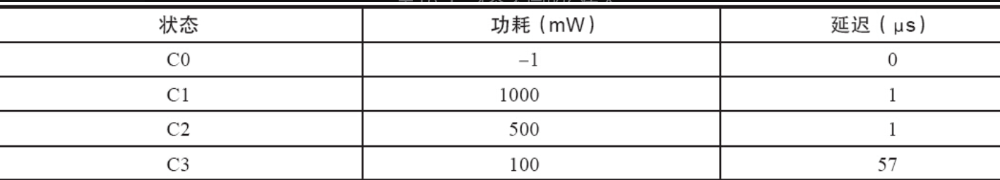
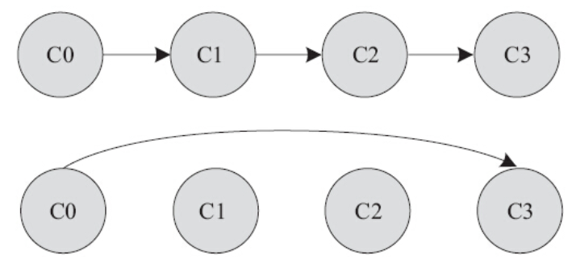
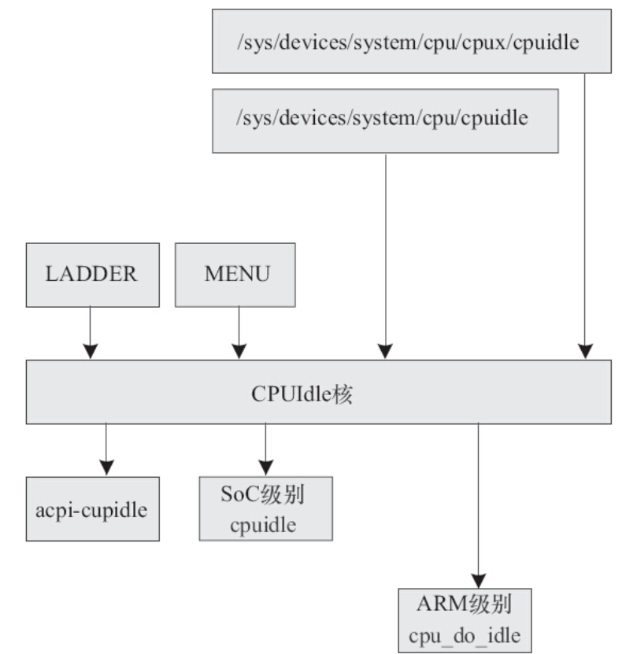

目前的ARM SoC大多支持几个不同的Idle级别，CPUIdle驱动子系统存在的目的就是对这些Idle状态进行管理，并根据系统的运行情况进入不同的Idle级别。具体SoC的底层CPUIdle驱动实现则提供一个类似于CPUFreq驱动频率表的Idle级别表，并实现各种不同Idle状态的进入和退出流程。

对于Intel系列笔记本计算机而言，支持ACPI（Advanced Configuration and Power Interface，高级配置和电源接口），一般有4个不同的C状态（其中C0为操作状态，C1是Halt状态，C2是Stop-Clock状态，C3是Sleep状态），如表19.3所示。

表19.3　4个不同的C状态



而对于ARM而言，各个SoC对于Idle的实现方法差异比较大，最简单的Idle级别莫过于将CPU核置于WFI（等待中断发生）状态，因此在默认情况下，若SoC未实现自身的芯片级CPUIdle驱动，则会进入cpu_do_idle（），对于ARM V7而言，其实现位于arch/arm/mm/proc-v7.S中：

```
ENTRY(cpu_v7_do_idle)
dsb                                     @ WFI may enter a low-power mode
wfi
mov    pc, lr
ENDPROC(cpu_v7_do_idle)
```

与CPUFreq类似，CPUIdle的核心层提供了如下API以用于注册一个cpuidle_driver的实例：

```
intcpuidle_register_driver(struct cpuidle_driver *drv);
```

并提供了如下API来注册一个cpuidle_device：

```
int cpuidle_register_device(struct cpuidle_device *dev);
```

CPUIdle驱动必须针对每个CPU注册相应的cpuidle_device，这意味着对于多核CPU而言，需要针对每个CPU注册一次。

cpuidle_register_driver（）接受1个cpuidle_driver结构体的指针参数，该结构体是CPUIdle驱动的主体，其定义如代码清单19.4所示。

代码清单19.4　cpuidle_driver结构体

```
 1struct cpuidle_driver {
 2 const char            *name;
 3 struct module         *owner;
 4
 5 unsigned int          power_specified:1;
 6      /* set to 1 to use the core cpuidle time keeping (for all states). */
 7 unsigned int          en_core_tk_irqen:1;
 8 struct cpuidle_state   states[CPUIDLE_STATE_MAX];
 9 int state_count;
10 int safe_state_index;
11};
```

该结构体的关键成员是1个cpuidle_state的表，其实该表就是用于存储各种不同Idle级别的信息，它的定义如代码清单19.5所示。

代码清单19.5　cpuidle_state结构体

```
 1struct cpuidle_state {
 2 char name[CPUIDLE_NAME_LEN];
 3 chardesc[CPUIDLE_DESC_LEN];
 4
 5 unsigned int    flags;
 6 unsigned intexit_latency; /* in US */
 7 int power_usage; /* in mW */
 8 unsigned inttarget_residency; /* in US */
 9 bool          disabled; /* disabled on all CPUs */
10
11 int (*enter)    (struct cpuidle_device *dev,
12     struct cpuidle_driver *drv,
13     int index);
14
15 int (*enter_dead) (struct cpuidle_device *dev, int index);
16};
```

name和desc是该Idle状态的名称和描述，exit_latency是退出该Idle状态需要的延迟，enter（）是进入该Idle状态的实现方法。

忽略细节，一个具体的SoC的CPUIdle驱动实例可见于arch/arm/mach-ux500/cpuidle.c（最新的内核已经将代码转移到了drivers/cpuidle/cpuidle-ux500.c中），它有两个Idle级别，即WFI和ApIdle，其具体实现框架如代码清单19.6所示。

代码清单19.6　ux500CPUIdle驱动案例

```
 1staticatomic_t master = ATOMIC_INIT(0);
 2static DEFINE_SPINLOCK(master_lock);
 3static DEFINE_PER_CPU(struct cpuidle_device, ux500_cpuidle_device);
 4
 5static inline int ux500_enter_idle(struct cpuidle_device *dev,
 6              struct cpuidle_driver *drv, int index)
 7{
 8 …
 9}
10
11staticstruct cpuidle_driver ux500_idle_driver = {
12 .name = "ux500_idle",
13 .owner = THIS_MODULE,
14 .en_core_tk_irqen = 1,
15 .states = {
16     ARM_CPUIDLE_WFI_STATE,
17     {
18         .enter         = ux500_enter_idle,
19         .exit_latency  = 70,
20         .target_residency = 260,
21         .flags          = CPUIDLE_FLAG_TIME_VALID,
22         .name          = "ApIdle",
23         .desc          = "ARM Retention",
24     },
25 },
26 .safe_state_index = 0,
27 .state_count = 2,
28};
29
30/*
31 * For each cpu, setup the broadcast timer because we will
32 * need to migrate the timers for the states >= ApIdle.
33 */
34static void ux500_setup_broadcast_timer(void *arg)
35{
36 intcpu = smp_processor_id();
37 clockevents_notify(CLOCK_EVT_NOTIFY_BROADCAST_ON, &cpu);
38}
39
40int __init ux500_idle_init(void)
41{
42 …
43 ret = cpuidle_register_driver(&ux500_idle_driver);
44 …
45 for_each_online_cpu(cpu) {
46     device = &per_cpu(ux500_cpuidle_device, cpu);
47     device->cpu = cpu;
48     ret = cpuidle_register_device(device);
49     …
50 }
51 …
52}
53device_initcall(ux500_idle_init);
```

与CPUFreq类似，在CPUIdle子系统中也有对应的governor来抉择何时进入何种Idle级别的策略，这些governor包括CPU_IDLE_GOV_LADDER、CPU_IDLE_GOV_MENU。LADDER在进入和退出Idle级别的时候是步进的，它以过去的Idle时间作为参考，而MENU总是根据预期的空闲时间直接进入目标Idle级别。前者适用于没有采用动态时间节拍的系统（即没有选择NO_HZ的系统），不依赖于NO_HZ配置选项，而后者依赖于内核的NO_HZ选项。

图19.3演示了LADDER步进从C0进入C3，而MENU则可能直接从C0跳入C3。



图19.3　LADDER与MENU的区别

CPUIdle子系统还通过sys向userspace导出了一些节点：

- ·一类是针对整个系统的/sys/devices/system/cpu/cpuidle，通过其中的current_driver、current_governor、available_governors等节点可以获取或设置CPUIdle的驱动信息以及governor。
- ·一类是针对每个CPU的/sys/devices/system/cpu/cpux/cpuidle，通过子节点暴露各个在线的CPU中每个不同Idle级别的name、desc、power、latency等信息。

综合以上的各个要素，可以给出Linux CPUIdle子系统的总体架构，如图19.4所示。

