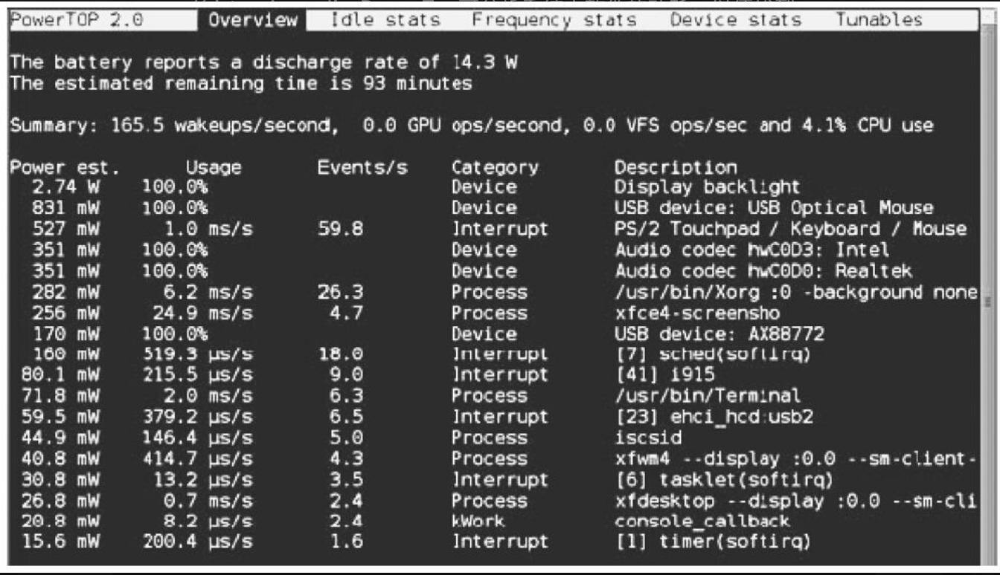

PowerTop是一款开源的用于进行电量消耗分析和电源管理诊断的工具，其主页位于Intel开源技术中心的https://01.org/powertop/ ，维护者是Arjan van de Ven和Kristen Accardi。PowerTop可分析系统中软件的功耗，以便找到功耗大户，也可显示系统中不同的C状态（与CPUIdle驱动对应）和P状态（与CPUFreq驱动对应）的时间比例，并采用了基于TAB的界面风格，如图19.5所示。

图19.5　PowerTOP