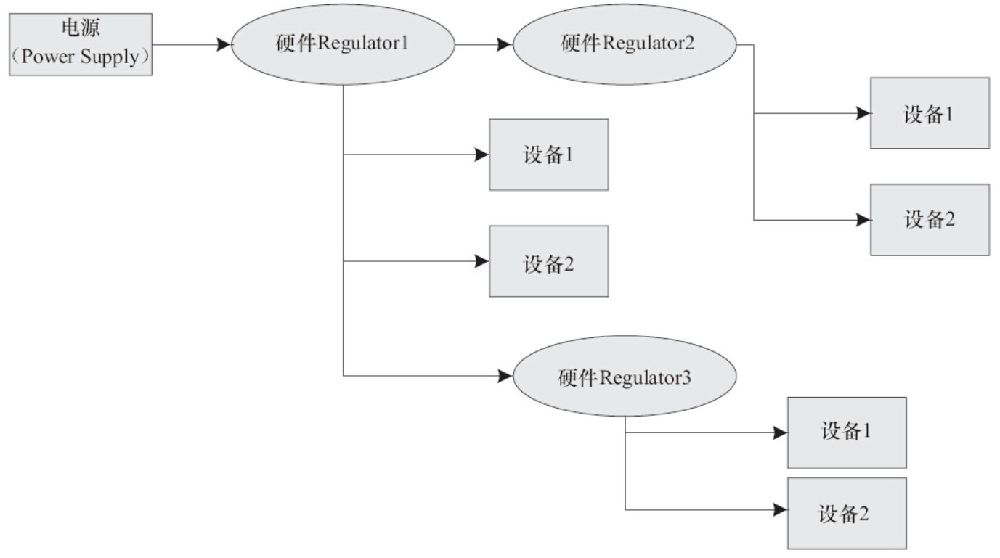

Regulator是Linux系统中电源管理的基础设施之一，用于稳压电源的管理，是各种驱动子系统中设置电压的标准接口。前面介绍的CPUFreq驱动就经常使用它来设定电压，比如代码清单19.2的第57~59行。

而Regulator则可以管理系统中的供电单元，即稳压器（Low Dropout Regulator，LDO，即低压差线性稳压器），并提供获取和设置这些供电单元电压的接口。一般在ARM电路板上，各个稳压器和设备会形成一个Regulator树形结构，如图19.6所示。

Linux的Regulator子系统提供如下API以用于注册/注销一个稳压器：

```
structregulator_dev     *        regulator_register(conststructregulator_desc
*regulator_desc, conststructregulator_config *config);
voidregulator_unregister(structregulator_dev *rdev);
```

regulator_register（）函数的两个参数分别是regulator_desc结构体和regulator_config结构体的指针。



图19.6　Regulator树形结构

regulator_desc结构体是对这个稳压器属性和操作的封装，如代码清单19.7所示。

代码清单19.7　regulator_desc结构体

```
 1struct regulator_desc {
 2       const char *name;                /* Regulator的名字*/
 3       const char *supply_name;         /* Regulator Supply的名字*/
 4       int id;
 5       unsigned n_voltages;
 6       struct regulator_ops *ops;
 7       int irq;
 8       enum regulator_type type;        /* 是电压还是电流Regulator */
 9       struct module *owner;
10
11       unsigned int min_uV;             /* 在线性映射情况下最低的Selector的电压*/
12       unsigned int uV_step;            /* 在线性映射情况下每步增加/减小的电压*/
13       unsigned int ramp_delay;         /* 电压改变后稳定下来所需时间*/
14
15       const unsigned int *volt_table;    /* 基于表映射情况下的电压映射表 */
16
17       unsigned int vsel_reg;
18       unsigned int vsel_mask;
19       unsigned int enable_reg;
20       unsigned int enable_mask;
21       unsigned int bypass_reg;
22       unsigned int bypass_mask;
23
24       unsigned int enable_time;
25};
```

上述结构体中的regulator_ops指针ops是对这个稳压器硬件操作的封装，其中包含获取、设置电压等的成员函数，如代码清单19.8所示。

代码清单19.8　regulator_ops结构体

```
 1struct regulator_ops {
 2      /* enumerate supported voltages */
 3      int (*list_voltage) (struct regulator_dev *, unsigned selector);
 4
 5      /* get/set regulator voltage */
 6      int (*set_voltage) (struct regulator_dev *, int min_uV, int max_uV,
 7                       unsigned *selector);
 8      int (*map_voltage)(struct regulator_dev *, int min_uV, int max_uV);
 9      int (*set_voltage_sel) (struct regulator_dev *, unsigned selector);
10      int (*get_voltage) (struct regulator_dev *);
11      int (*get_voltage_sel) (struct regulator_dev *);
12
13      /* get/set regulator current  */
14      int (*set_current_limit) (struct regulator_dev *,
15                           int min_uA, int max_uA);
16      int (*get_current_limit) (struct regulator_dev *);
17
18      /* enable/disable regulator */
19      int (*enable) (struct regulator_dev *);
20      int (*disable) (struct regulator_dev *);
21      int (*is_enabled) (struct regulator_dev *);
22
23      …
24};
```

在drivers/regulator目录下，包含大量的与电源芯片对应的Regulator驱动，如Dialog的DA9052、Intersil的ISL6271A、ST-Ericsson的TPS61050/61052、Wolfon的WM831x系列等，它同时提供了一个虚拟的Regulator驱动作为参考，如代码清单19.9所示。

代码清单19.9　虚拟的Regulator驱动

```
 1struct regulator_dev *dummy_regulator_rdev;
 2static struct regulator_init_data dummy_initdata;
 3static struct regulator_ops dummy_ops;
 4static struct regulator_desc dummy_desc = {
 5       .name = "regulator-dummy",
 6       .id = -1,
 7       .type = REGULATOR_VOLTAGE,
 8       .owner = THIS_MODULE,
 9       .ops = &dummy_ops,
10};
11
12static int __devinit dummy_regulator_probe(struct platform_device *pdev)
13{
14       struct regulator_config config = { };
15       int ret;
16
17       config.dev = &pdev->dev;
18       config.init_data = &dummy_initdata;
19
20       dummy_regulator_rdev = regulator_register(&dummy_desc, &config);
21       if (IS_ERR(dummy_regulator_rdev)) {
22              ret = PTR_ERR(dummy_regulator_rdev);
23              pr_err("Failed to register regulator: %d\n", ret);
24              return ret;
25       }
26
27       return 0;
28}
```

Linux的Regulator子系统提供消费者（Consumer）API以便让其他的驱动获取、设置、关闭和使能稳压器：

```
structregulator * regulator_get(structdevice *dev, const char *id);
structregulator * devm_regulator_get(structdevice *dev, const char *id);
structregulator * regulator_get_exclusive(structdevice *dev, const char *id);
voidregulator_put(structregulator *regulator);
voiddevm_regulator_put(structregulator *regulator);
intregulator_enable(structregulator *regulator);
intregulator_disable(structregulator *regulator);
intregulator_set_voltage(structregulator *regulator, intmin_uV, intmax_uV);
intregulator_get_voltage(structregulator *regulator);
```

这些消费者API的地位大致与GPIO子系统的gpio_request（）、时钟子系统的clk_get（）、dmaengine子系统的dmaengine_submit（）等相当，属于基础设施。