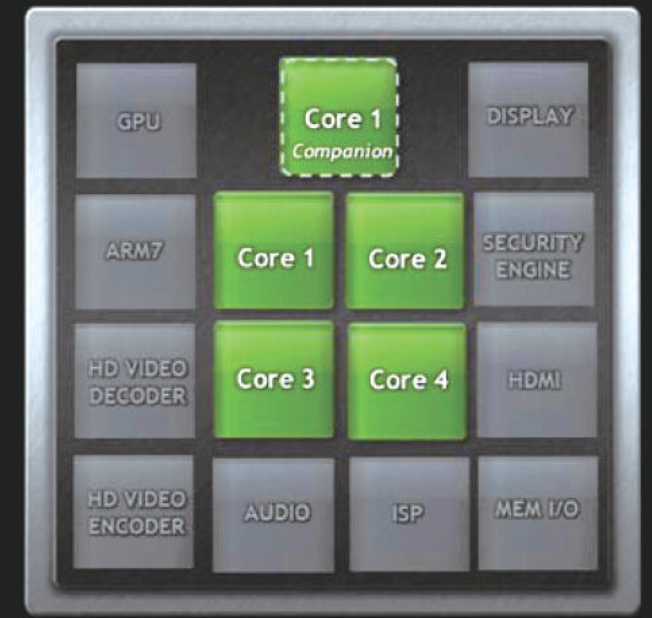
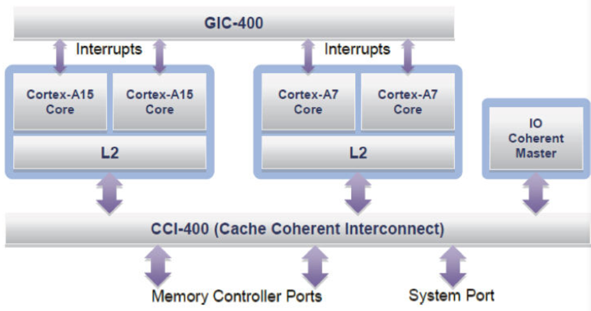

Linux CPU热插拔的功能已经存在相当长的时间了，Linux 3.8之后的内核里一个小小的改进就是CPU0也可以热插拔。

一般来讲，在用户空间可以通过/sys/devices/system/cpu/cpun/online节点来操作一个CPU的在线和离线：

```
# echo 0>/sys/devices/system/cpu/cpu3/online
CPU 3 is now offline
# echo1 >/sys/devices/system/cpu/cpu3/online
```

通过echo0>/sys/devices/system/cpu/cpu3/online关闭CPU3的时候，CPU3上的进程都会被迁移到其他的CPU上，以保证这个拔除CPU3的过程中，系统仍然能正常运行。一旦通过echo 1>/sys/devices/system/cpu/cpu3/online再次开启CPU3，CPU3又可以参与系统的负载均衡，分担系统中的任务。

在嵌入式系统中，CPU热插拔可以作为一种省电的方式，在系统负载小的时候，动态关闭CPU，在系统负载增大的时候，再开启之前离线的CPU。目前各个芯片公司可能会根据自身SoC的特点，对内核进行调整，来实现运行时“热插拔”。这里以Nvidia的Tegra3为例进行说明。

Tegra3采用vSMP（variableSymmetric Multiprocessing）架构，共有5个Cortex-A9处理器，其中4个为高性能设计的G核，1个为低功耗设计的LP核，如图19.7所示。



图19.7　Tegra3的架构

在系统运行过程中，Tegra3的Linux内核会根据CPU负载切换低功耗处理器和高功耗处理器。除此之外，4个高性能ARM核心也会根据运行情况，动态借用Linux内核支持的CPU热插拔进行CPU的插入/拔出操作。

用华硕EeePad运行高负载、低负载应用，通过dmesg查看内核消息也确实验证了多核的热插拔以及G核和LP核之间的动态切换：

```
<4>[104626.426957] CPU1: Booted secondary processor
<7>[104627.427412] tegra CPU: force EDP limit 720000 kHz
<4>[104627.427670] CPU2: Booted secondary processor
<4>[104628.537005] stop_machine_cpu_stop cpu=0
<4>[104628.537017] stop_machine_cpu_stop cpu=2
<4>[104628.537059] stop_machine_cpu_stop cpu=1
<4>[104628.537702] __stop_cpus: wait_for_completion_timeout+
<4>[104628.537810] __stop_cpus: smp=0 done.executed=1 done.ret =0-
<5>[104628.537960] CPU1: clean shutdown
<4>[104630.537092] stop_machine_cpu_stop cpu=0
<4>[104630.537172] stop_machine_cpu_stop cpu=2
<4>[104630.537739] __stop_cpus: wait_for_completion_timeout+
<4>[104630.538060] __stop_cpus: smp=0 done.executed=1 done.ret =0-
<5>[104630.538203] CPU2: clean shutdown
<4>[104631.306984] tegra_watchdog_touch
```

高性能处理器和低功耗处理器切换：

```
<3>[104666.799152] LP=>G: prolog 22 us, switch 2129 us, epilog 24 us, total 2175 us
<3>[104667.807273] G=>LP: prolog 18 us, switch 157 us, epilog 25 us, total 200 us
<4>[104671.407008] tegra_watchdog_touch
<4>[104671.408816] nct1008_get_temp: ret temp=35C
<3>[104671.939060] LP=>G: prolog 17 us, switch 2127 us, epilog 22 us, total 2166 us
<3>[104672.938091] G=>LP: prolog 18 us, switch 156 us, epilog 24 us, total 198 us
```

在运行过程中，我们发现4个G核会动态热插拔，而4个G核和1个LP核之间，会根据运行负载进行集群切换。这一部分都是在内核里面实现的，和tegra的CPUF req驱动（DVFS驱动）紧密关联。相关代码可见于http://nv-tegra.nvidia.com/gitweb/?p=linux-2.6.git;a=tree;f=arch/arm/mach-tegra;h=e5d1ff2;hb=rel-14r7

# 1.如何判断自己是什么核

每个核都可以通过调用is_lp_cluster（）来判断当前正在执行的CPU是LP还是G处理器：

```
static inline unsigned int is_lp_cluster(void)
{
        unsigned int reg;
        reg =readl(FLOW_CTRL_CLUSTER_CONTROL);
        return (reg& 1); /* 0 == G, 1 == LP */
}
```

即读FLOW_CTRL_CLUSTER_CONTROL寄存器判断自己是G核还是LP核。

# 2.G核和LP核集群的切换时机

［场景1］何时从LP核切换给G核：当前执行于LP集群，CPUFreq驱动判断出LP核需要增频率到超过高值门限，即TEGRA_HP_UP：

```
caseTEGRA_HP_UP:
        if(is_lp_cluster() && !no_lp) {
               if(!clk_set_parent(cpu_clk, cpu_g_clk)) {
                       hp_stats_update(CONFIG_NR_CPUS, false);
                       hp_stats_update(0, true);
                        /* catch-upwith governor target speed */
                       tegra_cpu_set_speed_cap(NULL);
               }
```

［场景2］何时从G核切换给LP核：当前执行于G集群，CPUFreq驱动判断出某G核需要降频率到低于低值门限，即TEGRA_HP_DOWN，且最慢的CPUID不小于nr_cpu_ids（实际上代码逻辑跟踪等价于只有CPU0还活着的情况）：

```
caseTEGRA_HP_DOWN:
        cpu= tegra_get_slowest_cpu_n();
        if(cpu < nr_cpu_ids) {
               ...
        }else if(!is_lp_cluster() && !no_lp) {
               if(!clk_set_parent(cpu_clk, cpu_lp_clk)) {
                       hp_stats_update(CONFIG_NR_CPUS, true);
                       hp_stats_update(0, false);
                        /* catch-upwith governor target speed */
                       tegra_cpu_set_speed_cap(NULL);
               } else
                       queue_delayed_work(
                               hotplug_wq, &hotplug_work, down_delay);
       }
       break;
```

切换实际上就发生在clk_set_parent（）更改CPU的父时钟里面，这部分代码写得比较不好，1个函数完成n个功能，实际上不仅切换了时钟，还切换了G和LP集群：

```
clk_set_parent(cpu_clk, cpu_lp_clk) ->
         tegra3_cpu_cmplx_clk_set_parent(structclk *c, struct clk *p) ->
                   tegra_cluster_control(unsigned int us, unsigned int flags) ->
                            tegra_cluster_switch_prolog()->
tegra_cluster_switch_epilog()
```

# 3.G核动态热插拔

何时进行G核的动态插拔，具体如下。

［场景3］当前执行于G集群，CPUFreq驱动判断出某G核需要降频率到低于低值门限，即TEGRA_HP_DOWN，且最慢的CPUID小于nr_cpu_ids（实际上等价于还有两个或两个以上的G核活着的情况），关闭最慢的CPU，留意tegra_get_slowest_cpu_n（）不会返回0，这意味着CPU0要么活着，要么切换给了LP核，对应于［场景2］：

```
caseTEGRA_HP_DOWN:
        cpu= tegra_get_slowest_cpu_n();
        if(cpu < nr_cpu_ids) {
               up = false;
               queue_delayed_work(
                        hotplug_wq,&hotplug_work, down_delay);
               hp_stats_update(cpu, false);
        }
```

［场景4］当前执行于G集群，CPUFreq驱动判断出某G核需要设置频率大于高值门限，即TEGRA_HP_UP，如果负载平衡状态为TEGRA_CPU_SPEED_BALANCED，再开一个核；如果状态为TEGRA_CPU_SPEED_SKEWED，则关一个核。TEGRA_CPU_SPEED_BALANCED的含义是当前所有G核要求的频率都高于最高频率的50%，TEGRA_CPU_SPEED_SKEWED的含义是当前至少有两个G核要求的频率低于门限的25%，即CPU频率的要求在各个核之间有倾斜。

```
caseTEGRA_HP_UP:
        if(is_lp_cluster() && !no_lp) {
                ...
        }else {
               switch (tegra_cpu_speed_balance()) {
               /* cpu speed is up and balanced - one more on-line */
               case TEGRA_CPU_SPEED_BALANCED:
                       cpu =cpumask_next_zero(0, cpu_online_mask);
                        if(cpu <nr_cpu_ids) {
                                up =true;
                               hp_stats_update(cpu, true);
                       }
                        break;
               /* cpu speed is up, but skewed - remove one core */
               case TEGRA_CPU_SPEED_SKEWED:
                        cpu =tegra_get_slowest_cpu_n();
                        if(cpu < nr_cpu_ids) {
                                up =false;
                               hp_stats_update(cpu, false);
                        }
                        break;
               /* cpu speed is up, butunder-utilized - do nothing */
               case TEGRA_CPU_SPEED_BIASED:
               default:
                        break;
               }
        }
```

上述代码中TEGRA_CPU_SPEED_BIASED路径的含义是有1个以上G核的频率低于最高频率的50%但是还未形成“SKEWED”条件，即只是“BIASED”，还没有达到“SKEWED”的程度，因此暂时什么都不做。

目前，ARM和Linux社区都在从事关于big.LITTLE架构下，CPU热插拔以及调度器方面有针对性的改进工作。在big.LITTLE架构中，将高性能且功耗也较高的Cortex-A15和稍低性能且功耗低的Cortex-A7进行了结合，或者在64位下，进行Cortex-A57和Cortex-A53的组合，如图19.8所示。

big.LITTLE架构的设计旨在为适当的作业分配恰当的处理器。Cortex-A15处理器是目前已开发的性能最高的低功耗ARM处理器，而Cortex-A7处理器是目前已开发的最节能的ARM应用程序处理器。可以利用Cortex-A15处理器的性能来承担繁重的工作负载，而用Cortex-A7可以最有效地处理智能手机的大部分工作负载。这些操作包括操作系统活动、用户界面和其他持续运行、始终连接的任务。



图19.8　ARM的big.LITTLE架构

三星在2013年CES（国际消费电子展）大会上发布了Exynos 5Octa 8核移动处理器，这款处理器也是采用big.LITTLE架构的第一款CPU。