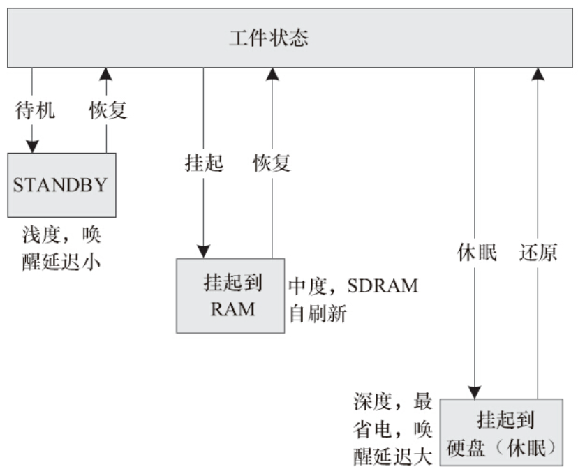
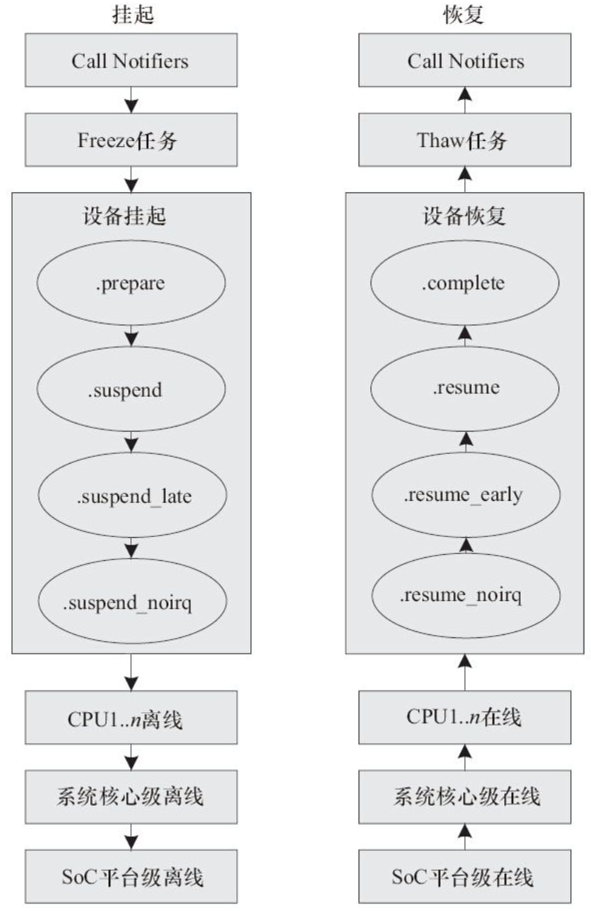

Linux支持STANDBY、挂起到RAM、挂起到硬盘等形式的待机，如图19.9所示。一般的嵌入式产品仅仅只实现了挂起到RAM（也简称为s2ram，或常简称为STR），即将系统的状态保存于内存中，并将SDRAM置于自刷新状态，待用户按键等操作后再重新恢复系统。少数嵌入式Linux系统会实现挂起到硬盘（简称STD），它与挂起到RAM的不同是s2ram并不关机，STD则把系统的状态保持于磁盘，然后关闭整个系统。



图19.9　Linux的待机模式

在Linux下，这些行为通常是由用户空间触发的，通过向/sys/power/state写入mem可开始挂起到RAM的流程。当然，许多Linux产品会有一个按键，一按就进入挂起到RAM。这通常是由于与这个按键对应的输入设备驱动汇报了一个和电源相关的input_event，用户空间的电源管理daemon进程收到这个事件后，再触发s2ram的。当然，内核也有一个INPUT_APMPOWER驱动，位于drivers/input/apm-power.c下，它可以在内核级别侦听EV_PWR类事件，并通过apm_queue_event（APM_USER_SUSPEND）自动引发s2ram：

```
static void system_power_event(unsigned int keycode)
{
switch (keycode) {
case KEY_SUSPEND:
             apm_queue_event(APM_USER_SUSPEND);
             pr_info("Requesting system suspend...\n");
break;
default:
break;
       }
}
static void apmpower_event(struct input_handle *handle, unsigned int type,
unsigned int code, int value)
{…
switch (type) {
case EV_PWR:
              system_power_event(code);
break;…
     }
}
```

在Linux内核中，大致的挂起到RAM的挂起和恢复流程如图19.10所示（牵涉的操作包括同步文件系统、freeze进程、设备驱动挂起以及系统的挂起入口等）。

在Linux内核的device_driver结构中，含有一个pm成员，它是一个dev_pm_ops结构体指针，在该结构体中，封装了挂起到RAM和挂起到硬盘所需要的回调函数，如代码清单19.13所示。

代码清单19.13　dev_pm_ops结构体

```
 1 struct dev_pm_ops {
 2        int (*prepare)(struct device *dev);
 3        void (*complete)(struct device *dev);
 4        int (*suspend)(struct device *dev);
 5        int (*resume)(struct device *dev);
 6        int (*freeze)(struct device *dev);
 7        int (*thaw)(struct device *dev);
 8        int (*poweroff)(struct device *dev);
 9        int (*restore)(struct device *dev);
10        int (*suspend_late)(struct device *dev);
11        int (*resume_early)(struct device *dev);
12        int (*freeze_late)(struct device *dev);
13        int (*thaw_early)(struct device *dev);
14        int (*poweroff_late)(struct device *dev);
15        int (*restore_early)(struct device *dev);
16        int (*suspend_noirq)(struct device *dev);
17        int (*resume_noirq)(struct device *dev);
18        int (*freeze_noirq)(struct device *dev);
19        int (*thaw_noirq)(struct device *dev);
20        int (*poweroff_noirq)(struct device *dev);
21        int (*restore_noirq)(struct device *dev);
22        int (*runtime_suspend)(struct device *dev);
23        int (*runtime_resume)(struct device *dev);
24        int (*runtime_idle)(struct device *dev);
25};
```

图19.10实际上也给出了在挂起到RAM的时候这些PM回调函数的调用时机。



图19.10　Linux挂起到RAM流程

目前比较推荐的做法是在platform_driver、i2c_driver和spi_driver等xxx_driver结构体实例的driver成员中，以上述结构体的形式封装PM回调函数，并赋值到driver的pm字段。如代码清单19.14中的第50行，在drivers/spi/spi-s3c64xx.c中，platform_driver中的pm成员被赋值。

代码清单19.14　设备驱动中的pm成员

```
 1#ifdef CONFIG_PM_SLEEP
 2static int s3c64xx_spi_suspend(struct device *dev)
 3{
 4 struct spi_master *master = dev_get_drvdata(dev);
 5 struct s3c64xx_spi_driver_data *sdd = spi_master_get_devdata(master);
 6
 7 int ret = spi_master_suspend(master);
 8 if (ret)
 9     return ret;
10
11 if (!pm_runtime_suspended(dev)) {
12     clk_disable_unprepare(sdd->clk);
13     clk_disable_unprepare(sdd->src_clk);
14 }
15
16 sdd->cur_speed = 0; /* 输出时钟停止*/
17
18 return 0;
19}
20
21static int s3c64xx_spi_resume(struct device *dev)
22{
23 struct spi_master *master = dev_get_drvdata(dev);
24 struct s3c64xx_spi_driver_data *sdd = spi_master_get_devdata(master);
25 struct s3c64xx_spi_info *sci = sdd->cntrlr_info;
26
27 if (sci->cfg_gpio)
28     sci->cfg_gpio();
29
30 if (!pm_runtime_suspended(dev)) {
31     clk_prepare_enable(sdd->src_clk);
32     clk_prepare_enable(sdd->clk);
33 }
34
35 s3c64xx_spi_hwinit(sdd, sdd->port_id);
36
37 return spi_master_resume(master);
38}
39#endif /* CONFIG_PM_SLEEP */
40
41static const struct dev_pm_ops s3c64xx_spi_pm = {
42 SET_SYSTEM_SLEEP_PM_OPS(s3c64xx_spi_suspend, s3c64xx_spi_resume)
43 SET_RUNTIME_PM_OPS(s3c64xx_spi_runtime_suspend,
44            s3c64xx_spi_runtime_resume, NULL)
45};
46
47static struct platform_driver s3c64xx_spi_driver = {
48 .driver = {
49     .name= "s3c64xx-spi",
50     .pm = &s3c64xx_spi_pm,
51     .of_match_table = of_match_ptr(s3c64xx_spi_dt_match),
52 },
53 .probe = s3c64xx_spi_probe,
54 .remove = s3c64xx_spi_remove,
55 .id_table = s3c64xx_spi_driver_ids,
56};
```

s3c64xx_spi_suspend（）完成了时钟的禁止，s3c64xx_spi_resume（）则完成了硬件的重新初始化、时钟的使能等工作。第42行的SET_SYSTEM_SLEEP_PM_OPS是一个快捷宏，它完成suspend、resume等成员函数的赋值：

```
#define SET_SYSTEM_SLEEP_PM_OPS(suspend_fn, resume_fn) \
       .suspend = suspend_fn, \
       .resume = resume_fn, \
       .freeze = suspend_fn, \
       .thaw = resume_fn, \
       .poweroff = suspend_fn, \
       .restore = resume_fn,
```

除了上述推行的做法以外，在platform_driver、i2c_driver、spi_driver等xxx_driver结构体中仍然保留了过时（Legacy）的suspend、resume入口函数（目前不再推荐使用过时的接口，而是推荐赋值xxx_driver中的driver的pm成员），譬如代码清单19.15给出的platform_driver就包含了过时的suspend、resume等。

代码清单19.15　设备驱动中过时的PM成员函数

```
 1struct platform_driver {
 2       int (*probe)(struct platform_device *);
 3       int (*remove)(struct platform_device *);
 4       void (*shutdown)(struct platform_device *);
 5       int (*suspend)(struct platform_device *, pm_message_t state);
 6       int (*resume)(struct platform_device *);
 7       struct device_driver driver;
 8       const struct platform_device_id *id_table;
 9};
```

在Linux的核心层中，实际上是优先选择执行xxx_driver.driver.pm.suspend（）成员函数，在前者不存在的情况下，执行过时的xxx_driver.suspend（），如platform_pm_suspend（）的逻辑如代码清单19.16所示

代码清单19.16　驱动核心层寻找PM回调的顺序

```
 1int platform_pm_suspend(struct device *dev)
 2{
 3      struct device_driver *drv = dev->driver;
 4      int ret = 0;
 5
 6      if (!drv)
 7            return 0;
 8
 9      if (drv->pm) {
10             if (drv->pm->suspend)
11                    ret = drv->pm->suspend(dev);
12      } else {
13             ret = platform_legacy_suspend(dev, PMSG_SUSPEND);
14      }
15
16      return ret;
17}
```

一般来讲，在设备驱动的挂起入口函数中，会关闭设备、关闭该设备的时钟输入，甚至是关闭设备的电源，在恢复时则完成相反的的操作。在挂起到RAM的挂起和恢复过程中，系统恢复后要求所有设备的驱动都工作正常。为了调试这个过程，可以使能内核的PM_DEBUG选项，如果想在挂起和恢复的过程中，看到内核的打印信息以关注具体的详细流程，可以在Bootloader传递给内核的bootargs中设置标志no_console_suspend。

在将Linux移植到一个新的ARM SoC的过程中，最终系统挂起的入口需由芯片供应商在相应的arch/arm/mach-xxx中实现platform_suspend_ops的成员函数，一般主要实现其中的enter和valid成员，并将整个platform_suspend_ops结构体通过内核通用API suspend_set_ops（）注册进系统，如arch/arm/mach-prima2/pm.c中prima2SoC级挂起流程的逻辑如代码清单19.17所示。

代码清单19.17　系统挂起到RAM的SoC级代码

```
 1static int sirfsoc_pm_enter(suspend_state_t state)
 2{
 3      switch (state) {
 4      case PM_SUSPEND_MEM:
 5             sirfsoc_pre_suspend_power_off();
 6
 7             outer_flush_all();
 8             outer_disable();
 9             /* go zzz */
10              cpu_suspend(0, sirfsoc_finish_suspend);
11              outer_resume();
12              break;
13       default:
14              return -EINVAL;
15       }
16       return 0;
17 }
18
19 static const struct platform_suspend_ops sirfsoc_pm_ops = {
20        .enter = sirfsoc_pm_enter,
21        .valid = suspend_valid_only_mem,
22 };
23
24 int __init sirfsoc_pm_init(void)
25 {
26       suspend_set_ops(&sirfsoc_pm_ops);
27       return 0;
28 }
```

上述代码中第5行的sirfsoc_pre_suspend_power_off（）的实现如代码清单19.18所示，它会将系统恢复回来后重新开始执行的物理地址存入与SoC相关的寄存器中。与本例对应的寄存器为SIRFSOC_PWRC_SCRATCH_PAD1，并向该寄存器写入了virt_to_phys（cpu_resume）。在系统重新恢复中，会执行cpu_resume这段汇编，并进行设置唤醒源等操作。

代码清单19.18　SoC设置恢复回来时的执行地址

```
 1static int sirfsoc_pre_suspend_power_off(void)
 2{
 3      u32 wakeup_entry = virt_to_phys(cpu_resume);
 4
 5      sirfsoc_rtc_iobrg_writel(wakeup_entry, sirfsoc_pwrc_base +
 6             SIRFSOC_PWRC_SCRATCH_PAD1);
 7
 8      sirfsoc_set_wakeup_source();
 9
10      sirfsoc_set_sleep_mode(SIRFSOC_DEEP_SLEEP_MODE);
11
12      return 0;
13}
```

而cpu_suspend（0，sirfsoc_finish_suspend）以及其中调用的与SoC相关的用汇编实现的函数sirfsoc_finish_suspend（）真正完成最后的待机并将系统置于深度睡眠，同时置SDRAM于自刷新状态的过程，具体的代码高度依赖于特定的芯片，其实现一般是一段汇编。