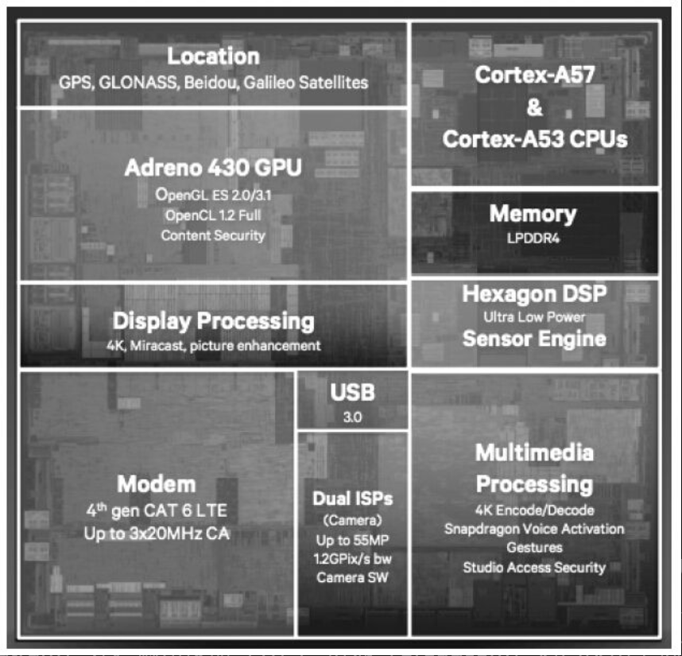
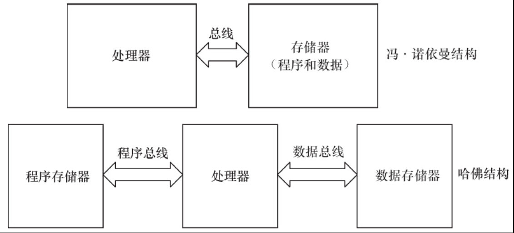
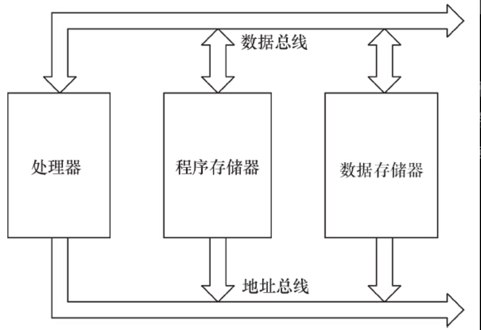
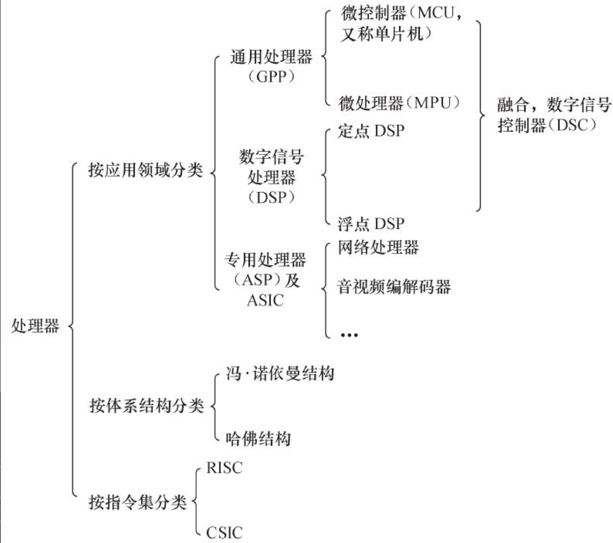

# 2.1.1　通用处理器

目前主流的通用处理器（GPP）多采用SoC（片上系统）的芯片设计方法，集成了各种功能模块，每一种功能都是由硬件描述语言设计程序，然后在SoC内由电路实现的。在SoC中，每一个模块不是一个已经设计成熟的ASIC器件，而是利用芯片的一部分资源去实现某种传统的功能，将各种组件采用类似搭积木的方法组合在一起。

ARM内核的设计技术被授权给数百家半导体厂商，做成不同的SoC芯片。ARM的功耗很低，在当今最活跃的无线局域网、3G、手机终端、手持设备、有线网络通信设备等中应用非常广泛。至本书编写时，市面上绝大多数智能手机、平板电脑都使用ARM SoC作为主控芯片。很多ARM主控芯片的集成度非常高，除了集成多核ARM以外，还可能集成图形处理器、视频编解码器、浮点协处理器、GPS、WiFi、蓝牙、基带、Camera等一系列功能。比如，高通的Snapdragon 810就集成了如图2.1所示的各种

图2.1　ARM SoC范例：Snapdragon 810

主流的ARM移动处理芯片供应商包括高通（Qualcomm）、三星（Samsung）、英伟达（Nvidia）、美满（Marvell）、联发科（MTK）、海思（HiSilicon）、展讯（Spreadtrum）等。德州仪器（TI）、博通（Broadcom）则已淡出手机芯片业务。

中央处理器的体系结构可以分为两类，一类为冯·诺依曼结构，另一类为哈佛结构。Intel公司的中央处理器、ARM的ARM7、MIPS公司的MIPS处理器采用了冯·诺依曼结构；而AVR、ARM9、ARM10、ARM11以及Cortex A系列等则采用了哈佛结构。

冯·诺依曼结构也称普林斯顿结构，是一种将程序指令存储器和数据存储器合并在一起的存储器结构。程序指令存储地址和数据存储地址指向同一个存储器的不同物理位置，因此程序指令和数据的宽度相同。而哈佛结构将程序指令和数据分开存储，指令和数据可以有不同的数据宽度。此外，哈佛结构还采用了独立的程序总线和数据总线，分别作为CPU与每个存储器之间的专用通信路径，具有较高的执行效率。图2.2描述了冯·诺依曼结构和哈佛结构的区别。

图2.2　冯·诺依曼结构与哈佛结构

许多芯片采用的是如图2.3所示的改进的哈佛架构，它具有独立的地址总线和数据总线，两条总线由程序存储器和数据存储器分时共用。因此，改进的哈佛结构针对程序和数据，其实没有独立的总线，而是使用公用数据总线来完成程序存储模块或数据存储模块与CPU之间的数据传输，公用的地址总线来寻址程序和数据

图2.3　改进的哈佛结构

从指令集的角度来讲，中央处理器也可以分为两类，即RISC（精简指令集计算机）和CISC（复杂指令集计算机）。CSIC强调增强指令的能力、减少目标代码的数量，但是指令复杂，指令周期长；而RISC强调尽量减少指令集、指令单周期执行，但是目标代码会更大。ARM、MIPS、PowerPC等CPU内核都采用了RISC指令集。目前，RISC和CSIC两者的融合非常明显。

# 2.1.2　数字信号处理器

数字信号处理器（DSP）针对通信、图像、语音和视频处理等领域的算法而设计。它包含独立的硬件乘法器。DSP的乘法指令一般在单周期内完成，且优化了卷积、数字滤波、FFT（快速傅里叶变换）、相关矩阵运算等算法中的大量重复乘法。

DSP分为两类，一类是定点DSP，另一类是浮点DSP。浮点DSP的浮点运算用硬件来实现，可以在单周期内完成，因而其浮点运算处理速度高于定点DSP。而定点DSP只能用定点运算模拟浮点运算。

德州仪器（TI）、美国模拟器件公司（ADI）是全球DSP的两大主要厂商。

TI的TMS320 TM DSP平台包含了功能不同的多个系列，如2000系列、3000系列、4000系列、5000系列、6000系列，工程师也习惯称其为2x、3x、4x、5x、6x。2010年5月，TI已经宣布为其C64x系列数字信号处理器与多核片上系统提供Linux内核支持，以充分满足通信与关键任务基础设施、医疗诊断以及高性能测量测试等应用需求。TI也推出了软件可编程多核ARM+DSP SoC，即KeyStone多核ARM+DSP处理器，以满足医疗成像应用、任务关键应用、测试和自动化应用的需求

ADI主要有16位定点的21xx系列、32位浮点的SHARC系列、从SHARC系列发展而来的TigerSHARC系列，以及高性能16位DSP信号处理能力与通用微控制器方便性相结合的blackfin系列等。ADI的blackfin不含MMU，完整支持Linux，是没有MMU情况下Linux的典型案例，其官方网站为http://blackfin.uclinux.org ，目前blackfin的Linux开发保持了与Linux mainline的同步。

通用处理器和数字信号处理器也有相互融合以取长补短的趋势，如数字信号控制器（DSC）即为MCU+DSP，ADI的blackfin系列就属于DSC。目前，芯片厂商也推出了许多ARM+DSP的双核以及多核处理器，如TI公司的OMAP 4平台就包括4个主要处理引擎：ARM Cortex-A9MPCore、PowerVR SGX 540GPU（Graphic Processing Unit）、C64x DSP和ISP（Image Signal Processor）。

除了上面讲述的通用微控制器和数字信号处理器外，还有一些针对特定领域而设计的专用处理器（ASP），它们都是针对一些特定应用而设计的，如用于HDTV、ADSL、Cable Modem等的专用处理器。

网络处理器是一种可编程器件，它应用于电信领域的各种任务，如包处理、协议分析、路由查找、声音/数据的汇聚、防火墙、QoS等。网络处理器器件内部通常由若干个微码处理器和若干硬件协处理器组成，多个微码处理器在网络处理器内部并行处理，通过预先编制的微码来控制处理流程。而对于一些复杂的标准操作（如内存操作、路由表查找算法、QoS的拥塞控制算法、流量调度算法等），则采用硬件协处理器来进一步提高处理性能，从而实现了业务灵活性和高性能的有机结合。

对于某些应用场合，使用ASIC（专用集成电路）往往是低成本且高性能的方案。ASIC专门针对特定应用而设计，不具备也不需要灵活的编程能力。使用ASIC完成同样的功能往往比直接使用CPU资源或CPLD（复杂可编程逻辑器件）/FPGA（现场可编程门阵列）来得更廉价且高效

图2.4　处理器分类

在实际项目的硬件方案中，往往会根据应用的需求选择通用处理器、数字信号处理器、特定领域处理器、CPLD/FPGA或ASIC之一的解决方案，在复杂的系统中，这些芯片可能会同时存在，协同合作，各自发挥自己的长处。如在一款智能手机中，可使用MCU处理图形用户界面和用户的按键输入并运行多任务操作系统，使用DSP进行音视频编解码，而在射频方面则采用ASIC。