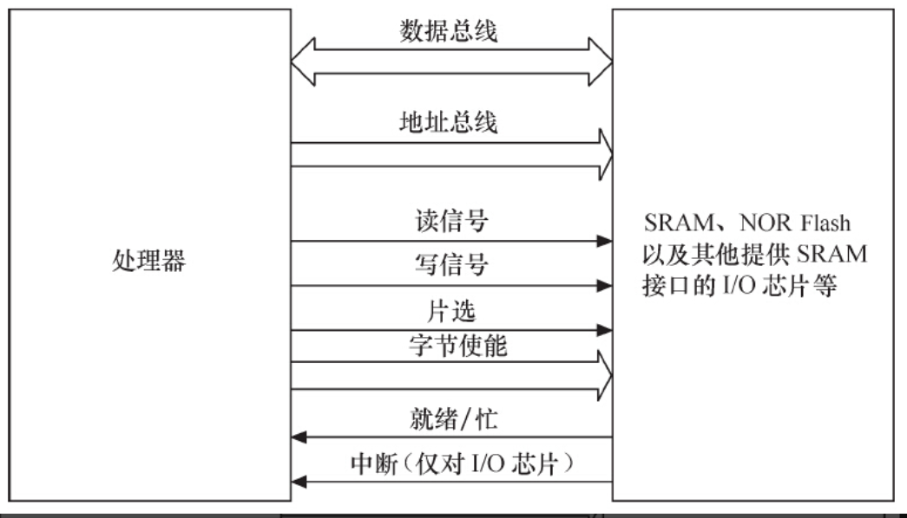
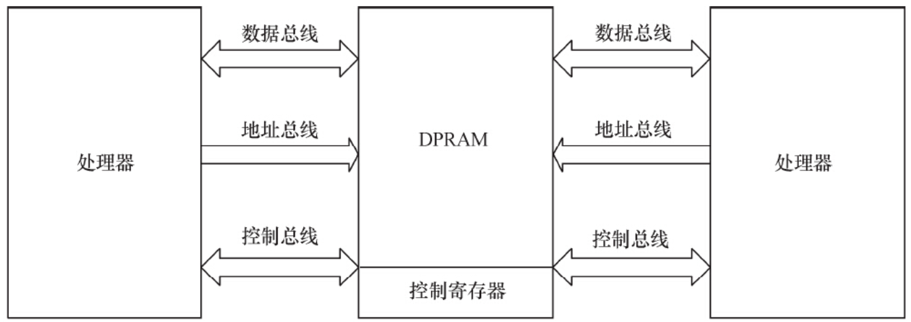
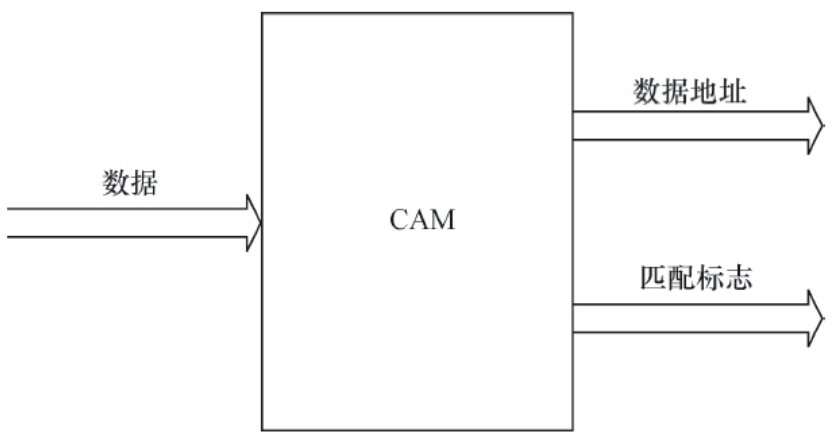
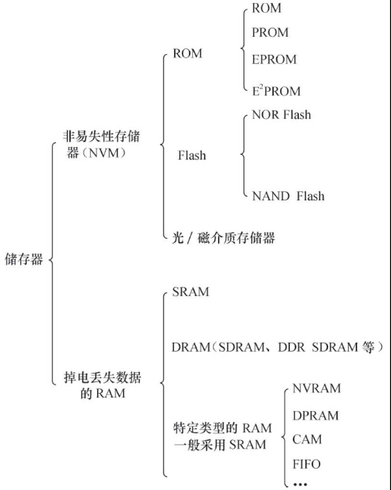

存储器主要可分类为只读储存器（ROM）、闪存（Flash）、随机存取存储器（RAM）、光/磁介质储存器。

ROM还可再细分为不可编程ROM、可编程ROM（PROM）、可擦除可编程ROM（EPROM）和电可擦除可编程ROM（E2PROM），E2PROM完全可以用软件来擦写，已经非常方便了。

NOR（或非）和NAND（与非）是市场上两种主要的Flash闪存技术。Intel于1988年首先开发出NOR Flash技术，彻底改变了原先由EPROM和EEPROM一统天下的局面。紧接着，1989年，东芝公司发表了NAND Flash结构，每位的成本被大大降低。

NOR Flash和CPU的接口属于典型的类SRAM接口（如图2.5所示），不需要增加额外的控制电路。NOR Flash的特点是可芯片内执行（eXecute In Place，XIP），程序可以直接在NOR内运行。而NAND Flash和CPU的接口必须由相应的控制电路进行转换，当然也可以通过地址线或GPIO产生NAND Flash接口的信号。NAND Flash以块方式进行访问，不支持芯片内执行。

图2.5　典型的类SRAM接口

公共闪存接口（Common Flash Interface，CFI）是一个从NOR Flash器件中读取数据的公开、标准接口。它可以使系统软件查询已安装的Flash器件的各种参数，包括器件阵列结构参数、电气和时间参数以及器件支持的功能等。如果芯片不支持CFI，就需使用JEDEC（Joint Electron Device Engineering Council，电子电器设备联合会）了。JEDEC规范的NOR则无法直接通过命令来读出容量等信息，需要读出制造商ID和设备ID，以确定Flash的大小

与NOR Flash的类SRAM接口不同，一个NAND Flash的接口主要包含如下信号。

- ·I/O总线：地址、指令和数据通过这组总线传输，一般为8位或16位。
- ·芯片启动（Chip Enable，CE#）：如果没有检测到CE信号，NAND器件就保持待机模式，不对任何控制信号做出响应。
- ·写使能（Write Enable，WE#）：WE#负责将数据、地址或指令写入NAND之中。
- ·读使能（Read Enable，RE#）：RE#允许数据输出。
- ·指令锁存使能（Command Latch Enable，CLE）：当CLE为高电平时，在WE#信号的上升沿，指令将被锁存到NAND指令寄存器中。
- ·地址锁存使能（Address Latch Enable，ALE）：当ALE为高电平时，在WE#信号的上升沿，地址将被锁存到NAND地址寄存器中。
- ·就绪/忙（Ready/Busy，R/B#）：如果NAND器件忙，R/B#信号将变为低电平。该信号是漏极开路，需要采用上拉电阻。

NAND Flash较NOR Flash容量大，价格低；NAND Flash中每个块的最大擦写次数是100万次，而NOR的擦写次数是10万次；NAND Flash的擦除、编程速度远超过NOR Flash。

Flash的编程原理都是只能将1写为0，而不能将0写为1。因此在Flash编程之前，必须将对应的块擦除，而擦除的过程就是把所有位都写为1的过程，块内的所有字节变为0xFF。另外，Flash还存在一个负载均衡的问题，不能老是在同一块位置进行擦除和写的动作，这样容易导致坏块。

值得一提的是，目前NOR Flash可以使用SPI接口进行访问以节省引脚。相对于传统的并行NOR Flash而言，SPI NOR Flash只需要6个引脚就能够实现单I/O、双I/O和4个I/O口的接口通信，有的SPI NOR Flash还支持DDR模式，能进一步提高访问速度到80MB/s。

IDE（Integrated Drive Electronics）接口可连接硬盘控制器或光驱，IDE接口的信号与SRAM类似。人们通常也把IDE接口称为ATA（Advanced Technology Attachment）接口，不过，从技术角度而言，这并不准确。其实，ATA接口发展至今，已经经历了ATA-1（IDE）、ATA-2（Enhanced IDE/Fast ATA，EIDE）、ATA-3（FastATA-2）、Ultra ATA、Ultra ATA/33、Ultra ATA/66、Ultra ATA/100及Serial ATA（SATA）的发展过程。

很多SoC集成了一个eFuse电编程熔丝作为OTP（One-Time Programmable，一次性可编程）存储器。eFuse可以通过计算机对芯片内部的参数和功能进行配置，这一般是在芯片出厂的时候已经设置好了。

以上所述的各种ROM、Flash和磁介质存储器都属于非易失性存储器（NVM）的范畴，掉电时信息不会丢失，而RAM则与此相反。

RAM也可再分为静态RAM（SRAM）和动态RAM（DRAM）。DRAM以电荷形式进行存储，数据存储在电容器中。由于电容器会因漏电而出现电荷丢失，所以DRAM器件需要定期刷新。SRAM是静态的，只要供电它就会保持一个值，SRAM没有刷新周期。每个SRAM存储单元由6个晶体管组成，而DRAM存储单元由1个晶体管和1个电容器组成。

通常所说的SDRAM、DDR SDRAM皆属于DRAM的范畴，它们采用与CPU外存控制器同步的时钟工作（注意，不是与CPU的工作频率一致）。与SDRAM相比，DDR SDRAM同时利用了时钟脉冲的上升沿和下降沿传输数据，因此在时钟频率不变的情况下，数据传输频率加倍。此外，还存在使用RSL（Rambus Signaling Level，Rambus发信电平）技术的RDRAM（Rambus DRAM）和Direct RDRAM。

针对许多特定场合的应用，嵌入式系统中往往还使用了一些特定类型的RAM。

# 1.DPRAM：双端口RAM

DPRAM的特点是可以通过两个端口同时访问，具有两套完全独立的数据总线、地址总线和读写控制线，通常用于两个处理器之间交互数据，如图2.6所示。当一端被写入数据后，另一端可以通过轮询或中断获知，并读取其写入的数据。由于双CPU同时访问DPRAM时的仲裁逻辑电路集成在DPRAM内部，所以需要硬件工程师设计的电路原理比较简单。

图2.6　双端口RAM

DPRAM的优点是通信速度快、实时性强、接口简单，而且两边处理器都可主动进行数据传输。除了双端口RAM以外，目前IDT等芯片厂商还推出了多端口RAM，可以供3个以上的处理器互通数据

# 2.CAM：内容寻址RAM

CAM是以内容进行寻址的存储器，是一种特殊的存储阵列RAM，它的主要工作机制就是同时将一个输入数据项与存储在CAM中的所有数据项自动进行比较，判别该输入数据项与CAM中存储的数据项是否相匹配，并输出该数据项对应的匹配信息。

如图2.7所示，在CAM中，输入的是所要查询的数据，输出的是数据地址和匹配标志。若匹配（即搜寻到数据），则输出数据地址。CAM用于数据检索的优势是软件无法比拟的，它可以极大地提高系统性能。

图2.7　CAM的输入与输出

# 3.FIFO：先进先出队列

FIFO存储器的特点是先进先出，进出有序，FIFO多用于数据缓冲。FIFO和DPRAM类似，具有两个访问端口，但是FIFO两边的端口并不对等，某一时刻只能设置为一边作为输入，一边作为输出。

如果FIFO的区域共有n个字节，我们只能通过循环n次读取同一个地址才能将该片区域读出，不能指定偏移地址。对于有n个数据的FIFO，当循环读取m次之后，下一次读时会自动读取到第m+1个数据，这是由FIFO本身的特性决定的。

总结2.2节的内容，可得出如图2.8所示的存储器分类。

图2.8　存储器分类