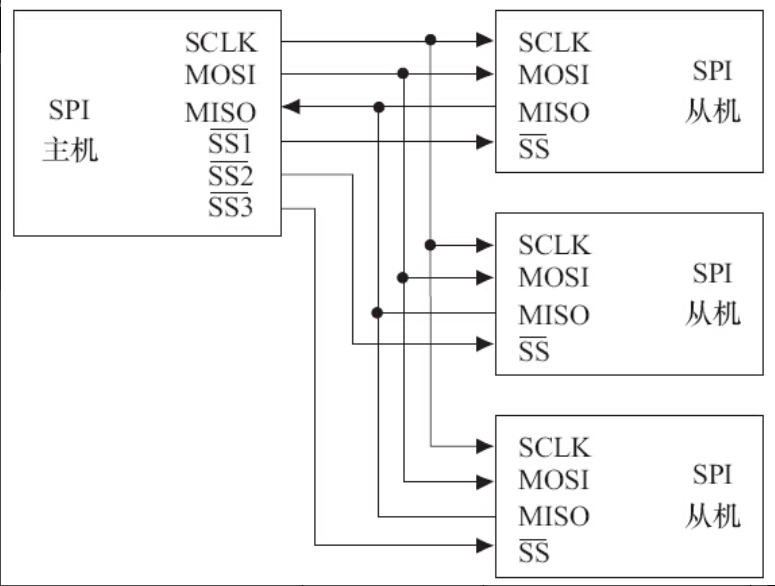

# 2.3.1　串口

RS-232、RS-422与RS-485都是串行数据接口标准，最初都是由电子工业协会（EIA）制订并发布的。

RS-232在1962年发布，命名为EIA-232-E。之后发布的RS-422定义了一种平衡通信接口，它是一种单机发送、多机接收的单向、平衡传输规范，被命名为TIA/EIA-422-A标准。RS-422改进了RS-232通信距离短、速率低的缺点。为进一步扩展应用范围，EIA又于1983年在RS-422的基础上制定了RS-485标准，增加了多点、双向通信能力，即允许多个发送器连接到同一条总线上，同时增加了发送器的驱动能力和冲突保护特性，并扩展了总线共模范围，被命名为TIA/EIA-485-A标准。

1969年发布的RS-232修改版RS-232C是嵌入式系统中应用最广泛的串行接口，它为连接DTE（数据终端设备）与DCE（数据通信设备）而制定。RS-232C标准接口有25条线（4条数据线、11条控制线、3条定时线、7条备用和未定义线），常用的只有9根，它们是RTS/CTS（请求发送/清除发送流控制）、RxD/TxD（数据收发）、DSR/DTR（数据终端就绪/数据设置就绪流控制）、DCD（数据载波检测，也称RLSD，即接收线信号检出）、Ringing-RI（振铃指示）、SG（信号地）信号。RTS/CTS、RxD/TxD、DSR/DTR等信号的定义如下。

- ·RTS：用来表示DTE请求DCE发送数据，当终端要发送数据时，使该信号有效。
- ·CTS：用来表示DCE准备好接收DTE发来的数据，是对RTS的响应信号。
- ·RxD：DTE通过RxD接收从DCE发来的串行数据。
- ·TxD：DTE通过TxD将串行数据发送到DCE。
- ·DSR：有效（ON状态）表明DCE可以使用。
- ·DTR：有效（ON状态）表明DTE可以使用。
- ·DCD：当本地DCE设备收到对方DCE设备送来的载波信号时，使DCD有效，通知DTE准备接收，并且由DCE将接收到的载波信号解调为数字信号，经RxD线送给DTE。
- ·Ringing-RI：当调制解调器收到交换台送来的振铃呼叫信号时，使该信号有效（ON状态），通知终端，已被呼叫。

最简单的RS-232C串口只需要连接RxD、TxD、SG这3个信号，并使用XON/XOFF软件流控。

组成一个RS-232C串口的硬件原理如图2.9所示，从CPU到连接器依次为CPU、UART（通用异步接收器发送器，作用是完成并/串转换）、CMOS/TTL电平与RS-232C电平转换、DB9/DB25或自定义连接器。

图2.9　RS-232C串口电路原理

# 2.3.2　I2 C

I2 C（内置集成电路）总线是由Philips公司开发的两线式串行总线，产生于20世纪80年代，用于连接微控制器及其外围设备。I2 C总线简单而有效，占用的PCB（印制电路板）空间很小，芯片引脚数量少，设计成本低。I2 C总线支持多主控（Multi-Mastering）模式，任何能够进行发送和接收的设备都可以成为主设备。主控能够控制数据的传输和时钟频率，在任意时刻只能有一个主控。

组成I2 C总线的两个信号为数据线SDA和时钟SCL。为了避免总线信号的混乱，要求各设备连接到总线的输出端必须是开漏输出或集电极开路输出的结构。总线空闲时，上拉电阻使SDA和SCL线都保持高电平。根据开漏输出或集电极开路输出信号的“线与”逻辑，I2 C总线上任意器件输出低电平都会使相应总线上的信号线变低。

线与”逻辑指的是两个或两个以上的输出直接互连就可以实现“与”的逻辑功能，只有输出端是开漏（对于CMOS器件）输出或集电极开路（对于TTL器件）输出时才满足此条件。工程师一般以“OC门”简称开漏或集电极开路。

I2 C设备上的串行数据线SDA接口电路是双向的，输出电路用于向总线上发送数据，输入电路用于接收总线上的数据。同样地，串行时钟线SCL也是双向的，作为控制总线数据传送的主机要通过SCL输出电路发送时钟信号，并检测总线上SCL上的电平以决定什么时候发下一个时钟脉冲电平；作为接收主机命令的从设备需按总线上SCL的信号发送或接收SDA上的信号，它也可以向SCL线发出低电平信号以延长总线时钟信号周期。

当SCL稳定在高电平时，SDA由高到低的变化将产生一个开始位，而由低到高的变化则产生一个停止位，如图2.10所示。

开始位和停止位都由I2 C主设备产生。在选择从设备时，如果从设备采用7位地址，则主设备在发起传输过程前，需先发送1字节的地址信息，前7位为设备地址，最后1位为读写标志。之后，每次传输的数据也是1字节，从MSB开始传输。每个字节传完后，在SCL的第9个上升沿到来之前，接收方应该发出1个ACK位。SCL上的时钟脉冲由I2 C主控方发出，在第8个时钟周期之后，主控方应该释放SDA，I2 C总线的时序如图2.11所示。

图2.10　I2 C总线的开始位和停止位

图2.11　I2 C总线的时序

# 2.3.3　SPI

SPI（Serial Peripheral Interface，串行外设接口）总线系统是一种同步串行外设接口，它可以使CPU与各种外围设备以串行方式进行通信以交换信息。一般主控SoC作为SPI的“主”，而外设作为SPI的“从”。

SPI接口一般使用4条线：串行时钟线（SCLK）、主机输入/从机输出数据线MISO、主机输出/从机输入数据线MOSI和低电平有效的从机选择线SS（在不同的文献里，也常称为nCS、CS、CSB、CSN、nSS、STE、SYNC等）。图2.12演示了1个主机连接3个SPI外设的硬件连接图。

图2.12　SPI主、从硬件连接图

如图2.13所示，在SPI总线的传输中，SS信号是低电平有效的，当我们要与某外设通信的时候，需要将该外设上的SS线置低。此外，特别要注意SPI从设备支持的SPI总线最高时钟频率（决定了SCK的频率）以及外设的CPHA、CPOL模式，这决定了数据与时钟之间的偏移、采样的时刻以及触发的边沿是上升沿还是下降沿。

SPI模块为了和外设进行数据交换，根据外设工作要求，其输出串行同步时钟极性（CPOL）和相位（CPHA）可以进行配置。如果CPOL=0，串行同步时钟的空闲状态为低电平；如果CPOL=1，串行同步时钟的空闲状态为高电平。如果CPHA=0，在串行同步时钟的第一个跳变沿（上升或下降）数据被采样；如果CPHA=1，在串行同步时钟的第二个跳变沿（上升或下降）数据被采样。

# 2.3.4　USB

USB（通用串行总线）是Intel、Microsoft等厂商为解决计算机外设种类的日益增加与有限的主板插槽和端口之间的矛盾而于1995年提出的，它具有数据传输率高、易扩展、支持即插即用和热插拔的优点，目前已得到广泛应用。

USB 1.1包含全速和低速两种模式，低速方式的速率为1.5Mbit/s，支持一些不需要很大数据吞吐量和很高实时性的设备，如鼠标等。全速模式为12Mbit/s，可以外接速率更高的外设。在USB 2.0中，增加了一种高速方式，数据传输率达到480Mbit/s，半双工，可以满足更高速外设的需要。而USB 3.0（也被认为是Super Speed USB）的最大传输带宽高达5.0Gbit/s（即640MB/s），全双工。

USB 2.0总线的机械连接非常简单，采用4芯的屏蔽线，一对差分线（D+、D-）传送信号，另一对（VBUS、电源地）传送+5V的直流电。USB 3.0线缆则设计了8条内部线路，除VBUS、电源地之外，其余3对均为数据传输线路。其中保留了D+与D-这两条兼容USB 2.0的线路，新增了SSRX与SSTX专为USB 3.0所设的线路。

在嵌入式系统中，电路板若需要挂接USB设备，则需提供USB主机（Host）控制器和连接器；若电路板需要作为USB设备，则需提供USB设备适配器和连接器。目前，大多数SoC集成了USB主机控制器（以连接USB外设）和设备适配器（以将本嵌入式系统作为其他计算机系统的USB外设，如手机充当U盘）。由USB主机、设备和Hub组成的USB系统的物理拓扑结构如图2.14所示。

图2.14　USB的物理拓扑结构

每一个USB设备会有一个或者多个逻辑连接点在里面，每个连接点叫端点。USB提供了多种传输方式以适应各种设备的需要，一个端点可以选择如下一种传输方式。

## 1.控制（Control）传输方式

控制传输是双向传输，数据量通常较小，主要用来进行查询、配置和给USB设备发送通用命令。所有USB设备必须支持标准请求（Standard Request），控制传输方式和端点0。

## 2.同步（Isochronous）传输方式

同步传输提供了确定的带宽和间隔时间，它用于时间要求严格并具有较强容错性的流数据传输，或者用于要求恒定数据传送率的即时应用。例如进行语音业务传输时，使用同步传输方式是很好的选择。同步传输也常称为“Streaming Real-time”传输。

## 3.中断（Interrupt）传输方式

中断方式传送是单向的，对于USB主机而言，只有输入。中断传输方式主要用于定时查询设备是否有中断数据要传送，该传输方式应用在少量分散的、不可预测的数据传输场合，键盘、游戏杆和鼠标属于这一类型

## 4.批量（Bulk）传输方式

批量传输主要应用在没有带宽、间隔时间要求的批量数据的传送和接收中，它要求保证传输。打印机和扫描仪属于这种类型。

而USB 3.0则增加了一种Bulk Streams传输模式，USB 2.0的Bulk模式只支持1个数据流，而Bulk Streams传输模式则可以支持多个数据流，每个数据流被分配一个Stream ID（SID），每个SID与一个主机缓冲区对应。

在USB架构中，集线器负责检测设备的连接和断开，利用其中断IN端点（Interrupt IN Endpoint）来向主机报告。一旦获悉有新设备连接上来，主机就会发送一系列请求给设备所挂载的集线器，再由集线器建立起一条连接主机和设备之间的通信通道。然后主机以控制传输的方式，通过端点0对设备发送各种请求，设备收到主机发来的请求后回复相应的信息，进行枚举（Enumerate）操作。因此USB总线具备热插拔的能力。

# 2.3.5　以太网接口

以太网接口由MAC（以太网媒体接入控制器）和PHY（物理接口收发器）组成。以太网MAC由IEEE 802.3以太网标准定义，实现了数据链路层。常用的MAC支持10Mbit/s或100Mbit/s两种速率。吉比特以太网（也称为千兆位以太网）是快速以太网的下一代技术，将网速提高到了1000Mbit/s。千兆位以太网以IEEE 802.3z和802.3ab发布，作为IEEE 802.3标准的补充。

MAC和PHY之间采用MII（媒体独立接口）连接，它是IEEE-802.3定义的以太网行业标准，包括1个数据接口与MAC和PHY之间的1个管理接口。数据接口包括分别用于发送和接收的两条独立信道，每条信道都有自己的数据、时钟和控制信号，MII数据接口总共需要16个信号。MII管理接口包含两个信号，一个是时钟信号，另一个是数据信号。通过管理接口，上层能监视和控制PHY

一个以太网接口的硬件电路原理如图2.15所示，从CPU到最终接口依次为CPU、MAC、PHY、以太网隔离变压器、RJ45插座。以太网隔离变压器是以太网收发芯片与连接器之间的磁性组件，在其两者之间起着信号传输、阻抗匹配、波形修复、信号杂波抑制和高电压隔离作用

图2.15　以太网接口的硬件电路原理

许多处理器内部集成了MAC或同时集成了MAC和PHY，另有许多以太网控制芯片也集成了MAC和PHY。

# 2.3.6　PCI和PCI-E

PCI（外围部件互连）是由Intel于1991年推出的一种局部总线，作为一种通用的总线接口标准，它在目前的计算机系统中得到了非常广泛应用。PCI总线具有如下特点。

- ·数据总线为32位，可扩充到64位。
- ·可进行突发（Burst）模式传输。突发方式传输是指取得总线控制权后连续进行多个数据的传输。突发传输时，只需要给出目的地的首地址，访问第1个数据后，第2~n个数据会在首地址的基础上按一定规则自动寻址和传输。与突发方式对应的是单周期方式，它在1个总线周期只传送1个数据。
- ·总线操作与处理器—存储器子系统操作并行。
- ·采用中央集中式总线仲裁。
- ·支持全自动配置、资源分配，PCI卡内有设备信息寄存器组为系统提供卡的信息，可实现即插即用。
- ·PCI总线规范独立于微处理器，通用性好。
- ·PCI设备可以完全作为主控设备控制总线。

图2.16给出了一个典型的基于PCI总线的计算机系统逻辑示意图，系统的各个部分通过PCI总线和PCI-PCI桥连接在一起。CPU和RAM通过PCI桥连接到PCI总线0（即主PCI总线），而具有PCI接口的显卡则可以直接连接到主PCI总线上。PCI-PCI桥是一个特殊的PCI设备，它负责将PCI总线0和PCI总线1（即从PCI主线）连接在一起，通常PCI总线1称为PCI-PCI桥的下游（Downstream），而PCI总线0则称为PCI-PCI桥的上游（Upstream）。为了兼容旧的ISA总线标准，PCI总线还可以通过PCI-ISA桥来连接ISA总线，从而支持以前的ISA设备。

图2.16　基于PCI总线的计算机系统逻辑示意图

当PCI卡刚加电时，卡上配置空间即可以被访问。PCI配置空间保存着该卡工作时所需的所有信息，如厂家、卡功能、资源要求、处理能力、功能模块数量、主控卡能力等。通过对这个空间信息的读取与编程，可完成对PCI卡的配置。如图2.17所示，PCI配置空间共为256字节，主要包括如下信息。

- ·制造商标识（Vendor ID）：由PCI组织分配给厂家。
- ·设备标识（Device ID）：按产品分类给本卡的编号。
- ·分类码（Class Code）：本卡功能的分类码，如图卡、显示卡、解压卡等。·申请存储器空间：PCI卡内有存储器或以存储器编址的寄存器和I/O空间，为使驱动程序和应用程序能访问它们，需申请CPU的一段存储区域以进行定位。配置空间的基地址寄存器用于此目的。
- ·申请I/O空间：配置空间中的基地址寄存器用来进行系统I/O空间的申请。
- ·中断资源申请：配置空间中的中断引脚和中断线用来向系统申请中断资源。偏移3Dh处为中断引脚寄存器，其值表明PCI设备使用了哪一个中断引脚，对应关系为1—INTA#、2—INTB#、3—INTC#、4—INTD#。

图2.17　PCI配置空间

PCI-E（PCI Express）是Intel公司提出的新一代的总线接口，PCI Express采用了目前业内流行的点对点串行连接，比起PCI以及更早的计算机总线的共享并行架构，每个设备都有自己的专用连接，采用串行方式传输数据，不需要向整个总线请求带宽，并可以把数据传输率提高到一个很高的频率，达到PCI所不能提供的高带宽。

PCI Express在软件层面上兼容目前的PCI技术和设备，支持PCI设备和内存模组的初始化，也就是说无须推倒目前的驱动程序、操作系统，就可以支持PCI Express设备。

# 2.3.7　SD和SDIO

SD（Secure Digital）是一种关于Flash存储卡的标准，也就是一般常见的SD记忆卡，在设计上与MMC（Multi-Media Card）保持了兼容。SDHC（SD High Capacity）是大容量SD卡，支持的最大容量为32GB。2009年发布的SDXC（SD eXtended Capacity）则支持最大2TB大小的容量

SDIO（Secure Digital Input and Output Card，安全数字输入输出卡）在SD标准的基础上，定义了除存储卡以外的外设接口。SDIO主要有两类应用——可移动和不可移动。不可移动设备遵循相同的电气标准，但不要求符合物理标准。现在已经有非常多的手机或者手持装置都支持SDIO的功能，以连接WiFi、蓝牙、GPS等模块。

一般情况下，芯片内部集成的SD控制器同时支持MMC、SD卡，又支持SDIO卡，但是SD和SDIO的协议还是有不一样的地方，支持的命令也会有不同。

SD/SDIO的传输模式有：

- ·SPI模式
- ·1位模式
- ·4位模式

表2.1显示了SDIO接口的引脚定义。其中CLK为时钟引脚，每个时钟周期传输一个命令或数据位；CMD是命令引脚，命令在CMD线上串行传输，是双向半双工的（命令从主机到从卡，而命令的响应是从卡发送到主机）；DAT[0]~DAT[3]为数据线引脚；在SPI模式中，第8脚位被当成中断信号。图2.18给出了一个SDIO单模块读、写的典型时序。

表2.1　SDIO接口引脚定义

图2.18　SDIO单模块读、写的典型时序

eMMC（Embedded Multi Media Card）是当前移动设备本地存储的主流解决方案，目的在于简化手机存储器的设计。eMMC就是NAND Flash、闪存控制芯片和标准接口封装的集合，它把NAND和控制芯片直接封装在一起成为一个多芯片封装（Multi-Chip Package，MCP）芯片。eMMC支持DAT[0]~DAT[7]8位的数据线。上电或者复位后，默认处于1位模式，只使用DAT[0]，后续可以配置为4位或者8位模式。