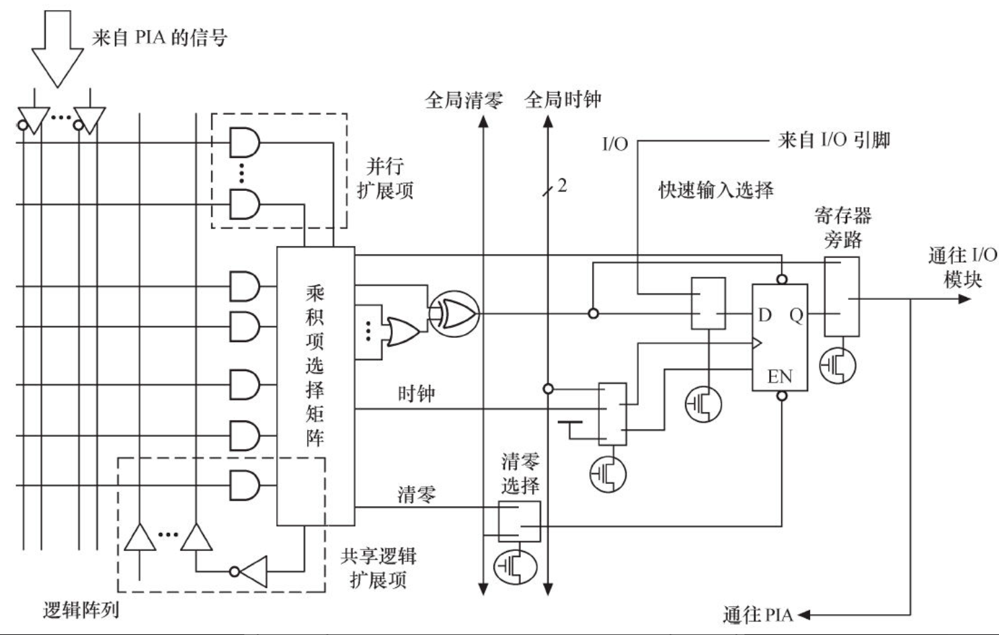
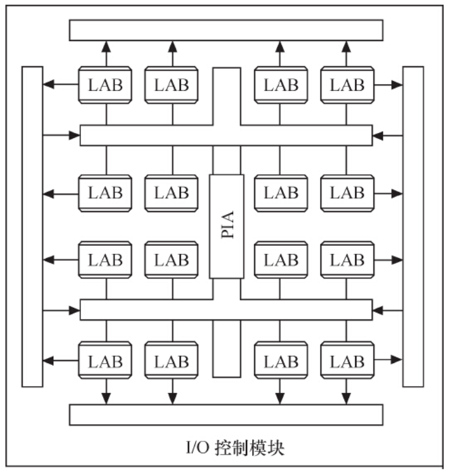
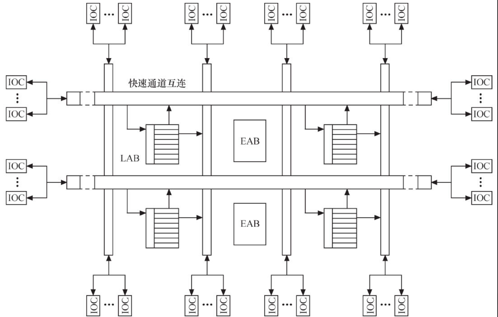
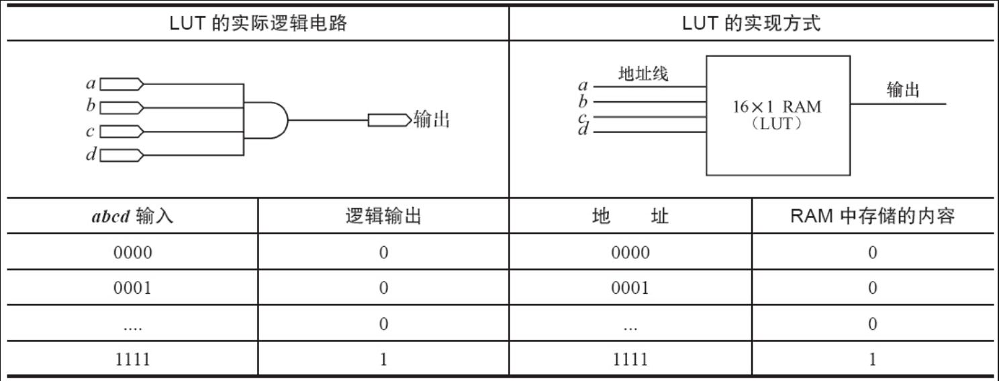

CPLD（复杂可编程逻辑器件）由完全可编程的与或门阵列以及宏单元构成。

CPLD中的基本逻辑单元是宏单元，宏单元由一些“与或”阵列加上触发器构成，其中“与或”阵列完成组合逻辑功能，触发器完成时序逻辑功能。宏单元中与阵列的输出称为乘积项，其数量标示着CPLD的容量。乘积项阵列实际上就是一个“与或”阵列，每一个交叉点都是一个可编程熔丝，如果导通就是实现“与”逻辑。在“与”阵列后一般还有一个“或”阵列，用以完成最小逻辑表达式中的“或”关系。图2.19所示为非常典型的CPLD的单个宏单元结构

图2.20给出了一个典型CPLD的整体结构。这个CPLD由LAB（逻辑阵列模块，由多个宏单元组成）通过PIA（可编程互连阵列）互连组成，而CPLD与外部的接口则由I/O控制模块提供。

图2.19　典型的CPLD的单个宏单元结构

图2.20　典型的CPLD整体架构

图2.20中宏单元的输出会经I/O控制块送至I/O引脚，I/O控制块控制每一个I/O引脚的工作模式，决定其为输入、输出还是双向引脚，并决定其三态输出的使能端控制

与CPLD不同，FPGA（现场可编程门阵列）基于LUT（查找表）工艺。查找表本质上是一片RAM，当用户通过原理图或HDL（硬件描述语言）描述了一个逻辑电路以后，FPGA开发软件会自动计算逻辑电路所有可能的结果，并把结果事先写入RAM。这样，输入一组信号进行逻辑运算就等于输入一个地址进行查表以输出对应地址的内容。

图2.21所示为一个典型FPGA的内部结构。这个FPGA由IOC（输入/输出控制模块）、EAB（嵌入式阵列块）、LAB和快速通道互连构成。

图2.21　典型的FPGA内部结构

IOC是内部信号到I/O引脚的接口，它位于快速通道的行和列的末端，每个IOC包含一个双向I/O缓冲器和一个既可作为输入寄存器也可作为输出寄存器的触发器。

EAB（嵌入式存储块）是一种输入输出端带有寄存器的非常灵活的RAM。EAB不仅可以用作存储器，还可以事先写入查表值以用来构成如乘法器、纠错逻辑等电路。当用于RAM时，EAB可配制成8位、4位、2位和1位长度的数据格式。

LAB主要用于逻辑电路设计，一个LAB包括多个LE（逻辑单元），每个LE包括组合逻辑及一个可编程触发器。一系列LAB构成的逻辑阵列可实现普通逻辑功能，如计数器、加法器、状态机等

器件内部信号的互连和器件引出端之间的信号互连由快速通道连线提供，快速通道遍布于整个FPGA器件中，是一系列水平和垂直走向的连续式布线通道。

表2.2所示为一个4输入LUT的实际逻辑电路与LUT实现方式的对应关系。

表2.2　实际逻辑电路与查找表的实现

CPLD和FPGA的主要厂商有Altera、Xilinx和Lattice等，它们采用专门的开发流程，在设计阶段使用HDL（如VHDL、Verilog HDL）编程。它们可以实现许多复杂的功能，如实现UART、I2 C等I/O控制芯片、通信算法、音视频编解码算法等，甚至还可以直接集成ARM等CPU内核和外围电路。

对于驱动工程师而言，我们只需要这样看待CPLD和FPGA：如果它完成的是特定的接口和控制功能，我们就直接把它当成由很多逻辑门（与、非、或、D触发器）组成的可完成一系列时序逻辑和组合逻辑的ASIC；如果它完成的是CPU的功能，我们就直接把它当成CPU。驱动工程师眼里的硬件比IC设计师要宏观。

值得一提的是，Xilinx公司还推出了ZYNQ芯片，内部同时集成了两个Cortex-A9ARM多处理器子系统和可编程逻辑FPGA，同时可编程逻辑可由用户配置。