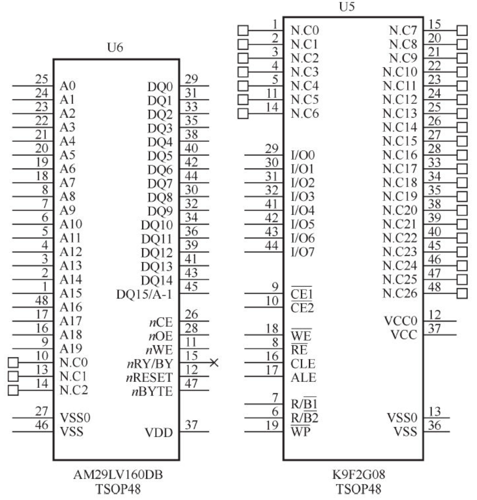
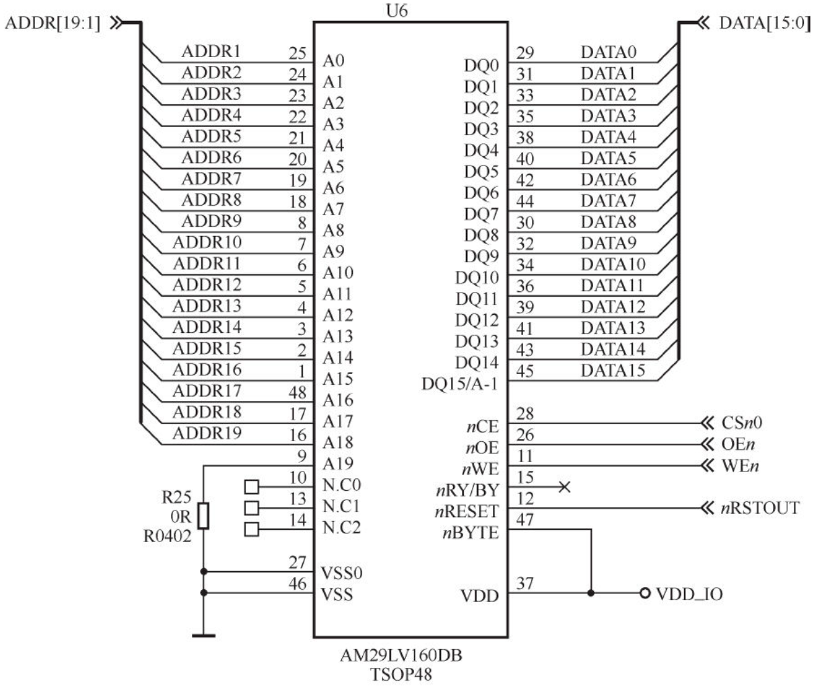
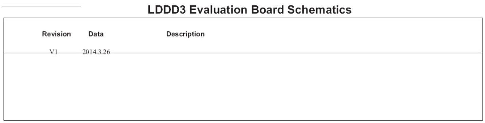

原理图分析的含义是指通过阅读电路板的原理图获得各种存储器、外设所使用的硬件资源、接口和引脚连接关系。若要整体理解整个电路板的硬件组成，原理图的分析方法是以主CPU为中心向存储器和外设辐射，步骤如下。

1）阅读CPU部分，获知CPU的哪些片选、中断和集成的外设控制器在使用，列出这些元素a、b、c、…。

CPU引脚比较多的时候，芯片可能会被分成几个模块并单独画在原理图的不同页上，这时应该把相应的部分都分析到位。

2）对第1步中列出的元素，从原理图中对应的外设和存储器电路中分析出实际的使用情况。

硬件原理图中包含如下元素。

·符号（symbol）。符号描述芯片的外围引脚以及引脚的信号，对于复杂的芯片，可能会被分割为几个符号。在符号中，一般把属于同一个信号群的引脚排列在一起。图2.22所示为NOR Flash AM29LV160DB和NAND Flash K9F2G08的符号。

图2.22　原理图中的符号

·网络（net）。描述芯片、接插件和分离元器件引脚之间的互连关系，每个网络需要根据信号的定义赋予一个合适的名字，如果没有给网络取名字，EDA软件会自动添加一个默认的网络名。添加网络后的AM29LV160DB如图2.23所示。

·描述。原理图中会添加一些文字来辅助描述原理图（类似源代码中的注释），如每页页脚会有该页的功能描述，对重要的信号，在原理图的相应符号和网络中也会附带文字说明。图2.24中给出了原理图中的描述示例。

图2.23　原理图中的网络

图2.24　原理图中的描述示例