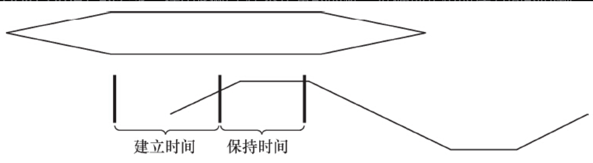
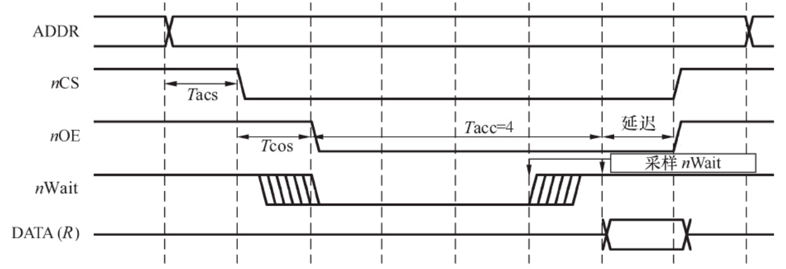

# 2.6.1　时序分析的概念

驱动工程师一般不需要分析硬件的时序，但是鉴于许多企业内驱动工程师还需要承担电路板调试的任务，因此，掌握时序分析的方法也就比较必要了

对驱动工程师或硬件工程师而言，时序分析的意思是让芯片之间的访问满足芯片数据手册中时序图信号有效的先后顺序、采样建立时间（Setup Time）和保持时间（Hold Time）的要求，在电路板工作不正常的时候，准确地定位时序方面的问题。

建立时间是指在触发器的时钟信号边沿到来以前，数据已经保持稳定不变的时间，如果建立时间不够，数据将不能在这个时钟边沿被打入触发器；保持时间是指在触发器的时钟信号边沿到来以后，数据还需稳定不变的时间，如果保持时间不够，数据同样不能被打入触发器。如图2.25所示，数据稳定传输必须满足建立时间和保持时间的要求，当然，在一些情况下，建立时间和保持时间的值可以为零。

图2.25　建立时间和保持时间

# 2.6.2　典型的硬件时序

最典型的硬件时序是SRAM的读写时序，在读/写过程中涉及的信号包括地址、数据、片选、读/写、字节使能和就绪/忙。对于一个16位、32位（甚至64位）的SRAM，字节使能表明哪些字节被读写。

图2.26给出了SRAM的读时序，写时序与此相似。首先，地址总线上输出要读（写）的地址，然后发出SRAM片选信号，接着输出读（写）信号，之后读（写）信号要经历数个等待周期。当SRAM读（写）速度比较慢时，等待周期可以由MCU的相应寄存器设置，也可以通过设备就绪/忙（如图2.27中的nWait）向CPU报告，这样，读写过程中会自动添加等待周期。

图2.26　SRAM读时序图

NOR Flash和许多外设控制芯片都使用了类似SRAM的访问时序，因此，牢固掌握这个时序意义重大。一般，在芯片数据手册给出的时序图中，会给出图中各段时间的含义和要求，真实的电路板必须满足芯片数据手册中描述的建立时间和保持时间的最小要求

