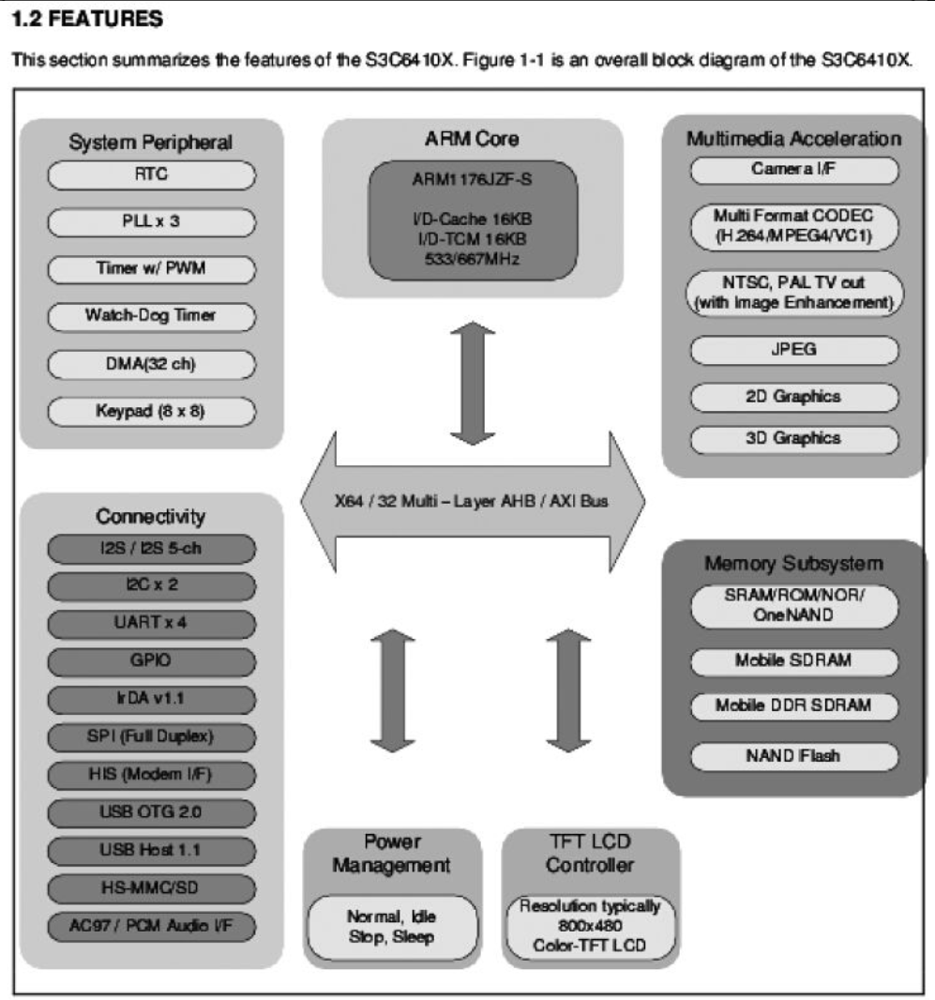
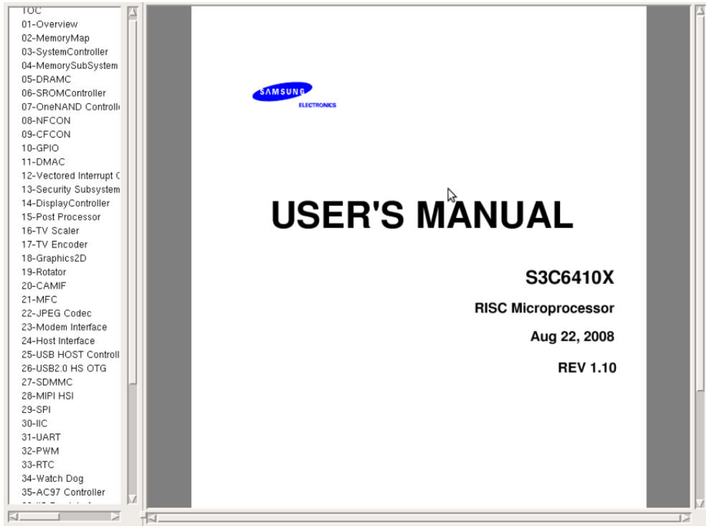
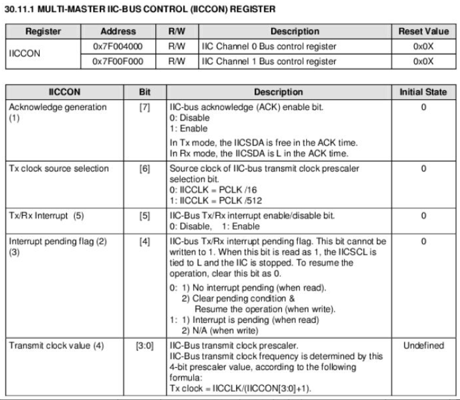
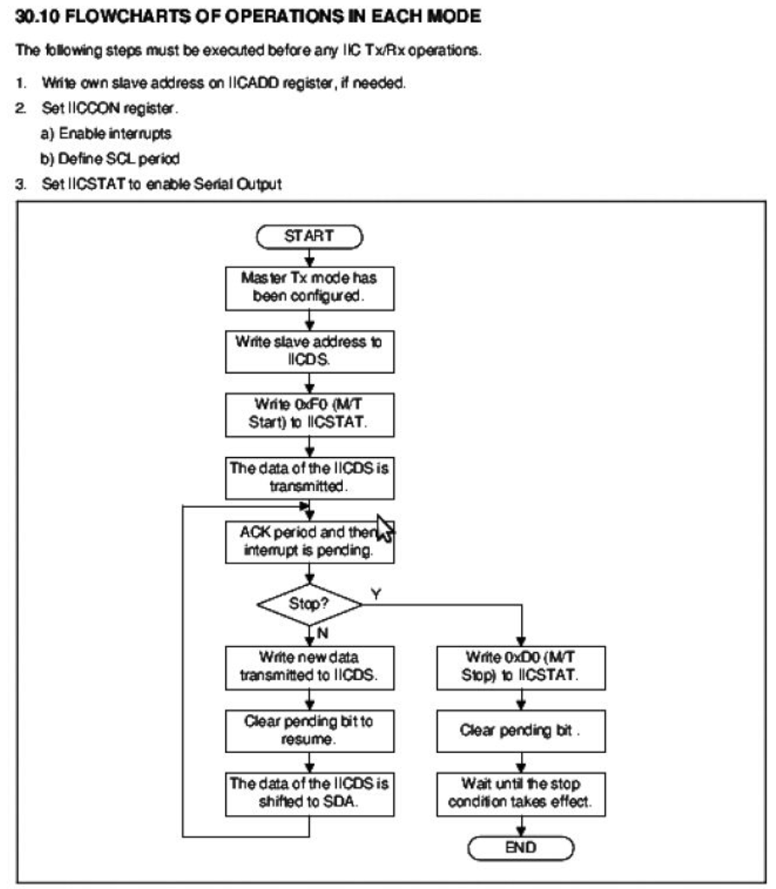

# 2.7　芯片数据手册阅读方法

芯片数据手册往往长达数百页，甚至上千页，而且全部是英文，从头到尾不加区分地阅读需要花费非常长的时间，而且不一定能获取对设计设备驱动有帮助的信息。芯片数据手册的正确阅读方法是快速而准确地定位有用信息，重点阅读这些信息，忽略无关内容。下面以S3C6410A的数据手册为例来分析阅读方法，为了直观地反映阅读过程，本节的图都是直接从数据手册中抓屏而得到的。

打开S3C6410A的数据手册，发现页数为1378页，从头读到尾是不现实的。

S3C6410A数据手册的第1章“PRODUCT OVERVIEW”（产品综述）是必读的，通过阅读这一部分可以获知整个芯片的组成。这一章往往会给出一个芯片的整体结构图，并对芯片内的主要模块进行一个简洁的描述。S3C6410A的整体结构图如图2.27所示（见数据手册第61页）。

图2.27　S3C6410A数据手册中的芯片结构图

第2~43章中的每一章都对应S3C6410A整体结构图中的一个模块，图2.28为从Adobe Acrobat中直接抓取的S3C6410A数据手册的目录结构图。

图2.28　S3C6410A数据手册的目录结构

第2章“MemoryMap”（内存映射）比较关键，对于定位存储器和外设所对应的基址有直接指导意义，这一部分应该细看。

第3~34章对应于CPU内部集成的外设或总线控制器，当具体编写某接口的驱动时，应该详细阅读，主要是分析数据、控制、地址寄存器（数据手册中一般会以表格列出）的访问控制和具体设备的操作流程（数据手册中会给出步骤，有的还会给出流程图）。譬如为了编写S3C6410A的I2 C控制器驱动，我们需要详细阅读类似图2.29的寄存器定义表格和图2.30的操作流程图。

第44章“ELECTRICAL DATA”（对于电气数据，在图2.28中未画出），描述芯片的电气特性，如电压、电流和各种工作模式下的时序、建立时间和保持时间的要求。所有的数据手册都会包含类似章节，这一章对于硬件工程师比较关键，但是，一般来说，驱动工程师并不需要阅读。

第45章“MECHANICAL DATA”（机械数据）描述芯片的物理特性、尺寸和封装，硬件工程师会依据这一章绘制芯片的封装（Footprint），但是，驱动工程师无须阅读。

图2.29　芯片数据手册中以表格形式列出的寄存器定义

图2.30　芯片数据手册中给出的外设控制器的操作流程