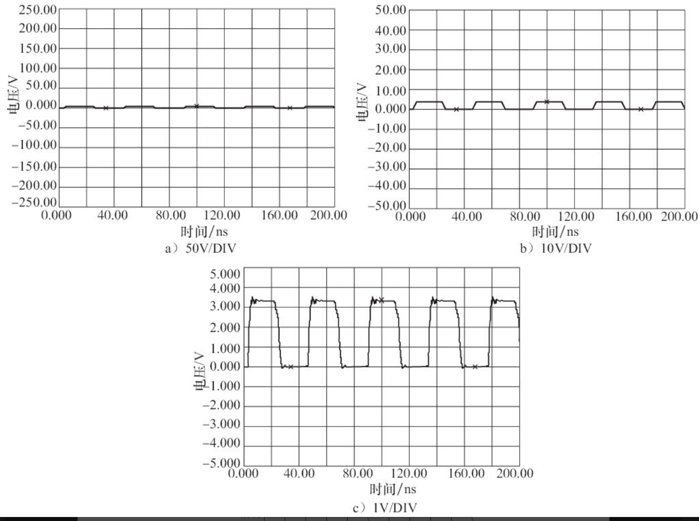
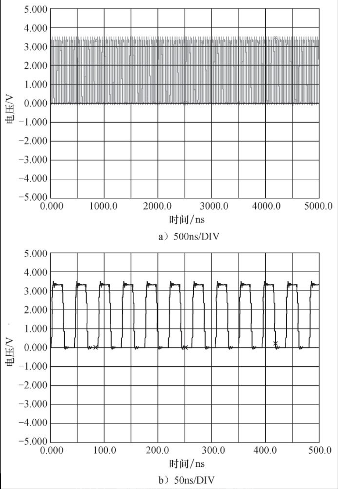
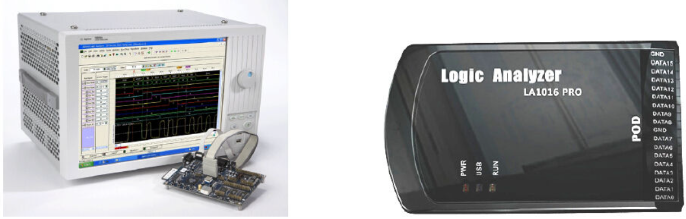
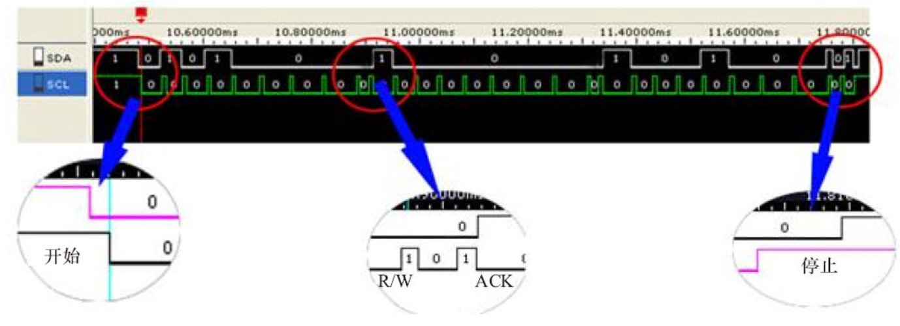
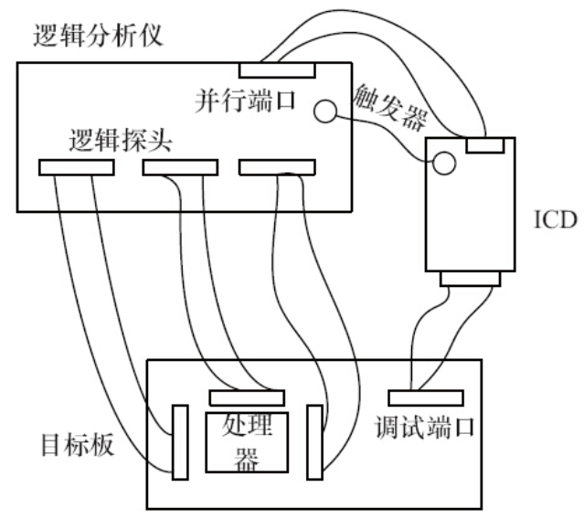

# 2.8.1　万用表

在电路板调试过程中主要使用万用表的两个功能。

- ·测量电平。
- ·使用二极管挡测量电路板上网络的连通性，当示波器被设置在二极管挡，测量连通的网络会发出“嘀嘀”的鸣叫，否则，没有连通。

# 2.8.2　示波器

示波器是利用电子示波管的特性，将人眼无法直接观测的交变电信号转换成图像，显示在荧光屏上以便测量的电子仪器。它是观察数字电路实验现象、分析实验中的问题、测量实验结果必不可少的重要仪器

使用示波器时应主要注意调节垂直偏转因数选择（VOLTS/DIV）和微调、时基选择（TIME/DIV）和微调以及触发方式。

如果VOLTS/DIV设置不合理，则可能造成电压幅度超出整个屏幕或在屏幕上变动太过微小以致无法观测的现象。图2.31所示为同一个波形在VOLTS/DIV设置由大到小变化过程中的示意图。

图2.31　示波器的VOLTS/DIV设置与波形

如果TIME/DIV设置不合适，则可能造成波形混迭。混迭意味着屏幕上显示的波形频率低于信号实际频率。这时候，可以通过缓慢改变扫速TIME/DIV到较快的时基挡提高波形频率，如果波形频率参数急剧改变或者晃动的波形在某个较快的时基挡稳定下来，说明之前发生了波形混迭。根据奈奎斯特定理，采样速率至少高于信号高频分量的两倍才不会发生混迭，如一个500MHz的信号，至少需要1GS/s的采样速率。图2.32所示为同一个波形在TIME/DIV设置由小到大变化过程中的示意图。

图2.32　示波器的TIME/DIV设置与波形

奈奎斯特定理即为采样定理，指当采样频率fsmax 大于信号中最高频率fmax 的两倍时，即fsmax ≥2fmax 时，采样之后的数字信号可完整地保留原始信息。这条定理在信号处理领域中的地位相当高，大致相当于物理学领域中的牛顿定律。

在示波器的使用过程中，要设置触发方式和触发模式。触发的目的是为了在每次显示的时候都从波形的同一位置开始，波形可以稳定显示。一般示波器都支持边沿触发，在某些情况下，我们也要使用视频触发、毛刺触发、脉宽触发、斜率触发、码型触发等。设定正确的触发，可以大大提高测试过程的灵活性，并简化工作。

示波器一般支持3种触发模式：自动模式、常规模式和单次模式。

- ·自动模式（示波器面板上的AUTO按钮）。在这种模式下，当触发没有发生时，示波器的扫描系统会根据设定的扫描速率自动进行扫描；而当有触发发生时，扫描系统会尽量按信号的频率进行扫描。因此，AUTO模式下，不论触发条件是否满足，示波器都会产生扫描，都可以在屏幕上看到有变化的扫描线，这是这种模式的特点。一般来说，在对信号的特点不是很了解的时候，可先选择自动模式。
- ·常规模式（示波器面板上的NORM或NORMAL按钮）。在这种模式下，示波器只有当触发条件满足了才进行扫描，如果没有触发，就不进行扫描。因此在这种模式下，如果没有触发，对于模拟示波器而言，用户不会看到扫描线，对于数字示波器而言，不会看到波形更新
- ·单次模式（示波器面板上的SIGL或SINGLE按钮）。这种模式与NORMAL模式有一点类似，就是只有当触发条件满足时才产生扫描，否则不扫描。而不同在于，这种扫描一旦产生并完成后，示波器的扫描系统即进入一种休止状态，即使后面再有满足触发条件的信号出现也不再进行扫描，也就是触发一次只扫描一次。实际工作中，可能要根据情况在自动、常规和单次模式之间进行切换。

# 2.8.3　逻辑分析仪

逻辑分析仪是利用时钟从测试设备上采集数字信号并进行显示的仪器，其最主要的作用是用于时序的判定。与示波器不同，逻辑分析仪并不具备许多电压等级，通常只显示两个电压（逻辑1和0）。在设定了参考电压之后，逻辑分析仪通过比较器来判定待测试信号，高于参考电压者为1，低于参考电压者为0。

例如，如果以n MHz采样率测量一个信号，逻辑分析仪会以1000/n ns为周期采样信号，当参考电压设定为1.5V时，超过1.5V则判定为1，低于1.5V则为0，将逻辑1和0连接成连续的波形，工程师依据此连续波形可寻找时序问题。

高端逻辑分析仪会安装Windows操作系统并提供非常友善的逻辑分析应用软件，在其中可方便地编辑探针、信号并查看波形。这种逻辑分析仪一般称为传统逻辑分析仪，其功能强大，数据采集、分析和波形显示融于一身，但是价格十分昂贵。有的逻辑分析仪则没有图形界面，但是可以通过USB等接口与PC连接，分析软件则工作在PC上。这种逻辑分析仪一般称为虚拟逻辑分析仪，它是PC技术和测量技术结合的产物，触发和记录功能由虚拟逻辑分析仪硬件完成，波形显示、输入设置等功能由PC完成，因此比较廉价。图2.33给出了两种逻辑分析仪。

图2.33　逻辑分析仪

逻辑分析仪的波形可以显示地址、数据、控制信号及任意外部探头信号的变化轨迹，在使用之前应先编辑每个探头的信号名。之后，根据波形还原出总线的工作时序，图2.34给出了一个I2 C的例子。目前，很多逻辑分析仪都自带了协议分析能力，可以自动分析出总线上传输的命令、地址和数据等信息。

图2.34　从逻辑分析仪波形还原I2 C总线

逻辑分析仪具有超强的逻辑跟踪分析功能，它可以捕获并记录嵌入式处理器的总线周期，也可以捕获如实时跟踪用的ETM接口的程序执行信息，并对这些记录进行分析、译码且还原出应用程序的执行过程。因此，可使用逻辑分析仪通过触发接口与ICD（在线调试器）协调工作以补充ICD在跟踪功能方面的不足。逻辑分析仪与ICD协作可为工程师提供断点、触发和跟踪调试手段，如图2.35所示。

 ICD是一个容易与ICE（在线仿真器）混淆的概念，ICE本身需要完全仿真CPU的行为，可以从物理上完全替代CPU，而ICD则只是与芯片内部的嵌入式ICE单元通过JTAG等接口互通。因此，对ICD的硬件性能要求远低于ICE。目前市面上出现的很多号称为ICE的产品实际上是ICD等，但是人们一般也称它们为ICE。

图2.35　逻辑分析仪与ICD协作