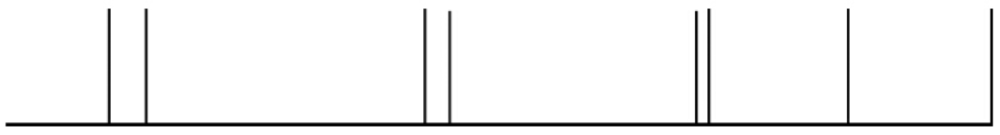

Linux 2.6的早期（Linux2.6.21之前）内核是基于节拍设计的，一般SoC公司在将Linux移植到自己芯片上的时候，会从芯片内部找一个定时器，并将该定时器配置为赫兹的频率，在每个时钟节拍到来时，调用ARM Linux内核核心层的timer_tick（）函数，从而引发系统里的一系列行为。如Linux 2.6.17中arch/arm/mach-s3c2410/time.c的做法类似于代码清单20.1所示。

代码清单20.1　早期内核的节拍驱动

```
 1/*
 2 * IRQ handler for the timer
 3 */
 4static irqreturn_t
 5s3c2410_timer_interrupt(int irq, void *dev_id, struct pt_regs *regs)
 6{
 7        write_seqlock(&xtime_lock);
 8        timer_tick(regs);
 9        write_sequnlock(&xtime_lock);
10        return IRQ_HANDLED;
11}
12
13static struct irqaction s3c2410_timer_irq = {
14        .name           = "S3C2410 Timer Tick",
15        .flags          = SA_INTERRUPT | SA_TIMER,
16        .handler        = s3c2410_timer_interrupt,
17};
18static void __init s3c2410_timer_init (void)
19{
20        s3c2410_timer_setup();
21        setup_irq(IRQ_TIMER4, &s3c2410_timer_irq);
22}
```

代码清单20.1将硬件的TIMER4定时器配置为周期触发中断，每个中断到来就会自动调用内核函数timer_tick（）。

当前Linux多采用无节拍方案，并支持高精度定时器，内核的配置一般会使能NO_HZ（即无节拍，或者说动态节拍）和HIGH_RES_TIMERS。要强调的是无节拍并不是说系统中没有时钟节拍，而是说这个节拍不再像以前那样周期性地产生。无节拍意味着，根据系统的运行情况，以事件驱动的方式动态决定下一个节拍在何时发生。如果画一个时间轴，周期节拍的系统节拍中断发生的时序如图20.1所示：


图20.1　周期节拍的系统节拍中断发生的时序

而NO_HZ的Linux的运行节拍如图20.2所示，看起来则是：两次定时器中断发生的时间间隔可长可短：



图20.2　NO_HZ的运行节拍

在当前的Linux系统中，SoC底层的定时器被实现为一个clock_event_device和clocksource形式的驱动。在clock_event_device结构体中，实现其set_mode（）和set_next_event（）成员函数；在clocksource结构体中，主要实现read（）成员函数。而在定时器中断服务程序中，不再调用timer_tick（），而是调用clock_event_device的event_handler（）成员函数。一个典型SoC的底层节拍定时器驱动形如代码清单20.2所示。

代码清单20.2　新内核基于clocksource和clock_event的节拍驱动

```
 1static irqreturn_t xxx_timer_interrupt(int irq, void *dev_id)
 2{
 3        struct clock_event_device *ce = dev_id;
 4        …
 5        ce->event_handler(ce);
 6
 7        return IRQ_HANDLED;
 8}
 9
10/* read 64-bit timer counter */
11static cycle_t xxx_timer_read(struct clocksource *cs)
12{
13        u64 cycles;
14
15        /* read the 64-bit timer counter */
16        cycles = readl_relaxed(xxx_timer_base + LATCHED_HI);
17        cycles=(cycles<<32)|readl_relaxed(xxx_timer_base + LATCHED_LO);
18
19        return cycles;
20}
21
22static int xxx_timer_set_next_event(unsigned long delta,
23        struct clock_event_device *ce)
24{
25        unsigned long now, next;
26        now = readl_relaxed(xxx_timer_base + LATCHED_LO);
27        next = now + delta;
28        writel_relaxed(next, xxx_timer_base + SIRFSOC_TIMER_MATCH_0);
29        ...
30}
31
32static void xxx_timer_set_mode(enum clock_event_mode mode,
33        struct clock_event_device *ce)
34{
35        switch (mode) {
36        case CLOCK_EVT_MODE_PERIODIC:
37                …
38        case CLOCK_EVT_MODE_ONESHOT:
39                …
40        case CLOCK_EVT_MODE_SHUTDOWN:
41                …
42        case CLOCK_EVT_MODE_UNUSED:
43        case CLOCK_EVT_MODE_RESUME:
44                break;
45        }
46}
47static struct clock_event_device xxx_clockevent = {
48        .name = "xxx_clockevent",
49        .rating = 200,
50        .features = CLOCK_EVT_FEAT_ONESHOT,
51        .set_mode = xxx_timer_set_mode,
52        .set_next_event = xxx_timer_set_next_event,
53};
54
55static struct clocksource xxx_clocksource = {
56        .name = "xxx_clocksource",
57        .rating = 200,
58        .mask = CLOCKSOURCE_MASK(64),
59        .flags = CLOCK_SOURCE_IS_CONTINUOUS,
60        .read = xxx_timer_read,
61        .suspend = xxx_clocksource_suspend,
62        .resume = xxx_clocksource_resume,
63};
64
65static struct irqaction xxx_timer_irq = {
66        .name = "xxx_tick",
67        .flags = IRQF_TIMER,
68        .irq = 0,
69        .handler = xxx_timer_interrupt,
70        .dev_id = &xxx_clockevent,
71};
72
73static void __init xxx_clockevent_init(void)
74{
75        clockevents_calc_mult_shift(&xxx_clockevent, CLOCK_TICK_RATE, 60);
76
77        xxx_clockevent.max_delta_ns =
78                clockevent_delta2ns(-2, &xxx_clockevent);
79        xxx_clockevent.min_delta_ns =
80                clockevent_delta2ns(2, &xxx_clockevent);
81
82        xxx_clockevent.cpumask = cpumask_of(0);
83        clockevents_register_device(&xxx_clockevent);
84}
85
86/* initialize the kernel jiffy timer source */
87static void __init xxx_timer_init(void)
88{
89        …
90        BUG_ON(clocksource_register_hz(&xxx_clocksource, CLOCK_TICK_RATE));
91        BUG_ON(setup_irq(xxx_timer_irq.irq, &xxx_timer_irq));
92        xxx_clockevent_init();
93}
94struct sys_timer xxx_timer = {
95        .init = xxx_timer_init,
96};
```

在上述代码中，我们特别关注如下的函数：

# 1.clock_event_device的set_next_event成员函数xxx_timer_set_next_event（）

该函数的delta参数是Linux内核传递给底层定时器的一个差值，它的含义是下一次节拍中断产生的硬件定时器中计数器的值相对于当前计数器的差值。我们在该函数中将硬件定时器设置为在“当前计数器计数值+delta”的时刻产生下一次节拍中断。xxx_clockevent_init（）函数中设置了可接受的最小和最大delta值对应的纳秒数，即xxx_clockevent.min_delta_ns和xxx_clockevent.max_delta_ns。

# 2.clocksource的read成员函数xxx_timer_read（）

该函数可读取出从开机到当前时刻定时器计数器已经走过的值，无论有没有设置当计数器达到某值时产生中断，硬件的计数总是在进行的（我们要理解，计数总是在进行，而计数到某值后要产生中断则需要软件设置）。因此，该函数给Linux系统提供了一个底层的准确的参考时间。

# 3.定时器的中断服务程序xxx_timer_interrupt（）

在该中断服务程序中，直接调用clock_event_device的event_handler（）成员函数，event_handler（）成员函数的具体工作也是Linux内核根据Linux内核配置和运行情况自行设置的。

# 4.clock_event_device的set_mode成员函数xxx_timer_set_mode（）

用于设置定时器的模式以及恢复、关闭等功能，目前一般采用ONESHOT模式，即一次一次产生中断。当然新版的Linux也可以使用老的周期性模式，如果内核在编译的时候未选择NO_HZ，该底层的定时器驱动依然可以为内核的运行提供支持。

这些函数的结合使得ARM Linux内核底层所需要的时钟得以运行。下面举一个典型的场景，假定定时器的晶振时钟频率为1MHz（即计数器每加1等于1μs），应用程序通过nanosleep（）API睡眠100μs，内核会据此换算出下一次定时器中断的delta值为100，并间接调用xxx_timer_set_next_event（）去设置硬件让其在100μs后产生中断。100μs后，中断产生，xxx_timer_interrupt（）被调用，event_handler（）会间接唤醒睡眠的进程并导致nanosleep（）函数返回，从而让用户进程继续。

这里要特别强调的是，对于多核处理器来说，一般的做法是给每个核分配一个独立的定时器，各个核根据自身的运行情况动态地设置自己时钟中断发生的时刻。看一下我们所运行的ARM vexpress的中断（GIC 29twd）即知：

```
# cat /proc/interrupts
           CPU0       CPU1       CPU2       CPU3
 29:       1548       1511       1501       1484       GIC  29  twd
 34:          7          0          0          0       GIC  34  timer
 36:          0          0          0          0       GIC  36  rtc-pl031
 37:        162         21          2         27       GIC  37  uart-pl011
 41:         88        105        149        121       GIC  41  mmci-pl18x (cmd)
 42:       5449       5443       5450       5863       GIC  42  mmci-pl18x (pio)
 44:          0          8          1          0       GIC  44  kmi-pl050
 45:          0        100          0          0       GIC  45  kmi-pl050
 47:          0          0          0          0       GIC  47  eth0
IPI0:          0          1          1          1  CPU wakeup interrupts
IPI1:          0          0          0          0  Timer broadcast interrupts
IPI2:        454        266        436        642  Rescheduling interrupts
IPI3:          0          1          1          1  Function call interrupts
IPI4:          0          0          0          0  Single function call interrupts
IPI5:          0          0          0          0  CPU stop interrupts
IPI6:          0          0          0          0  IRQ work interrupts
IPI7:          0          0          0          0  completion interrupts
Err:          0
```

而比较低效率的方法则是只给CPU0提供定时器，由CPU0将定时器中断通过IPI（Inter Processor Interrupt，处理器间中断）广播到其他核。对于ARM来讲，1号IPIIPI_TIMER就是来负责这个广播的，从arch/arm/kernel/smp.c可以看出

```
enum ipi_msg_type {
        IPI_WAKEUP,
        IPI_TIMER,
        IPI_RESCHEDULE,
        IPI_CALL_FUNC,
        IPI_CALL_FUNC_SINGLE,
        IPI_CPU_STOP,
};
```

