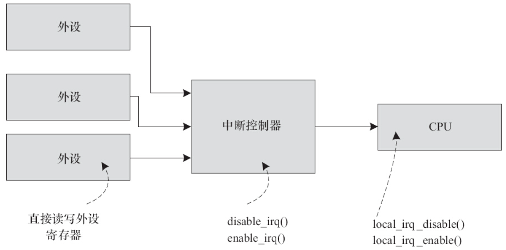
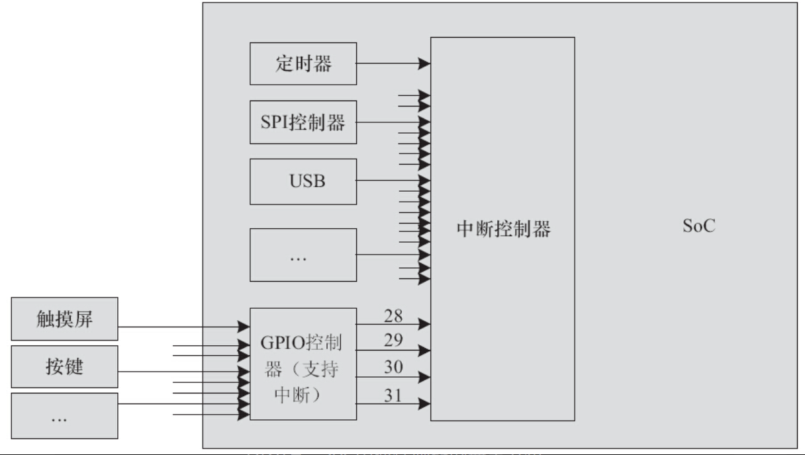
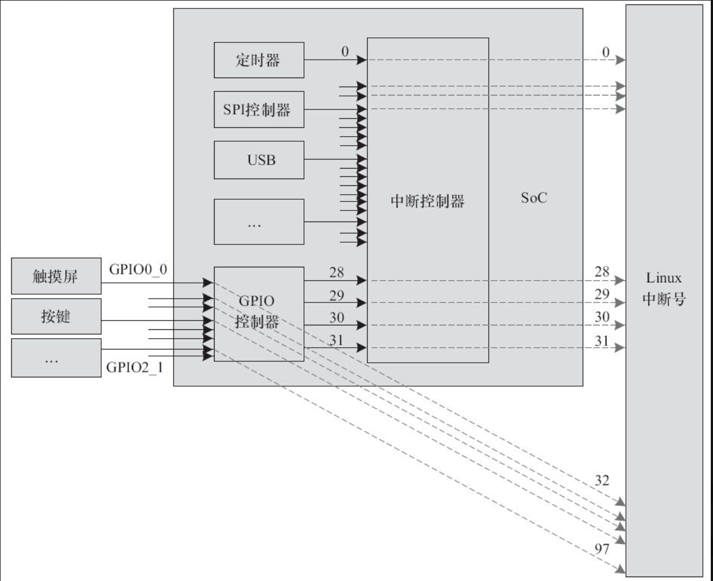

在Linux内核中，各个设备驱动可以简单地调用request_irq（）、enable_irq（）、disable_irq（）、local_irq_disable（）、local_irq_enable（）等通用API来完成中断申请、使能、禁止等功能。在将Linux移植到新的SoC时，芯片供应商需要提供该部分API的底层支持。

local_irq_disable（）、local_irq_enable（）的实现与具体中断控制器无关，对于ARM v6以上的体系结构而言，是直接调用CPSID/CPSIE指令进行，而对于ARM v6以前的体系结构，则是通过MRS、MSR指令来读取和设置ARM的CPSR寄存器。由此可见，local_irq_disable（）、local_irq_enable（）针对的并不是外部的中断控制器，而是直接让CPU本身不响应中断请求。相关的实现位于arch/arm/include/asm/irqflags.h中，如代码清单20.3所示。

代码清单20.3　ARM Linux local_irq_disable（）/enable（）底层实现

```
 1#if __LINUX_ARM_ARCH__ >= 6
 2
 3static inline unsigned long arch_local_irq_save(void)
 4{
 5        unsigned long flags;
 6
 7        asm volatile(
 8                "       mrs     %0, cpsr        @ arch_local_irq_save\n"
 9                "       cpsid   i"
10                : "=r" (flags) : : "memory", "cc");
11        return flags;
12}
13
14static inline void arch_local_irq_enable(void)
15{
16        asm volatile(
17                "       cpsie i                 @ arch_local_irq_enable"
18                :
19                :
20                : "memory", "cc");
21}
22
23static inline void arch_local_irq_disable(void)
24{
25        asm volatile(
26                "       cpsid i                 @ arch_local_irq_disable"
27                :
28                :
29                : "memory", "cc");
30}
31#else
32
33/*
34 * Save the current interrupt enable state & disable IRQs
35 */
36static inline unsigned long arch_local_irq_save(void)
37{
38        unsigned long flags, temp;
39
40        asm volatile(
41                "       mrs     %0, cpsr        @ arch_local_irq_save\n"
42                "       orr     %1, %0, #128\n"
43                "       msr     cpsr_c, %1"
44                : "=r" (flags), "=r" (temp)
45                :
46                : "memory", "cc");
47        return flags;
48}
49
50/*
51 * Enable IRQs
52 */
53static inline void arch_local_irq_enable(void)
54{
55        unsigned long temp;
56        asm volatile(
57                "       mrs     %0, cpsr        @ arch_local_irq_enable\n"
58                "       bic     %0, %0, #128\n"
59                "       msr     cpsr_c, %0"
60                : "=r" (temp)
61                :
62                : "memory", "cc");
63}
64
65/*
66 * Disable IRQs
67 */
68static inline void arch_local_irq_disable(void)
69{
70        unsigned long temp;
71        asm volatile(
72                "       mrs     %0, cpsr        @ arch_local_irq_disable\n"
73                "       orr     %0, %0, #128\n"
74                "       msr     cpsr_c, %0"
75                : "=r" (temp)
76                :
77                : "memory", "cc");
78}
79 #endif
```

与local_irq_disable（）和local_irq_enable（）不同，disable_irq（）、enable_irq（）针对的则是中断控制器，因此它们适用的对象是某个中断。disable_irq（）的字面意思是暂时屏蔽掉某中断（其实在内核的实现层面上做了延后屏蔽），直到enable_irq（）后再执行ISR。实际上，屏蔽中断可以发生在外设、中断控制器、CPU三个位置，如图20.3所示。对于外设端，是从源头上就不产生中断信号给中断控制器，由于它高度依赖于外设于本身，所以Linux不提供标准的API而是由外设的驱动直接读写自身的寄存器。



图20.3　屏蔽中断的3个不同位置

在内核中，通过irq_chip结构体来描述中断控制器。该结构体内部封装了中断mask、unmask、ack等成员函数，其定义于include/linux/irq.h中，如代码清单20.4所示。

代码清单20.4　irq_chip结构体

```
 1struct irq_chip {
 2        const char      *name;
 3        unsigned int    (*irq_startup)(struct irq_data *data);
 4        void            (*irq_shutdown)(struct irq_data *data);
 5        void            (*irq_enable)(struct irq_data *data);
 6        void            (*irq_disable)(struct irq_data *data);
 7
 8        void            (*irq_ack)(struct irq_data *data);
 9        void            (*irq_mask)(struct irq_data *data);
10        void            (*irq_mask_ack)(struct irq_data *data);
11        void            (*irq_unmask)(struct irq_data *data);
12        void            (*irq_eoi)(struct irq_data *data);
13
14        int             (*irq_set_affinity)(struct irq_data *data, const struct
                                       cpumask *dest, bool force);
15        int             (*irq_retrigger)(struct irq_data *data);
16        int             (*irq_set_type)(struct irq_data *data, unsigned int
                                     flow_type);
17        int             (*irq_set_wake)(struct irq_data *data, unsigned int on);
18};
```

各个芯片公司会将芯片内部的中断控制器实现为irq_chip驱动的形式。受限于中断控制器硬件的能力，这些成员函数并不一定需要全部实现，有时候只需要实现其中的部分函数即可。譬如drivers/pinctrl/sirf/pinctrl-sirf.c驱动中的下面代码部分：

```
static struct irq_chip sirfsoc_irq_chip = {
        .name = "sirf-gpio-irq",
        .irq_ack = sirfsoc_gpio_irq_ack,
        .irq_mask = sirfsoc_gpio_irq_mask,
        .irq_unmask = sirfsoc_gpio_irq_unmask,
        .irq_set_type = sirfsoc_gpio_irq_type,
};
```

我们只实现了其中的ack、mask、unmask和set_type成员函数，ack函数用于清中断，mask、unmask用于中断屏蔽和取消中断屏蔽、set_type则用于配置中断的触发方式，如高电平、低电平、上升沿、下降沿等。至于到enable_irq（）的时候，虽然没有实现irq_enable（）成员函数，但是内核会间接调用irq_unmask（）成员函数，这点从kernel/irq/chip.c中可以看出：

```
void irq_enable(struct irq_desc *desc)
{
        irq_state_clr_disabled(desc);
        if (desc->irq_data.chip->irq_enable)
                desc->irq_data.chip->irq_enable(&desc->irq_data);
        else
                desc->irq_data.chip->irq_unmask(&desc->irq_data);
        irq_state_clr_masked(desc);
}
```

在芯片内部，中断控制器可能不止1个，多个中断控制器之间还很可能是级联的。举个例子，假设芯片内部有一个中断控制器，支持32个中断源，其中有4个来源于GPIO控制器外围的4组GPIO，每组GPIO上又有32个中断（许多芯片的GPIO控制器也同时是一个中断控制器），其关系如图20.4所示。



图20.4　SoC中断控制器的典型分布

那么，一般来讲，在实际操作中，gpio0_0~gpio0_31这些引脚本身在第1级会使用中断号28，而这些引脚本身的中断号在实现与GPIO控制器对应的irq_chip驱动时，我们又会把它映射到Linux系统的32~63号中断。同理，gpio1_0~gpio1_31这些引脚本身在第1级会使用中断号29，而这些引脚本身的中断号在实现与GPIO控制器对应的irq_chip驱动时，我们又会把它映射到Linux系统的64~95号中断，以此类推。对于中断号的使用者而言，无须看到这种2级映射关系。如果某设备想申请与gpio1_0这个引脚对应的中断，它只需要申请64号中断即可。这个关系图看起来如图20.5所示。

要特别注意的是，上述图20.4和20.5中所涉及的中断号的数值，无论是base还是具体某个GPIO对应的中断号是多少，都不一定是如图20.4和图20.5所描述的简单线性映射。Linux使用IRQ Domain来描述一个中断控制器所管理的中断源。换句话说，每个中断控制器都有自己的Domain。我们可以将IRQ Domain看作是IRQ控制器的软件抽象。在添加IRQ Domain的时候，内核中存在的映射方法有：irq_domain_add_legacy（）、irq_domain_add_linear（）、irq_domain_add_tree（）等。



图20.5　中断级联与映射

irq_domain_add_legacy（）实际上是一种过时的方法，它一般是由IRQ控制器驱动直接指定中断源硬件意义上的偏移（一般称为hwirq）和Linux逻辑上的中断号的映射关系。类似图20.5的指定映射可以被这种方法弄出来。irq_domain_add_linear（）则在中断源和irq_desc之间建立线性映射，内核针对这个IRQ Domain维护了一个hwirq和Linux逻辑IRQ之间关系的一个表，这个时候我们其实也完全不关心逻辑中断号了；irq_domain_add_tree（）则更加灵活，逻辑中断号和hwirq之间的映射关系是用一棵radix树来描述的，我们需要通过查找的方法来寻找hwirq和Linux逻辑IRQ之间的关系，一般适合某中断控制器支持非常多中断源的情况。

实际上，在当前的内核中，中断号更多的是一个逻辑概念，具体数值是多少不是很关键。人们更多的是关心在设备树中设置正确的interrupt_parrent和相对该interrupt_parent的偏移。

以drivers/pinctrl/sirf/pinctrl-sirf.c的irq_chip部分为例，在sirfsoc_gpio_probe（）函数中，每组GPIO的中断都通过gpiochip_set_chained_irqchip（）级联到上一级中断控制器的中断。

代码清单20.5　二级GPIO中断级联到一级中断控制器

```
 1static int sirfsoc_gpio_probe(struct device_node *np)
 2{
 3...
 4for (i = 0; i < SIRFSOC_GPIO_NO_OF_BANKS; i++) {
 5       bank = &sgpio->sgpio_bank[i];
 6       spin_lock_init(&bank->lock);
 7       bank->parent_irq = platform_get_irq(pdev, i);
 8       if (bank->parent_irq < 0) {
 9               err = bank->parent_irq;
10               goto out_banks;
11       }
12
13       gpiochip_set_chained_irqchip(&sgpio->chip.gc,
14               &sirfsoc_irq_chip,
15               bank->parent_irq,
16               sirfsoc_gpio_handle_irq);
17}
18
19...
20}
```

对于SIRFSOC_GPIO_NO_OF_BANKS这么多组GPIO进行循环，上述代码中第15行的bank->parent_irq是与这一组GPIO对应的“上级”中断号，sirfsoc_gpio_handle_irq（）则是与bank->parent_irq对应的“上级”中断服务程序。而sirfsoc_gpio_handle_irq（）这个“上级”函数最终还是要调用GPIO这一级别的中断服务程序。

在sirfsoc_gpio_handle_irq（）函数的入口处调用chained_irq_enter（）暗示自身进入链式IRQ处理，在函数体内判决具体的GPIO中断，并通过generic_handle_irq（）调用最终的外设驱动中的中断服务程序，最后调用chained_irq_exit（）暗示自身退出链式IRQ处理，如代码清单20.6所示。

代码清单20.6　“上级”中断服务程序派生到下级

```
 1static void sirfsoc_gpio_handle_irq(unsigned int irq, struct irq_desc *desc)
 2{
 3...
 4chained_irq_enter(chip, desc);
 5
 6while (status) {
 7       ctrl = readl(sgpio->chip.regs + SIRFSOC_GPIO_CTRL(bank->id, idx));
 8
 9       /*
10        * Here we must check whether the corresponding GPIO’s interrupt
11        * has been enabled, otherwise just skip it
12        */
13       if ((status & 0x1) && (ctrl & SIRFSOC_GPIO_CTL_INTR_EN_MASK)) {
14              generic_handle_irq(irq_find_mapping(gc->irqdomain, idx +
15                             bank->id * SIRFSOC_GPIO_BANK_SIZE));
16       }
17
18       idx++;
19       status = status >> 1;
20}
21
22chained_irq_exit(chip, desc);
23}
```

下面用一个实例来呈现这个过程，假设GPIO0_0~31对应上级中断号28，而外设A使用了GPIO0_5（即第0组GPIO的第5个），并假定外设A的中断号为37，即32+5，中断服务程序为deva_isr（）。那么，当GPIO0_5中断发生的时候，内核的调用顺序是：sirfsoc_gpio_handle_irq（）->generic_handle_irq（）->deva_isr（）。如果硬件的中断系统有更深的层次，这种软件上的中断服务程序级联实际上可以有更深的级别。

在上述实例中，GPIO0_0~31的interrupt_parrent实际是上级中断控制器，而外设A的interrupt_parrent就是GPIO0，这些都会在设备树中进行呈现。

很多中断控制器的寄存器定义呈现出简单的规律，如有一个mask寄存器，其中每1位可屏蔽1个中断等，在这种情况下，我们无须实现1个完整的irq_chip驱动，而可以使用内核提供的通用irq_chip驱动架构irq_chip_generic，这样只需要实现极少量的代码，如drivers/irqchip/irq-sirfsoc.c中，用于注册CSR SiRFprimaII内部中断控制器的代码（见代码清单20.7）。

代码清单20.7　使用generic的irq_chip框架

```
 1static __init void
 2sirfsoc_alloc_gc(void __iomem *base, unsigned int irq_start, unsigned int num)
 3{
 4        struct irq_chip_generic *gc;
 5        struct irq_chip_type *ct;
 6        int ret;
 7        unsigned int clr = IRQ_NOREQUEST | IRQ_NOPROBE | IRQ_NOAUTOEN;
 8        unsigned int set = IRQ_LEVEL;
 9
10        ret = irq_alloc_domain_generic_chips(sirfsoc_irqdomain,num, 1, "irq_sirfsoc",
11               handle_level_irq, clr, set, IRQ_GC_INIT_MASK_CACHE);
12
13        gc = irq_get_domain_generic_chip(sirfsoc_irqdomain, irq_start);
14        gc->reg_base = base;
15        ct = gc->chip_types;
16        ct->chip.irq_mask = irq_gc_mask_clr_bit;
17        ct->chip.irq_unmask = irq_gc_mask_set_bit;
18        ct->regs.mask = SIRFSOC_INT_RISC_MASK0;
19}
```

irq_chip驱动的入口声明方法形如：

```
IRQCHIP_DECLARE(sirfsoc_intc, "sirf,prima2-intc", sirfsoc_irq_init);
```

sirf，prima2-intc是设备树中中断控制器的compatible字段，sirfsoc_irq_init是匹配这个compatible字段后运行的初始化函数。

特别值得一提的是，目前多数主流ARM芯片内部的一级中断控制器都使用了ARM公司的GIC，我们几乎不需要实现任何代码，只需要在设备树中添加相关的节点。

如在arch/arm/boot/dts/exynos5250.dtsi中即含有：

```
gic:interrupt-controller@10481000 {
        compatible = "arm,cortex-a9-gic";
        #interrupt-cells = <3>;
        interrupt-controller;
        reg = <0x10481000 0x1000>, <0x10482000 0x2000>;
};
```

打开drivers/irqchip/irq-gic.c，发现GIC驱动的入口声明如下：

```
IRQCHIP_DECLARE(gic_400, "arm,gic-400", gic_of_init);
IRQCHIP_DECLARE(cortex_a15_gic, "arm,cortex-a15-gic", gic_of_init);
IRQCHIP_DECLARE(cortex_a9_gic, "arm,cortex-a9-gic", gic_of_init);
IRQCHIP_DECLARE(cortex_a7_gic, "arm,cortex-a7-gic", gic_of_init);
IRQCHIP_DECLARE(msm_8660_qgic, "qcom,msm-8660-qgic", gic_of_init);
IRQCHIP_DECLARE(msm_qgic2, "qcom,msm-qgic2", gic_of_init);
```

这说明drivers/irqchip/irq-gic.c这个驱动可以兼容arm，gic-400、arm，cortex-a15-gic、arm，cortex-a7-gic等，但是初始化函数都是统一的gic_of_init。