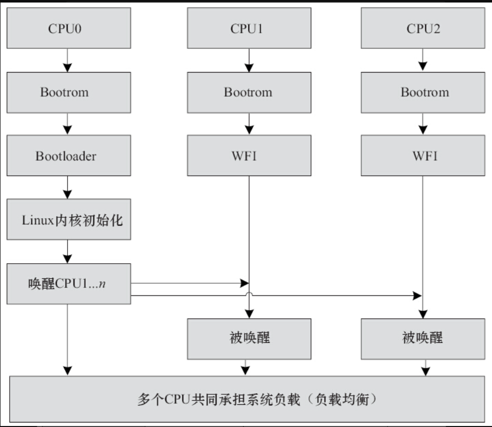
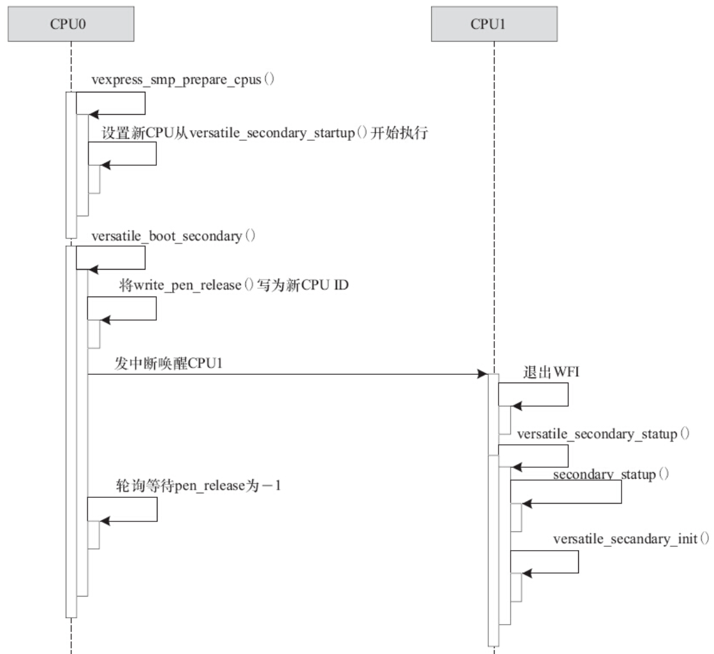

在Linux系统中，对于多核的ARM芯片而言，在Bootrom代码中，每个CPU都会识别自身ID，如果ID是0，则引导Bootloader和Linux内核执行，如果ID不是0，则Bootrom一般在上电时将自身置于WFI或者WFE状态，并等待CPU0给其发CPU核间中断或事件（一般通过SEV指令）以唤醒它。一个典型的多核Linux启动过程如图20.6所示。

被CPU0唤醒的CPUn可以在运行过程中进行热插拔，譬如运行如下命令即可卸载CPU1，并且将CPU1上的任务全部迁移到其他CPU中：

```
# echo 0 > /sys/devices/system/cpu/cpu1/online
```

同理，运行如下命令可以再次启动CPU1：

```
# echo 1 > /sys/devices/system/cpu/cpu1/online
```

之后CPU1会主动参与系统中各个CPU之间要运行任务的负载均衡工作。



图20.6　一个典型的多核Linux启动过程

CPU0唤醒其他CPU的动作在内核中被封装为一个smp_operations的结构体，对于ARM而言，它定义于arch/arm/include/asm/smp.h中。该结构体的成员函数如代码清单20.8所示。

代码清单20.8　smp_operations结构体

```
 1struct smp_operations {
 2#ifdef CONFIG_SMP
 3        /*
 4         * Setup the set of possible CPUs (via set_cpu_possible)
 5         */
 6        void (*smp_init_cpus)(void);
 7        /*
 8         * Initialize cpu_possible map, and enable coherency
 9         */
10        void (*smp_prepare_cpus)(unsigned int max_cpus);
11
12        /*
13         * Perform platform specific initialisation of the specified CPU.
14         */
15        void (*smp_secondary_init)(unsigned int cpu);
16        /*
17         * Boot a secondary CPU, and assign it the specified idle task.
18         * This also gives us the initial stack to use for this CPU.
19         */
20        int  (*smp_boot_secondary)(unsigned int cpu, struct task_struct *idle);
21#ifdef CONFIG_HOTPLUG_CPU
22        int  (*cpu_kill)(unsigned int cpu);
23        void (*cpu_die)(unsigned int cpu);
24        int  (*cpu_disable)(unsigned int cpu);
25#endif
26#endif
27};
```

我们从arch/arm/mach-vexpress/v2m.c中看到VEXPRESS电路板用到的smp_ops（）为vexpress_smp_ops：

```
DT_MACHINE_START(VEXPRESS_DT, "ARM-Versatile Express")
        .dt_compat      = v2m_dt_match,
        .smp            = smp_ops(vexpress_smp_ops),
        .map_io         = v2m_dt_map_io,
        …
MACHINE_END
```

通过arch/arm/mach-vexpress/platsmp.c的实现代码可以看出，smp_operations的成员函数smp_init_cpus（），即vexpress_smp_init_cpus（）调用的ct_ca9x4_init_cpu_map（）会探测SoC内CPU核的个数，并通过set_cpu_possible（）设置这些CPU可见。

而smp_operations的成员函数smp_prepare_cpus（），即vexpress_smp_prepare_cpus（）则会通过v2m_flags_set（virt_to_phys（versatile_secondary_startup））设置其他CPU的启动地址为versatile_secondary_startup，如代码清单20.9所示。

代码清单20.9　在smp_prepare_cpus（）中设置CPU1...n的启动地址

```
 1static void __init vexpress_smp_prepare_cpus(unsigned int max_cpus)
 2{
 3        …
 4
 5        /*
 6         * Write the address of secondary startup into the
 7         * system-wide flags register. The boot monitor waits
 8         * until it receives a soft interrupt, and then the
 9         * secondary CPU branches to this address.
10         */
11        v2m_flags_set(virt_to_phys(versatile_secondary_startup));
12}
```

注意这部分的具体实现方法是与SoC相关的，由芯片的设计以及芯片内部的Bootrom决定。对于VEXPRESS来讲，设置方法如下：

```
void __init v2m_flags_set(u32 data)
{
        writel(~0, v2m_sysreg_base + V2M_SYS_FLAGSCLR);
        writel(data, v2m_sysreg_base + V2M_SYS_FLAGSSET);
}
```

即填充v2m_sysreg_base+V2M_SYS_FLAGSCLR标记清除寄存器为0xFFFFFFFF，将CPU1...n初始启动执行的指令地址填入v2m_sysreg_base+V2M_SYS_FLAGSSET寄存器。这两个地址由芯片实现时内部的Bootrom程序设定的。填入CPU1...n的起始地址都通过virt_to_phys（）转化为物理地址，因为此时CPU1...n的MMU尚未开启。

比较关键的是smp_operations的成员函数smp_boot_secondary（），对于本例而言为versatile_boot_secondary（），它完成CPU的最终唤醒工作，如代码清单20.10所示。

代码清单20.10　CPU0通过中断唤醒其他CPU

```
 1static void write_pen_release(int val)
 2{
 3pen_release = val;
 4smp_wmb();
 5sync_cache_w(&pen_release);
 6}
 7
 8int versatile_boot_secondary(unsigned int cpu, struct task_struct *idle)
 9{
10unsigned long timeout;
11...
12/*
13 * This is really belt and braces; we hold unintended secondary
14 * CPUs in the holding pen until we’re ready for them.  However,
15 * since we haven’t sent them a soft interrupt, they shouldn’t
16 * be there.
17 */
18write_pen_release(cpu_logical_map(cpu));
19
20/*
21 * Send the secondary CPU a soft interrupt, thereby causing
22 * the boot monitor to read the system wide flags register,
23 * and branch to the address found there.
24 */
25arch_send_wakeup_ipi_mask(cpumask_of(cpu));
26
27timeout = jiffies + (1 * HZ);
28while (time_before(jiffies, timeout)) {
29        smp_rmb();
30        if (pen_release == -1)
31               break;
32
33        udelay(10);
34}
35...
36return pen_release != -1   -ENOSYS : 0;
37}
```

上述代码第18行调用的write_pen_release（）会将pen_release变量设置为要唤醒的CPU核的CPU号cpu_logical_map（cpu），而后通过arch_send_wakeup_ipi_mask（）给要唤醒的CPU发IPI中断，这个时候，被唤醒的CPU会退出WFI状态并从前面smp_operations中的smp_prepare_cpus（）成员函数，即vexpress_smp_prepare_cpus（）里通过v2m_flags_set（）设置的起始地址versatile_secondary_startup开始执行，如果顺利的话，该CPU会将原先为正数的pen_release写为-1，以便CPU0从等待pen_release成为-1的循环（见第28~34行）中跳出。

versatile_secondary_startup实现于arch/arm/plat-versatile/headsmp.S中，是一段汇编，如代码清单20.11所示。

代码清单20.11　被唤醒CPU的执行入口

```
 1ENTRY(versatile_secondary_startup)
 2        mrc     p15, 0, r0, c0, c0, 5
 3        and     r0, r0, #15
 4        adr     r4, 1f
 5        ldmia   r4, {r5, r6}
 6        sub     r4, r4, r5
 7        add     r6, r6, r4
 8pen:    ldr     r7, [r6]
 9        cmp     r7, r0
10        bne     pen
11
12        /*
13         * we’ve been released from the holding pen: secondary_stack
14         * should now contain the SVC stack for this core
15         */
16        b       secondary_startup
17
18        .align
191:      .long   .
20        .long   pen_release
21ENDPROC(versatile_secondary_startup)
```

上述代码第8~10行的循环是等待pen_release变量成为CPU0设置的cpu_logical_map（cpu），一般直接就成立了。第16行则调用内核通用的secondary_startup（）函数，经过一系列的初始化（如MMU等），最终新的被唤醒的CPU将调用smp_operations的smp_secondary_init（）成员函数，对于本例为versatile_secondary_init（），如代码清单20.12所示。

代码清单20.12　被唤醒的CPU恢复pen_release（）

```
 1void versatile_secondary_init(unsigned int cpu)
 2{
 3        /*
 4         * let the primary processor know we’re out of the
 5         * pen, then head off into the C entry point
 6         */
 7        write_pen_release(-1);
 8
 9        /*
10         * Synchronise with the boot thread.
11         */
12        spin_lock(&boot_lock);
13        spin_unlock(&boot_lock);
14}
```

上述代码第7行会将pen_release写为-1，于是CPU0还在执行的代码清单20.10里versatile_boot_secondary（）函数中的如下循环就退出了：

```
while (time_before(jiffies, timeout)) {
        smp_rmb();
        if (pen_release == -1)
                break;
        udelay(10);
}
```

这样CPU0就知道目标CPU已经被正确地唤醒，此后CPU0和新唤醒的其他CPU各自运行。整个系统在运行过程中会进行实时进程和正常进程的动态负载均衡。

图20.7总结性地描述了前文提到的vexpress_smp_prepare_cpus（）、versatile_boot_secondary（）、write_pen_release（）、versatile_secondary_startup（）、versatile_secondary_init（）这些函数的执行顺序。



图20.7　CPU0唤醒其他CPU过程

CPU热插拔的实现也是与芯片相关的，对于VEXPRESS而言，实现了smp_operations的cpu_die（）成员函数，即vexpress_cpu_die（）。它会在进行CPUn的拔除操作时将CPUn投入低功耗的WFI状态，相关代码位于arch/arm/mach-vexpress/hotplug.c中，如代码清单20.13所示。

代码清单20.13　smp_operations的cpu_die（）成员函数案例

```
 1void __ref vexpress_cpu_die(unsigned int cpu)
 2{
 3        int spurious = 0;
 4
 5        /*
 6         * we’re ready for shutdown now, so do it
 7         */
 8        cpu_enter_lowpower();
 9        platform_do_lowpower(cpu, &spurious);
10
11        /*
12         * bring this CPU back into the world of cache
13         * coherency, and then restore interrupts
14         */
15        cpu_leave_lowpower();
16
17        if (spurious)
18                pr_warn("CPU%u: %u spurious wakeup calls\n", cpu, spurious);
19}
20static inline void platform_do_lowpower(unsigned int cpu, int *spurious)
21{
22        /*
23         * there is no power-control hardware on this platform, so all
24         * we can do is put the core into WFI; this is safe as the calling
25         * code will have already disabled interrupts
26         */
27        for (;;) {
28                wfi();
29
30                if (pen_release == cpu_logical_map(cpu)) {
31                        /*
32                         * OK, proper wakeup, we're done
33                         */
34                        break;
35                }
36
37                /*
38                 * Getting here, means that we have come out of WFI without
39                 * having been woken up - this shouldn’t happen
40                 *
41                 * Just note it happening - when we’re woken, we can report
42                 * its occurrence.
43                 */
44                (*spurious)++;
45        }
46}
```

CPUn睡眠于wfi（），之后再次在线的时候，又会因为CPU0给它发出的IPI而从wfi（）函数返回继续执行，醒来时CPUn也判断“pen_release==cpu_logical_map（cpu）”是否成立，以确定该次醒来确实是由CPU0唤醒的一次正常醒来。