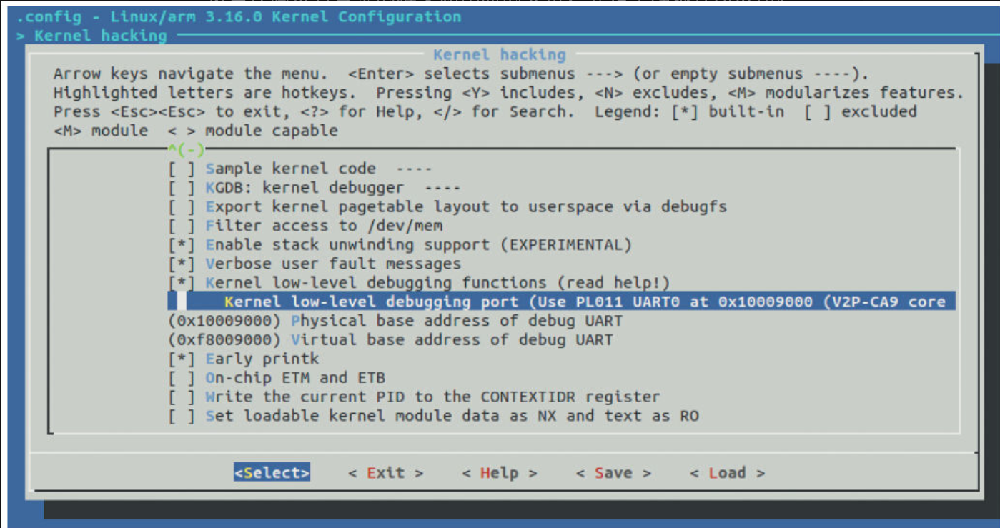

在Linux启动的早期，控制台驱动还没有投入运行。当我们把Linux移植到一个新的SoC时，工程师一般非常想在刚开始就可以执行printk（）功能以跟踪调试启动过程。内核的DEBUG_LL和EARLY_PRINTK选项为我们提供了这样的支持，而在Bootloader引导内核执行的bootargs中，则需要使能earlyprintk选项。

为了让DEBUG_LL和EARLY_PRINTK可以运行，在Linux内核中需实现早期解压过程打印需要的putc（）和后续的addruart、senduart和waituart等宏。以CSR SiRFprimaII为例，相关的代码实现于arch/arm/include/debug/sirf.S中，如代码清单20.14所示。

为了让DEBUG_LL和EARLY_PRINTK可以运行，在Linux内核中需实现早期解压过程打印需要的putc（）和后续的addruart、senduart和waituart等宏。以CSR SiRFprimaII为例，相关的代码实现于arch/arm/include/debug/sirf.S中，如代码清单20.14所示。

代码清单20.14　DEBUG_LL端口的驱动

```
 1.macroaddruart, rp, rv, tmp
 2ldr\rp, =SIRFSOC_UART1_PA_BASE    @ physical
 3ldr\rv, =SIRFSOC_UART1_VA_BASE    @ virtual
 4.endm
 5
 6.macrosenduart,rd,rx
 7str\rd, [\rx, #SIRFSOC_UART_TXFIFO_DATA]
 8.endm
 9
10.macrobusyuart,rd,rx
11.endm
12
13.macrowaituart,rd,rx
141001:ldr\rd, [\rx, #SIRFSOC_UART_TXFIFO_STATUS]
15tst\rd, #SIRFSOC_UART1_TXFIFO_EMPTY
16beq1001b
17.endm
```

这些代码没有复杂的框架和中断的支持，只是单纯地往UART的TX FIFO寄存器写要发送的数据。其中的senduart完成了往UART的FIFO丢打印字符的过程。waituart则相当于一个流量握手，等待FIFO为空。这些宏最终会被内核的arch/arm/kernel/debug.S引用

而对于本书与vexpress QEMU对应的实验平台而言，相应的驱动则位于arch/arm/include/debug/pl01x.S中，同样是实现了类似的宏。

在配置内核的时候，要进行正确的配置。譬如，对于vepress的实验板子，我们选择的就是“Kernel low-level debugging port（Use PL011UART0at 0x10009000（V2P-CA9core tile））”，对应的UART类型为PL01X，如图20.8所示。



图20.8　配置DEBUG_LL的端口

arch/arm/Kconfig.debug会根据用户的配置选择对应的arch/arm/include/debug/xxx.S，譬如：

```
config DEBUG_LL_INCLUDE
   string
   default "debug/8250.S" if DEBUG_LL_UART_8250 || DEBUG_UART_8250
   default "debug/pl01x.S" if DEBUG_LL_UART_PL01X || DEBUG_UART_PL01X
   default "debug/sirf.S" if DEBUG_SIRFPRIMA2_UART1 || DEBUG_SIRFMARCO_UART1
```

上述配置选项对应的CONFIG_DEBUG_LL_INCLUDE这个宏会被内核的arch/arm/boot/compressed/debug.S、arch/arm/boot/compressed/head.S、arch/arm/kernel/debug.S和arch/arm/kernel/head.S以“#include CONFIG_DEBUG_LL_INCLUDE”的形式引用。