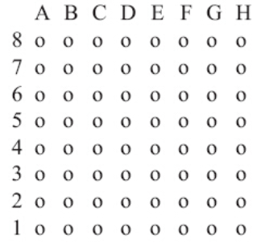
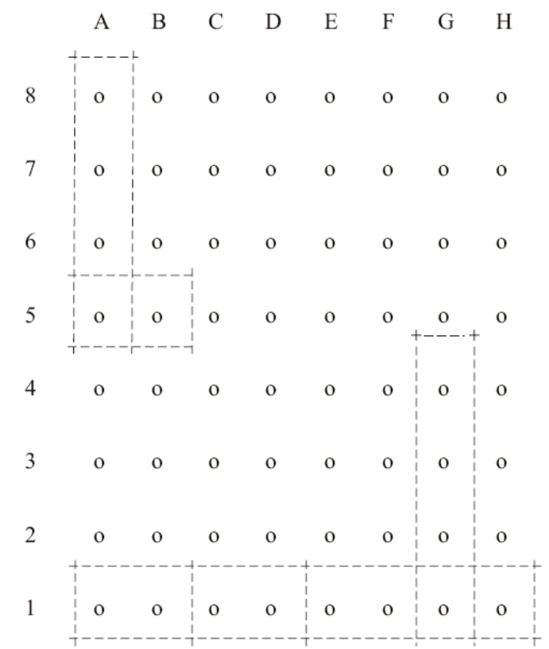

许多SoC内部都包含pin控制器，通过pin控制器的寄存器，我们可以配置一个或者一组引脚的功能和特性。在软件上，Linux内核的pinctrl驱动可以操作pin控制器为我们完成如下工作：

- ·枚举并且命名pin控制器可控制的所有引脚；
- ·提供引脚复用的能力；
- ·提供配置引脚的能力，如驱动能力、上拉下拉、开漏（Open Drain）等。

# 1.pinctrl和引脚

在特定SoC的pinctrl驱动中，我们需要定义引脚。假设有一个PGA封装的芯片的引脚排布如图20.9所示。



图20.9　一个PGA封装的芯片的引脚排布

在pinctrl驱动初始化的时候，需要向pinctrl子系统注册一个pinctrl_desc描述符，该描述符的pins成员中包含所有引脚的列表。可以通过代码清单20.16的方法来注册这个pin控制器并命名它的所有引脚。

代码清单20.16　pinctrl引脚描述

```
 1#include <linux/pinctrl/pinctrl.h>
 2
 3const struct pinctrl_pin_desc foo_pins[] = {
 4      PINCTRL_PIN(0, "A8"),
 5      PINCTRL_PIN(1, "B8"),
 6      PINCTRL_PIN(2, "C8"),
 7      ...
 8      PINCTRL_PIN(61, "F1"),
 9      PINCTRL_PIN(62, "G1"),
10      PINCTRL_PIN(63, "H1"),
11};
12
13static struct pinctrl_desc foo_desc = {
14        .name = "foo",
15        .pins = foo_pins,
16        .npins = ARRAY_SIZE(foo_pins),
17        .maxpin = 63,
18        .owner = THIS_MODULE,
19};
20
21int __init foo_probe(void)
22{
23        struct pinctrl_dev *pctl;
24
25        pctl = pinctrl_register(&foo_desc, <PARENT>, NULL);
26        if (IS_ERR(pctl))
27                pr_err("could not register foo pin driver\n");
28}
```

# 2.引脚组（Pin Group）

在pinctrl子系统中，支持将一组引脚绑定为同一功能。假设{0，8，16，24}这一组引脚承担SPI的功能，而{24，25}这一组引脚承担I2 C接口功能。在驱动的代码中，需要体现这个分组关系，并且为这些分组实现pinctrl_ops的成员函数get_groups_count（）、get_group_name（）和get_group_pins（），将pinctrl_ops填充到前文pinctrl_desc的实例foo_desc中，如代码清单20.17所示。

代码清单20.17　pinctrl驱动对引脚分组

```
 1#include <linux/pinctrl/pinctrl.h>
 2
 3struct foo_group {
 4        const char *name;
 5        const unsigned int *pins;
 6        const unsigned num_pins;
 7};
 8
 9static const unsigned int spi0_pins[] = { 0, 8, 16, 24 };
10static const unsigned int i2c0_pins[] = { 24, 25 };
11
12static const struct foo_group foo_groups[] = {
13        {
14                .name = "spi0_grp",
15                .pins = spi0_pins,
16                .num_pins = ARRAY_SIZE(spi0_pins),
17        },
18        {
19                .name = "i2c0_grp",
20                .pins = i2c0_pins,
21                .num_pins = ARRAY_SIZE(i2c0_pins),
22        },
23};
24
25
26static int foo_get_groups_count(struct pinctrl_dev *pctldev)
27{
28        return ARRAY_SIZE(foo_groups);
29}
30
31static const char *foo_get_group_name(struct pinctrl_dev *pctldev,
32                                       unsigned selector)
33{
34        return foo_groups[selector].name;
35}
36
37static int foo_get_group_pins(struct pinctrl_dev *pctldev, unsigned selector,
38                              unsigned ** const pins,
39                              unsigned * const num_pins)
40{
41        *pins = (unsigned *) foo_groups[selector].pins;
42        *num_pins = foo_groups[selector].num_pins;
43        return 0;
44}
45
46static struct pinctrl_ops foo_pctrl_ops = {
47        .get_groups_count = foo_get_groups_count,
48        .get_group_name = foo_get_group_name,
49        .get_group_pins = foo_get_group_pins,
50};
51
52
53static struct pinctrl_desc foo_desc = {
54       ...
55       .pctlops = &foo_pctrl_ops,
56};
```

get_groups_count（）成员函数用于告知pinctrl子系统该SoC中合法的被选引脚组有多少个，而get_group_name（）则提供引脚组的名字，get_group_pins（）提供引脚组的引脚表。在设备驱动调用pinctrl通用API使能某一组引脚的对应功能时，pinctrl子系统的核心层会调用上述回调函数。

# 3.引脚配置

设备驱动有时候需要配置引脚，譬如可能把引脚设置为高阻或者三态（达到类似断连引脚的效果），或通过某阻值将引脚上拉/下拉以确保默认状态下引脚的电平状态。在驱动中可以自定义相应板级引脚配置API的细节，譬如某设备驱动可能通过如下代码将某引脚上拉：

```
#include <linux/pinctrl/consumer.h>
ret = pin_config_set("foo-dev", "FOO_GPIO_PIN", PLATFORM_X_PULL_UP);
```

其中的PLATFORM_X_PULL_UP由特定的pinctrl驱动定义。在特定的pinctrl驱动中，需要实现完成这些配置所需要的回调函数（pinctrl_desc的confops成员函数），如代码清单20.18所示。

代码清单20.18　引脚的配置

```
 1#include <linux/pinctrl/pinctrl.h>
 2#include <linux/pinctrl/pinconf.h>
 3#include "platform_x_pindefs.h"
 4
 5static int foo_pin_config_get(struct pinctrl_dev *pctldev,
 6                    unsigned offset,
 7                    unsigned long *config)
 8{
 9        struct my_conftype conf;
10
11        ... Find setting for pin @ offset ...
12
13        *config = (unsigned long) conf;
14}
15
16static int foo_pin_config_set(struct pinctrl_dev *pctldev,
17                    unsigned offset,
18                    unsigned long config)
19{
20        struct my_conftype *conf = (struct my_conftype *) config;
21
22        switch (conf) {
23                case PLATFORM_X_PULL_UP:
24                ...
25                }
26        }
27}
28
29static int foo_pin_config_group_get (struct pinctrl_dev *pctldev,
30                    unsigned selector,
31                    unsigned long *config)
32{
33       ...
34}
35
36static int foo_pin_config_group_set (struct pinctrl_dev *pctldev,
37                    unsigned selector,
38                    unsigned long config)
39{
40       ...
41}
42
43static struct pinconf_ops foo_pconf_ops = {
44        .pin_config_get = foo_pin_config_get,
45        .pin_config_set = foo_pin_config_set,
46        .pin_config_group_get = foo_pin_config_group_get,
47        .pin_config_group_set = foo_pin_config_group_set,
48};
49
50/* Pin config operations are handled by some pin controller */
51static struct pinctrl_desc foo_desc = {
52        ...
53        .confops = &foo_pconf_ops,
54};
```

其中的pin_config_group_get（）、pin_config_group_set（）针对的是可同时配置一个引脚组的状态情况，而pin_config_get（）、pin_config_set（）针对的则是单个引脚的配置。

# 4.与GPIO子系统的交互

pinctrl驱动所覆盖的引脚可同时作为GPIO用，内核的GPIO子系统和pinctrl子系统本来是并行工作的，但是有时候需要交叉映射，在这种情况下，需要在pinctrl驱动中告知pinctrl子系统核心层GPIO与底层pinctrl驱动所管理的引脚之间的映射关系。假设pinctrl驱动中定义的引脚32~47与gpio_chip实例chip_a的GPIO对应，引脚64~71与gpio_chip实例chip_b的GPIO对应，即映射关系为：

```
chip a:
  - GPIO range : [32 .. 47]
  - pin range  : [32 .. 47]
chip b:
  - GPIO range : [48 .. 55]
  - pin range  : [64 .. 71]
```

则在特定pinctrl驱动中可以通过如下代码注册两个GPIO范围，如代码清单20.19所示。

代码清单20.19　GPIO与pinctrl引脚的映射

```
 1struct gpio_chip chip_a;
 2struct gpio_chip chip_b;
 3
 4static struct pinctrl_gpio_range gpio_range_a = {
 5        .name = "chip a",
 6        .id = 0,
 7        .base = 32,
 8        .pin_base = 32,
 9        .npins = 16,
10        .gc = &chip_a;
11};
12
13static struct pinctrl_gpio_range gpio_range_b = {
14        .name = "chip b",
15        .id = 0,
16        .base = 48,
17        .pin_base = 64,
18        .npins = 8,
19        .gc = &chip_b;
20};
21
22{
23        struct pinctrl_dev *pctl;
24        ...
25        pinctrl_add_gpio_range(pctl, &gpio_range_a);
26        pinctrl_add_gpio_range(pctl, &gpio_range_b);
27}
```

在基于内核gpiolib的GPIO驱动中，若设备驱动需进行GPIO申请gpio_request（）和释放gpio_free（），GPIO驱动则会调用pinctrl子系统中的pinctrl_request_gpio（）和pinctrl_free_gpio（）通用API，pinctrl子系统会查找申请的GPIO和引脚的映射关系，并确认引脚是否被其他复用功能所占用。与pinctrl子系统通用层pinctrl_request_gpio（）和pinctrl_free_gpio（）API对应，在底层的具体pinctrl驱动中，需要实现pinmux_ops结构体的gpio_request_enable（）和gpio_disable_free（）成员函数。

# 5.引脚复用（pinmux）

在pinctrl驱动中可处理引脚复用，它定义了功能（FUNCTIONS），驱动可以设置某功能的使能或者禁止。各个功能联合起来组成一个一维数组，譬如{spi0，i2c0，mmc0}就描述了3个不同的功能。

一个特定的功能总是要求由一些引脚组来完成，引脚组的数量可以为1个或者多个。假设对前文所描述的PGA封装的SoC而言，引脚分组如图20.10所示。

假设I2 C功能由{A5，B5}引脚组成，而在定义引脚描述的pinctrl_pin_desc结构体实例foo_pins的时候，将它们的序号定义为了{24，25}；而SPI功能则可以由{A8，A7，A6，A5}和{G4，G3，G2，G1}，即{0，8，16，24}和{38，46，54，62}两个引脚组完成（注意在整个系统中，引脚组的名字不会重叠）。

据此，由功能和引脚组的组合就可以决定一组引脚在系统里的作用，因此在设置某组引脚的作用时，pinctrl的核心层会将功能的序号以及引脚组的序号传递给底层pinctrl驱动中相关的回调函数。



图20.10　针对PGA封装的SoC的引脚分组

在整个系统中，驱动或板级代码调用pinmux相关的API获取引脚后，会形成一个pinctrl、使用引脚的设备、功能、引脚组的映射关系，假设在某电路板上，将让spi0设备使用pinctrl0的fspi0功能以及gspi0引脚组，让i2c0设备使用pinctrl0的fi2c0功能和gi2c0引脚组，我们将得到如下的映射关系：

```
{
  {"map-spi0", spi0, pinctrl0, fspi0, gspi0},
  {"map-i2c0", i2c0, pinctrl0, fi2c0, gi2c0}
}
```

pinctrl子系统的核心会保证每个引脚的排他性，因此一个引脚如果已经被某设备用掉了，而其他的设备又申请该引脚以行使其他的功能或GPIO，则pinctrl核心层会让该次申请失败。

在特定pinctrl驱动中pinmux相关的代码主要处理如何使能/禁止某一{功能，引脚组}的组合，譬如，当spi0设备申请pinctrl0的fspi0功能和gspi0引脚组以便将gspi0引脚组配置为SPI接口时，相关的回调函数被组织进一个pinmux_ops结构体中，而该结构体的实例最终成为前文pinctrl_desc的pmxops成员，如代码清单20.20所示

代码清单20.20　pinmux的实现

```
  1#include <linux/pinctrl/pinctrl.h>
  2#include <linux/pinctrl/pinmux.h>
  3
  4struct foo_group {
  5        const char *name;
  6        const unsigned int *pins;
  7        const unsigned num_pins;
  8};
  9
 10static const unsigned spi0_0_pins[] = { 0, 8, 16, 24 };
 11static const unsigned spi0_1_pins[] = { 38, 46, 54, 62 };
 12static const unsigned i2c0_pins[] = { 24, 25 };
 13static const unsigned mmc0_1_pins[] = { 56, 57 };
 14static const unsigned mmc0_2_pins[] = { 58, 59 };
 15static const unsigned mmc0_3_pins[] = { 60, 61, 62, 63 };
 16
 17static const struct foo_group foo_groups[] = {
 18        {
 19                .name = "spi0_0_grp",
 20                .pins = spi0_0_pins,
 21                .num_pins = ARRAY_SIZE(spi0_0_pins),
 22        },
 23        {
 24                .name = "spi0_1_grp",
 25                .pins = spi0_1_pins,
 26                .num_pins = ARRAY_SIZE(spi0_1_pins),
 27        },
 28        {
 29                .name = "i2c0_grp",
 30                .pins = i2c0_pins,
 31                .num_pins = ARRAY_SIZE(i2c0_pins),
 32        },
 33        {
 34                .name = "mmc0_1_grp",
 35                .pins = mmc0_1_pins,
 36                .num_pins = ARRAY_SIZE(mmc0_1_pins),
 37        },
 38        {
 39                .name = "mmc0_2_grp",
 40                .pins = mmc0_2_pins,
 41                .num_pins = ARRAY_SIZE(mmc0_2_pins),
 42        },
 43        {
 44                .name = "mmc0_3_grp",
 45                .pins = mmc0_3_pins,
 46                .num_pins = ARRAY_SIZE(mmc0_3_pins),
 47        },
 48};
 49
 50
 51static int foo_get_groups_count(struct pinctrl_dev *pctldev)
 52{
 53        return ARRAY_SIZE(foo_groups);
 54}
 55
 56static const char *foo_get_group_name(struct pinctrl_dev *pctldev,
 57                                       unsigned selector)
 58{
 59        return foo_groups[selector].name;
 60}
 61
 62static int foo_get_group_pins(struct pinctrl_dev *pctldev, unsigned selector,
 63                              unsigned ** const pins,
 64                              unsigned * const num_pins)
 65{
 66        *pins = (unsigned *) foo_groups[selector].pins;
 67        *num_pins = foo_groups[selector].num_pins;
 68        return 0;
 69}
 70
 71static struct pinctrl_ops foo_pctrl_ops = {
 72        .get_groups_count = foo_get_groups_count,
 73        .get_group_name = foo_get_group_name,
 74        .get_group_pins = foo_get_group_pins,
 75};
 76
 77struct foo_pmx_func {
 78        const char *name;
 79        const char * const *groups;
 80        const unsigned num_groups;
 81};
 82
 83static const char * const spi0_groups[] = { "spi0_0_grp", "spi0_1_grp" };
 84static const char * const i2c0_groups[] = { "i2c0_grp" };
 85static const char * const mmc0_groups[] = { "mmc0_1_grp", "mmc0_2_grp",
 86                                        "mmc0_3_grp" };
 87
 88static const struct foo_pmx_func foo_functions[] = {
 89        {
 90                .name = "spi0",
 91                .groups = spi0_groups,
 92                .num_groups = ARRAY_SIZE(spi0_groups),
 93        },
 94        {
 95                .name = "i2c0",
 96                .groups = i2c0_groups,
 97                .num_groups = ARRAY_SIZE(i2c0_groups),
 98        },
 99        {
100                .name = "mmc0",
101                .groups = mmc0_groups,
102                .num_groups = ARRAY_SIZE(mmc0_groups),
103        },
104};
105
106int foo_get_functions_count(struct pinctrl_dev *pctldev)
107{
108        return ARRAY_SIZE(foo_functions);
109}
110
111const char *foo_get_fname(struct pinctrl_dev *pctldev, unsigned selector)
112{
113        return foo_functions[selector].name;
114}
115
116static int foo_get_groups(struct pinctrl_dev *pctldev, unsigned selector,
117                          const char * const **groups,
118                          unsigned * const num_groups)
119{
120        *groups = foo_functions[selector].groups;
121        *num_groups = foo_functions[selector].num_groups;
122        return 0;
123}
124
125int foo_enable(struct pinctrl_dev *pctldev, unsigned selector,
126                unsigned group)
127{
128        u8 regbit = (1 << selector + group);
129
130        writeb((readb(MUX)|regbit), MUX)
131        return 0;
132}
133
134void foo_disable(struct pinctrl_dev *pctldev, unsigned selector,
135                unsigned group)
136{
137        u8 regbit = (1 << selector + group);
138
139        writeb((readb(MUX) & ~(regbit)), MUX)
140        return 0;
141}
142
143struct pinmux_ops foo_pmxops = {
144        .get_functions_count = foo_get_functions_count,
145        .get_function_name = foo_get_fname,
146        .get_function_groups = foo_get_groups,
147        .enable = foo_enable,
148        .disable = foo_disable,
149};
150
151/* Pinmux operations are handled by some pin controller */
152static struct pinctrl_desc foo_desc = {
153        ...
154        .pctlops = &foo_pctrl_ops,
155        .pmxops = &foo_pmxops,
156};
```

具体的pinctrl、使用引脚的设备、功能、引脚组的映射关系，可以在板文件中通过定义pinctrl_map结构体的实例来展开，如：

```
static struct pinctrl_map __initdata mapping[] = {
   PIN_MAP_MUX_GROUP("foo-i2c.o", PINCTRL_STATE_DEFAULT, "pinctrl-foo", NULL, "i2c0"),
};
```

又由于1个功能可由两个不同的引脚组实现，所以对于同1个功能可能形成有两个可选引脚组的pinctrl_map：

```
static struct pinctrl_map __initdata mapping[] = {
        PIN_MAP_MUX_GROUP("foo-spi.0", "spi0-pos-A", "pinctrl-foo", "spi0_0_grp", "spi0"),
        PIN_MAP_MUX_GROUP("foo-spi.0", "spi0-pos-B", "pinctrl-foo", "spi0_1_grp", "spi0"),
};
```

其中调用的PIN_MAP_MUX_GROUP是一个快捷宏，用于赋值pinctrl_map的各个成员：

```
#define PIN_MAP_MUX_GROUP(dev, state, pinctrl, grp, func)               \
        {                                                               \
                .dev_name = dev,                                        \
                .name = state,                                          \
                .type = PIN_MAP_TYPE_MUX_GROUP,                         \
                .ctrl_dev_name = pinctrl,                               \
                .data.mux = {                                           \
                        .group = grp,                                   \
                        .function = func,                               \
                },                                                      \
        }
```

当然，这种映射关系最好是在设备树中通过节点的属性进行，具体的节点属性的定义方法依赖于具体的pinctrl驱动，最终在pinctrl驱动中通过pinctrl_ops结构体的.dt_node_to_map（）成员函数读出属性并建立映射表。

在运行时，我们可以通过类似的API去查找并设置位置A的引脚组以行驶SPI接口的功能：

```
p = devm_pinctrl_get(dev);
s = pinctrl_lookup_state(p, "spi0-pos-A ");
ret = pinctrl_select_state(p, s)
```

或者可以更加简单地使用：

```
p = devm_pinctrl_get_select(dev, "spi0-pos-A");
```

若想在运行时切换位置A和B的引脚组以行使SPI的接口功能，代码结构类似清单20.21所示。

代码清单20.21　pinctrl_lookup_state（）和pinctrl_select_stat（）

```
 1foo_probe()
 2{
 3        /* Setup */
 4        p = devm_pinctrl_get(&device);
 5        if (IS_ERR(p))
 6                ...
 7
 8        s1 = pinctrl_lookup_state(foo->p, " spi0-pos-A");
 9        if (IS_ERR(s1))
10                ...
11
12        s2 = pinctrl_lookup_state(foo->p, " spi0-pos-B");
13        if (IS_ERR(s2))
14                ...
15}
16
17foo_switch()
18{
19        /* Enable on position A */
20        ret = pinctrl_select_state(s1);
21        if (ret < 0)
22            ...
23
24        ...
25
26        /* Enable on position B */
27        ret = pinctrl_select_state(s2);
28        if (ret < 0)
29            ...
30
31        ...
32}
```

对于"default"状态下的引脚配置，驱动一般不需要完成devm_pinctrl_get_select（dev，"default"）的调用。譬如对于arch/arm/boot/dts/prima2-evb.dts中的如下引脚组：

```
peri-iobg {
        uart@b0060000 {
                pinctrl-names = "default";
                pinctrl-0 = <&uart1_pins_a>;
        };
        spi@b00d0000 {
                pinctrl-names = "default";
                pinctrl-0 = <&spi0_pins_a>;
        };
        spi@b0170000 {
                pinctrl-names = "default";
                pinctrl-0 = <&spi1_pins_a>;
        };
};
```

由于pinctrl-names都是"default"的，所以pinctrl核实际会自动做类似devm_pinctrl_get_select（dev，"default"）的操作。