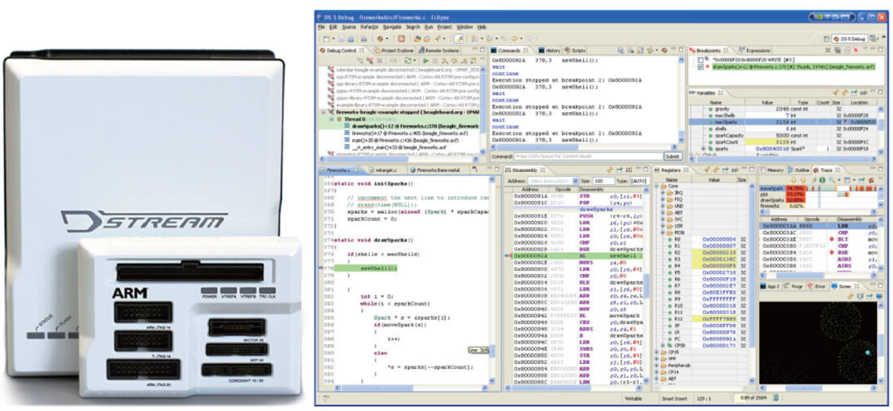
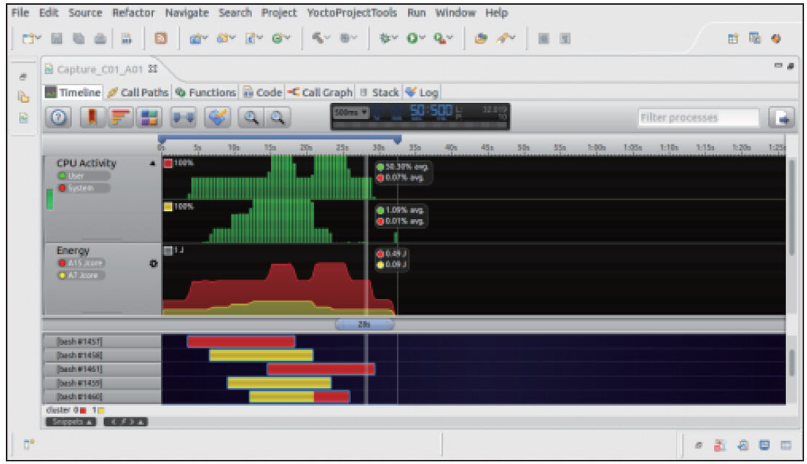

在ARM Linux领域，目前比较主流的是采用ARM DS-5Development Studio方案。ARM DS-5是一个针对基于Linux的系统和裸机嵌入式系统的专业软件开发解决方案，它涵盖了开发的所有阶段，从启动代码、内核移植直到应用程序调试、分析。如图21.7所示，它使用了DSTREAM高性能仿真器（ARM已经停止更新RVI-RVT2仿真器），在Eclipse内包含了DS-5和DSTREAM的开发插件。

调试主机一般通过网线与DSTREAM仿真器连接，而仿真器则连接与电路板类似的JTAG接口，之后用DS-5调试器进行调试。DS-5图形化调试器提供了全面和直观的调试图，非常易于调试Linux和裸机程序，易于查看代码，进行栈回溯，查看内存、寄存器、表达式、变量，分析内核线程，设置断点。

图21.7　DSTREAM仿真器和DS-5开发环境

值得一提的是，DS-5也提供了Streamline Performance Analyzer。ARM Streamline性能分析器（见图21.8）为软件开发人员提供了一种用来分析和优化在ARM926、ARM11和Cortex-A系列平台上运行的Linux和Android系统的直观方法。使用Streamline，Linux内核中需包含一个gator模块，用户空间则需要使能gatord后台服务器程序。关于Streamline具体的操作方法可以查看《ARM® DS-5Using ARM Streamline》。

图21.8　ARMStreamline性能分析器