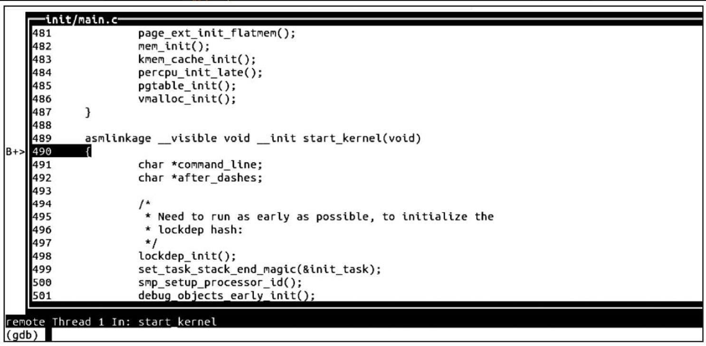

在嵌入式系统中，由于目标机资源有限，因此往往在主机上先编译好程序，再在目标机上运行。用户所有的开发工作都在主机开发环境下完成，包括编码、编译、连接、下载和调试等。目标机和主机通过串口、以太网、仿真器或其他通信手段通信，主机用这些接口控制目标机，调试目标机上的程序。

调试嵌入式Linux内核的方法如下。

1）目标机“插桩”，如打上KGDB补丁，这样主机上的GDB可与目标机的KGDB通过串口或网口通信。

2）使用仿真器，仿真器可直接连接目标机的JTAG/BDM，这样主机的GDB就可以通过与仿真器的通信来控制目标机。

3）在目标板上通过printk（）、Oops、strace等软件方法进行“观察”调试，这些方法不具备查看和修改数据结构、断点、单步等功能。

21.4~21.7节将对这些调试方法进行一一讲解。

不管是目标机“插桩”还是使用仿真器连接目标机JTAG/SWD/BDM，在主机上，调试工具一般都采用GDB。

GDB可以直接把Linux内核当成一个整体来调试，这个过程实际上可以被QEMU模拟出来。进入本书配套Ubuntu的/home/baohua/develop/linux/extra目录下，修改run-nolcd.sh的脚本，将其从

```
   qemu-system-arm -nographic -sd vexpress.img -M vexpress-a9 -m 512M -kernel
zImage -dtb vexpress-v2p-ca9.dtb  -smp 4 -append "init=/linuxrc root=/dev/
mmcblk0p1 rw rootwait e  arlyprintk console=ttyAMA0" 2>/dev/null
```

改为：

```
   qemu-system-arm –s –S -nographic -sd vexpress.img -M vexpress-a9 -m 512M -kernel
zImage -dtb vexpress-v2p-ca9.dtb  -smp 4 -append "init=/linuxrc root=/dev/
mmcblk0p1 rw rootwait e  arlyprintk console=ttyAMA0" 2>/dev/null
```

即添加-s–S选项，则会使嵌入式ARM Linux系统等待GDB远程连入。在终端1运行新的./run-nolcd.sh，这样嵌入式ARM Linux的模拟平台在1234端口侦听。开一个新的终端2，进入/home/baohua/develop/linux/，执行如下代码：

```
baohua@baohua-VirtualBox:~/develop/linux$ arm-linux-gnueabihf-gdb ./vmlinux
GNU gdb (crosstool-NG linaro-1.13.1-4.8-2013.05 - Linaro GCC 2013.05) 7.6-2013.05
Copyright (C) 2013 Free Software Foundation, Inc.
License GPLv3+: GNU GPL version 3 or later <http://gnu.org/licenses/gpl.html>
This is free software: you are free to change and redistribute it.
There is NO WARRANTY, to the extent permitted by law.  Type "show copying"
and "show warranty" for details.
This GDB was configured as "--host=i686-build_pc-linux-gnu --target=arm-linux-gnueabihf".
For bug reporting instructions, please see:
<https://bugs.launchpad.net/gcc-linaro>...
Reading symbols from /home/baohua/develop/linux/vmlinux...done.
(gdb)
```

接下来我们远程连接127.0.0.1：1234

```
(gdb) target remote 127.0.0.1:1234
Remote debugging using 127.0.0.1:1234
0x60000000 in ?? ()
```

设置一个断点到start_kernel（）。

```
(gdb) b start_kernel
Breakpoint 1 at 0x805fd8ac: file init/main.c, line 490.
```

继续运行：

```
(gdb) c
Continuing.
Breakpoint 1, start_kernel () at init/main.c:490
490  {
(gdb)
```

断点停在了内核启动过程中的start_kernel（）函数，这个时候我们按下Ctrl+X，A键，可以看到代码，如图21.4所示。

进一步，可以看看jiffies值之类的：

```
(gdb) p jiffies
$1 = 775612
(gdb) c
Continuing.
^C
Program received signal SIGINT, Interrupt.
cpu_v7_do_idle () at arch/arm/mm/proc-v7.S:74
74       ret lr
(gdb) p jiffies
$2 = 775687
(gdb)
```



图21.4　GDB调试内核

尽管采用“插桩”和仿真器结合GDB的方式可以查看和修改数据结构、断点、单步等，而printk（）这种最原始的方法却应用得更广泛。

printk（）这种方法很原始，但是一般可以解决工程中95%以上的问题。因此具体何时打印，以及打印什么东西，需要工程师逐步建立敏锐的嗅觉。加深对内核的认知，深入理解自己正在调试的模块，这才是快速解决问题的“王道”。工具只是一个辅助手段，无法代替工程师的思维。

工程师不能抱着得过且过的心态，也不能总是一知半解地进行低水平的重复建设。求知欲望对工程师技术水平的提升有着最关键的作用。