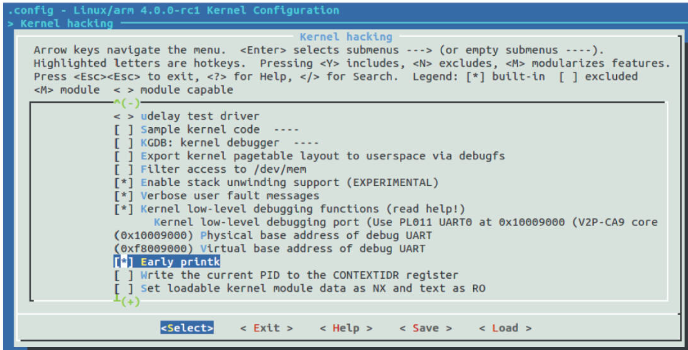

DEBUG_LL对应内核的Kernel low-level debugging功能，EARLY_PRINTK则对应内核中一个早期的控制台。为了在内核的drivers/tty/serial下的控制台驱动初始化之前支持打印，可以选择DEBUG_LL和EARLY_PRINTK这两个配置选项。另外，也需要在bootargs中设置earlyprintk的选项。

对于LDDD3_vexpress而言，没有DEBUG_LL和EARLY_PRINTK的时候，我们看到的内核最早的打印是：

```
Booting Linux on physical CPU 0x0
Initializing cgroup subsys cpuset
Linux version …
```

如果我们使能DEBUG_LL和EARLY_PRINTK，选择如图21.5所示的“Use PL011UART0at 0x10009000（V2P-CA9core tile）”这个低级别调试口，并在bootargs中设置earlyprintk，则我们看到了更早的打印信息：

```
Uncompressing Linux... done, booting the kernel.
```



图21.5　选择低级别调试UART