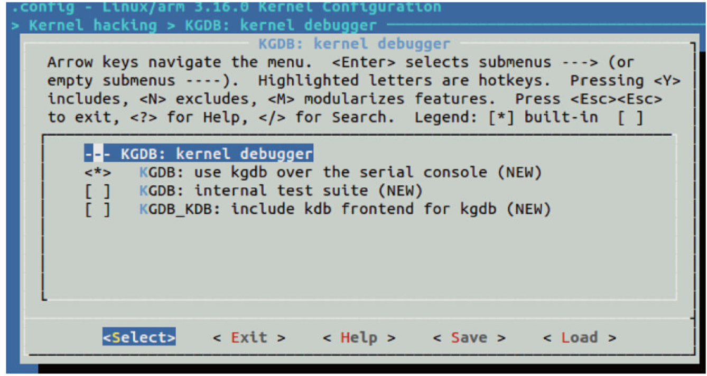

Linux直接提供了对KGDB的支持，KGDB采用了典型的嵌入式系统“插桩”技巧，一般依赖于串口与调试主机通信。为了支持KGDB，串口驱动应该实现纯粹的轮询收发单一字符的成员函数，以供drivers/tty/serial/kgdboc.c调用，譬如drivers/tty/serial/8250/8250_core.c中的：

```
static struct uart_ops serial8250_pops = {
      …
#ifdef CONFIG_CONSOLE_POLL
       .poll_get_char = serial8250_get_poll_char,
       .poll_put_char = serial8250_put_poll_char,
#endif
};
```

在编译内核时，运行make ARCH=arm menuconfig时需选择关于KGDB的编译项目，如图21.6所示。



图21.6　KGDB编译选项配置

对于目标板而言，需要在bootargs中设置与KGDB对应的串口等信息，如kgdboc=ttyS0，115200kgdbcon。

如果想一开机内核就直接进入等待GDB连接的调试状态，可以在bootargs中设置kgdbwait，kgdbwait的含义是启动时就等待主机的GDB连接。而若想在内核启动后进入GDB调试模式，可运行echo g>/proc/sysrq_trigger命令给内核传入一个键值是g的magic_sysrq。

在调试PC上，依次运行如下命令就可以启动调试并连接至目标机（假设串口在PC上对应的设备节点是/dev/ttyS0）：

```
# arm-eabi-gdb ./vmlinux
(gdb) set remotebaud 115200
(gdb) target remote /dev/ttyS0                              //连接目标机
(gdb)
```

之后，在主机上，我们可以使用GDB像调试应用程序一样调试使能了KGDB的目标机上的内核。