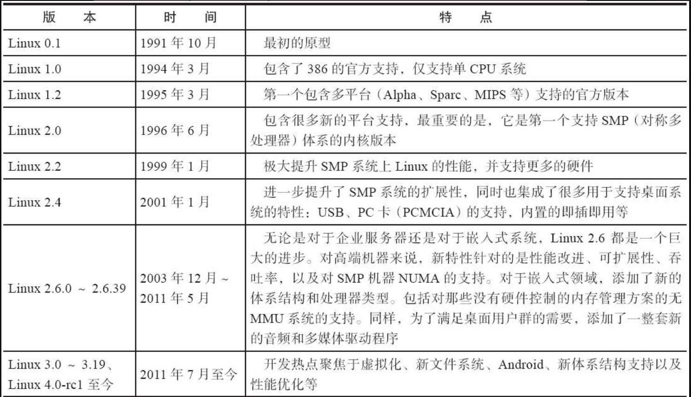
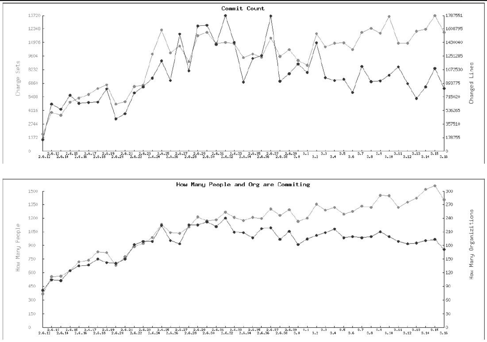

Linux操作系统是UNIX操作系统的一种克隆系统，是一种类UNIX操作系统，诞生于1991年10月5日（第一次正式向外公布的时间），起初的作者是Linus Torvalds。Linux操作系统的诞生、发展和成长过程依赖着5个重要支柱：UNIX操作系统、Minix操作系统、GNU计划、POSIX标准和Internet。

# 1.UNIX操作系统

UNIX操作系统是美国贝尔实验室的Ken.Thompson和Dennis Ritchie于1969年夏在DEC PDP-7小型计算机上开发的一个分时操作系统。Linux操作系统可看作UNIX操作系统的一个克隆版本。

# 2.Minix操作系统

Minix操作系统也是UNIX的一种克隆系统，它于1987年由著名计算机教授Andrew S.Tanenbaum开发完成。有开放源代码的Minix系统的出现在全世界的大学中刮起了学习UNIX系统的旋风。Linux刚开始就是参照Minix系统于1991年开发的。

# 3.GNU计划

GNU计划和自由软件基金会（FSF）是由Richard M.Stallman于1984年创办的，GNU是“GNU's Not UNIX”的缩写。到20世纪90年代初，GNU项目已经开发出许多高质量的免费软件，其中包括emacs编辑系统、bash shell程序、gcc系列编译程序、GDB调试程序等。这些软件为Linux操作系统的开发创造了一个合适的环境，是Linux诞生的基础之一。没有GNU软件环境，Linux将寸步难行。因此，严格来说，“Linux”应该称为“GNU/Linux”系统

下面从左到右依次为前文所提到的5位大师Linus Torvalds、Dennis Ritchie、Ken.Thompson、Andrew S.Tanenbaum、Richard M.Stallman。但愿我们能够追随大师的足迹，让自己不断地成长与进步。Linus Torvalds的一番话甚为有道理：“Most good programmers do programming not because they expect to get paid or get adulation by the public，but because it is fun to program.”技术成长的源动力应该是兴趣而非其他，只有兴趣才可以支撑一个人持续不断地十年如一日地努力与学习。Linus Torvalds本人，虽然已经是一代大师，仍然在不断地管理和合并Linux内核的代码。这点，在国内浮躁的学术氛围之下，几乎是不可思议的。我想，中国梦至少包含每个码农都可以因为技术成长而得到人生出彩的机会。


# 4.POSIX标准

POSIX（Portable Operating System Interface，可移植的操作系统接口）是由IEEE和ISO/IEC开发的一组标准。该标准基于现有的UNIX实践和经验完成，描述了操作系统的调用服务接口，用于保证编写的应用程序可以在源代码级上在多种操作系统中移植。该标准在推动Linux操作系统朝着正规化发展，是Linux前进的灯塔。

# 5.互联网

如果没有互联网，没有遍布全世界的无数计算机骇客的无私奉献，那么Linux最多只能发展到Linux 0.13（0.95）版本的水平。从Linux 0.95版开始，对内核的许多改进和扩充均以其他人为主了，而Linus以及其他维护者的主要任务开始变成对内核的维护和决定是否采用某个补丁程序。

表3.1描述了Linux操作系统重要版本的变迁历史及各版本的主要特点



Linux内核通常以2~3个月为周期更新一次大的版本号，如Linux 2.6.34是在2010年5月发布的，Linux 2.6.35的发布时间则为2010年8月。Linux 2.6的最后一个版本是Linux 2.6.39，之后Linux内核过渡到Linux 3.0版本，同样以2~3个月为周期更新小数点后第一位。因此，内核Linux 3.x时代，Linux 3和Linux 2.6的地位对等，因此，Linux 2.6时代的版本变更是Linux 2.6.N~2.6.N+1以2~3个月为周期递进，而Linux 3.x时代后，则是Linux 3.N~3.N+1以2~3个月为周期递进。Linux 3.x的最后一个版本是Linux 3.19。

在Linux内核版本发布后，还可以进行一个修复bug或者少量特性的反向移植（Backport，即把新版本中才有的补丁移植到已经发布的老版本中）的工作，这样的版本以小数点后最后一位的形式发布，如Linux 2.6.35.1、Linux 2.6.35.2、Linux 3.10.1和Linux 3.10.2等。此类已经发布的版本的维护版本通常是由Greg Kroah-Hartman等人进行管理的。Greg Kroah-Hartman是名著LDD3（《Linux设备驱动（第3版）》的作者之一。

关于Linux内核从Linux 2.6.39变更为Linux 3.0的变化，按照Linus Torvalds的解释，并没有什么大的改变：“NOTHING.Absolutely nothing.Sure，we have the usual two thirds driver changes，and a lot of random fixes，but the point is that 3.0is*just*about renumbering，we are very much*not*doing a KDE-4or a Gnome-3here.No breakage，no special scary new features，nothing at all like that.”因此，简单来说，版本号变更为“3.x”的原因就是“我喜欢”。

关于Linux内核每一个版本具体的变更，可以参考网页http://kernelnewbies.org/LinuxVersions ，比如Linux 3.15针对Linux 3.14的变更归纳在：http://kernelnewbies.org/Linux_3.15 。

就在本书写作的过程中，2015年2月23日，也迎来了Linux 4.0-rc1的诞生，而理由仍然是那么“无厘头”：

```
..after extensive statistical analysis of my G+ polling，I've come to the inescapable conclusion that internet polls are bad.
Big surprise.
But"Hurr durr I'ma sheep"trounced"I like online polls"by a 62-to-38%margin，in a poll that people weren't even supposed to participate in.
Who can argue with solid numbers like that 5796 votes from people who can't even follow the most basic directions
In contrast，"v4.0"beat out"v3.20"by a slimmer margin of 56-to-44%，but with a total of 29110 votes right now.
Now，arguably，that vote spread is only about 3200 votes，which is less than the almost six thousand votes that the"please ignore"poll got，so it could be considered noise.
But hey，I asked，so I'll honor the votes.
```

从表3.1可以看出，Linux的开发一直朝着支持更多的CPU、硬件体系结构和外部设备，支持更广泛领域的应用，提供更好的性能这3个方向发展。按照现在的状况，Linux内核本身基本没有大的路线图，完全是根据使用Linux内核的企业和个人的需求，被相应的企业和个人开发出来并贡献给Linux产品线的。简单地说，Linux内核是一个演变而不是一个设计。关于Linux的近期热点和走向，可以参考位于http://www.linuxfoundation.org/news-media/lwf 的《Linux Weather 

除了Linux内核本身可提供免费下载以外，一些厂商封装了Linux内核和大量有用的软件包、中间件、桌面环境和应用程序，制定了针对桌面PC和服务器的Linux发行版（Distro），如Ubuntu、Red Hat、Fedora、Debian、SuSe、Gentoo等，国内的红旗Linux开发商中科红旗则已经宣布倒闭。

再者，针对嵌入式系统的应用，一些集成和优化内核、开发工具、中间件和UI框架的嵌入式Linux被开发出来了，例如MontaVista Linux、Mentor Embedded Linux、MeeGo、Tizen、Firefox OS等。

Android采用Linux内核，但是在内核里加入了一系列补丁，如Binder、ashmem、wakelock、low memory killer、RAM_CONSOLE等，目前，这些补丁中的绝大多数已经进入Linux的产品线。

图3.1显示了Linux 2.6.13以来每个内核版本参与的人、组织的情况以及每次版本演进的时候被改变的代码行数和补丁的数量。目前每次版本升级，都有分布于200多个组织超过1000人提交代码，被改变的代码行数超过100万行，补丁数量达1万个。



图3.1　Linux内核开发人员和补丁情况