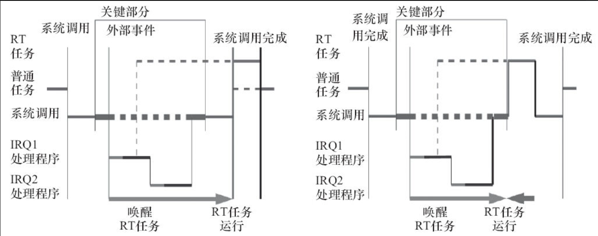

Linux 2.6内核是Linux开发者群落一个寄予厚望的版本，从2003年12月直至2011年7月，内核重新进行了版本的编号，从而过渡到Linux 3.x版本直到成书时的Linux 4.0-rc1。

Linux 2.6相对于Linux 2.4有相当大的改进，主要体现在如下几个方面。

# 1.新的调度器

Linux 2.6以后版本的Linux内核使用了新的进程调度算法，它在高负载的情况下有极其出色的性能，并且当有很多处理器时也可以很好地扩展。在Linux内核2.6的早期采用了O（1）算法，之后转移到CFS（Completely Fair Scheduler，完全公平调度）算法。在Linux 3.14中，也增加了一个新的调度类：SCHED_DEADLINE，它实现了EDF（Earliest Deadline First，最早截止期限优先）调度算法。

# 2.内核抢占

在Linux 2.6以后版本的Linux内核中，一个内核任务可以被抢占，从而提高系统的实时性。这样做最主要的优势在于，可以极大地增强系统的用户交互性，用户将会觉得鼠标单击和击键的事件得到了更快速的响应。Linux 2.6以后的内核版本还是存在一些不可抢占的区间，如中断上下文、软中断上下文和自旋锁锁住的区间，如果给Linux内核打上RT-Preempt补丁，则中断和软中断都被线程化了，自旋锁也被互斥体替换，Linux内核变得能支持硬实时。

如图3.2所示，左侧是Linux 2.4，右侧是Linux 2.6以后的内核。在Linux 2.4的内核中，在IRQ1的中断服务程序唤醒RT（实时）任务后，必须要等待前面一个Normal（普通）任务的系统调用完成，返回用户空间的时候，RT任务才能切入；而在Linux 2.6内核中，Normal任务的关键部分（如自旋锁）结束的时候，RT任务就从内核切入了。不过也可以看出，Linux 2.6以后的内核仍然存在中断、软中断、自旋锁等原子上下文进程无法抢占执行的情况，这是Linux内核本身只提供软实时能力的原因。

图3.2　Linux 2.4和2.6以后的内核在抢占上的区别

# 3.改进的线程模型

Linux 2.6以后版本中的线程采用NPTL（Native POSIX Thread Library，本地POSIX线程库）模型，操作速度得以极大提高，相比于Linux 2.4内核时代的LinuxThreads模型，它也更加遵循POSIX规范的要求。NPTL没有使用LinuxThreads模型中采用的管理线程，内核本身也增加了FUTEX（Fast Userspace Mutex，快速用户态互斥体），从而减小多线程的通信开销。

# 4.虚拟内存的变化

从虚拟内存的角度来看，新内核融合了r-map（反向映射）技术，显著改善虚拟内存在一定大小负载下的性能。在Linux 2.4中，要回收页时，内核的做法是遍历每个进程的所有PTE以判断该PTE是否与该页建立了映射，如果建立了，则取消该映射，最后无PTE与该页相关联后才回收该页。在Linux 2.6后，则建立反向映射，可以通过页结构体快速寻找到页面的映射。

# 5.文件系统

Linux 2.6版内核增加了对日志文件系统功能的支持，解决了Linux 2.4版本在这方面的不足。Linux 2.6版内核在文件系统上的关键变化还包括对扩展属性及POSIX标准访问控制的支持。ext2/ext3/ext4作为大多数Linux系统默认安装的文件系统，在Linux 2.6版内核中增加了对扩展属性的支持，可以给指定的文件在文件系统中嵌入元数据。

在文件系统方面，当前的研究热点是基于B树的Btrfs，Btrfs称为是下一代Linux文件系统，它在扩展性、数据一致性、多设备管理和针对SSD的优化等方面都优于ext4

# 6.音频

高级Linux音频体系结构（Advanced Linux Sound Architecture，ALSA）取代了缺陷很多旧的OSS（Open Sound System）。ALSA支持USB音频和MIDI设备，并支持全双工重放等功能。

# 7.总线、设备和驱动模型

在Linux 2.6以后的内核中，总线、设备、驱动三者之间因为一定的联系性而实现对设备的控制。总线是三者联系起来的基础，通过一种总线类型，将设备和驱动联系起来。总线类型中的match（）函数用来匹配设备和驱动，当匹配操作完成之后就会执行驱动程序中的probe（）函数。

# 8.电源管理

支持高级配置和电源接口（Advanced Configuration and Power Interface，ACPI），用于调整CPU在不同的负载下工作于不同的时钟频率以降低功耗。目前，Linux内核的电源管理（PM）相对比较完善了，包括CPUFreq、CPUIdle、CPU热插拔、设备运行时（runtime）PM、Linux系统挂起到内存和挂起到硬盘等全套的支持，在ARM上的支持也较完备。

# 9.联网和IPSec

Linux 2.6内核中加入了对IPSec的支持，删除了原来内核内置的HTTP服务器khttpd，加入了对新的NFSv4（网络文件系统）客户机/服务器的支持，并改进了对IPv6的支持。

# 10.用户界面层

Linux 2.6内核重写了帧缓冲/控制台层，人机界面层还加入了对近乎所有接口设备的支持（从触摸屏到盲人用的设备和各种各样的鼠标）。

在设备驱动程序方面，Linux 2.6相对于Linux 2.4也有较大的改动，这主要表现在内核API中增加了不少新功能（例如内存池）、sysfs文件系统、内核模块从.o变为.ko、驱动模块编译方式、模块使用计数、模块加载和卸载函数的定义等方面。

# 11.Linux 3.0后ARM架构的变更

Linus Torvalds在2011年3月17日的ARM Linux邮件列表中宣称“this whole ARM thing is a f*cking pain in the ass”，这引发了ARM Linux社区的地震，随后ARM社区进行了一系列重大修正。社区必须改变这种局面，于是PowerPC等其他体系结构下已经使用的FDT（Flattened Device Tree）进入到了ARM社区的视野。

此外，ARM Linux的代码在时钟、DMA、pinmux、计时器刻度等诸多方面都进行了优化和调整，也删除了arch/arm/mach-xxx/include/mach头文件目录，以至于Linux 3.7以后的内核可以支持多平台，即用同一份内核镜像运行于多家SoC公司的多个芯片，实现“一个Linux可适用于所有的ARM系统”。
