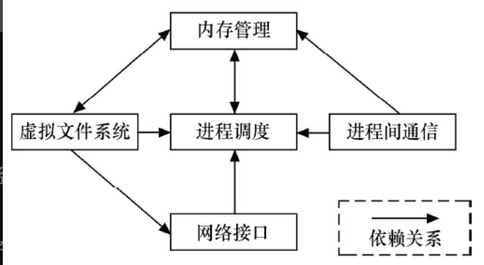
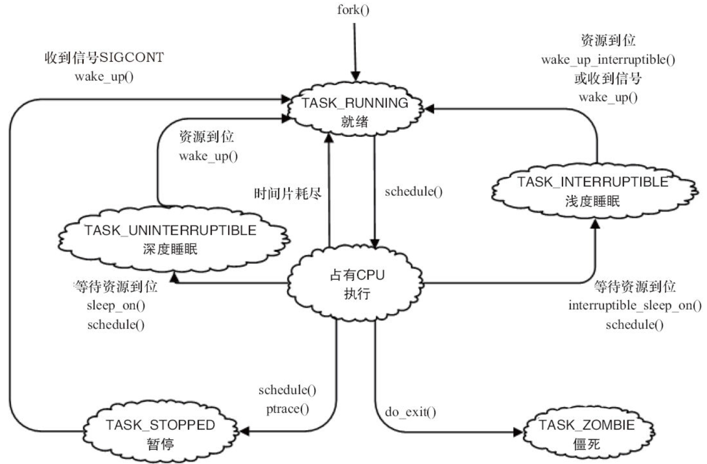
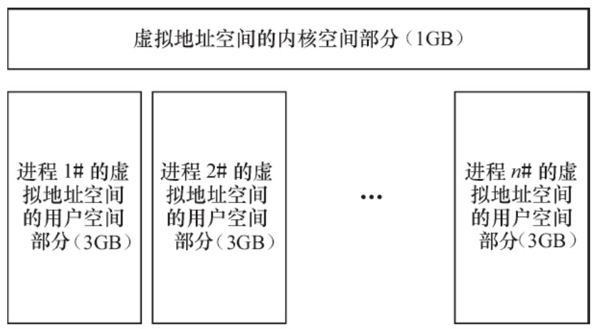
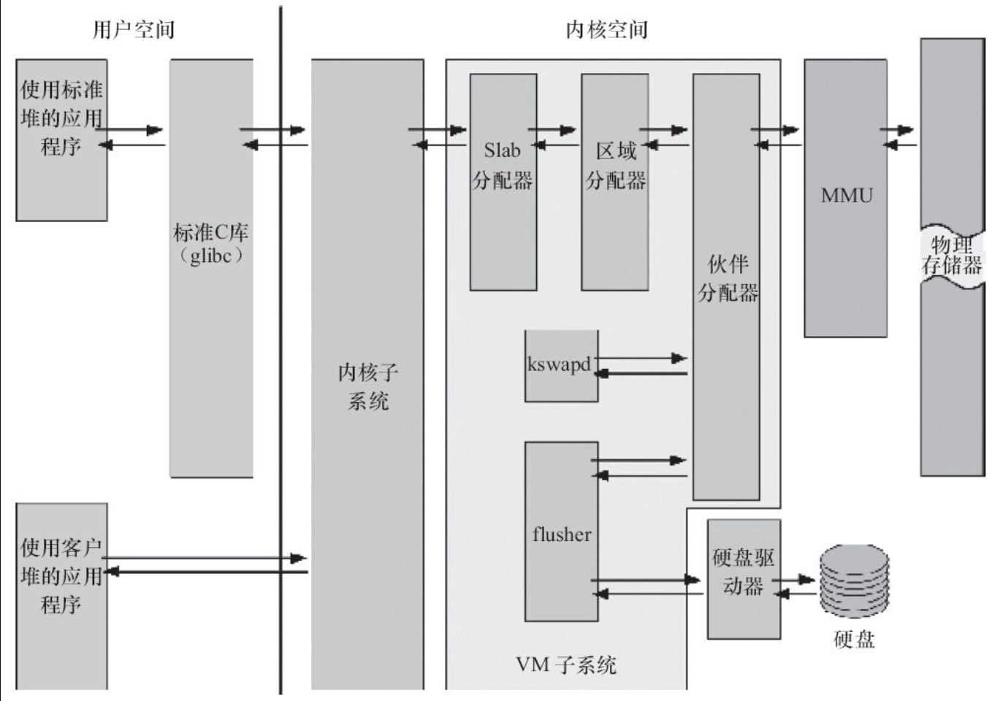
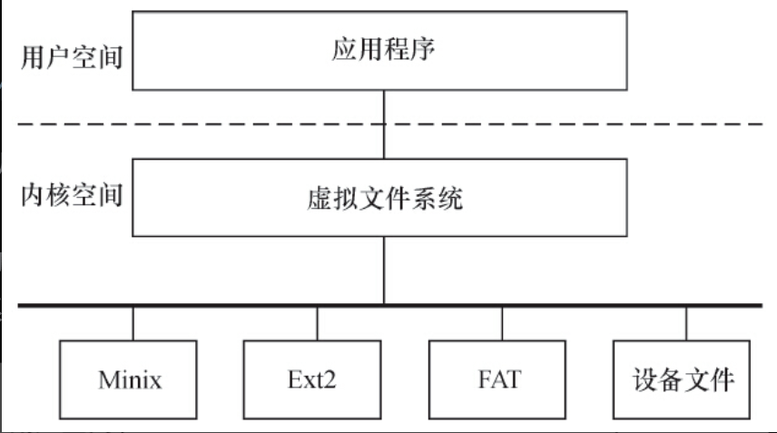
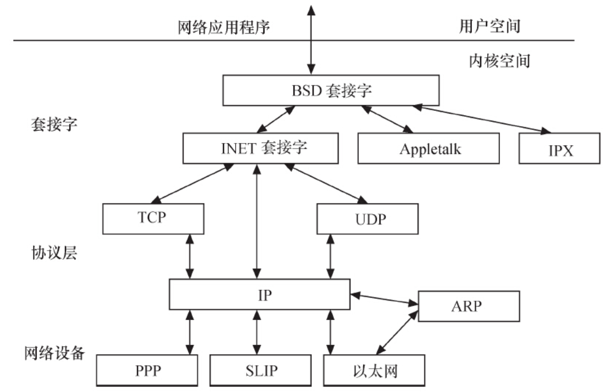

# 3.3.1　Linux内核源代码的目录结构

Linux内核源代码包含如下目录。

- ·arch：包含和硬件体系结构相关的代码，每种平台占一个相应的目录，如i386、arm、arm64、powerpc、mips等。Linux内核目前已经支持30种左右的体系结构。在arch目录下，存放的是各个平台以及各个平台的芯片对Linux内核进程调度、内存管理、中断等的支持，以及每个具体的SoC和电路板的板级支持代码。
- ·block：块设备驱动程序I/O调度。
- ·crypto：常用加密和散列算法（如AES、SHA等），还有一些压缩和CRC校验算法。
- ·documentation：内核各部分的通用解释和注释。
- ·drivers：设备驱动程序，每个不同的驱动占用一个子目录，如char、block、net、mtd、i2c等。
- ·fs：所支持的各种文件系统，如EXT、FAT、NTFS、JFFS2等。
- ·include：头文件，与系统相关的头文件放置在include/linux子目录下。
- ·init：内核初始化代码。著名的start_kernel（）就位于init/main.c文件中。
- ·ipc：进程间通信的代码。
- ·kernel：内核最核心的部分，包括进程调度、定时器等，而和平台相关的一部分代码放在arch/*/kernel目录下。
- ·lib：库文件代码。
- ·mm：内存管理代码，和平台相关的一部分代码放在arch/*/mm目录下。
- ·net：网络相关代码，实现各种常见的网络协议。
- ·scripts：用于配置内核的脚本文件。
- ·security：主要是一个SELinux的模块。
- ·sound：ALSA、OSS音频设备的驱动核心代码和常用设备驱动。
- ·usr：实现用于打包和压缩的cpio等。
- ·include：内核API级别头文件。

内核一般要做到drivers与arch的软件架构分离，驱动中不包含板级信息，让驱动跨平台。同时内核的通用部分（如kernel、fs、ipc、net等）则与具体的硬件（arch和drivers）剥离。

# 3.3.2　Linux内核的组成部分

如图3.3所示，Linux内核主要由进程调度（SCHED）、内存管理（MM）、虚拟文件系统（VFS）、网络接口（NET）和进程间通信（IPC）5个子系统组成。



## 1.进程调度

进程调度控制系统中的多个进程对CPU的访问，使得多个进程能在CPU中“微观串行，宏观并行”地执行。进程调度处于系统的中心位置，内核中其他的子系统都依赖它，因为每个子系统都需要挂起或恢复进程。

如图3.4所示，Linux的进程在几个状态间进行切换。在设备驱动编程中，当请求的资源不能得到满足时，驱动一般会调度其他进程执行，并使本进程进入睡眠状态，直到它请求的资源被释放，才会被唤醒而进入就绪状态。睡眠分成可中断的睡眠和不可中断的睡眠，两者的区别在于可中断的睡眠在收到信号的时候会醒。



图3.4　Linux进程状态转换

完全处于TASK_UNINTERRUPTIBLE状态的进程甚至都无法被“杀死”，所以Linux 2.6.26之后的内核也存在一种TASK_KILLABLE的状态，它等于“TASK_WAKEKILL|TASK_UNINTERRUPTIBLE”，可以响应致命信号。

在Linux内核中，使用task_struct结构体来描述进程，该结构体中包含描述该进程内存资源、文件系统资源、文件资源、tty资源、信号处理等的指针。Linux的线程采用轻量级进程模型来实现，在用户空间通过pthread_create（）API创建线程的时候，本质上内核只是创建了一个新的task_struct，并将新task_struct的所有资源指针都指向创建它的那个task_struct的资源指针。

绝大多数进程（以及进程中的多个线程）是由用户空间的应用创建的，当它们存在底层资源和硬件访问的需求时，会通过系统调用进入内核空间。有时候，在内核编程中，如果需要几个并发执行的任务，可以启动内核线程，这些线程没有用户空间。启动内核线程的函数为：

```
pid_t kernel_thread(int (*fn)(void *), void *arg, unsigned long flags);
```

## 2.内存管理

内存管理的主要作用是控制多个进程安全地共享主内存区域。当CPU提供内存管理单元（MMU）时，Linux内存管理对于每个进程完成从虚拟内存到物理内存的转换。Linux 2.6引入了对无MMU CPU的支持。

如图3.5所示，一般而言，32位处理器的Linux的每个进程享有4GB的内存空间，0~3GB属于用户空间，3~4GB属于内核空间，内核空间对常规内存、I/O设备内存以及高端内存有不同的处理方式。当然，内核空间和用户空间的具体界限是可以调整的，在内核配置选项Kernel Features→Memory split下，可以设置界限为2GB或者3GB。



图3.5　Linux进程地址空间

如图3.6所示，Linux内核的内存管理总体比较庞大，包含底层的Buddy算法，它用于管理每个页的占用情况，内核空间的slab以及用户空间的C库的二次管理。另外，内核也提供了页缓存的支持，用内存来缓存磁盘，per-BDI flusher线程用于刷回脏的页缓存到磁盘。Kswapd（交换进程）则是Linux中用于页面回收（包括file-backed的页和匿名页）的内核线程，它采用最近最少使用（LRU）算法进行内存回收。



## 3.虚拟文件系统

如图3.7所示，Linux虚拟文件系统隐藏了各种硬件的具体细节，为所有设备提供了统一的接口。而且，它独立于各个具体的文件系统，是对各种文件系统的一个抽象。它为上层的应用程序提供了统一的vfs_read（）、vfs_write（）等接口，并调用具体底层文件系统或者设备驱动中实现的file_operations结构体的成员函数。



图3.7　Linux虚拟文件系统

## 4.网络接口

网络接口提供了对各种网络标准的存取和各种网络硬件的支持。如图3.8所示，在Linux中网络接口可分为网络协议和网络驱动程序，网络协议部分负责实现每一种可能的网络传输协议，网络设备驱动程序负责与硬件设备通信，每一种可能的硬件设备都有相应的设备驱动程序



图3.8　Linux网络体系结构

Linux内核支持的协议栈种类较多，如Internet、UNIX、CAN、NFC、Bluetooth、WiMAX、IrDA等，上层的应用程序统一使用套接字接口。

## 5.进程间通信

进程间通信支持进程之间的通信，Linux支持进程间的多种通信机制，包含信号量、共享内存、消息队列、管道、UNIX域套接字等，这些机制可协助多个进程、多资源的互斥访问、进程间的同步和消息传递。在实际的Linux应用中，人们更多地趋向于使用UNIX域套接字，而不是System V IPC中的消息队列等机制。Android内核则新增了Binder进程间通信方式。

Linux内核5个组成部分之间的依赖关系如下。

- ·进程调度与内存管理之间的关系：这两个子系统互相依赖。在多程序环境下，程序要运行，则必须为之创建进程，而创建进程的第一件事情，就是将程序和数据装入内存
- ·进程间通信与内存管理的关系：进程间通信子系统要依赖内存管理支持共享内存通信机制，这种机制允许两个进程除了拥有自己的私有空间之外，还可以存取共同的内存区域。
- ·虚拟文件系统与网络接口之间的关系：虚拟文件系统利用网络接口支持网络文件系统（NFS），也利用内存管理支持RAMDISK设备。
- ·内存管理与虚拟文件系统之间的关系：内存管理利用虚拟文件系统支持交换，交换进程定期由调度程序调度，这也是内存管理依赖于进程调度的原因。当一个进程存取的内存映射被换出时，内存管理向虚拟文件系统发出请求，同时，挂起当前正在运行的进程。

除了这些依赖关系外，内核中的所有子系统还要依赖于一些共同的资源。这些资源包括所有子系统都用到的API，如分配和释放内存空间的函数、输出警告或错误消息的函数及系统提供的调试接口等。

# 3.3.3　Linux内核空间与用户空间

现代CPU内部往往实现了不同操作模式（级别），不同模式有不同功能，高层程序往往不能访问低级功能，而必须以某种方式切换到低级模式。

例如，ARM处理器分为7种工作模式。

- ·用户模式（usr）：大多数应用程序运行在用户模式下，当处理器运行在用户模式下时，某些被保护的系统资源是不能访问的。
- ·快速中断模式（fiq）：用于高速数据传输或通道处理。
- ·外部中断模式（irq）：用于通用的中断处理。
- ·管理模式（svc）：操作系统使用的保护模式。
- ·数据访问中止模式（abt）：当数据或指令预取中止时进入该模式，可用于虚拟存储及存储保护。
- ·系统模式（sys）：运行具有特权的操作系统任务。
- ·未定义指令中止模式（und）：当未定义的指令执行时进入该模式，可用于支持硬件协处理器的软件仿真。

ARM Linux的系统调用实现原理是采用swi软中断从用户（usr）模式陷入管理模式（svc）。

又如，x86处理器包含4个不同的特权级，称为Ring 0~Ring 3。在Ring0下，可以执行特权级指令，对任何I/O设备都有访问权等，而Ring3则被限制很多操作。

Linux系统可充分利用CPU的这一硬件特性，但它只使用了两级。在Linux系统中，内核可进行任何操作，而应用程序则被禁止对硬件的直接访问和对内存的未授权访问。例如，若使用x86处理器，则用户代码运行在特权级3，而系统内核代码则运行在特权级0。

内核空间和用户空间这两个名词用来区分程序执行的两种不同状态，它们使用不同的地址空间。Linux只能通过系统调用和硬件中断完成从用户空间到内核空间的控制转移。